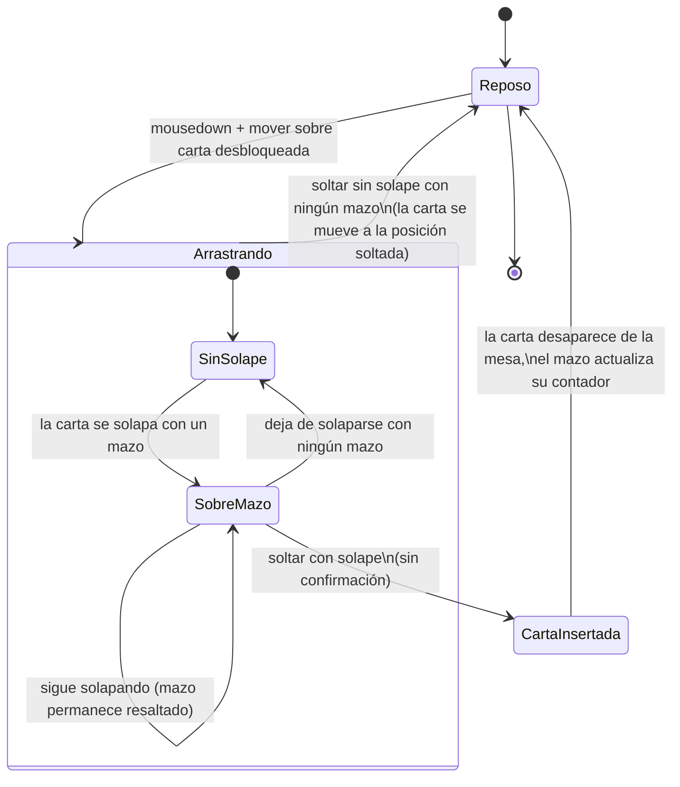

# Navegación — arrastrar carta sobre un mazo (modo juego)

- **SinSolape → SobreMazo**: el mazo pasa a su estado visual resaltado (`design_mazo-drop-highlight.html`, Panel B) en cuanto el rectángulo de la carta arrastrada se solapa con el del mazo.
- **SobreMazo → SinSolape**: el resaltado desaparece en cuanto deja de haber solape, sin esperar a que se suelte.
- **SobreMazo → CartaInsertada**: al soltar sobre un mazo resaltado, la carta se añade directamente (sin popup de confirmación) al final de las cartas del mazo — no importa sobre qué punto exacto del mazo se suelte, basta con que haya solape.
- **Arrastrando (SinSolape) → Reposo**: comportamiento actual sin cambios — la carta se mueve a la posición donde se soltó.
