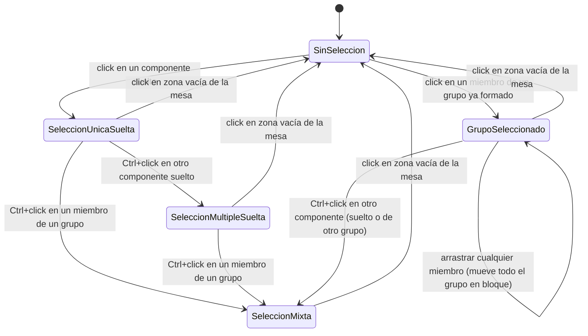
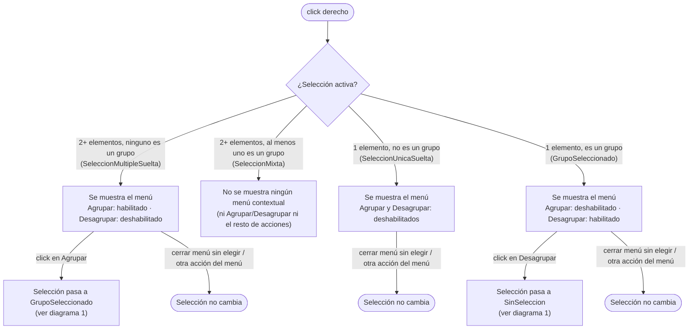

# Navegación — Agrupar / desagrupar elementos

Dos casos de uso independientes: cómo cambia la selección al hacer click/arrastrar (diagrama 1) y qué ofrece el menú contextual según la selección activa (diagrama 2, con la lógica de habilitado/deshabilitado ya confirmada por el usuario — ver tabla en `description.md`, sección "Comportamiento del menú contextual"). El diagrama 2 referencia los estados de selección del diagrama 1 para mostrar en qué estado queda la selección tras "Agrupar"/"Desagrupar". Quedan fuera de ambos diagramas el redimensionado (descartado por completo) y la anidación (pregunta abierta 1).

## 1. Estados de selección

### Notas

- **`SeleccionMixta`** = 2 o más elementos seleccionados donde al menos uno es un grupo ya formado.
- Un grupo cuenta como **un solo elemento** a efectos de contar la selección: click simple (sin Ctrl) sobre cualquiera de sus miembros selecciona el grupo entero (`GrupoSeleccionado`), no sus miembros por separado.
- No existe transición para "añadir un elemento suelto a un grupo ya existente" — no hay ninguna acción que fusione una selección mixta en un grupo (pregunta abierta 8 en `description.md`).
- Mientras un componente pertenece a un grupo (`GrupoSeleccionado`), el doble click sobre él **no abre su modal de propiedades** — a diferencia de un componente suelto (`SeleccionUnicaSuelta`), donde el doble click sigue abriendo el modal igual que hoy. No hay ningún gesto para editar un miembro individual sin desagrupar antes (ver regla "no se puede editar" en `description.md`).

## 2. Menú contextual: Agrupar / Desagrupar

### Notas

- Click derecho en `SeleccionMixta` no abre ningún menú — ni "Agrupar"/"Desagrupar" ni el resto de acciones (Ocultar, Clonar, Copiar, Eliminar, Añadir a etiqueta).
- Tras "Desagrupar", los miembros quedan sin seleccionar (`SinSeleccion`), no en `SeleccionMultipleSuelta` — a confirmar si en su lugar deberían quedar seleccionados sueltos (relacionado con la pregunta abierta 2, casos límite).
