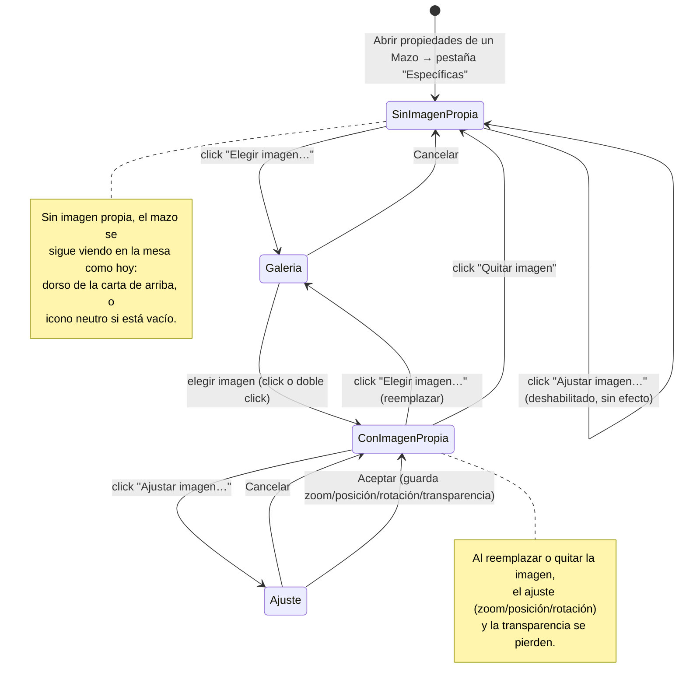

# Navegación — Imagen propia del mazo

- **SinImagenPropia**: pestaña "Específicas" del mazo, sin imagen propia configurada — botón "Ajustar imagen…" deshabilitado, sin botón "Quitar imagen" visible. En la mesa, el mazo se pinta igual que hoy (dorso de la carta de arriba / icono de vacío).
- **Galeria**: modal de galería de imágenes (reutilizada de otros elementos del juego), con buscador.
- **ConImagenPropia**: mismo modal que "SinImagenPropia", ya con imagen propia elegida — miniatura visible, botones "Ajustar imagen…" y "Quitar imagen" habilitados. En la mesa, el mazo pasa a pintarse siempre con esta imagen, tenga o no cartas dentro.
- **Ajuste**: modal de ajuste de imagen (zoom, transparencia, rotación), reutilizada de otros elementos del juego.

Cerrar/cancelar cualquiera de las dos modales secundarias (Galería, Ajuste) vuelve siempre a la pestaña "Específicas" sin perder los cambios ya aceptados anteriormente.
