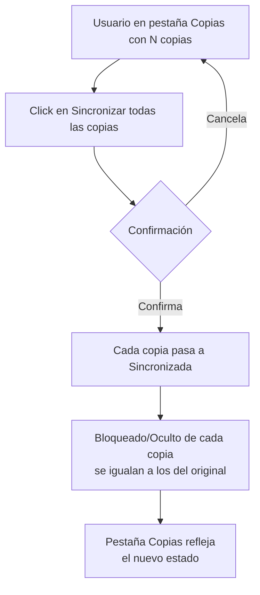
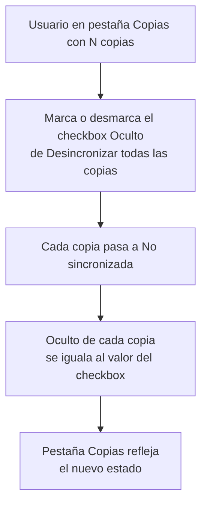
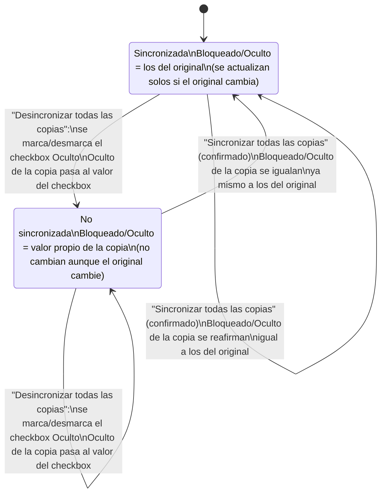

- **Nombre**: Pestaña "Copias" en las propiedades de un componente
- **Código**: 00196
- **Tipo**: change
- **Fecha creación**: 2026-08-07

## Prompt original del usuario

necesito crear una pestaña nueva en las propiedades de los objetos llamada "Copias".
Si el elemento no tiene copias, esa pestaña estará vacía
Si el elemento tiene copias, en la pestaña debería haber:
-el total de copias
-un botón para ver el listado de copias
-un botón de "Sincronizar todas las copias": si el usuario confirma, todas las copias de ese elemento deben marcarse como sincronizadas y sincronizarse.

También añade una sección llamada "Desincronizar todas las copias" y dentro:
- un checkbox para modificar el estado Oculto

Si se marca o desmarca ese checkbox todas las copias se desincronizan y macan su campo oculto como tengamos aquí

## Descripción completa

Se añade una pestaña nueva llamada "Copias" a la ventana de propiedades de un objeto, junto a las pestañas ya existentes ("Generales" y "Específicas"). Esta pestaña solo aparece al editar/crear un objeto que no sea a su vez una copia de otro (una copia se sigue editando con su propia ventana reducida, que no cambia con este trabajo).

**Comportamiento según el estado del objeto:**

- **Objeto nuevo, aún no guardado**: la pestaña "Copias" existe igual que en cualquier objeto, y se muestra vacía (mismo aspecto que un objeto guardado sin copias), porque un objeto recién creado no puede tener copias todavía.
- **Objeto sin copias**: la pestaña muestra únicamente un mensaje indicando que no tiene copias, sin ningún botón.
- **Objeto con una o más copias**: la pestaña muestra:
  - El número total de copias del objeto.
  - Un botón "Ver listado de copias": abre una ventana nueva por encima de la de propiedades con un listado de solo lectura de todas las copias (identificador de cada una y si está sincronizada o no). Este listado no permite editar ni eliminar copias directamente — para eso, el usuario sigue usando el panel de Componentes como hace hoy.
  - Un botón "Sincronizar todas las copias": al pulsarlo, se pide confirmación al usuario. Si confirma, todas las copias de ese objeto pasan a marcarse como sincronizadas y sus valores de "Bloqueado"/"Oculto" se igualan de inmediato a los del objeto original (no se limita a marcar la copia como sincronizada para que se actualice más adelante — el efecto es inmediato, igual que ya ocurre hoy al marcar "Sincronizado" en una copia individual). Si el usuario cancela la confirmación, no cambia nada.
  - Una sección "Desincronizar todas las copias", con un checkbox que representa el estado "Oculto" a forzar en todas las copias. Al abrir la pestaña, este checkbox arranca con el valor de "Oculto" del objeto original. Cada vez que el usuario marca o desmarca este checkbox, el cambio se aplica de inmediato y sin pedir confirmación: todas las copias del objeto pasan a "no sincronizadas" y su "Oculto" se iguala al nuevo valor del checkbox.

**Diagrama de flujo — botón "Sincronizar todas las copias":**

**Diagrama de flujo — checkbox "Desincronizar todas las copias" (Oculto):**

**Diagrama de estados — qué le pasa a cada copia según se sincronice o desincronice:**

Notas:

- Ambas acciones actúan sobre **todas** las copias del objeto a la vez, cada una pasando por esta misma transición de forma independiente.
- "Sincronizar todas las copias" solo mueve copias hacia "Sincronizada"; "Desincronizar todas las copias" (el checkbox "Oculto") solo mueve copias hacia "No sincronizada" — nunca se combinan en la misma acción.
- Ninguna de las dos acciones toca `x`/`y`, orden de apilado, ni el estado de interacción de juego propio de cada copia (p. ej. resultado de un dado o cara mostrada de una carta): eso siempre queda fuera de la sincronización, sincronizada o no la copia.

**Convivencia con lo existente:** esta pestaña no sustituye nada; complementa el mecanismo de sincronización que ya existe por copia individual, añadiendo una acción en bloque desde el objeto original. No afecta a la posición en la mesa, el orden de apilado, ni a valores de estado propios del uso en partida de cada copia (p. ej. resultado de un dado o cara mostrada de una carta), que siempre son independientes por copia.

**Alcance de los datos:** los objetos y sus copias son parte del estado de la partida/proyecto actual, sin distinción por usuario — igual que el resto de propiedades de un objeto. No se guarda ningún dato nuevo: el total de copias y el listado se calculan a partir de las copias ya existentes vinculadas al objeto, y el estado "sincronizada" de cada copia ya existe hoy.

**Quién puede usarlo:** esta pestaña, como el resto de la ventana de propiedades donde vive, solo está disponible en Modo Edición.

**Preguntas de alcance resueltas con el usuario:**

- Ubicación de la pestaña: solo en la ventana de propiedades del objeto original (no se toca la ventana reducida de edición de una copia individual).
- Contenido de cada fila del listado de copias: identificador de la copia y si está sincronizada o no, sin acciones de editar/eliminar por fila.
- Alcance de "Sincronizar todas las copias": marca cada copia como sincronizada e iguala de inmediato sus valores de "Bloqueado"/"Oculto" a los del original (no un marcado diferido).
- Objeto recién creado sin guardar: la pestaña se muestra igualmente, con el mismo aspecto vacío que un objeto sin copias.
- Botón "Ver listado de copias": abre una ventana nueva por encima de la de propiedades, sin sustituir el contenido de la pestaña.
- Checkbox "Oculto" de "Desincronizar todas las copias": aplica el cambio de inmediato al marcar/desmarcar, sin pedir confirmación (a diferencia del botón "Sincronizar todas las copias"), porque es una acción fácilmente reversible con un nuevo click. Al abrir la pestaña, arranca con el valor de "Oculto" del objeto original.

## Apuntes técnicos

- Modelo de datos ya existente y sin cambios: campo `copyOf` (id del original) y `sincronizado` (boolean) por componente — ver `design/docs/architecture/01-component-model.md`, sección "Copias vinculadas".
- La pestaña nueva va en `ui/componentModal.js` (modal con pestañas "Generales"/"Específicas", patrón `createTab`/`switchTab`), no en `ui/copyComponentModal.js` (modal reducida sin pestañas, usada para editar una copia individual — sin cambios).
- "Total de copias" y el listado se calculan filtrando componentes con `copyOf === id`, igual que ya hace `ui/componentList.js` (columna "Copia") y el borrado en cascada de `core/state.js`.
- "Sincronizar todas las copias" reutiliza el mismo efecto que ya provoca marcar el checkbox "Sincronizado" en `ui/copyComponentModal.js`: fijar `sincronizado = true` y aplicar `syncCopyWithOriginal(copy, original)` (o equivalente) para `bloqueado`/`oculto` de inmediato, sin esperar a la próxima actualización del original.
- "Desincronizar todas las copias" es la operación inversa a nivel de campo `oculto`: para cada copia, fija `sincronizado = false` y `oculto = <valor del checkbox>` directamente (sin pasar por `syncCopyWithOriginal`, que exige `sincronizado: true`). No toca `bloqueado` de las copias.
- Patrón de listado en ventana aparte a reutilizar como referencia: `ui/mazoContentModal.js` ("Ver contenido del mazo").
- Patrón de confirmación a reutilizar: `confirm()` nativo, igual que las confirmaciones de borrado ya existentes (`ui/componentList.js`, `ui/componentModal.js`, `ui/copyComponentModal.js`).
- Sin incongruencias detectadas entre `design/docs/architecture/01-component-model.md` y el código real en el área de `copyOf`/`sincronizado`/`syncCopyWithOriginal` (verificado con `ms-internal-tech-analysis`).
