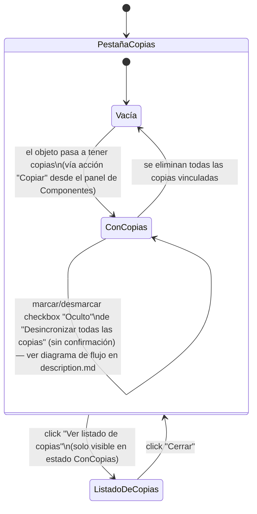

# Navegación — Pestaña "Copias"

Notas:

- "Ver listado de copias" abre `ListadoDeCopias` como ventana nueva por encima de la ventana de propiedades (mismo patrón que "Ver contenido del mazo"), sin cerrar ni sustituir la ventana de propiedades debajo. Cerrarla vuelve exactamente al mismo estado de la pestaña "Copias".
- Los botones "Sincronizar todas las copias" y el checkbox "Oculto" de "Desincronizar todas las copias" no cambian de pantalla ni abren nada — actualizan el estado de las copias y la propia pestaña se refresca en el sitio (transición reflexiva). Su lógica interna paso a paso ya está detallada como diagramas de flujo en `description.md`.
