- **Fecha creación**: 2026-08-13

## (a) Anotaciones funcionales

**Fuera de alcance:** el doble click sobre un miembro agrupado en la mesa sigue sin abrir su modal de edición (confirmado por el usuario, "de momento no se reactiva") — el desbloqueo de edición es solo a través del botón "Editar" del panel "Componentes". El menú contextual de modo edición no cambia en absoluto (ni su condición de visibilidad, ni las acciones que ofrece): sigue sin mostrarse cuando la selección mezcla un grupo con cualquier otro elemento (00193). En particular, cuando el menú contextual sí se muestra porque la selección es exactamente un grupo completo (caso "Desagrupar" habilitado), sus entradas "Clonar"/"Copiar" siguen operando sobre todos los miembros del grupo sin restricción — la nueva restricción de "Clonar"/"Copiar" deshabilitados solo aplica a los botones de fila del panel "Componentes", no al menú contextual (el usuario no pidió tocarlo). El matiz de contorno azul/gris aplica solo a la mesa; el panel "Componentes" sigue resaltando todas las filas de un grupo por igual, sin distinguir cuál fue la clicada. El modelo de datos de agrupación (`groupId`) no cambia.

**Dudas resueltas con el usuario:**
- ¿El doble click en la mesa se reactiva también? → No, de momento no se reactiva; solo el botón "Editar" del panel.
- ¿Alguna acción del menú contextual se desbloquea para estos casos? → No, el menú contextual sigue sin ser visible cuando la selección mezcla un grupo con otro elemento (sin cambios respecto a 00193).
- Resto de propuestas presentadas en la fase de `ms-new` (reutilizar `--text-muted` para el gris, matiz solo en la mesa, reparto del contorno con varios grupos seleccionados a la vez, comportamiento al seleccionar vía Etiqueta) → sin objeción, se dan por confirmadas tal cual se propusieron.

## (b) Solución técnica

- [x] **`src/modes/edit/editMode.js` — nuevo estado `primarySelectedIds`.** Junto a la declaración de `let selectedComponentIds = new Set();`, añadir `let primarySelectedIds = new Set();` (mismo criterio de estado de módulo, fuera de `renderEditMode`, para sobrevivir a los remontados por `components:changed`). Representa los ids que fueron el objetivo *directo* de un click (no toda la unidad de grupo arrastrada con él) — se usa solo para pintar el contorno de la mesa, nunca para decidir qué está "seleccionado" a efectos de acciones (eso lo sigue haciendo `selectedComponentIds` en exclusiva).
- [x] **`src/modes/edit/editMode.js` → `toggleSelect(component, event)` — mantener `primarySelectedIds` sincronizado.** Ver diagrama de flujo más abajo para la lógica completa (cubre también `handleComponentContextMenu` y `selectTag`). En la rama de click normal que reemplaza la selección: `primarySelectedIds = new Set([component.id])` (nunca toda la unidad). En la rama de click normal que deselecciona (unidad ya era la selección vigente): `primarySelectedIds.clear()`. En Ctrl+click que añade la unidad: `primarySelectedIds.add(component.id)` (además de añadir todos los ids de la unidad a `selectedComponentIds`, como ya hace hoy). En Ctrl+click que quita la unidad: `for (const id of unit) primarySelectedIds.delete(id)`.
- [x] **`src/modes/edit/editMode.js` → `handleComponentContextMenu(component, event)` — mismo criterio.** En la rama donde ya reemplaza `selectedComponentIds` porque la unidad no estaba completamente incluida (bloque `if (!unit.every(...))` ya existente de 00193): añadir `primarySelectedIds = new Set([component.id])`. Cuando la unidad ya estaba completamente incluida (rama que hoy no toca nada), seguir sin tocar `primarySelectedIds` tampoco — el menú contextual no cambia quién es "el clicado" si la selección ya estaba fijada de antes.
- [x] **`src/modes/edit/editMode.js` → `selectTag(tag)` — vaciar `primarySelectedIds`.** Al principio de la función (junto al `selectedComponentIds.clear()` ya existente), añadir `primarySelectedIds.clear()` — la selección por Etiqueta no tiene un "clicado" individual, así que ningún miembro de un grupo capturado así debe llevar el contorno habitual.
- [x] **`src/modes/edit/editMode.js` — sincronizar `primarySelectedIds` en cada punto que ya borra ids de `selectedComponentIds`.** Recorrer los puntos existentes que hacen `selectedComponentIds.delete(id)`/`.clear()` fuera de `toggleSelect` (rama única de `attemptDeleteComponents`, los tres `onDelete` de `openEditModalFor`/`openAddModal`, `onRemove` de `renderList()`, la rama bulk de `attemptDeleteComponents`) y añadir la mismo operación sobre `primarySelectedIds` en cada uno (`.delete(id)` junto a cada `selectedComponentIds.delete(id)`, `.clear()` junto a cada `selectedComponentIds.clear()`) — evita que `primarySelectedIds` acumule ids de componentes ya borrados.
- [x] **`src/modes/edit/editMode.js` → `renderTable()` — pasar `primarySelectedIds` y separar el bloqueo de doble click.** Añadir `primarySelectedIds` como nuevo argumento a `renderComponentsOnTable(...)`. Cambiar `onSelect: openEditModalFor` por `onSelect: (component) => { if (component.groupId != null) return; openEditModalFor(component); }` — el guard de bloqueo de edición individual se traslada aquí (antes vivía dentro de `openEditModalFor`), para que solo afecte al doble click de la mesa y no al botón "Editar" del panel (ver tarea siguiente).
- [x] **`src/modes/edit/editMode.js` → `openEditModalFor(component)` — quitar el guard de `groupId`.** Eliminar la línea `if (component.groupId != null) return;` del principio de la función (introducida en 00193) — ahora esa función se invoca también desde el botón "Editar" del panel (`renderList()`, `onEdit: openEditModalFor`, sin cambios en esa línea), que debe volver a abrir la modal con normalidad para un componente agrupado.
- [x] **`src/ui/componentRenderer.js` → `renderComponentsOnTable` — nuevo parámetro `primarySelectedIds` y clase `is-group-passenger`.** Añadir `primarySelectedIds = new Set()` a la firma desestructurada (mismo patrón que `selectedIds`). En cada uno de los 7 bloques de tipo que hoy hacen `if (selectedIds.has(component.id)) { el.classList.add('<tipo>--selected'); }` (texto ~L617, board ~L836, tablero-personalizado ~L1002, dice ~L1167, document-viewer ~L1389, carta ~L1584, mazo ~L1807 — mazo reutiliza las clases `carta--*`), añadir dentro de ese mismo bloque: `if (component.groupId != null && !primarySelectedIds.has(component.id)) el.classList.add('is-group-passenger');`.
- [x] **`src/styles/main.css` — reglas `is-group-passenger`.** Por cada uno de los 6 bloques CSS de tipo (`.text-box`, `.board`, `.tablero-personalizado`, `.dice`, `.document-viewer`, `.carta` — mazo cubierto por el de `.carta`, ver comentario ya existente "Cubre también 'mazo'"), añadir, junto al bloque `is-copy` ya existente de ese tipo, una regla análoga con el gris: `.<tipo>--selectable.is-group-passenger.<tipo>--selected { outline-color: var(--text-muted); }` y `.<tipo>--selectable.is-group-passenger.<tipo>--selected .component-id-label { background: var(--text-muted); }` (mismo patrón exacto que la variante `is-copy`, sustituyendo `var(--error)` por `var(--text-muted)`, sin el `:hover` — `is-group-passenger` no necesita variante de hover, a diferencia de `is-copy`, ya que solo se aplica junto a `--selected`). Si ambas clases (`is-copy` e `is-group-passenger`) coinciden alguna vez sobre el mismo elemento (miembro de grupo que además es una Copia), que gane `is-group-passenger` (gris) sobre `is-copy` (rojo) — declarar su regla después en el CSS para que la cascada la aplique en ese empate de especificidad.
- [x] **`src/ui/componentList.js` → `renderBody` — reajustar botones de fila para un componente agrupado.** Quitar `editButton.disabled = component.groupId != null;` (línea introducida en 00193 — "Editar" vuelve a estar siempre habilitado, sin condición de grupo). Añadir `cloneButton.disabled = component.groupId != null;` dentro del bloque `if (onClone && !component.copyOf) { ... }` y `copyButton.disabled = component.groupId != null;` dentro del bloque `if (onCopy && !component.copyOf) { ... }` (mismo patrón que la comprobación ya existente de `disabled` por otros motivos en esos botones — aquí se combinan ambas condiciones con OR: deshabilitado si es una Copia *o* si pertenece a un grupo). "Eliminar" no cambia (ya está habilitado hoy para un componente agrupado, sin condición de `groupId`).

```mermaid
flowchart TD
    A(["Evento de selección en modo edición"]) --> B{"¿Qué lo dispara?"}
    B -->|"selectTag(tag)"| C["Vaciar primarySelectedIds por completo"]
    C --> Z(["Fin"])

    B -->|"toggleSelect: click normal"| D["Calcular unidad completa del componente clicado"]
    D --> E{"¿La unidad ya era exactamente la selección vigente?"}
    E -->|Sí| F["Vaciar selectedComponentIds y primarySelectedIds"]
    E -->|No| G["selectedComponentIds = ids de la unidad; primarySelectedIds = solo el id clicado"]
    F --> Z
    G --> Z

    B -->|"toggleSelect: Ctrl+click"| H["Calcular unidad completa del componente clicado"]
    H --> I{"¿La unidad ya estaba incluida en la selección?"}
    I -->|Sí| J["Quitar todos los ids de la unidad de selectedComponentIds y primarySelectedIds"]
    I -->|No| K["Añadir ids de la unidad a selectedComponentIds; añadir solo el id clicado a primarySelectedIds"]
    J --> Z
    K --> Z

    B -->|"handleComponentContextMenu"| L["Calcular unidad completa del componente clicado"]
    L --> M{"¿La unidad ya estaba completamente incluida en la selección?"}
    M -->|Sí| N["No se toca selectedComponentIds ni primarySelectedIds"]
    M -->|No| O["selectedComponentIds = ids de la unidad; primarySelectedIds = solo el id clicado"]
    N --> Z
    O --> Z

    Z --> P["renderTable(): por cada componente con selectedIds.has(id)"]
    P --> Q{"¿Pertenece a un grupo (groupId no nulo) y su id NO está en primarySelectedIds?"}
    Q -->|Sí| R["Contorno gris — clase is-group-passenger"]
    Q -->|No| S["Contorno habitual de selección"]
```

## (c) Cambios de arquitectura

- **`design/docs/architecture/04-modes.md`**, sección "Grupos en modo edición" (añadida por 00193): actualizar dos bullets que este cambio hace inexactos —
  - "Bloqueo de edición individual": pasa a decir que solo el doble click en la mesa sigue bloqueado; el botón "Editar" del panel vuelve a estar habilitado y abre la modal con normalidad. Añadir que "Clonar"/"Copiar" del panel pasan a estar deshabilitados mientras el componente esté agrupado (antes no lo estaban), mientras que "Eliminar" sigue disponible sin cambios.
  - "Sin indicador visual permanente": ya no es del todo cierto — añadir que, mientras dura la selección, la mesa sí distingue con un contorno gris (`is-group-passenger`) a los miembros del grupo que se han sumado a la selección sin haber sido clicados directamente, frente al contorno habitual del componente realmente clicado; esto no es un indicador *permanente* (solo aplica mientras el grupo está seleccionado), así que aclarar esa distinción en vez de sustituir el bullet entero.

## (d) Cambios en estilo

- **`design/docs/style/INDEX.md`**, §7 "Nomenclatura de clases — BEM": añadir una entrada para `.is-group-passenger` junto a la ya existente de `.is-copy` (mismo criterio "estado transitorio, sin prefijo de bloque, transversal a los tipos de componente que usan `--selectable`/`--selected`, añadida por `ui/componentRenderer.js`, usada por `main.css` para pintar en gris el contorno de selección y `.component-id-label`"), dejando explícito que se aplica junto a `--selected` cuando el componente pertenece a un grupo y no fue el clicado directamente.

## (e) Verificación

- [x] Agrupar 2+ componentes (00193) y, con nada seleccionado, hacer click normal sobre uno de sus miembros en la mesa: ese miembro se pinta con el contorno azul habitual; el resto de miembros del grupo se pintan con contorno gris oscuro.
- [x] Con el grupo anterior ya seleccionado así, hacer Ctrl+click sobre un componente suelto (sin grupo): el suelto se añade con su contorno azul habitual; los miembros del grupo mantienen su reparto azul/gris de antes (el clicado en azul, el resto en gris).
- [x] Deseleccionar todo y volver a formar la misma selección clicando esta vez sobre un miembro *distinto* del grupo: ahora es ese otro miembro el que se pinta en azul, y el anteriormente clicado pasa a gris — el azul sigue siempre al último clic directo, no a un miembro fijo.
- [x] Seleccionar todos los miembros de una Etiqueta desde el panel "Etiquetas" (que incluya componentes de un grupo entre sus miembros): ningún miembro del grupo capturado así se pinta en azul — todos se ven en gris.
- [x] En el panel "Componentes", las filas de todos los miembros del grupo seleccionado se siguen resaltando por igual (mismo fondo de fila seleccionada), sin distinguir cuál fue el clicado directamente.
- [x] Con un componente agrupado, el botón "Editar" de su fila en el panel "Componentes" está habilitado y abre su modal de edición con normalidad; los botones "Clonar" y "Copiar" de esa misma fila aparecen deshabilitados; el botón "Eliminar" sigue habilitado y funciona igual que hoy (incluida la disolución automática del grupo si queda con ≤1 miembro tras el borrado).
- [x] Doble click sobre un miembro agrupado directamente en la mesa: no abre ninguna modal de edición (sigue bloqueado, sin cambios).
- [x] El menú contextual de modo edición se comporta exactamente igual que en 00193: no se muestra si la selección mezcla un grupo con otro elemento; cuando se muestra con un grupo completo como única selección, "Clonar"/"Copiar" siguen operando sobre todos sus miembros sin restricción.
- [x] Un componente que es a la vez Copia vinculada y miembro de un grupo, seleccionado como pasajero del grupo (no clicado directamente): se pinta en gris (`is-group-passenger`), no en rojo (`is-copy`).
