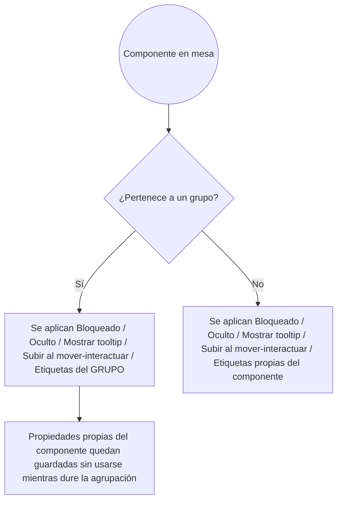
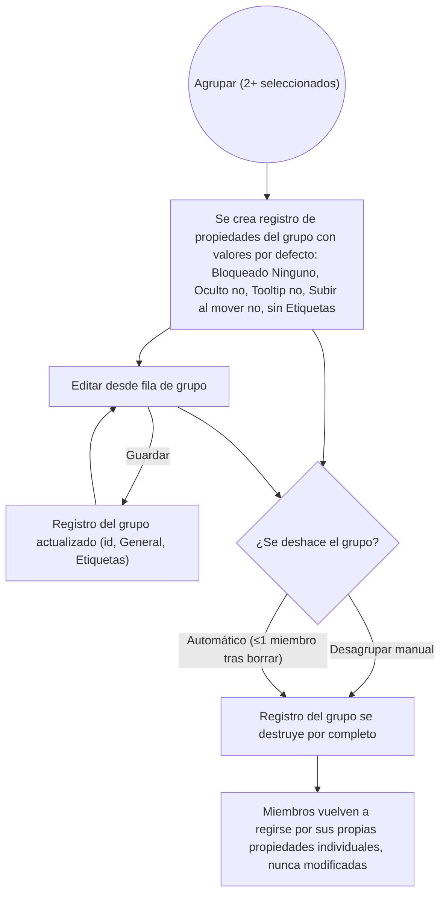

- **Nombre**: Editar propiedades de un grupo desde el panel de Componentes
- **Código**: 00202
- **Tipo**: change
- **Fecha creación**: 2026-08-14

## Descripción completa

En modo edición, la fila de grupo del panel de Componentes gana un botón "Editar" junto al ya existente "Desagrupar" (conviven, igual que "Editar"/"Eliminar" en una fila normal). Abre una ventana modal de propiedades del grupo, con una única pestaña "General":

- **Id del grupo**: campo de texto editable, precargado con el id actual (`grupo-1`, `grupo-2`...). Al aceptar, renombra el id de todos los miembros del grupo a la vez. Validación: no puede quedar vacío, ni coincidir con el id de otro grupo ya existente (mismo criterio que la validación de ID de un componente normal).
- **Sección "General" habitual** (Bloqueado / Oculto / Mostrar tooltip / Subir al mover-interactuar) y **sección "Etiquetas" habitual** — mismos campos, mismas opciones y mismo comportamiento que la pestaña "Generales" del modal de un componente normal.

El modal de grupo no incluye pestañas de tamaño ni de tipo específico (un grupo puede mezclar componentes de tipos distintos) — solo la pestaña "General" descrita arriba.

### Diferencia clave con el modal de un componente normal: propiedades propias del grupo, no en bloque

Estas propiedades **no se aplican en bloque a cada miembro** (no se sobrescribe el Bloqueado/Oculto/Mostrar tooltip/Subir al mover-interactuar/Etiquetas de ningún componente individual). El grupo pasa a tener su **propio registro independiente** de estas mismas propiedades, perteneciente al grupo como entidad, no a sus miembros.

Mientras el grupo existe, sus propiedades **gobiernan el comportamiento real en mesa** de todos sus miembros (bloqueo de movimiento, ocultación en modo juego, tooltip, subir al interactuar), sustituyendo por completo a las propiedades individuales de cada miembro mientras dure la agrupación — ver diagrama 1. Las propiedades propias de cada miembro nunca se tocan ni se pierden: simplemente dejan de leerse mientras el componente pertenece a un grupo.

Las Etiquetas del grupo son también una lista propia e independiente de las etiquetas que cada miembro ya tuviera antes de agruparse: el grupo cuenta como una entidad más con sus propias etiquetas (aparece en el panel "Etiquetas" y en el filtrado por etiqueta como cualquier otro elemento etiquetable), sin relación con las etiquetas individuales de sus miembros, que quedan intactas pero sin efecto mientras dura la agrupación.

### Ciclo de vida del registro de propiedades del grupo

- **Alta**: se crea automáticamente, con valores por defecto (Bloqueado: Ninguno, Oculto: no, Mostrar tooltip: no, Subir al mover: no, sin Etiquetas), en el momento en que se forma el grupo (acción "Agrupar" del menú contextual sobre 2+ componentes seleccionados). No existen grupos "sin" registro de propiedades.
- **Edición**: en cualquier momento posterior, desde el nuevo botón "Editar" de su fila en el panel de Componentes.
- **Baja**: se destruye por completo (sin dejar rastro, sin posibilidad de recuperarlo) en el mismo instante en que el grupo se deshace — tanto si es manual ("Desagrupar" del menú contextual o de la fila de grupo) como automático (el grupo queda con ≤1 miembro tras borrarse un componente). Los miembros, una vez destruido el registro, vuelven de inmediato a regirse por sus propias propiedades individuales (nunca modificadas durante la agrupación).

### Casos límite y alcance

- **Persistencia**: el registro de propiedades de un grupo se guarda y se exporta igual que el resto del estado — sobrevive a recargar la página y a "Guardar/Cargar partida" mientras el grupo siga existiendo.
- **Quién puede usarlo**: exclusivo de modo edición, igual que el resto de la gestión de grupos — no hay grupos ni edición de sus propiedades en modo juego.
- **Grupos ya existentes antes de este cambio** (creados con la versión anterior de la app, sin este registro): al cargar una partida guardada así, cada grupo sin registro propio recibe uno con los valores por defecto de alta (mismo criterio que un grupo recién formado).
- **Validación del id del grupo**: igual que el ID de un componente — no vacío, no duplicado con el id de otro grupo. No es necesario que siga el patrón `grupo-N`; renombrarlo a un valor libre no reintroduce colisiones con el autogenerado de un grupo nuevo.
- **Cancelar el modal**: descarta cualquier cambio hecho a id/General/Etiquetas del grupo, sin persistir nada.

### Diagramas funcionales

#### Diagrama 1 — Resolución de propiedades efectivas de un componente agrupado

#### Diagrama 2 — Ciclo de vida del registro de propiedades de un grupo

## Apuntes técnicos

- Este cambio contradice y actualiza feature 034 (`design/docs/features/034-agrupacion-de-elementos-agrupar-y-desagrupar.md`), que hoy documenta explícitamente que la fila de grupo solo tiene "Desagrupar" y no "Editar". También matiza el párrafo de esa feature sobre "Bloqueado" de un miembro agrupado: a partir de este cambio, mientras el grupo existe, el bloqueo efectivo del miembro pasa a ser el del registro propio del grupo (no simplemente "se ignora la restricción").
- Hoy un grupo no es una entidad persistida: es puramente el `groupId` compartido por 2+ componentes (`src/ui/componentList.js` líneas 46-68, fila sintética derivada en cada render; `src/core/component.js` línea 118, `nextGroupId()`). Este cambio requiere promover el grupo a una colección propia en `core/state.js` (patrón análogo a `tags`/`resources`: `createGroup`/`updateGroup`, colección con su propio evento de cambio y `panelState` si aplica), con su alta automática en la acción "Agrupar" (`src/modes/edit/editMode.js`) y su baja automática en cualquier punto donde hoy se deshaga un grupo (manual y automático por quedar ≤1 miembro).
- Checklist de "añadir un tipo/colección nuevo" de `design/docs/architecture/01-component-model.md`/`INDEX.md` (persistencia y guardado a fichero, autoguardado) aplica íntegro a esta colección nueva.
- La resolución de "propiedades efectivas" (diagrama 1) afecta a todo punto del código que hoy lee `bloqueado`/`oculto`/`mostrarTooltip`/`subirAlMoverInteractuar`/`etiquetaIds` directamente de un componente para decidir comportamiento en mesa (renderizado, arrastre, tooltip modo juego, insignias de modo edición) — cada uno de esos puntos necesita comprobar primero si el componente tiene `groupId` y, si lo tiene, leer del registro del grupo en su lugar. `ms-how` debe inventariar esos puntos de lectura antes de planificar la solución técnica.
- El modal de grupo puede reutilizar gran parte de la estructura visual/de pestañas de `ui/componentModal.js` (sección "General", sección "Etiquetas", patrón de validación de ID) pero necesita su propio flujo de guardado (no pasa por `replaceComponent`, sino por el update de la nueva colección de grupos).
