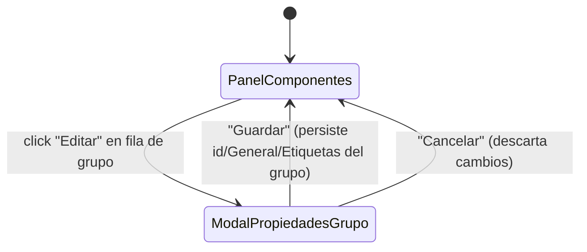

# Navegación — Editar propiedades de un grupo desde el panel de Componentes

Caso de uso: cómo se abre y se cierra el modal de propiedades del grupo desde su fila en el panel de Componentes.

- "Editar" solo está disponible en filas de grupo (conviven con "Desagrupar", ver `description.md`).
- Al abrir el modal se precargan el id actual del grupo y los valores propios de su registro de propiedades (no los de ningún miembro).
- "Guardar" valida primero el id (no vacío, no duplicado con otro grupo) antes de cerrar y persistir; si la validación falla, el modal permanece abierto con el error visible (mismo patrón que el modal de un componente normal).
