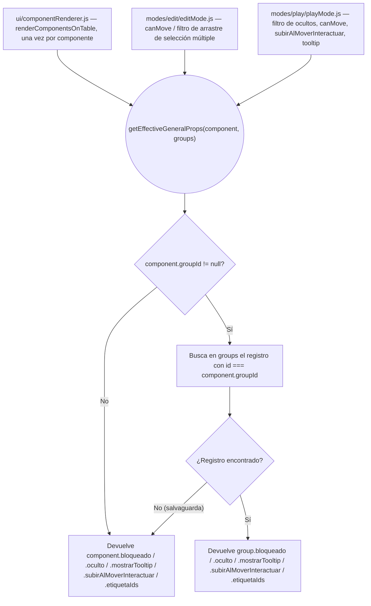

- **Fecha creación**: 2026-08-14

## (a) Anotaciones funcionales

**Fuera de alcance:** la importación/fusión de partidas (`core/importMerge.js`) no renombra hoy los `groupId` colisionados al fusionar dos partidas (gap preexistente, no relacionado con este cambio) — no se amplía aquí. Tampoco se toca el mecanismo de fusión de etiquetas duplicadas por nombre; el registro de grupo importado se fusiona por `id` igual que `tags`/`resources`, sin deduplicación adicional.

**Dudas resueltas con el usuario:** ninguna duda técnica adicional durante esta fase — el alcance funcional (propiedades propias del grupo, no en bloque; ciclo de vida del registro; validación del id) ya quedó cerrado y confirmado durante `ms-new` (ver `description.md`).

## (b) Solución técnica

- [x] **`core/group.js` (nuevo fichero) — modelo de "registro de propiedades de grupo".** Mismo patrón que `core/tag.js`/`core/resource.js`:
  - `createGroup({ id, bloqueado = 'ninguno', mostrarTooltip = false, subirAlMoverInteractuar = false, oculto = false, etiquetaIds = [] } = {})` → objeto plano con esos campos (sin `id` autogenerado por UUID: aquí `id` siempre lo pasa quien llama — `nextGroupId()` de `core/component.js` al crear, o el valor editado del modal al renombrar).
  - `updateGroup(group, changes)` → `{ ...group, ...changes }`.
  - `isGroupIdTaken(id, groups, excludeId = null)` → `true` si algún grupo (`id !== excludeId`) tiene ese mismo `id` exacto (sin normalizar nombre — aquí el "id" es literal, no un nombre libre como en `isTagNameTaken`).
  - `getEffectiveGeneralProps(component, groups)` → ver diagrama 1. Si `component.groupId != null` y existe un grupo con ese `id` en `groups`, devuelve los campos de ese grupo (`bloqueado`, `oculto`, `mostrarTooltip`, `subirAlMoverInteractuar`, `etiquetaIds`); en cualquier otro caso (sin grupo, o grupo no encontrado como salvaguarda) devuelve los campos propios de `component`.
  - `getGroupsUsingTag(tagId, groups)` → mismo criterio que `getComponentsUsingTag` de `core/tag.js`, pero filtrando `groups` por `etiquetaIds.includes(tagId)`.
  - `deriveMissingGroups(components, existingGroups)` → para cada `groupId` distinto presente en `components` (con ≥2 miembros) que no tenga ya entrada en `existingGroups`, añade una entrada `createGroup({ id: groupId })` con valores por defecto. Usada por el backfill de guardados anteriores a este cambio.

- [x] **`core/state.js` — colección `groups`.** Añadir `groups: []` a `state` (junto a `resources`/`tags`). Exponer, mismo patrón que `getTags`/`addTag`/`replaceTag`/`removeTag`/`loadTags`:
  - `getGroups()`, `addGroup(group)` (`emit('groups:changed', state.groups)`), `replaceGroup(id, updatedGroup)` (busca por `id`, sustituye, emite), `removeGroup(id)` (filtra, emite), `loadGroups(groups)` (sustituye array completo, emite).
  - Extender `removeComponent()` (líneas 87-109): en el bucle que ya recorre `affectedGroupIds` para poner `groupId = null` cuando `remaining.length <= 1`, añadir en ese mismo caso `state.groups = state.groups.filter((g) => g.id !== groupId)` y, tras el bucle, si se ha eliminado alguno, `emit('groups:changed', state.groups)` (un único emit al final, no uno por grupo disuelto).

- [x] **`core/persistence.js` — persistencia del registro de grupo.** Nombre de campo `componentGroups` (⚠️ no `groups`: esa clave ya está reservada como alias de compatibilidad hacia atrás de `tags`, ver líneas 26/30/72 — reutilizarla colisionaría con guardados antiguos de "Etiquetas"). Añadir a `parseState`/`saveState`/`parseImportedComponents`/`buildComponentsExport`, mismo patrón que `resources`: `const componentGroups = Array.isArray(parsed.componentGroups) ? parsed.componentGroups : [];`. Sin alias de compatibilidad hacia atrás (colección nueva, no existía con otro nombre).

- [x] **`core/fileExport.js` — `buildExportHtml`.** Añadir parámetro `componentGroups` (tras `tags`, antes de `tagPanelState` o en la posición que sea más clara) e incluirlo en el objeto serializado a `#initial-state`.

- [x] **`main.js` — arranque, autoguardado y semilla.** Importar `getGroups`/`loadGroups` de `core/state.js` y `deriveMissingGroups` de `core/group.js`.
  - `persistState()`: añadir `getGroups()` a la llamada de `saveState(...)`.
  - Suscripciones: `on('groups:changed', renderAll)`, `on('groups:changed', persistState)`.
  - Carga desde `localStorage` (`saved.componentGroups`) y desde semilla embebida (`seed.componentGroups`): `loadGroups(deriveMissingGroups(saved.components, saved.componentGroups ?? []))` — cubre tanto el caso "colección ya presente" (no añade nada nuevo, todos los `groupId` ya tienen entrada) como el caso "guardado anterior a este cambio" (colección vacía, se derivan todas desde `groupId` de los componentes).

- [x] **`ui/editModeToggle.js` — exportar/importar.** `buildExportHtml(...)` y `buildComponentsExport(...)`: añadir `getGroups()` a los argumentos, igual que `getTags()`. Si existe un flujo de importación con `parseImportedComponents` que aplica el resultado a `loadComponents`/`loadResources`/`loadTags` (ver `06-persistence-build.md`), añadir ahí también `loadGroups(deriveMissingGroups(result.components, result.componentGroups ?? []))` con el mismo criterio de backfill que en `main.js`.

- [x] **`ui/groupModal.js` (nuevo fichero) — modal "Propiedades del grupo".** `openGroupModal({ group, onAccept, onCancel })`, mismo patrón de construcción DOM que `ui/componentModal.js` (`.modal-overlay > .modal`, con `.modal__header`, `.modal__tabs` de una sola pestaña "General" ya activa, `.modal__content`, `.modal__footer`):
  - Campo "Id del grupo" (`.modal__field`, input texto) precargado con `group.id`. Validación en `input`: no vacío ("El ID no puede estar vacío"), no duplicado contra `getGroups()` excluyendo el propio (`isGroupIdTaken`, mensaje "Ya existe otro grupo con este ID") — mismo mecanismo que `validateId` de `componentModal.js` pero contra `getGroups()` en vez de `getComponents()`.
  - `fieldset.modal__section` "General": select "Bloqueado" (mismas `BLOQUEADO_OPTIONS` que `componentModal.js` — reexportarlas desde ahí o duplicarlas localmente, valorar en implementación cuál genera menos acoplamiento accidental), checkbox "Oculto", checkbox "Mostrar tooltip", checkbox "Subir al mover/interactuar" — mismos textos/`title` de ayuda que `componentModal.js` líneas 411-496, leyendo/escribiendo sobre un `workingGroup` local (copia de `group`), no sobre `group` directamente (para poder descartar en "Cancelar").
  - `fieldset.modal__section` "Etiquetas": mismo patrón que `componentModal.js` líneas 501-606 (`tag-checkbox-list__scroll`, checkbox por etiqueta de `getTags()` marcando `workingGroup.etiquetaIds.includes(tag.id)`, fila "+ Crear nueva etiqueta…" con alta rápida vía `createTag`/`addTag`), pero mutando `workingGroup.etiquetaIds` en vez de `workingComponent.etiquetaIds`.
  - Botón "Guardar" (`.btn-accept`): valida id; si es válido, llama `onAccept(workingGroup)` y cierra. Botón "Cancelar" (`.btn-cancel`): llama `onCancel?.()` (opcional) y cierra sin persistir nada.

- [x] **`ui/componentList.js` — botón "Editar" en la fila de grupo.** En `renderBody` (rama `component.__isGroupRow`, líneas ~139-188): añadir botón "Editar" (`.component-list__action-btn`, mismo patrón que el botón "Editar" de una fila normal, líneas 241-251) antes del botón "Desagrupar" existente, condicionado a un nuevo callback `onEditGroup` recibido en `renderBody`/`renderComponentList` (mismo criterio que `onEdit`/`onUngroup`). `onEditGroup(component.id)` (pasa el `groupId`, no necesita el registro completo — quien invoca ya tiene `getGroups()`).

- [x] **`modes/edit/editMode.js` — abrir el modal de grupo.** Importar `openGroupModal` de `ui/groupModal.js`, `getGroups`/`addGroup`/`replaceGroup`/`removeGroup` de `core/state.js`, `createGroup`/`isGroupIdTaken` de `core/group.js`.
  - Nueva función `openEditModalForGroup(groupId)`: busca `getGroups().find((g) => g.id === groupId)` (siempre debería existir, por el invariante "alta automática al agrupar"); abre `openGroupModal({ group, onAccept: (updated) => { ... } })`. En `onAccept`: si `updated.id !== group.id`, actualizar primero todos los miembros (`getComponents().filter((c) => c.groupId === group.id)`) vía `replaceComponent(c.id, updateComponent(c, { groupId: updated.id }))`, y luego `replaceGroup(group.id, updated)` — de forma que ningún miembro quede momentáneamente apuntando a un `groupId` que ya no existe en `groups`; si el id no cambió, solo `replaceGroup(group.id, updated)`.
  - En la llamada a `renderComponentList(...)` (línea ~681): añadir `onEditGroup: openEditModalForGroup`.
  - Acción "Agrupar" del menú contextual (líneas 592-602): tras el bucle que asigna `groupId: newGroupId` a `affectedComponents`, añadir `addGroup(createGroup({ id: newGroupId }))`.
  - Acción "Desagrupar" del menú contextual (líneas 603-612): tras el bucle que pone `groupId: null`, añadir `removeGroup(groupIdDelGrupoDesagrupado)` (capturar el `groupId` antes del bucle, ya que tras poner `null` en los componentes deja de estar accesible desde ellos).
  - Botón "Desagrupar" de la fila de grupo (línea ~700-703, el que ya conecta `onUngroup`): mismo ajuste — capturar el `groupId` antes del bucle de `replaceComponent(..., { groupId: null })` y llamar `removeGroup(groupId)` después.
  - Item general "Ocultar"/"Mostrar" del menú contextual (líneas 554-566): cuando la selección es un único grupo completo (`hasGroup && unitCount === 1`, ver variables ya calculadas en `handleComponentContextMenu`), leer/escribir el `oculto` del **registro del grupo** (`getGroups().find((g) => g.id === groupIdsInSelection.values().next().value)`) en vez de iterar `affectedComponents` — label y `onClick` condicionados a esa rama; en el resto de casos (selección de componentes sueltos, sin grupo) mantener el comportamiento actual sobre `affectedComponents`.
  - Item específico "Añadir a etiqueta" (líneas 615-628): mismo criterio — si la selección es un único grupo completo, añadir la etiqueta a `group.etiquetaIds` vía `replaceGroup` en vez de a cada miembro; si no, comportamiento actual sobre `affectedComponents`.
  - `canMove` de `renderTable` (línea 651) y el filtro de arrastre de selección múltiple (línea 177): sustituir la lectura directa de `c.bloqueado`/`component.bloqueado` por `getEffectiveGeneralProps(component, getGroups()).bloqueado` (ver diagrama 1) — el bypass actual para miembros de grupo (`|| c.groupId != null` en línea 177) deja de ser un bypass sin condición y pasa a depender del `bloqueado` efectivo del grupo.
  - `renderTable()`: pasar `groups: getGroups()` a `renderComponentsOnTable(...)`.

- [x] **`ui/componentRenderer.js` — lectura de propiedades efectivas.** `renderComponentsOnTable` gana parámetro `groups = []`. Justo al entrar en el bucle `for (const component of stackedComponents)` (línea 563), calcular una vez `const effective = getEffectiveGeneralProps(component, groups);` y sustituir, en las 7 ramas por tipo, las 14 lecturas directas `component.bloqueado`/`component.oculto`/`component.mostrarTooltip` (líneas 586-589, 728-731, 962-965, 1106-1109, 1329-1332, 1550-1553, 1777-1778) por `effective.bloqueado`/`effective.oculto`/`effective.mostrarTooltip`. Las líneas `component.groupId != null && ...` que pintan `.is-group-passenger` (619, 839, 1006, 1172, 1395, 1591, 1815) **no cambian** — siguen comprobando pertenencia a grupo, no las propiedades efectivas.

- [x] **`modes/play/playMode.js` — mismo criterio en modo juego.** Importar `getGroups`/`getEffectiveGeneralProps`.
  - Filtro `!component.oculto` (línea 142) → `!getEffectiveGeneralProps(component, groups).oculto`.
  - `component.subirAlMoverInteractuar` (líneas 159, 166, 173) y `mazo.subirAlMoverInteractuar` (línea 179) → `getEffectiveGeneralProps(component/mazo, groups).subirAlMoverInteractuar`.
  - `canMove: (component) => component.bloqueado === 'ninguno'` (línea 161) → `getEffectiveGeneralProps(component, groups).bloqueado === 'ninguno'`.
  - `const bloqueado = component.bloqueado !== 'ninguno'` (línea 189) → mismo criterio con `getEffectiveGeneralProps`.
  - Llamada a `renderComponentsOnTable(...)` (línea 142): pasar `groups: getGroups()`. `identifyMode === 'tooltip' && component.mostrarTooltip` ya vive dentro de `componentRenderer.js` (cubierto por la tarea anterior) — revisar si `playMode.js` tiene su propia copia de esa condición fuera del renderer; si es así, aplicar el mismo cambio ahí.

- [x] **Panel "Etiquetas" y selección por etiqueta — incluir grupos etiquetados.** `modes/edit/editMode.js`:
  - `selectTag(tag)` (líneas 502-521): además de `getComponentsUsingTag(tag.id, getComponents())`, incluir `getGroupsUsingTag(tag.id, getGroups())` — por cada grupo devuelto, seleccionar todos sus miembros (`getComponents().filter((c) => c.groupId === group.id)`), igual que ya hace para un componente etiquetado individualmente vía `getSelectionUnit`.
  - `attemptDeleteTag(tag, { onDeleted })` (líneas 389-413): además de `affectedIds` (componentes), calcular `affectedGroups = getGroupsUsingTag(tag.id, getGroups())`; si hay alguno, incluirlo en la información mostrada por `ui/tagDeleteConfirmModal.js` (revisar su firma actual — probablemente necesite aceptar también una lista de grupos afectados, no solo `affectedComponents`) y, al confirmar, quitar la etiqueta de cada grupo afectado vía `replaceGroup(group.id, updateGroup(group, { etiquetaIds: group.etiquetaIds.filter((id) => id !== tag.id) }))`, además de lo que ya hace con los componentes.
  - Revisar `ui/tagList.js` (panel dedicado "Etiquetas"): si muestra recuento o listado de "quién usa esta etiqueta", ampliarlo para incluir grupos, mismo criterio.

## (c) Cambios de arquitectura [aplicado]

- **`design/docs/architecture/04-modes.md`**, sección "Grupos en modo edición" (líneas 25-44): reescribir para reflejar que un grupo deja de ser puramente `groupId` compartido — ahora tiene un registro propio en la colección `groups` de `core/state.js` (`core/group.js`: `createGroup`/`updateGroup`/`getEffectiveGeneralProps`/`isGroupIdTaken`/`getGroupsUsingTag`), con sus propias `bloqueado`/`oculto`/`mostrarTooltip`/`subirAlMoverInteractuar`/`etiquetaIds` que gobiernan el comportamiento efectivo de todos sus miembros mientras el grupo existe (ver `getEffectiveGeneralProps`, sustituye las lecturas directas de esos campos en `componentRenderer.js`/`editMode.js`/`playMode.js`). Actualizar también:
  - La entrada "Agrupar asigna un `groupId` nuevo... Desagrupar pone `groupId: null`": añadir que "Agrupar" también da de alta el registro (`addGroup`) y "Desagrupar" lo destruye (`removeGroup`).
  - "Disolución automática" (`core/state.js#removeComponent`): añadir que, además de limpiar `groupId`, elimina la entrada de `groups` correspondiente.
  - El comportamiento de "Ocultar/Mostrar" y "Añadir a etiqueta" del menú contextual sobre una selección de grupo completo, que pasan a operar sobre el registro del grupo en vez de sobre cada miembro.
- **`design/docs/architecture/03-groups-resources.md`**: añadir un apartado nuevo "Modelo de datos de grupo" (o ampliar el existente sobre etiquetas si se considera más natural agruparlo ahí), documentando el shape de la colección `groups` (`id`, `bloqueado`, `oculto`, `mostrarTooltip`, `subirAlMoverInteractuar`, `etiquetaIds`), análoga en patrón a `tags`/`resources` (`getGroups`/`addGroup`/`replaceGroup`/`removeGroup`/`loadGroups`, evento `groups:changed`), y el nombre de campo de persistencia `componentGroups` (distinto de `tags`/`groups` por la colisión con el alias legacy de "Etiquetas" documentado en ese mismo fichero, línea 19).
- **`design/docs/features/034-agrupacion-de-elementos-agrupar-y-desagrupar.md`**: actualizar el párrafo sobre la fila de grupo del panel de Componentes ("como única acción, un botón 'Desagrupar' — sin 'Editar'...") para reflejar el nuevo botón "Editar". Matizar también el párrafo sobre "Bloqueado" de un miembro agrupado: ya no es que "pertenecer a un grupo anula esa restricción de movimiento", sino que el bloqueo efectivo pasa a ser el del registro propio del grupo.

## (e) Verificación

- [x] Formar un grupo de 2+ componentes ("Agrupar" desde el menú contextual): su fila en el panel de Componentes aparece con botones "Editar" y "Desagrupar" ambos habilitados.
- [x] Abrir "Editar" sobre esa fila: el modal muestra pestaña única "General" con el id autogenerado (`grupo-N`), Bloqueado "Ninguno", Oculto/Tooltip/Subir al mover desmarcados, sin etiquetas — valores por defecto, no los de ningún miembro.
- [x] Marcar "Oculto" en el modal del grupo y Guardar: en Modo Juego, todos los miembros del grupo dejan de mostrarse; en Modo Edición, todos siguen visibles con la insignia de "oculto". Ningún miembro individual queda con su propio campo `oculto` modificado (comprobable desagrupando después: ver siguiente punto).
- [x] Desagrupar ese mismo grupo (con "Oculto" marcado a nivel de grupo): los miembros vuelven a mostrarse con normalidad en ambos modos — sus propiedades individuales nunca se tocaron, y la fila de grupo desaparece del panel de Componentes.
- [x] Renombrar el id del grupo desde el modal (p.ej. `grupo-2` → `mazo-inicial`) y Guardar: la fila del panel de Componentes pasa a mostrar el nuevo id; los miembros siguen agrupados con normalidad (seleccionar uno selecciona el grupo entero).
- [x] Intentar renombrar el id de un grupo al id de otro grupo ya existente: el modal muestra el error y no permite guardar.
- [x] Marcar una etiqueta en el modal del grupo: la etiqueta aparece asociada al grupo en el panel "Etiquetas" (recuento/listado), y seleccionar esa etiqueta desde el panel selecciona el grupo completo (todos sus miembros).
- [x] Bloquear el grupo ("Todos los modos") desde el modal: ningún miembro se puede arrastrar en Modo Edición ni en Modo Juego, aunque individualmente (antes de agruparse) no estuviera bloqueado.
- [x] Borrar componentes hasta dejar un grupo con 1 solo miembro: el grupo se disuelve automáticamente, su fila desaparece del panel de Componentes, y el registro de propiedades ya no es recuperable (formar un grupo nuevo con ese mismo miembro parte de valores por defecto, no de los que tenía el grupo disuelto).
- [x] Recargar la página (o exportar y volver a importar la partida) con un grupo ya configurado (etiquetas/bloqueo propios): el registro del grupo sobrevive intacto.
- [x] Cargar una partida guardada con una versión anterior a este cambio, con al menos un grupo ya formado (`groupId` compartido, sin registro `componentGroups`): tras cargar, ese grupo aparece con su fila y botón "Editar" funcionando, con valores por defecto.
