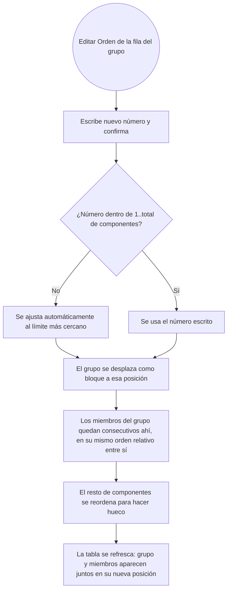

- **Nombre**: Orden de grupo y anidación visual de sus miembros en el panel de Componentes
- **Código**: 00204
- **Tipo**: change
- **Fecha creación**: 2026-08-14

## Descripción completa

En modo edición, la tabla del panel de Componentes cambia en tres puntos relacionados con el orden y la agrupación (amplía directamente el cambio 00202 — grupos con propiedades propias):

1. **La fila de grupo gana su propio campo "Orden"**, editable igual que el de cualquier fila normal.
2. **Los miembros de un grupo se muestran siempre anidados visualmente debajo de la fila de su grupo** (como una carpeta con su contenido), en vez de mezclados sueltos con el resto de filas según su posición individual.
3. **El campo "Orden" de un miembro agrupado deja de ser editable**: se muestra (número real, heredado del bloque) pero deshabilitado — el orden de un miembro solo puede cambiar editando el de su grupo.

### Semántica del "orden de grupo"

El campo "Orden" de la fila de grupo representa la posición del **bloque completo** de miembros (la del primero/más alto del grupo) dentro del mismo espacio compartido de siempre — 1..N, donde N sigue siendo el número total de componentes individuales (un grupo no cuenta como una unidad extra dentro de ese rango, es una forma de editar en bloque el de sus miembros).

Al escribir un nuevo número y confirmar (mismo mecanismo que hoy: perder el foco/Intro):
- Si el número está fuera de rango (1..N), se ajusta automáticamente al límite más cercano (mismo comportamiento que ya tiene hoy la columna "Orden" de una fila normal).
- Todo el grupo se desplaza como bloque a esa posición: sus miembros quedan consecutivos justo ahí, conservando el orden relativo que ya tenían entre sí (no se reordenan entre ellos, solo se desplaza el bloque completo).
- El resto de componentes (sueltos o de otros grupos) se reordena para hacer hueco, igual que ocurre hoy al mover un único componente.

**Al formar un grupo nuevo** ("Agrupar" desde el menú contextual, ver 00202): sus miembros se renumeran automáticamente a consecutivos en ese mismo momento, tomando como posición de bloque la del primero (el de menor Orden entre los seleccionados) — coherente con que a partir de ese instante el grupo ya tiene su propio número de orden.

Esto no cambia el significado de "orden" en sí (sigue siendo el mismo criterio de apilado visual en la mesa — z-index — de siempre): solo consecutiviza los valores ya existentes de los miembros de un grupo y quita la posibilidad de editarlos por separado.

### Anidación visual: siempre en bloque

La fila de grupo y sus miembros se muestran **siempre** como bloque contiguo (grupo primero, miembros indentados debajo), sea cual sea la columna por la que esté ordenada la tabla en ese momento (Id, Tipo...) — el orden interno entre los miembros de un mismo grupo se mantiene siempre por su propio Orden (ascendente); lo que cambia según la columna/orden activo es solo la posición relativa de cada bloque (grupo) o fila suelta entre sí en el conjunto de la tabla.

### Filtro de texto / filtro de columna

Si el filtro de texto (o un filtro de columna) coincide con el grupo o con al menos uno de sus miembros, se sigue mostrando la fila de grupo — pero debajo solo aparecen los miembros que coinciden individualmente con ese filtro, no todos. Si ni el grupo ni ninguno de sus miembros coincide, no se muestra nada de ese grupo.

### Casos límite y alcance

- Exclusivo de modo edición, igual que el resto de la gestión de grupos.
- Un grupo recién formado con miembros dispersos por la lista (no consecutivos entre sí) queda renumerado a consecutivos de inmediato al agruparse (ver arriba) — nunca hay un estado intermedio con un grupo cuyos miembros no sean consecutivos.
- Desagrupar no cambia el `order` de ningún miembro: cada uno conserva el número que tenía dentro del bloque (que en ese momento coincide con su posición real en la lista general), simplemente deja de estar anidado bajo ninguna fila de grupo y su campo "Orden" vuelve a ser editable.

### Diagrama funcional

## Apuntes técnicos

- Hoy `order` es un campo de `component.js` con invariante 1..N consecutivo sin huecos mantenido por `core/state.js` (`addComponent`, `compactOrders`, `reorderComponent`) — la fila de grupo hoy es puramente sintética (`ui/componentList.js#buildGroupRows`), sin `order` propio (`order: null`). Este cambio necesita decidir de dónde sale el "Orden" mostrado/editado en la fila de grupo (candidato: `Math.min` de los `order` de sus miembros) y una operación de "mover bloque" (variante de `reorderComponent` que desplaza N ids contiguos a la vez, no solo uno).
- `computeDisplayedList`/`renderBody` (`ui/componentList.js`) hoy fusionan filas de grupo y componentes en una única lista plana, ordenada globalmente por `columnSort` o por `order`. Este cambio requiere una estructura en dos niveles (bloques de nivel superior — grupo u componente suelto —, cada bloque de grupo con sus miembros anidados) que se reordene a nivel de bloque según `columnSort`, no fila a fila.
- El campo "Orden" de un miembro agrupado (deshabilitado) sigue necesitando mostrar su valor real — no se oculta la columna, solo se impide editarla.
- Filtro con coincidencia parcial dentro de un grupo: la lógica actual `matchesFilter`/`matchesColumnFilters` es por fila; hace falta un criterio a nivel de grupo ("¿el grupo o alguno de sus miembros coincide?") para decidir si se muestra la fila de grupo, combinado con el filtro individual ya existente para decidir qué miembros concretos aparecen debajo.
