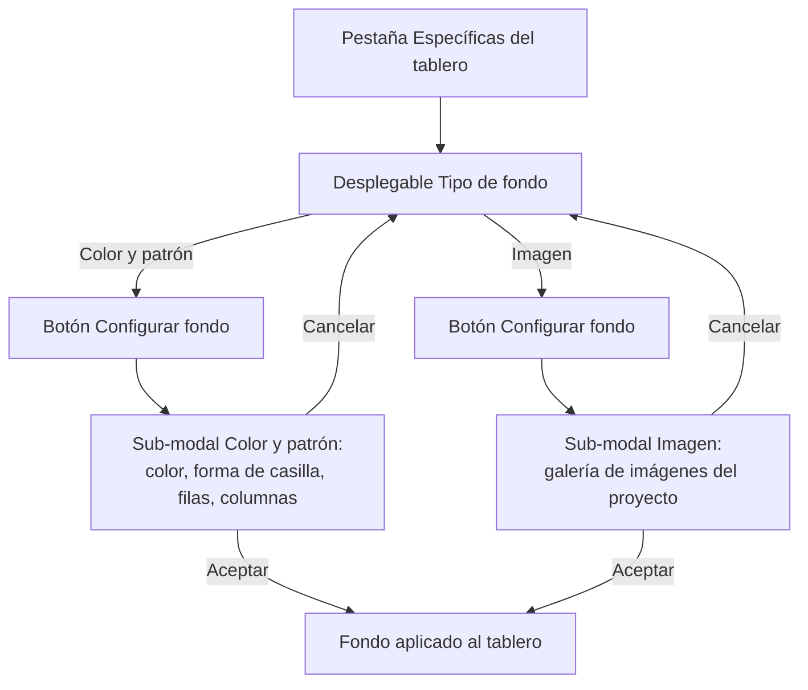

- **Nombre**: Nuevo tipo de componente "Tablero"
- **Código**: 00019
- **Tipo**: change

## Prompt original del usuario

un nuevo elemento para añadir a la mesa: un tablero.
- es un elemento cuadrado con un borde y un fondo.
- modo edición: dimensionable y movible

Propiedades generales:
- Bloqueado por defecto (ver cambio 00018)

Propiedades específicas:
- color y grosor del borde del tablero
- tipo de fondo a elegir en un desplegable y un botón para configurar el fondo que abre una nueva modal según lo que elija:
   - color y patrón: puede elegir un color y un patrón entre casillas cuadradas o hexagonales. También debe poder elegir el número de casillas en filas y columnas, que deben adaptarse según el tamaño del tablero.
   - imagen: Si elige imagen, mostrar una modal con la lista de imágenes que hay en la lista de recursos para elegir una.

---

Añade:
- la representación del tablero en la mesa debe dar cierta sensación de grosor

## Descripción completa

Se añade "Tablero" como nuevo tipo de componente que se puede colocar sobre la mesa, junto al ya existente "Cuadro de texto". Es un elemento cuadrado con un borde y un fondo configurables.

### Alta del componente

Como hasta ahora solo existía un tipo de componente, la modal de creación no tenía forma de elegir tipo (siempre creaba un "Cuadro de texto"). Con la llegada de "Tablero" como segundo tipo, la modal de creación incorpora un desplegable "Tipo" (con las opciones "Cuadro de texto" y "Tablero") en su pestaña "Generales", visible solo al crear un componente nuevo. El tipo elegido no se puede cambiar después de creado. Al elegir el tipo se actualiza el contenido de la pestaña "Específicas" con los campos correspondientes (Tablero, en este caso).

Al crear un tablero se le asigna un tamaño cuadrado por defecto y se coloca en la mesa sin solaparse con los componentes ya existentes, igual que ocurre hoy al crear cualquier otro componente.

### Comportamiento en modo edición

Igual que el resto de componentes: se puede seleccionar, mover libremente por la mesa y redimensionar arrastrando desde su esquina inferior derecha (el mismo manejador de redimensionado ya usado en el resto de la app). Se crea con forma cuadrada, pero al redimensionarlo el usuario puede darle cualquier proporción (no se fuerza a mantenerse cuadrado).

### Comportamiento en modo juego

Se muestra igual que en modo edición (cuadrado, con su borde y su fondo), sin poder editar sus propiedades. Solo se puede mover arrastrándolo si tiene desmarcada la propiedad general "Bloqueado" — comportamiento general ya definido en el cambio 00018, sin ninguna particularidad adicional para este tipo de componente. Por defecto (como cualquier componente nuevo) viene con "Bloqueado" marcado, es decir, fijo en su sitio durante la partida.

### Propiedades específicas del tablero

- **Borde**: color (por defecto negro) y grosor en píxeles (por defecto 2px, entre 1 y 20px). El borde se dibuja hacia dentro del cuadro, sin aumentar el tamaño total ocupado por el componente.
- **Fondo**: un desplegable con dos opciones — "Color y patrón" (preseleccionada por defecto) e "Imagen" — y, junto a él, un botón "Configurar fondo" que abre una modal distinta según la opción elegida en ese momento:
  - **Color y patrón**: se elige un color, una forma de casilla (cuadrada o hexagonal, una de las dos) y el número de filas y columnas del patrón (entre 1 y 50 cada uno). El patrón dibuja únicamente las líneas divisorias de las casillas en el color elegido sobre el resto del fondo del tablero (como una cuadrícula, no casillas alternas tipo ajedrez). El número de filas/columnas elegido se mantiene fijo aunque el tablero se redimensione después: es el tamaño de cada casilla el que se adapta (crece o encoge) para seguir llenando todo el tablero.
  - **Imagen**: se abre una galería con todas las imágenes disponibles en la carpeta de recursos de imágenes del proyecto, mostrando una miniatura y el nombre de cada una, para elegir una con un click. La imagen elegida se escala para cubrir todo el cuadro del tablero manteniendo su proporción (recortando el sobrante si no coincide el aspecto del tablero). No hay ninguna función para subir imágenes nuevas desde la propia app: solo se puede elegir entre las imágenes que ya estén disponibles en esa carpeta del proyecto.

Si el usuario cambia el tipo de fondo elegido en el desplegable (de "Color y patrón" a "Imagen" o viceversa), la configuración ya hecha en el tipo anterior no se pierde: queda guardada por si vuelve a cambiar de opinión, aunque en ese momento no esté activa.

### Sistema de recursos de imagen (nuevo)

Hoy el proyecto no tiene ninguna funcionalidad para listar o elegir imágenes ya disponibles — se construye como parte de este mismo cambio, ya que hace falta para poder ofrecer el fondo tipo "Imagen". Las imágenes se colocan en la carpeta de recursos de imágenes del proyecto y quedan disponibles automáticamente en la galería de selección de la modal, sin ningún paso adicional de configuración.

### Casos límite

- **Sin imágenes disponibles en la carpeta de recursos**: la galería de selección muestra el mensaje "No hay imágenes disponibles" y el botón para confirmar la selección permanece deshabilitado.
- **Filas/columnas del patrón**: limitadas a un rango razonable (1 a 50) para evitar patrones absurdamente densos o vacíos.

### Ampliación: sensación de grosor en la representación del tablero

La representación del tablero sobre la mesa (tanto en modo edición como en modo juego, con el mismo aspecto en ambos) debe transmitir cierta sensación de grosor físico, para diferenciarlo visualmente de un elemento plano como el cuadro de texto.

Se consigue mediante un **bisel en el propio borde** configurado (color y grosor ya definidos por el usuario): el borde se reparte en dos tonos derivados de ese color — más claro en los lados superior e izquierdo, más oscuro en los lados inferior y derecho — simulando un marco con relieve/altura, sin usar sombra ni degradado.

Esto es una **excepción explícita** a la convención de estilo general del proyecto, que hoy es deliberadamente plana (sin sombras ni relieves en ningún componente). Se acota expresamente a este componente: no se aplica a ningún otro tipo de componente existente ni futuro salvo que se decida ampliarlo más adelante.

No se añade ninguna propiedad configurable nueva para este efecto: se calcula automáticamente a partir del color de borde que el usuario ya elige, sin ningún campo adicional en la modal.

## Apuntes técnicos

- El campo `type` de `core/component.js` es hoy libre pero solo `'texto'` está implementado en `ui/componentModal.js` (pestaña "Específicas") y en `ui/componentRenderer.js` (renderizado sobre la mesa, de momento "solo texto" según `ARCHITECTURE.md` sección 5). Este cambio es la primera vez que se añade un segundo tipo real: hace falta generalizar ambos ficheros para soportar `'tablero'` además de `'texto'`, y añadir el desplegable de tipo (hoy `createComponent({ type: 'texto' })` está hardcodeado en `openComponentModal` para el caso `isNew`).
- El modelo de componente ya prevé un campo `image: string | null` ("referencia a un recurso en /src/img, opcional" — `ARCHITECTURE.md` sección 4) sin usar todavía por ningún tipo. Las propiedades específicas del tablero (borde, tipo de fondo, configuración de patrón, imagen elegida) deben ir en `properties` (como ya hace `'texto'`), no como campos generales nuevos del componente.
- `ARCHITECTURE.md` sección 7 ya documenta la convención `Los recursos gráficos van en /src/img, organizados por tipo de componente a medida que se definan` — la carpeta existe como convención pero está vacía; no hay hoy ningún mecanismo para enumerar su contenido desde JS en tiempo de ejecución (la app es estática, sin backend). Como el build (`src/scripts/build.py`) ya recorre y embebe assets referenciados desde CSS/HTML como data URIs, es candidato natural para generar también el listado de imágenes disponibles y dejarlo accesible a la app (dev y build final) — decisión de diseño técnico a resolver en el plan.
- La propiedad general "Bloqueado" (cambio 00018, campo `bloqueado` en `core/component.js`) no requiere ningún cambio adicional para este tipo: se aplica igual que a cualquier otro componente.
- El manejador de redimensionado genérico (`ui/resizeHandle.js`, `attachResizeHandle`) ya soporta `axis: 'both'` sin forzar proporción — el mismo patrón usado hoy por `'texto'` sirve para el tablero, sin necesidad de mantenerlo cuadrado tras el redimensionado (confirmado con el usuario).
- El efecto de bisel es una excepción a `STYLE_BIBLE.md` sección 13 ("Qué NO hacer" — hoy prohíbe sombras/relieves/gradientes sin decidirlo explícitamente). Al planificar/implementar, además del código de renderizado del tablero, hay que actualizar `STYLE_BIBLE.md` documentando esta excepción como acotada específicamente al tipo de componente "Tablero" (no como cambio general del lenguaje visual de la app).
