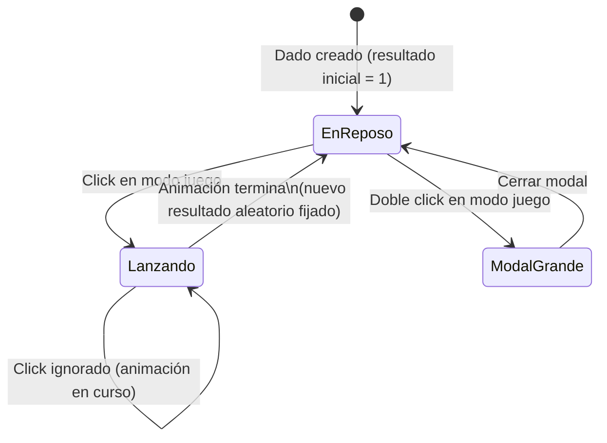

- **Nombre**: Nuevo tipo de componente "Dado"
- **Código**: 00020
- **Tipo**: change

## Prompt original del usuario

un nuevo elemento que se pueda crear y añadir a la mesa que sea un dado:
- representación pseudo-3D en la mesa según el número de caras y siempre con una cara visible para el usuario con el resultado impreso en ella.
- representación específica realista de cada tipo de dados de 4, 6, 8, 10 y 12 caras. Para dados con otra cantidad de caras , representarlos como el de 10.
- un clic: posibilidad de lanzarlo para tener un número aleatorio con un efecto visual
- cuando se lanza el dado, su resultado debe reflejarse en el propio dado
- doble clic: una modal con el resultado actual más grande

Configuración:
- color
- número de caras: mínimo 2, máximo 100.
- tipo de fuente de los números de los resultados (a elegir en la lista de recursos)

## Descripción completa

Se añade "Dado" como nuevo tipo de componente que se puede colocar sobre la mesa, junto a los ya existentes "Cuadro de texto" y "Tablero" (cambio 00019). Se crea, mueve y redimensiona en modo edición igual que cualquier otro componente, y se le puede aplicar la propiedad general "Bloqueado" (cambio 00018) para impedir que se arrastre en modo juego, sin ninguna particularidad adicional para este tipo.

### Alta del componente

Al crear un componente nuevo, el desplegable "Tipo" de la modal de creación (introducido en el cambio 00019) incorpora la opción "Dado" junto a "Cuadro de texto" y "Tablero". Al crear un dado se le asigna un tamaño por defecto y se coloca en la mesa sin solaparse con los componentes ya existentes, igual que el resto de tipos.

### Representación visual

Cada dado se representa con una ilustración 2D con distintos tonos de color (bisel/sombreado, sin gradientes ni transformación 3D real — misma técnica ya usada en el borde del tablero del cambio 00019) que sugiere el volumen de un poliedro, mostrando siempre de frente la cara con el resultado actual impreso en números grandes y legibles.

Existe una silueta dedicada y reconocible para cada uno de estos tipos de dado, según su número de caras configurado:

- **4 caras**: tetraedro.
- **6 caras**: cubo.
- **8 caras**: octaedro.
- **10 caras**: el clásico "cometa" (pentagonal trapezohedron) usado en juegos de rol.
- **12 caras**: dodecaedro.

Cualquier otro número de caras configurado (por ejemplo 2, 3, 5, 7, 9, 11, o cualquier valor entre 13 y 100) se representa con la misma silueta que el dado de 10 caras, sin una forma dedicada propia.

Al redimensionar el dado en modo edición (mismo manejador de esquina que el resto de componentes), mantiene siempre su proporción (ancho = alto), coherente con representar un objeto 3D regular — no se puede convertir en una forma alargada.

### Lanzamiento (modo juego)

Con un click sobre el dado (solo disponible en modo juego, no en modo edición) se lanza: se genera un número aleatorio entre 1 y el número de caras configurado, con un efecto visual breve (una animación de giro/tambaleo del propio dado) antes de asentarse mostrando el nuevo resultado impreso en su cara visible. Mientras dura la animación, nuevos clicks sobre el dado no inician otro lanzamiento (se ignoran hasta que termina de asentarse).

La propiedad general "Bloqueado" (cambio 00018) solo determina si el dado se puede arrastrar por la mesa; no afecta a la posibilidad de lanzarlo, que sigue disponible independientemente de su estado de bloqueo.

En modo edición, el click/doble click sobre el dado no lo lanza: siguen teniendo el comportamiento genérico ya existente para cualquier componente (selección, o abrir la modal de edición de propiedades).

### Ver resultado en grande

Con un doble click sobre el dado (solo en modo juego) se abre una modal mostrando el resultado actual con un tamaño mucho mayor, fácil de leer desde lejos. La modal se cierra igual que el resto de modales de la app.

### Casos límite

- **Resultado inicial**: al crear el dado se le asigna el resultado "1" (la cara "1"), para que nunca se muestre vacío ni indefinido, sin necesidad de lanzarlo antes.
- **Cambiar el número de caras tras crear el dado**: si el resultado actualmente mostrado deja de ser válido para el nuevo número de caras (por ejemplo, se reduce de 20 a 6 caras estando el resultado en 15), el resultado se reinicia a "1".
- **Sin tipografías disponibles**: si no hay ninguna fuente disponible en la carpeta de recursos del proyecto, los números del resultado se muestran con la tipografía por defecto de toda la app, sin impedir crear ni configurar el dado.

### Propiedades específicas del dado

- **Color del cuerpo**: color de fondo del dado (por defecto un gris neutro).
- **Color de los números**: color de los números del resultado impreso en la cara visible, independiente del color del cuerpo (por defecto negro).
- **Número de caras**: numérico, entre 2 y 100 (por defecto 6). Determina tanto el rango de resultados posibles al lanzar como qué silueta dedicada se usa (ver "Representación visual").
- **Tipo de fuente de los números**: se elige entre las fuentes tipográficas disponibles en la carpeta de recursos del proyecto, mediante un botón que abre una galería de selección (mismo patrón que la galería de imágenes ya prevista para el fondo tipo "Imagen" del tablero — cambio 00019), mostrando el nombre de cada fuente junto con una muestra de texto en esa propia tipografía. Si no hay ninguna fuente disponible, se usa la tipografía por defecto de toda la app (ver "Casos límite").

## Apuntes técnicos

- Esta entrada depende del tipo de componente "Tablero" (cambio 00019, todavía sin implementar) en dos frentes: (1) el desplegable "Tipo" de `ui/componentModal.js` que introduce ese cambio, al que "Dado" se suma como tercera opción; y (2) el sistema de recursos con galería de selección que ese cambio construye para elegir imágenes, que aquí se reutiliza/extiende para listar también ficheros de fuente tipográfica (`.woff`, `.woff2`, `.ttf`, `.otf`) en vez de imágenes. Conviene implementar 00019 antes que esta entrada, o generalizar su sistema de recursos para ambos tipos de fichero a la vez.
- `src/scripts/build.py` ya soporta embeber fuentes como data URI (mismo mecanismo que imágenes: `MIME_TYPES` incluye `.woff`/`.woff2`/`.ttf`/`.otf`/`.eot`, vía `@font-face` con `url()` en CSS) — es la base técnica en la que puede apoyarse la extensión del sistema de recursos a fuentes.
- El giro/tambaleo del lanzamiento y el bisel/sombreado de cada silueta son excepciones explícitas a `STYLE_BIBLE.md` sección 13 ("Qué NO hacer" — hoy prohíbe sombras/relieves/gradientes/animaciones sin decidirlo explícitamente), acotadas a este componente, en la misma línea que la excepción ya registrada para el bisel del borde del tablero (cambio 00019). Al planificar/implementar, actualizar `STYLE_BIBLE.md` documentando esta nueva excepción.
- El manejador de redimensionado genérico (`ui/resizeHandle.js`, `attachResizeHandle`) soporta hoy `axis: 'both'` sin forzar proporción; mantener el dado siempre cuadrado requiere o bien un nuevo modo de `axis` que fuerce ancho=alto, o bien clampar en el propio `clamp()` que recibe la función — a decidir en el plan.
- Distinguir un click (lanzar/abrir modal) de un arrastre (mover, si no está "Bloqueado") ya es un patrón resuelto en `ui/componentRenderer.js` para el modo edición (`onToggleSelect` vía click simple convive con `onMove` vía arrastre sobre el mismo componente) — reutilizable como referencia para la interacción de lanzamiento en modo juego.
- `modes/play/playMode.js` hoy llama a `renderComponentsOnTable` sin `onSelect`/`onToggleSelect` (sección 5 de `ARCHITECTURE.md`); el click/doble click de este cambio son interacciones nuevas específicas de modo juego, no relacionadas con la selección de modo edición.
- El resultado actual del dado (y su número de caras, colores y fuente) se guarda como cualquier otra propiedad de componente (`properties`), incluido en el autoguardado y la exportación a fichero ya existentes, sin mecanismo adicional.
