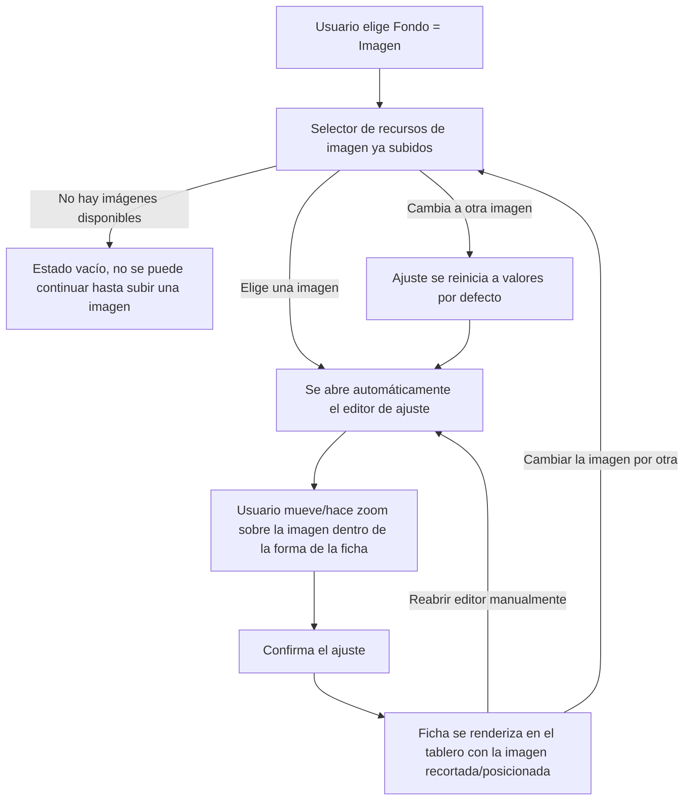

- **Nombre**: Ficha con editor de ajuste de imagen
- **Código**: 00029
- **Tipo**: change

## Prompt original del usuario

Implementar nuevo elemento: ficha y editor de imagen para elementos de tablero.

Propiedades generales:
- Bloqueado (false por defecto)

Propiedades específicas:
- Forma: cuadrada o circular
- Borde: color y grosor
- Fondo: color, texto (debe estar centrado vertical y horizontalmente siempre y ajustarse al tamaño de la ficha) o imagen (recurso).
        - En el caso de ser una imagen, al seleccionarla, el usuario debe poder redimensionarla y moverla sobre la forma de la ficha elegida hasta que esté conforme con la apariencia final. Esto es solo para saber como se debe ver la imagen en esta ficha (offset, zoom, recorte, etc), NUNCA cambia el recurso. Todo esto es una nueva funcionalidad reutilizable porque en el futuro habrá otros elementos que incorporen imágenes de fondo y también quiero que se pueda configurar la forma en que se vea esa imagen para ese elemento en concreto.

Implementar meeples o fichas.

## Descripción completa

Se añade un nuevo tipo de elemento de tablero, "Ficha", pensado para representar meeples/tokens/fichas de juego.

**Propiedad general:**
- Bloqueado: igual que en el resto de elementos, por defecto desbloqueada (`false`).

**Propiedades específicas:**
- Forma: cuadrada o circular. Cambiar la forma no hace perder la configuración de borde ni de fondo ya hecha, solo cambia el recorte visual de la ficha.
- Borde: color y grosor. Un grosor de 0 equivale a no mostrar borde.
- Fondo, con tres modos posibles (excluyentes entre sí, pero cada uno conserva su configuración aunque se cambie a otro y se vuelva):
  - Color sólido.
  - Texto: siempre centrado vertical y horizontalmente, con el tamaño de letra ajustado automáticamente para caber dentro de la ficha (sin tamaño manual configurable).
  - Imagen: se elige una imagen ya subida al proyecto (recurso existente). Tras elegirla (o al cambiarla por otra), se abre automáticamente un editor donde el usuario puede mover y hacer zoom sobre la imagen para decidir cómo se recorta/encaja dentro de la forma de la ficha (cuadrada o circular). Este ajuste (posición y zoom) es específico de esa ficha y nunca modifica el recurso de imagen original. El editor también se puede reabrir después bajo demanda, sin tener que volver a elegir la imagen. Si el usuario sustituye la imagen por otra, el ajuste se reinicia a un valor por defecto (imagen centrada, con el zoom mínimo que cubre toda la forma).

Este editor de ajuste de imagen (mover/zoom/recorte sobre una forma) se construye como una funcionalidad reutilizable, pensada para que futuros tipos de elemento que también tengan fondo de imagen puedan apoyarse en ella, y no como algo exclusivo de la ficha.

**Convivencia con lo existente:** la ficha es un tipo de elemento más, igual que los ya existentes (texto, tablero); no sustituye ni modifica ninguno de ellos.

**Alcance de datos y quién puede usarlo:** igual que cualquier otro elemento del proyecto — no hay usuarios ni roles distintos; se crea y edita en modo edición, y en modo juego se puede mover si no está bloqueada.

**Visual de alto nivel:**
- La ficha aparece como una nueva opción al elegir el tipo de elemento a añadir.
- Su edición sigue el mismo patrón de pestañas (Generales/Específicas) que el resto de elementos, con los campos de Forma, Borde y Tipo de fondo (y sus campos condicionales según el tipo elegido).
- En el tablero se dibuja como un cuadrado o un círculo con el borde y el fondo configurados (color, texto centrado o imagen recortada/posicionada según el ajuste guardado).
- Sin sombras, gradientes, bordes muy redondeados ni animaciones, salvo que se decida documentar explícitamente una excepción (no se pide ninguna para este cambio).

**Preguntas de alcance resueltas con el usuario:**
- Forma: selector simple cuadrada/circular, sin perder configuración de borde/fondo al cambiar — confirmado.
- Fondo con tres modos exclusivos que conservan su configuración al alternar entre ellos — confirmado.
- Texto de fondo con tamaño automático (sin campo manual) — confirmado.
- Editor de ajuste de imagen: se abre automáticamente tras elegir/cambiar la imagen, reutilizable para futuros tipos, con botón para reabrirlo manualmente, y con reinicio del ajuste al cambiar de imagen — confirmado.
- Bloqueado por defecto en `false` — confirmado (ya es un comportamiento genérico de cualquier elemento).
- Sin necesitar excepción de estilo (sombras/gradientes/bordes redondeados grandes) para este cambio — confirmado.

## Apuntes técnicos

- Modelo de componente genérico ya soporta `bloqueado`, `properties{}` e `image` (`src/core/component.js`); "Bloqueado" ya es una propiedad genérica editada en la pestaña "Generales" de `src/ui/componentModal.js`, no requiere trabajo adicional por tipo.
- Un nuevo tipo de elemento debe registrarse en: `src/ui/componentTypeModal.js` (array `COMPONENT_TYPES`), `src/ui/componentModal.js` (`createDefaultComponent(type)` y `renderSpecificTab()`) y `src/ui/componentRenderer.js` (renderizado real en el tablero). Ver también `design/docs/ARCHITECTURE.md` §4/§5.
- El tipo `'tablero'` ya usa un patrón de fondo con `properties.fondoTipo` y un submodal `openBoardImageModal` (`src/ui/boardImageModal.js`) para elegir un recurso de imagen — patrón directo a replicar para el selector de imagen de la ficha (galería de recursos tipo imagen, estado vacío "No hay imágenes disponibles").
- Sistema de recursos ya genérico y reutilizable: `src/core/resource.js` (`RESOURCE_TYPES.IMAGE`, `createResource`, `isResourceInUse`), con panel propio (`src/ui/resourceList.js`) y flujo de subida ya construido. `isResourceInUse` ya escanea `component.image` y todas las `properties`, por lo que un recurso de imagen usado por el ajuste de una ficha ya queda protegido de borrado sin trabajo adicional.
- No existe ningún editor de posición/zoom/recorte de imagen en el proyecto (comprobado por búsqueda de "zoom", "offset", "recorte", "crop" en `src/`): es funcionalidad nueva a construir desde cero, como módulo/modal independiente y genérico (no acoplado al tipo ficha) para que otros tipos futuros con imagen de fondo puedan reutilizarlo.
- El fondo actual de `'tablero'` usa `background-size: cover` sin ajuste manual — no sirve como referencia de implementación del editor, solo como referencia de dónde vive hoy la elección de imagen de fondo.
- El cambio `00020` ("Dado", `changes/inProgress/00020/`) está documentado pero aún no implementado; sirve como precedente de patrón para el modal de propiedades específicas (pestañas Generales/Específicas, campos `.modal__field`, `.modal__field--row`, botón que abre un submodal de selección de recurso) — no es una dependencia bloqueante para este cambio.
- `design/docs/stylebible/STYLE_BIBLE.md` §13 prohíbe sombras, gradientes, bordes muy redondeados y animaciones salvo excepciones explícitamente documentadas (la única existente es el bisel del tipo `'tablero'`, acotada solo a ese tipo); cualquier efecto similar para la ficha requeriría documentar una nueva excepción, no asumir la ya existente.
