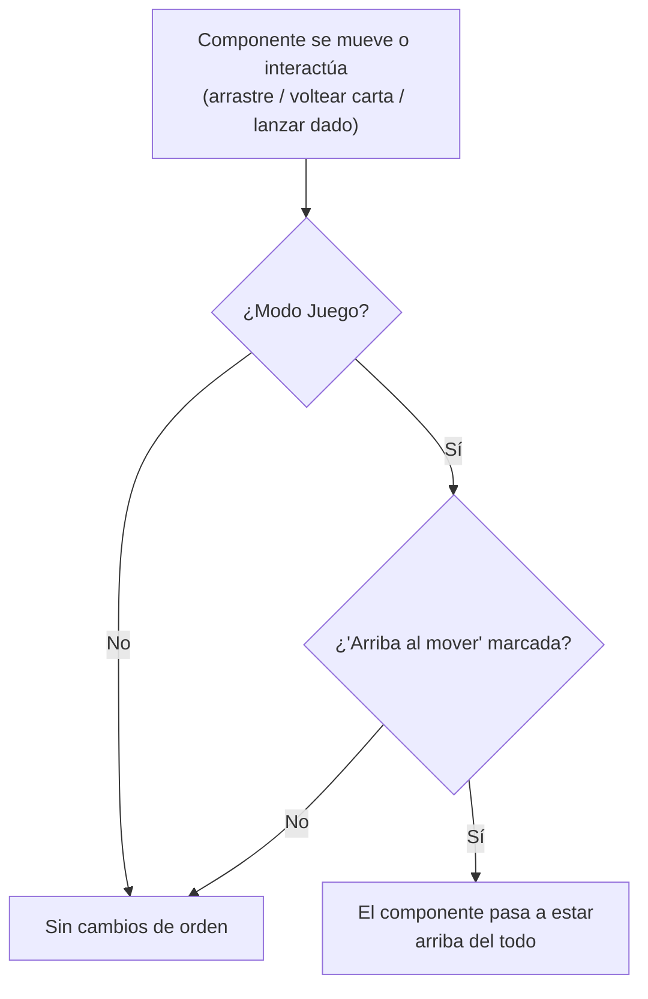

- **Nombre**: Propiedad "Arriba al mover" en componentes
- **Código**: 00061
- **Tipo**: change

## Prompt original del usuario

Los elementos tienen una propiedad global nueva, de tipo check, llamada “Arriba al mover”:
- si está  marcada: cada vez que se mueva el elemento SOLO en el modo juego, se le asigna un valor de orden=1  (el elemento se coloca arriba del todo)
- si no está marcado, no hay cambios: el elemento mantiene su valor de orden

El valor  por defecto es NO marcada, a excepción de las cartas, figuras, y dados, que el valor por defecto es SÍ marcada.

---

Corrección tras la primera propuesta de análisis:

3. Voltear una carta o lanzar un dado también se incluye. Añade a la ayuda de la propiedad que es al mover o interactuar
4. Si el componente está bloqueado todavía puede afectarle si tiene interacción

Asegúrate además de que en la importación/exportacion también se incluye el valor de esta propiedad

## Descripción completa

Cada componente de la mesa (cualquier tipo: cuadro de texto, tablero, dado, visor de documentos, ficha, carta) incorpora una nueva propiedad "Arriba al mover", editable individualmente para cada componente desde la pestaña "Generales" de su modal de configuración — el mismo sitio y el mismo aspecto que los checkboxes ya existentes "Bloqueado" y "Mostrar tooltip", justo debajo de ambos, con su propio icono de ayuda.

Comportamiento:

- Si está marcada: cada vez que, estando en Modo Juego, el componente se mueva (se arrastra a una nueva posición) **o realice su propia interacción de juego** (voltear, en el caso de una carta; lanzar, en el caso de un dado), se coloca automáticamente por encima de todos los demás componentes de la mesa (equivalente a fijar su orden al valor "1", el más alto de todos).
- Si no está marcada: no hay ningún cambio — el componente conserva la posición de apilado que ya tuviera, tanto al moverse como al interactuar con él.
- Aplica únicamente en **Modo Juego**. En Modo Edición no hay ningún cambio de comportamiento: mover un componente mientras se edita la partida nunca lo reordena por esta propiedad.
- Es independiente del checkbox "Bloqueado": un componente bloqueado sigue sin poder arrastrarse (sin cambios respecto a hoy), pero sus interacciones propias de juego (voltear una carta, lanzar un dado) siguen estando disponibles aunque esté bloqueado — igual que ya ocurre actualmente — por lo que "Arriba al mover" puede seguir disparándose por esas interacciones incluso con el componente bloqueado.
- El texto de ayuda de la propiedad deja claro que cubre ambos casos: se coloca arriba del todo tanto al moverlo como al interactuar con él (voltear, lanzar).

Diagrama de la decisión que se aplica en cada uno de esos tres momentos (arrastre, volteo de carta, lanzamiento de dado):

Valor por defecto al crear un componente nuevo: **marcada** para los tipos pensados para piezas de juego que se mueven o se usan activamente durante la partida — cartas, figuras (fichas/tokens/meeples) y dados — y **desmarcada** para el resto de tipos.

Un componente ya existente, guardado antes de que existiera esta propiedad, se comporta como si estuviera **desmarcada**, sea cual sea su tipo — el valor por defecto según el tipo solo se aplica a los componentes que se creen a partir de ahora, no de forma retroactiva a los ya guardados.

El valor de esta propiedad viaja junto con el resto de datos del componente en cualquier operación de guardado/carga: autoguardado, "Guardar a fichero" e "Exportar", igual que ya ocurre con "Bloqueado" u "Orden".

### Preguntas de alcance resueltas

- **¿A qué corresponden "cartas", "figuras" y "dados"?** El tipo pensado para representar figuras/meeples/tokens de juego es el que en el resto de la documentación del proyecto se llama "ficha". Se confirma ese mapeo.
- **¿Es una propiedad realmente global (una única configuración compartida por todos los componentes de un tipo) o un campo por componente con un valor por defecto según su tipo?** Se confirma que es un campo editable componente a componente (como "Bloqueado"/"Mostrar tooltip"), cuyo valor de partida al crearlo varía según el tipo — no una configuración única compartida por todos los componentes de un mismo tipo a la vez.
- **¿Qué cuenta como disparador?** Inicialmente se planteó solo el arrastre; se corrigió para incluir también la interacción propia de cada tipo (voltear carta, lanzar dado).
- **¿Y si el componente está bloqueado?** Se corrigió: el bloqueo solo impide el arrastre (sin cambios), pero no impide que las interacciones propias (volteo, lanzamiento) disparen "Arriba al mover".
- **¿Qué pasa con partidas ya guardadas sin este campo?** Se comportan como si estuviera desmarcada, sin aplicar el valor por defecto por tipo de forma retroactiva.

## Apuntes técnicos

- Campo por-componente equivalente a `bloqueado`/`mostrarTooltip`, a declarar en `core/component.js` (`createComponent`) y a editar en `ui/componentModal.js` (pestaña "Generales", mismo patrón `modal__field--checkbox` + `createHelpIcon` ya usado por esos dos campos).
- Valor por defecto por tipo: replicar el patrón ya usado en `createDefaultComponent(type)` de `ui/componentModal.js`, que ya fuerza `bloqueado = false` para `'ficha'`/`'carta'` — mismo mecanismo, para forzar el nuevo campo a `true` en `'carta'`/`'ficha'`/`'dado'`.
- `order = 1` ya significa "el componente más arriba de todos" en el modelo actual (`core/state.js`), que ya expone `reorderComponent(id, rawOrder)` para mover un componente a una posición dada — no hace falta nueva lógica de reordenación, solo invocarla con `1`.
- Los puntos de enganche en Modo Juego están todos en `modes/play/playMode.js`: `onMove` (arrastre), `onDiceResult` (lanzar dado), `onCartaFlip` (voltear carta). `modes/edit/editMode.js` tiene su propio `onMove` independiente, que no debe verse afectado.
- En `playMode.js`, `canMove` ya filtra el arrastre por `bloqueado !== true` (sin cambios ahí); en cambio `onDiceResult`/`onCartaFlip` no comprueban `bloqueado` (precedente ya documentado en `ARCHITECTURE.md`: "Bloqueado" solo afecta al arrastre, nunca a lanzar/voltear) — el nuevo campo debe aplicarse en ambos handlers sin condicionarlo a `bloqueado`.
- Al ser un campo plano del objeto `component` (no una colección nueva a nivel de `state.js`), queda cubierto automáticamente por el autoguardado/"Guardar a fichero"/"Exportar" ya existentes, que serializan la lista completa de componentes — no se necesita ningún cambio en `core/persistence.js` ni `core/fileExport.js` (la sección 8 de `ARCHITECTURE.md` solo exige revisión transversal para colecciones nuevas de `state.js`, no para campos de un componente ya cubierto).
- No se ha detectado ninguna incongruencia entre `ARCHITECTURE.md`/`FEATURES.md` y el código real durante este análisis.
