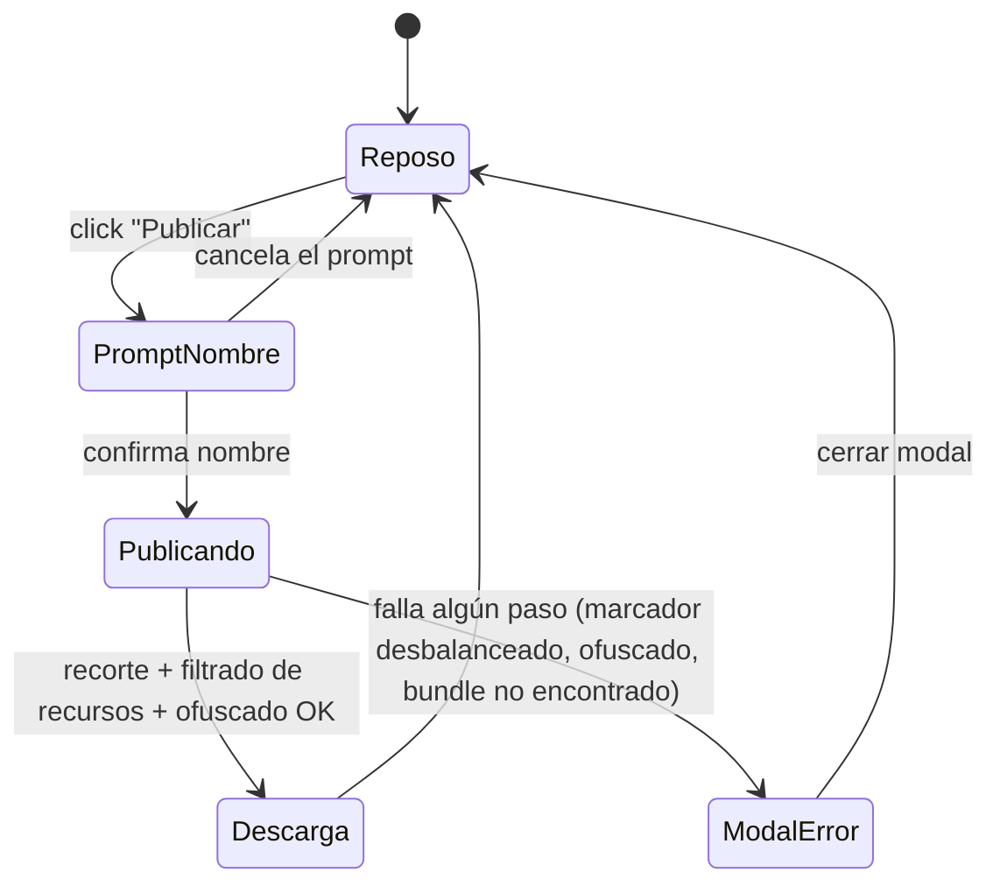

# Navegación — botón "Publicar" (modo edición)

Notas:

- **PromptNombre**: `prompt()` nativo del navegador, mismo patrón que ya usa "Guardar" — no es UI propia de la app, sin maqueta asociada. Precargado con `{título completo de la app}-game.html`.
- **Publicando**: botón "Publicar" deshabilitado con el texto cambiado a "Publicando…" (ver `design_boton-publicar.html`) mientras se recorta el código exclusivo de edición, se filtran los recursos no usados y se ofusca el bundle.
- **ModalError**: reutiliza el modal de error ya existente en la app (`showErrorModal`), sin diseño nuevo — cubre tanto el caso de marcadores `EDIT-ONLY` desbalanceados como el de un entorno sin bundle embebido (dev) o un fallo del ofuscador.
- **Descarga**: dispara la descarga del `Blob` (mismo mecanismo que `downloadHtml()` ya usa "Guardar") y vuelve a Reposo sin ningún paso intermedio adicional.
