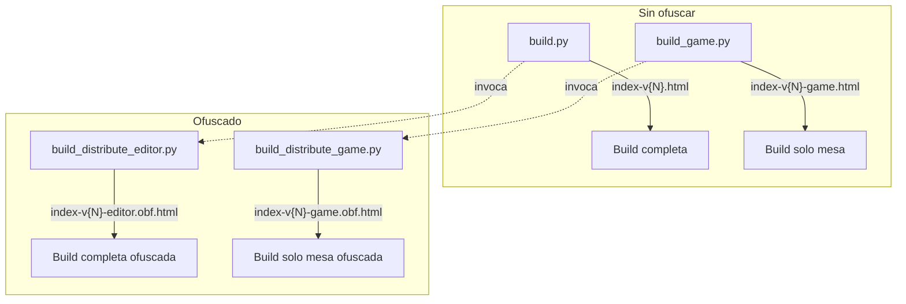
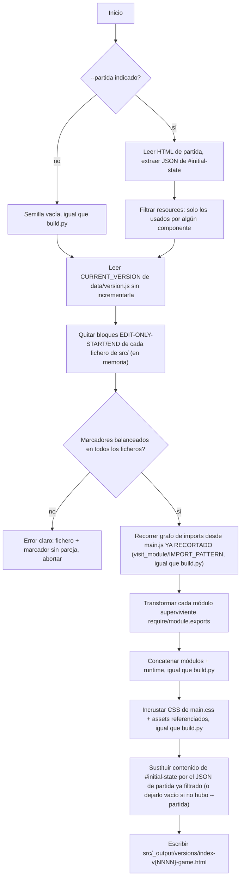
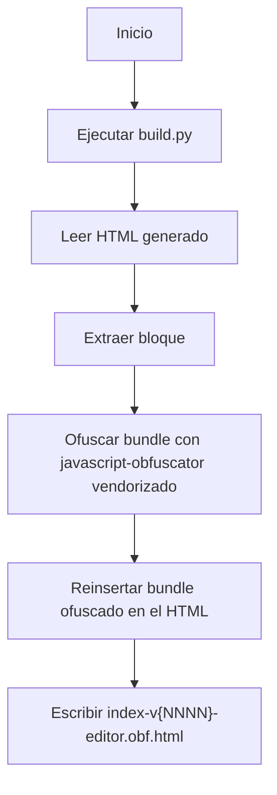
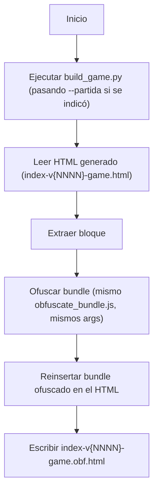

## (a) Anotaciones funcionales

**Fuera de alcance** (confirmado, sin cambios respecto a `description.md`):
- No se separa el CSS exclusivo de edición: `src/styles/main.css` no se recorta, se copia entero también en el entregable de solo mesa (sin efecto visible, solo unos KB de más).
- No se toca el proceso de versión: `build_game.py`/`build_distribute_game.py` leen `CURRENT_VERSION` de `src/data/version.js` tal cual, sin incrementarla ni escribirla — eso sigue siendo exclusivo de `build.py`.
- No se modifica en ningún sentido `build.py` ni su comportamiento (sigue incrementando versión y generando la build completa igual que hoy).

**Dudas técnicas resueltas con el usuario en esta fase de planificación** (adicionales a las ya resueltas en `description.md`):

- **¿Qué separador usar en el sufijo `.obf` (el código actual usa `_editor.obf.html` con guion bajo, la ampliación describía guion)?** Unificar todo a guion: se renombra también la salida ya existente de `build_distribute_editor.py` a `index-v{NNNN}-editor.obf.html`, y la nueva a `index-v{NNNN}-game.obf.html`.
- **¿Cómo recibe `build_game.py` una partida ya diseñada (necesaria para que la limpieza de recursos tenga efecto real)?** Argumento opcional de línea de comandos `--partida <ruta>` apuntando a un HTML ya generado con el botón "Guardar" del modo edición (tiene `#initial-state` ya relleno). Sin ese argumento, se comporta como `build.py`: semilla vacía, sin recursos que filtrar.
- **`ui/editModeToggle.js`, ¿fichero 100% exclusivo de edición o mixto?** Es mixto: `renderModeSwitcher`/`createFitButton` (botón "Ajustar zoom", usado también en modo juego) deben conservarse íntegros; solo `renderEditToolbar` (Guardar/Exportar/Importar) es exclusiva de edición. Se trata como fichero con marcador manual, igual que `main.js`/`core/persistence.js`, en vez de excluirlo entero por el mecanismo de grafo — ver (b).

**Incongruencia de documentación detectada** (vía `ms-internal-tech-analysis`): `ARCHITECTURE.md` sección 3 describe `ui/editModeToggle.js` con dos funciones `renderEnterEditButton`/`renderEditToolbar`; el código actual expone en su lugar `renderModeSwitcher` (que incluye el botón de entrar en edición **y** el botón "Ajustar zoom") y `renderEditToolbar`. Se corrige en (c).

## (b) Solución técnica

### Visión general de los cuatro scripts de build/distribución



Los cuatro escriben en `src/_output/versions/`, diferenciándose solo por el sufijo del nombre de fichero.

### 1. Convención de marcadores `EDIT-ONLY`

Se introduce un marcador de bloque de texto literal, independiente de la sintaxis de comentario de cada tipo de fichero:

- En `.js`: `// EDIT-ONLY-START` … `// EDIT-ONLY-END`
- En `.html`: `<!-- EDIT-ONLY-START -->` … `<!-- EDIT-ONLY-END -->`

`build_game.py` no distingue la sintaxis de comentario: busca directamente las cadenas `EDIT-ONLY-START`/`EDIT-ONLY-END` en el contenido crudo de cada fichero de `src/` (antes de cualquier otro procesado) y elimina todo lo que hay entre cada pareja (marcadores incluidos). Si en un fichero el número de `START` no coincide con el de `END`, o aparece un `END` antes que su `START` correspondiente, el script se detiene con un `SystemExit` indicando el fichero y qué marcador ha fallado (caso límite ya descrito en `description.md`).

Importante: el marcador **no** implica por sí solo que el fichero entero se excluya del bundle — solo recorta el texto entre marcadores, dejando el resto del fichero intacto para que siga participando en el recorrido de imports.

### 2. Ficheros con marcador manual (código de ambos modos mezclado en las mismas líneas)

Solo estos cuatro necesitan marcador manual; el resto de ficheros exclusivos de edición se detectan solos por alcanzabilidad de grafo (paso 4):

- **`src/main.js`**:
  - Separar la línea `import { renderModeSwitcher, renderEditToolbar } from './ui/editModeToggle.js';` en dos: una para `renderModeSwitcher` (se queda) y otra para `renderEditToolbar` (marcada).
  - Marcar la línea `import { renderEditMode, deleteSelectedComponent } from './modes/edit/editMode.js';` completa.
  - Marcar la llamada `renderEditToolbar(toolbarEl);` dentro de `renderAll()`.
  - Reescribir `renderActiveMode()` para que la rama de edición quede aislada en un bloque marcado con `return` propio, dejando `renderPlayMode(contentEl)` como única línea fuera del marcador:
    ```js
    function renderActiveMode() {
      // EDIT-ONLY-START
      if (getState().mode === MODES.EDIT) {
        renderEditMode(contentEl);
        return;
      }
      // EDIT-ONLY-END
      renderPlayMode(contentEl);
    }
    ```
  - Marcar la propiedad `onDeleteSelected: () => deleteSelectedComponent(),` dentro de la llamada a `initGlobalShortcuts(...)` (verificado que `ui/globalShortcuts.js` ya trata `onDeleteSelected` como opcional — `isEditMode() && onDeleteSelected` — así que retirar la propiedad no rompe nada).

- **`src/ui/editModeToggle.js`**: marcar la función `renderEditToolbar` completa (incluida su rama interna) y, en la cabecera del fichero, los imports que solo ella usa: `buildExportHtml`/`downloadHtml`/`downloadJson` (`core/fileExport.js`), `buildComponentsExport`/`parseImportedComponents` (`core/persistence.js`), `mergeImportedGame` (`core/importMerge.js`), `openExportSelectionModal`, `openImportSelectionModal`, `openImportConfirmModal`, `openImportReportModal`, `openImportConversionErrorModal`, `migrateFichaComponent`. Se conservan sin marcar: `getComponentsBounds` (`ui/componentRenderer.js`), `fitToBounds` (`ui/table.js`), `renderModeSwitcher`, `createFitButton`, y los imports de `core/state.js`/`showToast`/`showErrorModal` que use lo que quede sin marcar.

- **`src/core/persistence.js`**: marcar `buildComponentsExport` y `parseImportedComponents` (ya identificadas en `description.md` como exclusivas de la barra de edición). `saveState`/`loadState`/`readSeedState` quedan intactas.

- **`src/index.html`**: marcar únicamente el contenedor `<div id="edit-toolbar"></div>`. **Importante, ajuste sobre lo apuntado en `description.md`:** `<div id="mode-switcher"></div>` **no** se marca — `renderModeSwitcher` sigue renderizando en él (botón "Ajustar zoom", necesario en modo juego).

### 3. `src/scripts/build_game.py` (nuevo)



Notas de implementación:

- **Por qué recorrer el grafo sobre el árbol ya recortado, en un único pase, en vez del pase doble descrito originalmente en `description.md`:** al quitar primero los bloques `EDIT-ONLY` de `main.js` (imports de `editMode.js` y de `renderEditToolbar`), el propio `main.js` recortado deja de importar `modes/edit/editMode.js` y deja de arrastrar, a través de `ui/editModeToggle.js` ya recortado, los imports exclusivos de `renderEditToolbar` (`fileExport.js`, `importMerge.js`, las modales de exportar/importar, etc.). Un único recorrido de alcanzabilidad (idéntico al `visit_module`/`IMPORT_PATTERN` de `build.py`) partiendo de ese `main.js` recortado ya excluye automáticamente todo el subárbol exclusivo de edición (`editMode.js` y los ~20 ficheros de UI solo alcanzables desde ahí), sin necesitar comparar dos recorridos por separado ni tratar `ui/editModeToggle.js` como una raíz aparte. Esto resuelve de forma más simple y más correcta el caso mixto de `ui/editModeToggle.js` (punto (a)): al quedar recortado antes de recorrer el grafo, sus imports ya-innecesarios simplemente no se visitan.
- **Casos límite marcador mal formado**: igual que describe `description.md` — el script no debe generar un entregable a medias ni con marcadores visibles; debe abortar con `SystemExit` antes de llegar a escribir nada.
- **Lectura de `--partida`**: extraer el bloque `<script type="application/json" id="initial-state">...</script>` del HTML indicado (misma idea que `readSeedState()` de `core/persistence.js`, pero en Python) y parsear su JSON. Si el fichero no tiene ese bloque, o no es JSON válido, abortar con error claro (mismo criterio de "no generar a medias").
- **Filtrado de recursos no usados**: reimplementar en Python el mismo criterio que `core/resource.js` (`isResourceInUse`/`collectDeepValues`): un recurso se conserva si su `id` aparece como `component.image`, o en cualquier valor anidado de `component.properties`, para al menos un componente de la partida. Se aplica sobre `components`/`resources` del JSON leído, sin excepción para los recursos por defecto (ya resuelto en `description.md`). Si no hay `--partida`, no hay `resources` que filtrar (la semilla vacía nunca los incluye — el sembrado de los 38 recursos por defecto ocurre en tiempo de ejecución en el navegador, `main.js`, no en el build).
- El resto de campos del JSON de la partida (`panelState`, `resourcePanelState`, `resourcesSeeded`, `groups`, `groupPanelState`, `version`) se preservan tal cual al reinsertarlo en `#initial-state` — solo se muta `resources`.
- Reutilizar literalmente de `build.py`: `MIME_TYPES`, `to_data_uri`, `embed_css_asset_urls`, `embed_html_asset_refs`, `resolve_module_path`, el sistema `require`/`module.exports` (`RUNTIME`), y la comprobación del marcador `{VERSION}` en el `<title>`.
- Salida: `src/_output/versions/index-v{NNNN}-game.html` (misma carpeta que `build.py`, `NNNN` = `CURRENT_VERSION` vigente, sin incrementar). El script imprime `Build de solo mesa generado en {ruta}` — nótese que, a diferencia del mensaje de `build.py`, **debe seguir conteniendo la subcadena** `Build generado en` en algún punto reconocible para que `build_distribute_game.py` pueda localizar la ruta con la misma regex que ya usa `build_distribute_editor.py` (ver punto 5) — o, más simple, imprimir literalmente `Build generado en {ruta}` igual que `build.py`, sin cambiar el mensaje.

### 4. `src/scripts/build_distribute_editor.py` (cambio mínimo)

Único cambio: el nombre del fichero de salida pasa de `index-v{NNNN}_editor.obf.html` a `index-v{NNNN}-editor.obf.html` (guion en vez de guion bajo), por la unificación de esquema de nombres acordada. Sin cambios en la lógica de ofuscado ni de extracción.



### 5. `src/scripts/build_distribute_game.py` (nuevo)

Análogo a `build_distribute_editor.py`, reutilizando la misma `BUNDLE_SCRIPT_PATTERN` y el mismo `obfuscate_bundle.js` (sin cambios en este último — ya es agnóstico, recibe rutas de entrada/salida por argumento):



Acepta el mismo argumento opcional `--partida <ruta>` que `build_game.py` y lo reenvía tal cual al invocarlo como subproceso. Si `build_game.py` o el ofuscador fallan, se detiene con error claro sin generar un entregable a medias (mismo criterio que `build_distribute_editor.py` hoy).

### Orden de implementación sugerido

1. Introducir los marcadores `EDIT-ONLY` en los cuatro ficheros del punto 2 (cambios pequeños y verificables uno a uno).
2. Escribir `build_game.py` y comprobar manualmente que genera un entregable de solo mesa correcto (sin y con `--partida`).
3. Renombrar el sufijo de salida de `build_distribute_editor.py`.
4. Escribir `build_distribute_game.py`.

## (c) Cambios de arquitectura

`design/docs/ARCHITECTURE.md` sección 6 ("Flujo de desarrollo y build") debe ampliarse para documentar:

- Los cuatro scripts de build/distribución y su fichero de salida (tabla o lista análoga a la del diagrama de la sección (b) de este plan).
- La convención de marcadores `EDIT-ONLY-START`/`EDIT-ONLY-END` y la lista de ficheros que los usan hoy (`main.js`, `ui/editModeToggle.js`, `core/persistence.js`, `index.html`), como convención a mantener: cualquier funcionalidad nueva de modo edición debe preferir un fichero propio (detectado solo por alcanzabilidad de grafo) en vez de mezclarse inline en uno de estos cuatro.
- Corregir la sección 3 (incongruencia detectada en (a)): sustituir la referencia a `renderEnterEditButton` por `renderModeSwitcher` (que incluye también el botón "Ajustar zoom", ya documentado por separado en esa misma sección).
