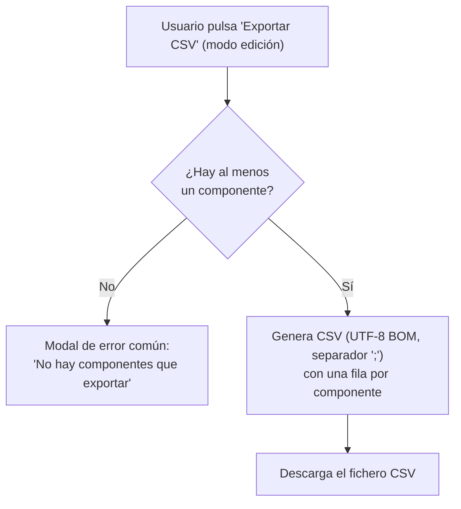

- **Nombre**: Exportar la lista de componentes a CSV
- **Código**: 00086
- **Tipo**: change

## Comentarios adicionales
- Tener en cuenta si un objeto tiene copias. ¿Se añade el original o solo las copias?

## Descripción completa

Se añade, en modo edición, un botón "Exportar CSV" junto a los botones existentes "Exportar"/"Importar" (JSON) y "Guardar" de la barra de edición. Al pulsarlo, descarga directamente un fichero CSV con una fila por cada componente actual del juego — sin selección previa ni modal intermedia, a diferencia de "Exportar" (JSON), que sí permite elegir qué incluir.

El CSV tiene las siguientes columnas:

- **id**: identificador del componente.
- **tipo**: tipo del componente (cuadro de texto, tablero, dado, visor de documentos, ficha, carta, etc).
- **Cantidad**: número de copias vinculadas que tiene este componente (ver funcionalidad "Copia" del proyecto), más él mismo. Por ejemplo, un componente con 5 copias vinculadas muestra el valor 6. Aplica a cualquier tipo de componente, no solo a cartas. Un componente sin copias vinculadas muestra 1. Una fila que es en sí misma una copia siempre muestra 1 (una copia no puede tener copias propias).
- **proporción**: proporción del componente (si aplica)
- **mazo**: nombre del mazo al que pertenece la carta (solo aplica a tipo "carta"; queda vacío si la carta no tiene mazo asignado, o si el componente no es de tipo carta).
- **imagenFrontal**: nombre de la imagen asociada a la cara frontal de la carta. Vacío si esa cara en concreto no tiene ninguna imagen asignada
- **imagenTrasera**: nombre de la imagen asociada a la cara trasera de la carta. Vacío si esa cara en concreto no tiene ninguna imagen asignada
- **imagen**: nombre de la imagen asociada al componente (aplica a los tipos que tienen una única imagen configurable — tablero y ficha; queda vacía para el resto de tipos, incluida carta, que usa las dos columnas anteriores en su lugar).
- **caras**: número de caras/resultados posibles del componente (solo aplica a tipo "dado" — el máximo configurado si usa "número máximo de caras", o la cantidad de valores de la lista si usa "lista de valores"; vacía para el resto de tipos).

### Casos límite y decisiones de alcance (confirmadas con el usuario)

- **Sin componentes**: si en el momento de pulsar el botón no hay ningún componente en el juego, se muestra un aviso de error (con el modal de error común de la app) y no se genera ni descarga ningún fichero.
- **Formato del fichero**: codificación UTF-8 con BOM y separador de campo punto y coma (`;`), para que se abra correctamente en Excel en español sin necesitar un paso de importación manual.
- **Disponibilidad**: solo en modo edición, igual que "Guardar"/"Exportar"/"Importar".
- **Relación con lo ya existente**: no sustituye ni interfiere con el mecanismo ya existente de Exportar/Importar en JSON (pensado para backup/restauración completa del estado). Este CSV es un informe de solo lectura, pensado para consulta o documentación externa del contenido del juego (por ejemplo, para producción física de los componentes).
- **Mantenimiento a futuro**: este listado de columnas no es cerrado. Cuando en el futuro se añada un nuevo tipo de componente, o una propiedad relevante a un tipo ya existente (p. ej. una nueva variante de imagen, un nuevo dato de configuración equivalente a "mazo"/"caras"/"proporción"), debe valorarse si esa novedad merece su propia columna en este CSV, igual que ya se ha hecho aquí con "proporción" para las cartas — el objetivo es que el listado siga reflejando fielmente los datos relevantes de producción/documentación de cualquier componente, no solo los de los tipos existentes en el momento de esta implementación.

### Flujo

## Apuntes técnicos

- La funcionalidad "Copia" (change 00097) vincula una copia a su original mediante el campo `copyOf` del componente (`copyOf === id del original`), de forma unidireccional (la copia apunta al original, el original no tiene lista de sus copias). No existe hoy ningún helper que cuente cuántas copias tiene un componente; `ms-how` deberá calcularlo recorriendo `components` y contando coincidencias de `copyOf`, siguiendo el mismo patrón ya usado en `core/state.js` (`syncCopyWithOriginal`, `removeComponent`) y en `nextCopyId` (`core/component.js`).
