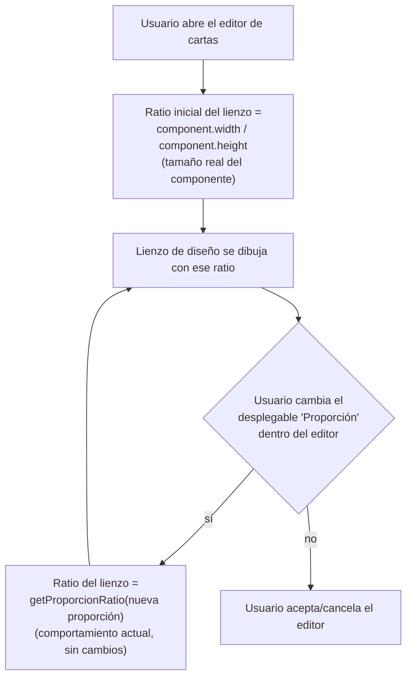

- **Nombre**: El editor de cartas usa el tamaño real como fuente de la proporción al abrirse
- **Código**: 00151
- **Tipo**: change
- **Fecha creación**: 2026-08-05

## Prompt original del usuario

al abrir el editor de cartas utiliza solo la proporción seleccionada, pero debería mirar ahora solo el tamaño, que es dónde tenemos la proporción real

## Descripción completa

Al abrir el editor visual de una carta para diseñar su cara frontal/trasera, el lienzo de diseño debe ajustar su forma (ancho/alto) al tamaño real que tiene la carta en ese momento, en vez de a la proporción guardada en la carta (el valor del desplegable "Proporción").

Motivo: el tamaño de cualquier componente (incluidas las cartas) se puede editar libremente desde su sección "Tamaño" (alto/ancho en píxeles), sin que ese cambio se refleje en el valor guardado de "Proporción". Esto puede hacer que ambos datos diverjan: la proporción guardada deja de representar fielmente cómo se ve la carta en la mesa, mientras que el tamaño real sí lo hace siempre. Por eso, al abrir el editor, debe primar el tamaño real sobre la proporción guardada, para que lo que se vea al diseñar coincida siempre con lo que se ve luego en la mesa.

**Qué no cambia:**
- El desplegable "Proporción" que hay dentro del propio editor de cartas sigue existiendo igual que hoy, y sigue sirviendo para elegir la forma de la carta (rectangular, circular, hexagonal, triangular...). Si el usuario cambia esta proporción mientras diseña, el lienzo sí recalcula su forma a partir de la proporción recién elegida (comportamiento actual, sin cambios) — la nueva regla solo aplica al momento de abrir el editor, no a los cambios que el usuario haga después dentro de él.
- Si el tamaño real de la carta no coincide exactamente con la proporción "canónica" de su forma (por ejemplo, alguien puso un ancho/alto desde "Tamaño" que no da exactamente un hexágono regular), el editor muestra el lienzo con ese tamaño real tal cual, aunque quede algo deformado respecto a la forma teórica — no se corrige ni se avisa de nada. El editor debe reflejar siempre fielmente cómo se ve la carta en la mesa, sea cual sea ese tamaño.

**Preguntas de alcance resueltas con el usuario:**
- ¿El cambio afecta solo al momento de abrir el editor, dejando el desplegable "Proporción" de dentro del editor con su comportamiento actual? — Sí, confirmado.
- ¿Si el tamaño real no encaja con la forma activa, se corrige/ajusta al abrir o se muestra tal cual, deformado? — Se muestra tal cual, sin corregir ni avisar.
- ¿Cambiar la Proporción dentro del propio editor debe seguir usando la proporción canónica de la forma elegida, o también debe intentar conservar el tamaño real? — Sigue usando la proporción canónica de la forma elegida (sin cambios respecto a hoy).

## Apuntes técnicos

- `ui/cardEditorModal.js`, `openCardEditorModal`: `working.proporcion` se inicializa hoy desde `props.proporcion || '5:7'` (línea ~286), y el lienzo de cada cara se dimensiona con `getDesignSize(working.proporcion)` (`core/cardProportions.js`) en varios puntos del fichero (líneas ~436, ~452, ~604 según última lectura). Al abrir el editor, el tamaño inicial del lienzo debe salir del ratio real `component.width / component.height` en vez de `getProporcionRatio(props.proporcion)` — con algún fallback razonable (p.ej. el ratio de `props.proporcion` como hoy) si `width`/`height` son `null`/`0`. Los usos de `getDesignSize(working.proporcion)` ligados al evento `change` del desplegable "Proporción" (línea ~404-436 aprox.) no cambian: siguen usando el ratio canónico de la proporción recién elegida.
- Causa raíz de la divergencia: `ui/componentModal.js` (cambio 00144) añadió una sección "Tamaño" en la pestaña "Generales" que edita `width`/`height` de cualquier componente sin pasar por ningún `clamp` de ratio — a diferencia del redimensionado en la mesa (`ui/componentRenderer.js`, `clampCartaSize`), que sí fuerza el ratio de `props.proporcion` (salvo `'circular'`/`'libre'`). Esta asimetría no se pide corregir en este cambio, solo que el editor confíe en el tamaño real al abrir.
- Cambio 00143 (en curso, `changes/inProgress/00143`) planea renombrar `ui/cardEditorModal.js` → `ui/visualEditorModal.js` (`openCardEditorModal` → `openVisualEditorModal`) y generalizar el editor con un parámetro `showProporcionSelector` (`true` para `'carta'`, `false` para `'tableroPersonalizado'`). Si 00143 se implementa antes que este cambio, `ms-how` debe aplicar esta solución sobre `ui/visualEditorModal.js`, limitada al caso `showProporcionSelector: true` — `'tableroPersonalizado'` no tiene proporción configurable y usa su propio tamaño de diseño fijo (`TABLERO_PERSONALIZADO_DESIGN_WIDTH`/`HEIGHT`), ajeno a este cambio.

