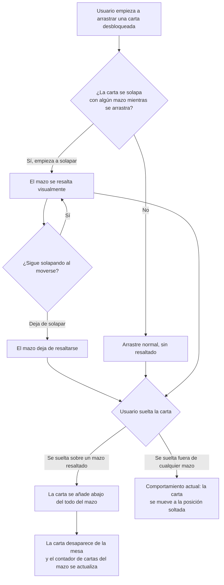

- **Nombre**: Meter carta en mazo arrastrándola en modo juego
- **Código**: 00188
- **Tipo**: change
- **Fecha creación**: 2026-08-07

## Prompt original del usuario

en el modo de juego también se debe poder meter una carta en un mazo si se arrastra encima

## Descripción completa

En el modo de juego (la partida en curso, no el modo de edición) se podrá meter una carta en un mazo simplemente arrastrándola y soltándola encima de él, igual que ya es posible hoy en el modo de edición.

Hoy, en modo de juego, la única forma de meter una carta en un mazo es a través del menú contextual de la carta ("Meter en mazo..."), que abre un desplegable para elegir mazo y posición (arriba o abajo del todo). Esa vía se mantiene sin cambios. El nuevo gesto de arrastrar es un atajo adicional, más rápido, para el caso habitual durante una partida.

### Comportamiento

- La carta se añade siempre "abajo del todo" del mazo (la próxima en aparecer sería la que ya estaba de última). Quien quiera elegir explícitamente "arriba del todo" sigue usando "Meter en mazo..." del menú contextual.
- No se pide confirmación al soltar: la carta entra directamente en el mazo. Es una acción reversible (se puede volver a sacar del mazo desde su menú contextual → "Ver contenido..." → "Sacar"), y pedir confirmación en cada suelta interrumpiría el ritmo normal de juego.
- Solo se puede arrastrar una carta cada vez — el modo de juego no permite seleccionar varias cartas a la vez (a diferencia del modo de edición, donde si se arrastra un grupo de cartas seleccionadas se pueden meter todas juntas).
- Una carta bloqueada no se puede arrastrar en absoluto (regla ya existente en modo juego), así que tampoco se puede meter en un mazo de esta forma mientras esté bloqueada.
- Tras soltarla dentro de un mazo, la carta deja de dibujarse en la mesa (igual que cualquier otra carta ya guardada en un mazo) hasta que se vuelva a sacar.

### Casos límite

- **Soltar fuera de cualquier mazo**: comportamiento actual sin cambios, la carta se mueve a la posición donde se soltó.
- **Arrastrar sobre un mazo bloqueado**: el bloqueo del mazo no afecta a esta acción — el mazo sigue aceptando cartas aunque esté bloqueado (el bloqueo solo impide arrastrar el propio mazo).
- **Cancelar el arrastre a medias** (si el navegador o la interacción lo permite, p.ej. soltando fuera de la mesa): no debe insertarse en ningún mazo; se comporta como cualquier arrastre cancelado hoy.
- **Varios mazos solapados a la vez**: no es un caso a resolver especialmente en este cambio — se aplica el mismo criterio que ya usa el drag&drop de modo edición para resolver solapes (el primer mazo que solape según el orden de comprobación existente).

## Apuntes técnicos

- Modo edición ya implementa este mismo gesto: `attemptDropOnMazo(groupIds, draggedRect)` dentro del `onMove` de `renderTable()` en `modes/edit/editMode.js`, usando `rectsOverlap` y `getCartaIdsEnAlgunMazo`/`cartaIds` de `core/deck.js`. Ese flujo pide `confirm()` nativo y añade al final de `cartaIds` — este cambio replica la detección de solape y la inserción, pero sin `confirm()`, adaptado a `modes/play/playMode.js` (que usa `canMove: (component) => component.bloqueado === 'ninguno'` y no tiene selección múltiple, solo `selectedComponentId`).
- Nuevo: resaltado visual del mazo mientras se arrastra una carta por encima, antes de soltar — no existe hoy ni en modo edición ni en modo juego para este gesto (modo edición solo reacciona al soltar, vía `confirm()`).
- El menú contextual "Meter en mazo..." (`ui/insertIntoMazoModal.js`) no se modifica.
- No se detectó ninguna incongruencia entre `design/docs/architecture/04-modes.md`/`02-component-types.md` y el código real durante el análisis previo.
