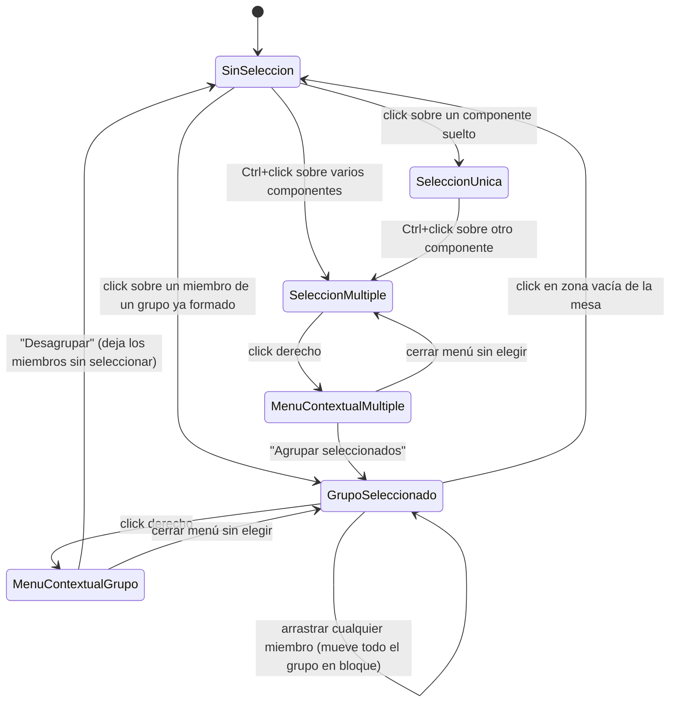

# Navegación — Agrupar / desagrupar elementos (propuesta provisional, sin confirmar)

Flujo de partida para las preguntas abiertas 5 y 7 (dónde viven las acciones, y cómo se accede a un miembro individual). Sujeto a cambio en el refinamiento posterior con `ms-how`.

## Notas

- **"Agrupar seleccionados"** solo aparece en el menú contextual cuando la selección activa tiene 2 o más componentes sueltos (no ya agrupados).
- **"Desagrupar"** solo aparece cuando la selección activa es exactamente un grupo ya formado.
- Tras "Desagrupar", los miembros quedan sin seleccionar (`SinSeleccion`), no en `SeleccionMultiple` — a confirmar si en su lugar deberían quedar seleccionados sueltos (pregunta abierta 8, relacionada).
- Este diagrama **no representa** todavía cómo se accede a un único miembro sin desagrupar del todo (pregunta abierta 7: ¿doble click para "entrar" al grupo?) — queda fuera hasta que se resuelva esa duda.
- No incluye redimensionado de grupo (pregunta abierta 3) ni anidación (pregunta abierta 4), al no estar decidido si forman parte de esta primera versión.
