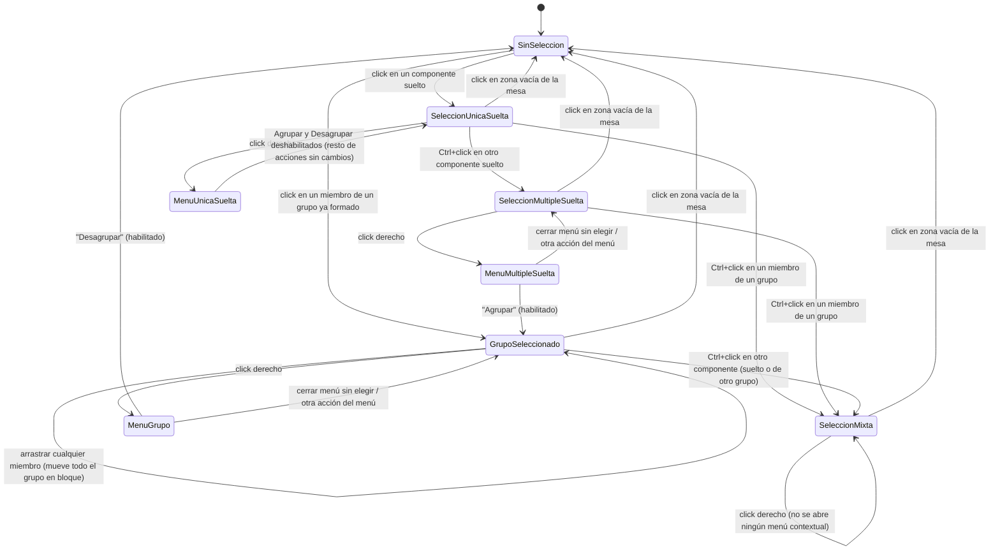

# Navegación — Agrupar / desagrupar elementos

Flujo de selección y menú contextual, con la lógica de habilitado/deshabilitado ya confirmada por el usuario (ver tabla en `description.md`, sección "Comportamiento del menú contextual"). Quedan fuera del diagrama el redimensionado (descartado por completo) y la anidación (pregunta abierta 2).

## Notas

- **`SeleccionMixta`** = 2 o más elementos seleccionados donde al menos uno es un grupo ya formado. Click derecho en este estado no abre ningún menú — ni "Agrupar"/"Desagrupar" ni el resto de acciones (Ocultar, Clonar, Copiar, Eliminar, Añadir a etiqueta).
- Un grupo cuenta como **un solo elemento** a efectos de contar la selección: click simple (sin Ctrl) sobre cualquiera de sus miembros selecciona el grupo entero (`GrupoSeleccionado`), no sus miembros por separado.
- No existe transición para "añadir un elemento suelto a un grupo ya existente" — no hay ninguna acción que fusione una selección mixta en un grupo (pregunta abierta 9 en `description.md`).
- Mientras un componente pertenece a un grupo (`GrupoSeleccionado`), el doble click sobre él **no abre su modal de propiedades** — a diferencia de un componente suelto (`SeleccionUnicaSuelta`), donde el doble click sigue abriendo el modal igual que hoy. No hay ningún gesto para editar un miembro individual sin desagrupar antes (ver regla "no se puede editar" en `description.md`).
- Tras "Desagrupar", los miembros quedan sin seleccionar (`SinSeleccion`), no en `SeleccionMultipleSuelta` — a confirmar si en su lugar deberían quedar seleccionados sueltos (relacionado con la pregunta abierta 3, casos límite).
