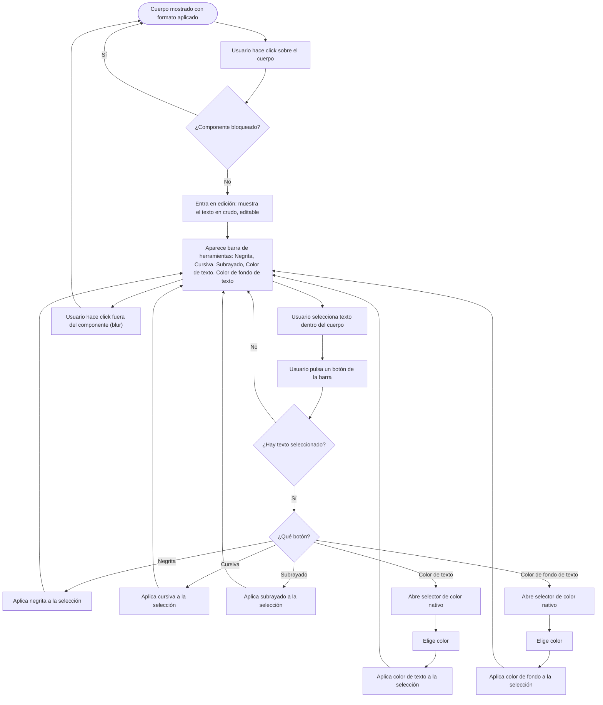

- **Nombre**: Bloc de notas — nuevo tipo de componente
- **Código**: 00196
- **Tipo**: change
- **Fecha creación**: 2026-08-09

## Descripción completa

Nuevo tipo de componente independiente, "Bloc de notas", para el board game virtual. No sustituye al componente "Texto" (etiqueta simple sin título) ni al "Visor de documentos" (visor de markdown/HTML/URL sin título ni edición directa) — convive con ambos.

### Estructura visual

Tarjeta rectangular con sombra de contacto (sin bisel), redimensionable libremente en ambos ejes, sin restricción de proporción. Tamaño inicial 220×180px. Dos zonas:

- **Cabecera**: título de una sola línea, sin formato ni markdown (el texto del título siempre se muestra en negro). El fondo de la cabecera tiene un color configurable mediante un pequeño icono/muestra de color integrado en la propia cabecera, visible siempre — en cualquier modo (edición o juego) y en cualquier momento, no solo mientras se está editando el resto del contenido. Al pulsarlo se abre el selector de color nativo del navegador. En el extremo derecho de la cabecera, otro icono fijo (visible siempre, igual que el de color) permite copiar todo el contenido de la nota al portapapeles del sistema en texto plano, sin ningún formato — título y cuerpo, sin negrita/cursiva/subrayado/colores ni marcas de markdown.
- **Cuerpo**: texto con formato (negrita, cursiva, subrayado, color de texto, color de fondo de texto), guardado internamente como markdown.

### Edición de contenido (título y cuerpo)

El título y el cuerpo se editan directamente sobre el propio componente, en el tablero, sin necesidad de abrir ninguna ventana aparte — en ambos modos (edición y juego), salvo que el componente esté bloqueado (mismo criterio que el resto de tipos de componente). La ventana estándar de "Propiedades generales" del componente (bloqueado, oculto, etiquetas, etc., disponible en modo edición igual que en el resto de tipos) se sigue abriendo con normalidad — esa ventana no contiene el título ni el cuerpo, que se editan siempre directamente sobre el componente.

### Comportamiento del cuerpo

Mientras el cuerpo no está en edición, se muestra el resultado ya formateado (negrita/cursiva/subrayado/colores aplicados visualmente). Al hacer click sobre el cuerpo, se entra en edición: se muestra el texto en crudo (con las marcas de formato visibles como texto), editable libremente, y aparece una pequeña barra de herramientas con 5 botones, solo mientras dura la edición: Negrita, Cursiva, Subrayado, Color de texto, Color de fondo de texto.

- Cada botón actúa sobre el texto que el usuario tenga seleccionado en ese momento dentro del cuerpo (no es un interruptor que afecte a todo el cuerpo de golpe). Sin ningún texto seleccionado, pulsar el botón no hace nada.
- Negrita, Cursiva y Subrayado aplican el estilo correspondiente al texto seleccionado.
- Color de texto y Color de fondo de texto abren el selector de color nativo del navegador; al elegir un color, se aplica como color de letra o como resaltado de fondo, respectivamente, sobre el texto seleccionado.
- Al salir de la edición (dejar de tener el foco / hacer click fuera del componente), el cuerpo vuelve a mostrarse formateado y la barra de herramientas desaparece.

### Casos límite y estados

- Título y cuerpo vacíos están permitidos, sin aviso de error.
- Redimensionar por debajo de un tamaño mínimo recorta el contenido visible (el contenido que no cabe queda oculto), mismo criterio que otros componentes redimensionables del proyecto.
- Sin límite propio de longitud de texto.

### Convivencia con lo existente

Tipo de componente nuevo e independiente, se añade a la lista de tipos disponibles al dar de alta un componente nuevo. No sustituye a "Texto" ni a "Visor de documentos".

### Alcance de los datos

Igual que el resto de componentes del tablero: se guarda con el resto de la partida (autoguardado del navegador, "Guardar a fichero", "Exportar"), sin distinción de usuario o sesión — el proyecto no tiene ese concepto.

### Quién puede usarlo

Sin restricción de roles (el proyecto no tiene sistema de roles). Cualquiera en modo edición puede crear el componente. En ambos modos, cualquiera puede editar título, cuerpo y color de cabecera salvo que el componente esté bloqueado, mismo criterio que el resto de tipos. El icono de copiar al portapapeles no se ve afectado por el bloqueo (es una acción de solo lectura, no una edición).

## Apuntes técnicos

Reunidos por `ms-internal-tech-analysis`; sin incongruencias detectadas entre la documentación técnica y el código real.

- El tipo `'documento'` (`design/docs/architecture/02-component-types.md`) ya resuelve el mismo problema de renderizar markdown sanitizado (`core/markdown.js` → `markdownToHtml` + `core/sanitizeHtml.js` → `sanitizeHtml`) — reutilizable tal cual para el cuerpo del bloc de notas. `sanitizeHtml` no elimina atributos `style` ni etiquetas como `<u>`/``, solo `<script>`, atributos `on...` y `href`/`src` con `javascript:` — confirma que el subrayado (`<u>`) y los colores (``/``) embebidos en el markdown guardado sobreviven a la sanitización sin cambios en esa función.
- El checklist de "Al añadir un tipo/colección nuevo" (`design/docs/architecture/INDEX.md` §8) aplica íntegro: alta en `ui/componentTypeModal.js` + `DEFAULT_*_PROPERTIES`/`createDefaultComponent` de `ui/componentModal.js`, rama de dibujo propia en `ui/componentRenderer.js` (`renderComponentsOnTable`), redimensionado libre sin `clamp` en `ui/resizeHandle.js`, revisión de `getComponentsBounds`, ficheros de prueba en `src/test/*.json`, persistencia/guardado a fichero/autoguardado (`core/persistence.js`/`core/fileExport.js`) si se introduce alguna colección/campo nuevo a nivel de `state.js`.
- La edición de título/cuerpo directamente sobre el componente en la mesa (sin modal) es un patrón de interacción nuevo en el proyecto: hoy el único precedente de edición "in-place" es el `<h1>` de cabecera de la app (`ui/appTitle.js`, click → `<input>`, confirmado con blur/Enter) — mismo patrón de referencia, aplicado por primera vez a un componente de la mesa en vez de a un elemento de layout único.
- No existe hoy en el proyecto ningún control de color "siempre visible en cualquier modo" sobre un componente de la mesa — los controles de color existentes (`bordeColor`, `colorFondo` de otros tipos) se editan siempre desde la modal de propiedades, nunca con un control directo sobre el componente. Es una excepción de interacción nueva a documentar en el checklist de estilo si `ms-how` decide un patrón reutilizable.
- Formato de texto sobre una selección parcial (no todo el cuerpo) tampoco tiene precedente: el `TextBox` usado dentro de `'carta'`/`'tableroPersonalizado'` (`design/docs/architecture/01-component-model.md`) aplica `negrita`/`cursiva`/`subrayado` como interruptores booleanos a todo el contenido, sin guardar markdown ni operar sobre selección — mecanismo distinto, no reutilizable para este cuerpo con formato mixto.
