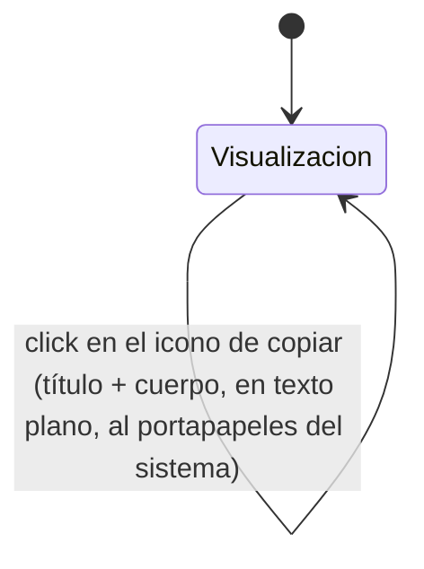

# Navegación — Copiar contenido del "Bloc de notas" al portapapeles

Caso de uso: qué dispara el icono de copiar integrado en la cabecera.

Notas:
- El icono está siempre visible en el extremo derecho de la cabecera, en cualquier modo y en cualquier momento, sin verse afectado por el estado `bloqueado` del componente (acción de solo lectura, no una edición).
- El contenido copiado es siempre texto plano: título y cuerpo sin marcas de formato (sin negrita/cursiva/subrayado/colores ni sintaxis markdown), aunque el cuerpo tenga formato aplicado visualmente en ese momento.
- No hay estado intermedio ni pantalla propia: la acción se resuelve en el mismo estado de visualización.
