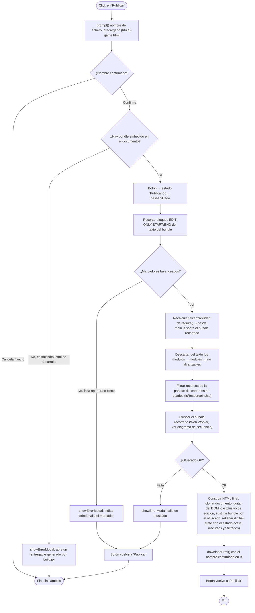
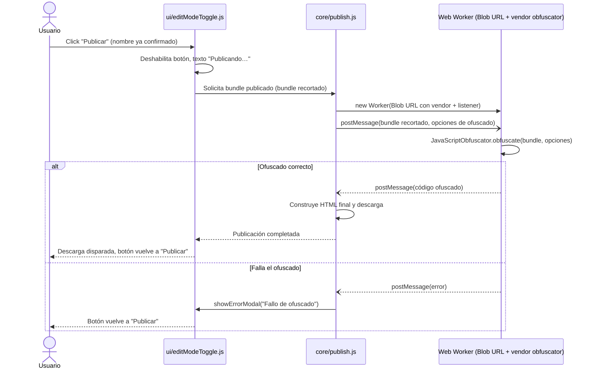

- **Nombre**: Botón "Publicar" (variante de solo mesa ofuscada)
- **Código**: 00198
- **Tipo**: change

## Descripción completa

**Origen:** esta entrada nace de dividir el cambio 00080 ("Botón 'Publicar' y script `build_obf.py`") en dos cambios independientes, tras detectarse en la implementación que el análisis conjunto era más complejo de lo esperado. Esta mitad cubre únicamente el botón "Publicar"; la otra mitad (script `build_obf.py` desde terminal) vive en el cambio 00197. `build.py` no cambia: sigue generando el entregable base sin ofuscar (mesa + edición), y es ese entregable el que, abierto en el navegador, ya debe contener el botón "Publicar" dentro de su modo edición.

Un botón **"Publicar"** dentro de la propia app (modo edición) que genera la variante de **solo mesa** (sin modo edición) ya ofuscada.

Vive en la barra de herramientas de modo edición, junto a "Guardar"/"Exportar"/"Importar" — mismo criterio de visibilidad: solo en modo edición, nunca para un jugador en modo juego. Genera y descarga, sin salir de la app ni depender de terminal/Python, el HTML ofuscado de la variante de solo mesa (sufijo "game"), a partir de la partida que esté cargada en ese momento en el navegador.

Qué contiene el entregable generado:

- Todo lo que hoy es exclusivo del modo edición desaparece: sin botón para entrar en modo edición, sin la barra de herramientas de edición, sin paneles de gestión de componentes/recursos, sin ventanas de configuración/edición ni las de exportar/importar partida — incluidos los huecos vacíos en pantalla que hoy reservan esos controles. Lo compartido con el modo juego (modelo de datos de componentes, autoguardado, mesa infinita, interacción con fichas/dados/cartas, etc.) se mantiene igual que hoy.
- El CSS no se recorta (se mantiene íntegro, sin separar por marcadores): el único efecto es que el fichero final pesa algo más de lo estrictamente necesario, sin ningún efecto visible ni funcional, ya que el HTML/JS de edición ya no está presente para que ese CSS se llegue a aplicar.
- Los recursos (imágenes y tipografías) que ningún componente de la partida esté usando se eliminan de la galería empaquetada — "en uso" = referenciado en cualquier profundidad de las `properties` de algún componente, sin trato especial para los 38 recursos por defecto (fondos de localización, mochila, objetos, reversos de evento): si no están en uso, se eliminan igual que cualquier otro. Si la partida no tiene ningún componente, todos sus recursos se consideran no usados y se eliminan igualmente — mismo criterio sin excepción.

Comportamiento del botón:

- Al pulsarlo, pide nombre de fichero igual que "Guardar" (`prompt()` nativo del navegador), precargado con `{título completo de la app}-game.html`.
- Mientras dura la operación (recortar el código exclusivo de edición, filtrar recursos no usados y ofuscar el bundle, todo en el propio navegador), el botón muestra el estado "Publicando…" deshabilitado. Al terminar, dispara la descarga del fichero con el nombre confirmado.
- Opera siempre sobre la partida actualmente cargada en la app (mismo estado que vería "Guardar") — nunca sobre una partida vacía ni un fichero aparte.
- El código exclusivo de modo edición se identifica mediante marcadores introducidos en el código fuente que señalan explícitamente qué partes son exclusivas de ese modo, para que el recorte sea fiable y no dependa solo de ocultar el botón de acceso (ocultarlo no basta: el código de edición seguiría presente e incluido en el fichero final, solo que inaccesible desde la interfaz). No hace falta eliminar el 100% del código de modo edición del proyecto fuente — sigue existiendo en `/src` para poder seguir generando también la build completa.
- No toca el número de versión del proyecto: usa la versión vigente tal cual para nombrar/identificar el entregable, sin registrarla como una versión oficial nueva.

Casos límite:

- **Se pulsa "Publicar" en un entorno sin bundle embebido** (p. ej. `src/index.html` de desarrollo, servido con Live Server, sin JS/CSS ya incrustados): muestra un error claro explicando que hace falta abrir un entregable ya generado por `build.py`, en vez de generar un fichero corrupto o a medias.
- **Marcadores de bloque de "exclusivo de edición" desbalanceados** (falta el de cierre, o aparece uno de cierre sin su apertura): se aborta con una notificación/modal de error dentro de la propia app indicando dónde ha fallado, sin generar un entregable a medias ni con marcadores visibles.
- **Falla el paso de ofuscado**: se aborta sin descargar nada, con el mismo modal de error.

Quién puede usarlo: quien desarrolla el proyecto, desde dentro de la propia app en modo edición — no es funcionalidad para el jugador final, y no depende de tener Python ni la terminal a mano.

Componente visual: sí — nuevo botón "Publicar" en la barra de herramientas de modo edición, con su estado deshabilitado/"Publicando…" durante la operación. Ver `design_boton-publicar.html` y `design_navigation_publicar.md`.

## Apuntes técnicos

- El script `build.py` empaqueta el entregable recorriendo el grafo de imports ES estático a partir de `src/main.js` (funciones `visit_module`/`IMPORT_PATTERN`); no hay ningún tipo de eliminación de código muerto más allá de esa alcanzabilidad.
- **Mecanismo de detección del código exclusivo de edición (prioridad acordada: que el modo juego quede completo y correcto; que se cuele algún resto exclusivo de edición no es crítico):** la mayoría de ficheros exclusivos de edición se detectan por alcanzabilidad de grafo de imports (recorriendo el grafo desde los puntos de entrada de cada modo, igual que ya hace `build.py`), sin depender de que alguien los marque a mano. El marcado manual (marcador de bloque `EDIT-ONLY-START`/`EDIT-ONLY-END`) queda reservado a los pocos ficheros donde código de ambos modos convive en las mismas líneas:
  - `src/main.js`: imports y llamadas a `renderModeSwitcher`/`renderEditToolbar`/`renderEditMode` (`ui/editModeToggle.js`, `modes/edit/editMode.js`), y la rama `mode === MODES.EDIT` de `renderActiveMode()`.
  - `src/ui/editModeToggle.js`: mixto — `renderModeSwitcher`/`createFitButton` (usado también en modo juego) se conservan; solo `renderEditToolbar` (Guardar/Exportar/Importar/Publicar) es exclusiva de edición.
  - `src/core/persistence.js`: `buildComponentsExport`/`parseImportedComponents` son exclusivos de la barra de edición; `saveState`/`loadState`/`readSeedState` son compartidos (autoguardado, también en modo juego).
  - `src/index.html`: contenedor `#edit-toolbar` (no `#mode-switcher`, que sigue siendo necesario en modo juego para el botón "Ajustar zoom").
  - Convención para el futuro (a documentar en `ARCHITECTURE.md`/`STYLE_BIBLE.md` durante la implementación): cualquier funcionalidad nueva de modo edición debe añadirse preferentemente en un fichero propio en vez de inline dentro de estos ficheros mixtos, para que caiga en el caso "se detecta solo por grafo" y no en el de "hay que acordarse del marcador".
- No hace falta una comprobación exhaustiva de que no haya quedado ningún resto de edición en el bundle final — basta con que el fallo por marcador de bloque mal formado impida generar un entregable corrupto o a medias (ver "Casos límite"). Un resto de edición que se cuele por un marcador olvidado en el futuro es un defecto menor a corregir cuando se detecte, no algo que deba bloquear la operación.
- `src/core/state.js` mantiene el campo `mode`/`MODES.EDIT`/`setMode()` sin cambios: es infraestructura compartida mínima, no se considera código exclusivo de edición a recortar.
- **Recursos "en uso" — reutilizable, no hace falta reimplementarlo:** `core/resource.js` ya expone `isResourceInUse(resourceId, components)` y `getComponentsUsingResource(resourceId, components)`, apoyadas en el helper `collectDeepValues(value)` que recorre `component.properties` en profundidad — es exactamente la comprobación que necesita el botón "Publicar", aplicada a cada recurso de `getResources()` contra la lista de componentes de la partida cargada.
- **`core/fileExport.js` (`buildExportHtml`, usado hoy por "Guardar") ya resuelve la base técnica que necesita "Publicar":** clona `document.documentElement` (que en un entregable ya generado por `build.py` trae el JS/CSS ya embebidos), sustituye `#initial-state` por el estado actual y descarga el resultado como `Blob` vía `downloadHtml()`. "Publicar" es conceptualmente una variante de ese mismo mecanismo, con dos pasos añadidos antes de descargar: (a) recortar del bundle clonado el código exclusivo de modo edición, y (b) ofuscar el bundle JS resultante.
- **Ofuscación ya vendorizada para navegador:** `src/scripts/vendor/javascript-obfuscator.browser.js` es la build "browser" (UMD) de `javascript-obfuscator` — hoy se invoca desde Node (`src/scripts/obfuscate_bundle.js`, con el shim `global.self = global`, necesario solo porque Node no tiene ese global de forma nativa). Ejecutándose ya dentro de un navegador real, ese shim no hace falta: el bundle vendorizado puede cargarse/ejecutarse directamente en el contexto de la app. Punto a resolver: cómo se embebe ese vendor (¿módulo más del bundle de `build.py`, cargado bajo demanda al pulsar "Publicar", u otra vía?) y si conviene moverlo a un Web Worker para no bloquear el hilo principal mientras dura la ofuscación (ajustes como `controlFlowFlattening`, `deadCodeInjection`, `selfDefending` son costosos).
- **Punto abierto:** en el navegador solo existe el bundle ya concatenado en un único `<script>` (sistema `require`/`module.exports` en runtime que ya genera `build.py`), no ficheros fuente separados — el mecanismo de marcadores `EDIT-ONLY` sigue aplicándose igual (búsqueda de cadenas literales sobre el texto del bundle), pero la exclusión completa de ficheros exclusivos de edición detectados hoy por grafo de imports en Python necesita un equivalente en JS sobre el bundle ya concatenado: una vía plausible es que, tras recortar los bloques `EDIT-ONLY`, se recorran en JS las llamadas `require(...)` que quedan en cada módulo superviviente (mismo principio de alcanzabilidad, aplicado al texto ya bundleado en vez de a ficheros) para excluir los módulos que dejen de ser alcanzables desde `main.js` recortado — sin cerrarlo aquí como decisión.

## Notas técnicas del plan anterior (cambio 00080, pendiente de repetir el análisis)

> Volcado literal del `plan.md` ya descartado del cambio 00080 (que en la práctica solo llegó a desarrollar la solución técnica de este botón "Publicar", no la de `build_obf.py`, ver cambio 00197). El intento de implementación con Haiku a partir de este plan resultó en errores de sintaxis repetidos y el botón no funcionando — se guarda solo como punto de partida / lecciones a revisar para cuando se repita el análisis desde cero, no como un plan vigente ni verificado.

### (a) Anotaciones funcionales del plan anterior

**Precisión técnica sobre el alcance de `EDIT-ONLY` en `main.js`/`ui/editModeToggle.js`** (afinando el apunte de `description.md`, sin contradecirlo): `description.md` lista "imports y llamadas a `renderModeSwitcher`/`renderEditToolbar`/`renderEditMode`" como exclusivas de edición en `main.js`. Al revisar el código real, `renderModeSwitcher` no puede marcarse entera como `EDIT-ONLY`: dentro de ella, `createFitButton('mode-switcher__fit-btn')` (botón "Ajustar zoom") es funcionalidad de **modo juego**, compartida, y debe sobrevivir en el entregable publicado — el propio `description.md` ya lo deja claro para `index.html` ("`#mode-switcher` sigue siendo necesario en modo juego para el botón 'Ajustar zoom'"). La solución propuesta entonces: en `main.js` solo se marca como `EDIT-ONLY` la llamada a `renderEditToolbar`, no la de `renderModeSwitcher`; dentro de `ui/editModeToggle.js`, se marca como `EDIT-ONLY` únicamente el bloque del botón "Entrar en modo edición" de `renderModeSwitcher`, dejando `createFitButton` fuera del marcador.

### (b) Solución técnica del plan anterior

1. **`src/ui/editModeToggle.js` — marcar como `EDIT-ONLY` solo el botón "Entrar en modo edición" dentro de `renderModeSwitcher`.** Envolver únicamente la creación/inserción de ese botón (no la llamada a `createFitButton`) entre comentarios `/* EDIT-ONLY-START */` y `/* EDIT-ONLY-END */`:
   ```js
   export function renderModeSwitcher(container) {
     container.innerHTML = '';
     if (getState().mode !== MODES.PLAY) return;

     /* EDIT-ONLY-START */
     const button = document.createElement('button');
     button.textContent = 'Entrar en modo edición';
     button.addEventListener('click', () => setMode(MODES.EDIT));
     container.appendChild(button);
     /* EDIT-ONLY-END */

     container.appendChild(createFitButton('mode-switcher__fit-btn'));
   }
   ```
   Marcar entera la función `renderEditToolbar` como `EDIT-ONLY` (cabecera y cuerpo completos), ya que solo se invoca en modo edición y su recorte no deja huecos de funcionalidad de juego.

2. **`src/main.js` — marcar como `EDIT-ONLY` solo lo exclusivo de edición.**
   - En la lista de imports desde `./ui/editModeToggle.js`, separar `renderEditToolbar` de `renderModeSwitcher` (esta última no se marca):
     ```js
     import { renderModeSwitcher } from './ui/editModeToggle.js';
     /* EDIT-ONLY-START */
     import { renderEditToolbar } from './ui/editModeToggle.js';
     /* EDIT-ONLY-END */
     ```
   - El import completo de `renderEditMode`/`deleteSelectedComponent`/`moveSelectedComponent` desde `./modes/edit/editMode.js` se envuelve entero en `EDIT-ONLY` (usado únicamente por la rama de edición y por los atajos globales, ver siguiente punto).
   - En `renderActiveMode()`, usar patrón de retorno anticipado para poder recortar solo el bloque de edición sin romper la sintaxis restante:
     ```js
     function renderActiveMode() {
       /* EDIT-ONLY-START */
       if (getState().mode === MODES.EDIT) {
         renderEditMode(contentEl);
         return;
       }
       /* EDIT-ONLY-END */
       renderPlayMode(contentEl);
     }
     ```
   - En `renderAll()`, envolver solo la línea `renderEditToolbar(toolbarEl);` en `EDIT-ONLY` (`renderModeSwitcher(switcherEl);` queda fuera).
   - Los atajos globales (`initGlobalShortcuts`) referencian `deleteSelectedComponent`/`moveSelectedComponent` de `editMode.js`, exclusivas de edición: envolver en `EDIT-ONLY` las líneas `onDeleteSelected: () => deleteSelectedComponent(),` y `onMoveSelected: (dx, dy) => moveSelectedComponent(dx, dy),`, sustituyendo cada callback por uno vacío (`() => {}`) fuera del bloque marcado, para que `initGlobalShortcuts` siga recibiendo las claves que su firma espera.

3. **`src/core/persistence.js` — marcar `buildComponentsExport`/`parseImportedComponents` como `EDIT-ONLY`.** Son exclusivas del flujo Exportar/Importar de la barra de edición (`ui/editModeToggle.js`); `saveState`/`loadState`/`readSeedState` quedan fuera del marcador (autoguardado, compartido).

4. **`src/index.html` — marcar el contenedor `#edit-toolbar` como exclusivo de edición.** Envolver `<div id="edit-toolbar"></div>` (no `<div id="mode-switcher"></div>`, que se conserva) en un comentario HTML equivalente, p.ej.:
   ```html
   <!-- EDIT-ONLY-START -->
   <div id="edit-toolbar"></div>
   <!-- EDIT-ONLY-END -->
   ```
   Añadir además, en el mismo fichero, el `<script>` con el vendor `javascript-obfuscator.browser.js` embebido íntegro (ver tarea 6), también envuelto en marcadores `EDIT-ONLY` — así el propio entregable de "Guardar"/`build.py` lo trae (necesario para que "Publicar" pueda usarlo en runtime), pero desaparece del entregable ya publicado por "Publicar" (que no lo necesita: ya generó el bundle ofuscado, no vuelve a ofuscar sobre sí mismo).

5. **Nuevo `src/core/publish.js` — motor de recorte y reconstrucción del bundle.** Funciones:
   - `stripEditOnlyBlocks(text)`: recorta con regex no codiciosa todo lo que quede entre pares `/* EDIT-ONLY-START */` ... `/* EDIT-ONLY-END */` (variante HTML `<!-- EDIT-ONLY-START --> ... <!-- EDIT-ONLY-END -->` para el HTML, mismo mecanismo aplicado también a la cadena del documento clonado). Lanza un error explícito con el índice del marcador implicado si detecta apertura sin cierre o cierre sin apertura (recorrido secuencial contando aperturas/cierres, no solo contar globalmente — para poder señalar cuál está descolocado).
   - `pruneUnreachableModules(bundleText)`: localiza cada bloque de módulo por el patrón literal que genera `build.py` (`__modules['{ruta}'] = function(module, exports, require) {` ... hasta el siguiente `__modules[...]` o el final del bundle), extrae de cada bloque superviviente las llamadas `require('ruta')` restantes tras el recorte de la tarea anterior, calcula el conjunto alcanzable por recorrido en anchura/profundidad desde `'main.js'`, y devuelve el bundle reconstruido concatenando solo los bloques alcanzables (mismo orden relativo, más el runtime `__modules`/`__cache`/`require` y la línea final `require('main.js');`, sin tocar esas tres partes).
   - `buildPublishedDocument({ resources, components, ...restoDelEstado })`: función principal que orquesta clonar `document.documentElement`, localizar el `<script>` del bundle (heurística: el único `<script>` sin `type="application/json"` ni `src`, con contenido no vacío — si no se encuentra o está vacío, lanza el error de "entorno sin bundle embebido"), aplicarle `stripEditOnlyBlocks` + `pruneUnreachableModules`, aplicar `stripEditOnlyBlocks` también al HTML clonado completo (recorta `#edit-toolbar` y el `<script>` del vendor obfuscador), filtrar `resources` con `isResourceInUse` (`core/resource.js`) contra `components`, y devolver `{ html: clone, trimmedBundleText }` — deja el paso de ofuscado y el de rellenar `#initial-state`/servir el HTML final a quien la invoque (tarea 7), para no acoplar este módulo a la comunicación con el Worker.

6. **`src/scripts/build.py` — embeber el vendor del ofuscador en el entregable.** Añadir un paso análogo al de `bundle_js`: leer `src/scripts/vendor/javascript-obfuscator.browser.js` tal cual (sin transformar, no es un módulo ES) e insertarlo en el HTML final como `<script>` propio, envuelto en los marcadores `EDIT-ONLY` de la tarea 4, situado junto al resto de scripts antes de `</body>`. Sin cambios en el mecanismo de módulos existente (`visit_module`/`IMPORT_PATTERN`): el vendor no entra en ese grafo.

7. **Nuevo Web Worker inline en `src/core/publish.js` — ofuscado sin bloquear el hilo principal.** Función `obfuscateInWorker(code)` que:
   - Construye el código del Worker como cadena de texto: contenido íntegro del vendor (leído del propio documento, del `<script>` embebido por la tarea 6 — `document.querySelector('script[data-vendor-obfuscator]').textContent`, atributo `data-vendor-obfuscator` añadido en la tarea 6 para localizarlo sin ambigüedad) + un listener `self.onmessage` que ejecuta `JavaScriptObfuscator.obfuscate(e.data.code, e.data.options)` y responde con `postMessage({ code: result.getObfuscatedCode() })` o `postMessage({ error: err.message })` si lanza excepción.
   - Crea el Worker con `new Worker(URL.createObjectURL(new Blob([workerSource], { type: 'application/javascript' })))`, envía el bundle recortado + opciones de ofuscado (mismas opciones que ya usa `obfuscate_bundle.js`: `compact`, `controlFlowFlattening`, `deadCodeInjection`, `stringArray`, `stringArrayEncoding: ['base64']`, `renameGlobals: false`, `selfDefending`), y devuelve una `Promise` que resuelve con el código ofuscado o rechaza con el error recibido — el Worker se termina (`worker.terminate()`) tras recibir la respuesta, sin reutilizarse entre publicaciones (uso puntual, no justifica una caché).

8. **`src/ui/editModeToggle.js` — botón "Publicar" en `renderEditToolbar`.** Añadir tras el botón "Importar" (mismo estilo que sus hermanos, sin modificador de clase, ver `design_boton-publicar.html`):
   - Click → `prompt('Publicar', `${getFullAppTitle(getAppTitle())}-game.html`)`; si se cancela/vacío, no hace nada.
   - Con nombre confirmado: deshabilita el botón, cambia su texto a "Publicando…", y llama a la función orquestadora `publish()` de `core/publish.js` (ver tarea 9) pasándole el nombre confirmado (con `.html` si falta, mismo criterio que "Guardar").
   - Al terminar (éxito o error), siempre restaura el botón a texto "Publicar" y lo rehabilita.

9. **`src/core/publish.js` — función orquestadora `publish(filename)`.** Encadena: `buildPublishedDocument(...)` (tarea 5, con captura de errores de bundle-no-encontrado y marcadores desbalanceados → cada uno relanza con un mensaje ya listo para `showErrorModal`) → `obfuscateInWorker(trimmedBundleText)` (tarea 7) → sustituir en el `<script>` del bundle del HTML clonado el texto recortado por el ofuscado → rellenar `#initial-state` del clon con `JSON.stringify({ version: CURRENT_VERSION, components, resources: recursosFiltrados, panelState, resourcePanelState, resourcesSeeded, tags, tagPanelState, appTitle })` (mismos campos que `buildExportHtml`, mismo criterio de "resourcesSeeded no se recalcula, se preserva") → `downloadHtml(filename, `<!doctype html>\n${clone.outerHTML}`)` (reutiliza `core/fileExport.js` tal cual, sin cambios). Cualquier error en cualquier paso (bundle no encontrado, marcadores desbalanceados, fallo del Worker) se traduce en una llamada a `showErrorModal` con el mensaje correspondiente del caso límite, sin descargar nada.

Orden de implementación propuesto entonces: 6 → 4 (dependen entre sí, el marcador del vendor necesita que `build.py` ya lo embeba) → 1, 2, 3 (marcado `EDIT-ONLY` del resto del código fuente) → 5 → 7 → 9 → 8 (UI al final, cuando ya existe todo lo que invoca).





### (c) Cambios de arquitectura del plan anterior

- **`design/docs/architecture/06-persistence-build.md`**: añadir una sección nueva "Publicar (variante de solo mesa ofuscada)" junto a "Guardar a fichero", documentando el flujo de `core/publish.js` (recorte `EDIT-ONLY`, poda de módulos no alcanzables, filtrado de recursos no usados, ofuscado en Web Worker, descarga) y su relación con `build.py`/`buildExportHtml`.
- **`design/docs/architecture/INDEX.md`** (§7 "Convenciones de código"): documentar la convención `EDIT-ONLY-START`/`EDIT-ONLY-END` (comentario JS `/* ... */` o HTML `<!-- ... -->`, siempre en pareja, delimitando código exclusivo de modo edición dentro de un fichero compartido con modo juego) como convención transversal nueva, con la nota ya prevista: funcionalidad nueva de modo edición se añade preferentemente en fichero propio para caer en el caso "se detecta por grafo de imports/`require`", reservando el marcador manual a los ficheros mixtos ya existentes.

### (d) Cambios en estilo del plan anterior

No aplica: el botón "Publicar" reutiliza el estilo ya existente de la barra de herramientas de modo edición sin ninguna variante visual propia (ver `design_boton-publicar.html`), y el estado "Publicando…" reutiliza el tratamiento genérico de botón `disabled` ya documentado.

### (e) Verificación propuesta en el plan anterior

1. En un entregable generado por `build.py` (no en `src/index.html` de desarrollo), entrar en modo edición y comprobar que el botón "Publicar" aparece en la barra de herramientas, junto a "Guardar"/"Exportar"/"Importar", con el mismo estilo visual.
2. Pulsar "Publicar", cancelar el `prompt()` de nombre: no ocurre nada (ni descarga, ni cambio de estado del botón).
3. Pulsar "Publicar" con una partida cargada que tenga componentes y recursos (algunos en uso, alguno sin usar), confirmar un nombre: el botón muestra "Publicando…" deshabilitado durante el proceso y, al terminar, se dispara la descarga de un `.html` con el nombre confirmado (con `.html` añadido si no se indicó), y el botón vuelve a "Publicar" habilitado.
4. Abrir el HTML descargado en el navegador: se ve directamente en modo juego (mesa con los componentes de la partida original), sin botón "Entrar en modo edición" visible, sin acceso a modo edición de ninguna forma, pero con el botón "Ajustar zoom" del selector de modo funcionando igual que en el entregable original.
5. Comprobar que el HTML descargado no contiene el `<script>` del vendor `javascript-obfuscator.browser.js` (ni el contenedor `#edit-toolbar`), y que su bundle JS está ofuscado (ilegible, sin nombres de función/variable originales).
6. Con la Consola/Network del navegador abiertas durante el paso 3, comprobar que la interfaz sigue respondiendo (se puede seguir interactuando con la mesa) mientras el botón dice "Publicando…" — confirma que el ofuscado corre en el Worker y no bloquea el hilo principal.
7. Repetir el paso 3 con una partida sin ningún componente: el HTML descargado no incluye ningún recurso en `#initial-state` (todos se consideran no usados), sin error.
8. Simular un `<script>` de bundle vacío o ausente (abrir `src/index.html` de desarrollo, si el botón llegara a mostrarse ahí, o forzando el caso en consola): el botón "Publicar" muestra el error "abre un entregable ya generado por build.py" sin descargar nada.
9. Ejecutar `build.py` tras el cambio y comprobar que el entregable resultante sigue funcionando en modo edición con todas sus funciones (Guardar/Exportar/Importar/Publicar), y que en modo juego nada ha cambiado (autoguardado, mesa infinita, interacción con componentes).
