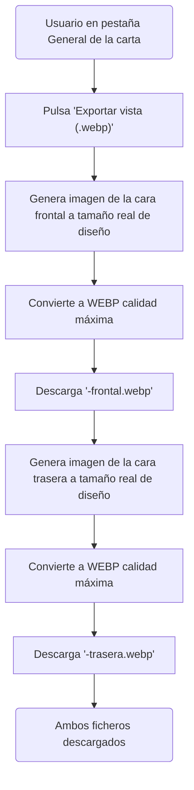

- **Nombre**: Exportar vista de elemento a WEBP (cartas)
- **Código**: 00199
- **Tipo**: change
- **Fecha creación**: 2026-08-09

## Descripción completa

En la pestaña "General" de las propiedades de un elemento se añade una nueva sección "Exportar", al final de la pestaña (después de "Interacciones programadas"), con un botón para exportar una vista del elemento en formato WEBP de máxima calidad.

Esta sección con su botón solo se muestra cuando el tipo de elemento tiene implementada su propia exportación de vista. Por ahora eso solo ocurre para el tipo "Carta/Ficha" — para el resto de tipos de elemento (texto, tablero simple, dado, documento, mazo, tablero personalizado) la sección no aparece todavía, hasta que se implemente su exportación en cambios futuros.

Cada tipo de elemento tendrá su propia lógica de exportación de su vista, independiente del botón, pensada para que otras funcionalidades futuras de la aplicación puedan generar esa misma imagen sin depender de que el usuario pulse el botón ni de que se descargue ningún fichero.

### Comportamiento para "Carta/Ficha" (primera implementación)

- Una carta tiene dos caras (frontal y trasera). Al pulsar el botón "Exportar vista", se generan y descargan **dos** ficheros WEBP de una sola vez, uno por cada cara: `<id>-frontal.webp` y `<id>-trasera.webp`, donde `<id>` es el identificador único del elemento (el mismo campo "ID del componente" de esta misma pestaña).
- Cada imagen se genera al **tamaño real del diseño** de esa cara (el tamaño con el que está diseñada en el Editor visual), no al tamaño ni proporción que tenga la carta ahora mismo colocada en la mesa.
- Si una cara está vacía (sin imagen ni elementos añadidos, se ve en blanco en el editor), se exporta igualmente en blanco, sin ningún aviso ni bloqueo.
- La calidad de la imagen WEBP exportada es la máxima posible, sin compresión perceptual (a diferencia de las imágenes que se suben a la galería de recursos, que sí se comprimen).
- No hay casos de error ni de cancelación relevantes para el usuario: es una operación inmediata, sin llamadas de red, con resultado siempre exitoso.

### Diagrama funcional — Exportar vista de una carta

### Ampliación — reutilizar la vista de la carta en el listado del mazo

El listado de cartas de la ventana "Contenido del mazo" sigue mostrando, para cada carta, una miniatura de su cara frontal — sin cambio visual respecto a hoy. Lo que cambia es de dónde sale esa miniatura: en vez de que ese listado calcule por su cuenta cómo pintar la cara de cada carta (duplicando lógica ya necesaria en otras partes de la aplicación), debe pedirle a la propia carta su vista previa de la cara frontal, reutilizando la misma responsabilidad de "vista de elemento" introducida arriba para el botón de exportar a WEBP: cada tipo de elemento es responsable de saber generar su propia vista, tanto para exportarla a fichero como para que otra funcionalidad de la app (como este listado) la muestre en pantalla.

Esta vista previa en pantalla es una responsabilidad distinta de la exportación a fichero WEBP (no pasa por generar ningún fichero ni Blob de imagen), aunque ambas pertenecen al mismo tipo de elemento y pueden compartir lógica interna de pintado.

No hay ningún cambio de comportamiento visible para el usuario en este punto: la miniatura se sigue viendo exactamente igual. El objetivo es evitar código de renderizado duplicado y mantener la responsabilidad de "cómo se ve una carta" en un único sitio.

Queda para el análisis técnico (`ms-how`) decidir, evaluando qué conviene para el mantenimiento futuro sin añadir complejidad innecesaria, si además del listado del mazo hay otros puntos del código que hoy también pintan la cara de una carta por su cuenta y deberían pasar a reutilizar esta misma vía.

### Preguntas de alcance resueltas

- **Ubicación del botón**: sección nueva "Exportar" al final de la pestaña General (no mezclada con la sección "General" existente).
- **Presentación para cartas**: un único botón que descarga los dos ficheros (frontal + trasera) de golpe, no dos botones separados.
- **Reutilización por otras funcionalidades**: la función de exportación de cada tipo de elemento devuelve el/los `Blob` WEBP en memoria; es el botón quien se encarga de convertir eso en una descarga de fichero.
- **Resolución de la imagen exportada**: tamaño real de diseño de la carta, no el tamaño actual en la mesa.
- **Tipos de elemento sin exportación implementada todavía**: la sección "Exportar" no se muestra en absoluto para esos tipos (no aparece deshabilitada).
- **Nombre de los ficheros descargados**: `<id>-frontal.webp` / `<id>-trasera.webp`.
- **Cara vacía**: se exporta igual, en blanco, sin aviso.

## Apuntes técnicos

- Panel de propiedades: `ui/componentModal.js`. Pestaña "General" (`tab: 'general'`) actualmente agrupa, en este orden: ID del componente, sección "General" (bloqueado/oculto/tooltip/subir al mover), sección "Tamaño", sección "Etiquetas" y sección "Interacciones programadas". La nueva sección "Exportar" va después de esta última.
- Modelo de `'carta'` (`design/docs/architecture/02-component-types.md`): `caraFrontal`/`caraTrasera`, cada una con `imagenResourceId`, `ajusteImagen`, `formas`, `textBoxes`, `bordeColor`, `bordeGrosor`, etc., en coordenadas de píxeles reales (independientes del `width`/`height` del componente en la mesa).
- Renderizado actual de una cara: `paintCartaFace(contentParent, cara, scaleX, faceWidth, faceHeight, scaleY)` en `ui/componentRenderer.js` — pinta el contenido como **DOM** (imagen de fondo + formas + textBoxes en divs posicionados), no en un `<canvas>`. Exportar a WEBP requerirá rasterizar ese DOM (p.ej. render fuera de pantalla + conversión a canvas), sin poder usar `canvas.toDataURL` directamente sobre el resultado de `paintCartaFace` como está hoy.
- Restricción de arquitectura (`design/docs/architecture/INDEX.md` §7): librería nueva solo se incorpora si su bundle puede embeberse íntegramente en el HTML final (sin CDN en runtime) — cualquier solución de rasterizado debe respetar esto.
- Precedente de conversión a WEBP ya existente: `core/imageConversion.js` (`canvas.toDataURL('image/webp', quality)`), hoy usado solo para comprimir imágenes subidas a la galería (`WEBP_QUALITY = 0.92`) — la nueva exportación de vista necesita calidad máxima (`1`), no ese mismo valor.
- Patrón de descarga de fichero ya existente en el proyecto a reutilizar para el botón: `core/fileExport.js`.
- No existe ninguna funcionalidad de exportación de imagen previa en el proyecto (ni de tablero ni de componente) — es funcionalidad nueva.
- La decisión técnica concreta de cómo rasterizar el DOM de una cara (qué mecanismo, dónde vive el código reutilizable por tipo de elemento) queda pendiente de diseño en `ms-how`.
- **Ampliación — listado del mazo**: `ui/mazoContentModal.js` (líneas ~72-87) hoy importa `paintCartaFace` y `getCartaShapeCss` directamente (`componentRenderer.js`/`core/cardProportions.js`), calcula manualmente `renderScale` para encajar la carta en `THUMB_MAX_WIDTH`/`THUMB_MAX_HEIGHT`, y pinta `carta.properties?.caraFrontal`. Esto debe sustituirse por una llamada a la nueva función de "vista previa en DOM" de `'carta'` (misma responsabilidad de "vista de elemento" del botón exportar, pero sin pasar por Blob/imagen), pasándole el contenedor, la cara a mostrar (`'frontal'`/`'trasera'`) y el tamaño máximo disponible.
- Candidato adicional a evaluar en `ms-how`: `ui/componentRenderer.js` también llama `paintCartaFace` directamente en varios puntos (definición y uso interno del propio pintado de `'carta'`/`'tableroPersonalizado'`, y el fallback de renderizado de `'mazo'` sin `imagenResourceId` propio, que pinta `caraTrasera` de la carta de arriba — funcionalmente análogo al caso del listado: una vista previa de una cara de una carta ajena, no el pintado de su propia cara). El resto de llamadas (pintado de `'carta'`/`'tableroPersonalizado'` según su propia configuración) no son duplicación con otro módulo — son la implementación misma de "cómo se pinta una cara", no un consumidor externo pidiendo una vista previa.
- Definir en `ms-how` la forma exacta de la nueva función compartida de vista previa en DOM (nombre, módulo donde vive — candidato natural: junto a la exportación WEBP de `'carta'`, ambas responsabilidad del mismo tipo — firma, y si reutiliza `paintCartaFace` internamente o la sustituye).
