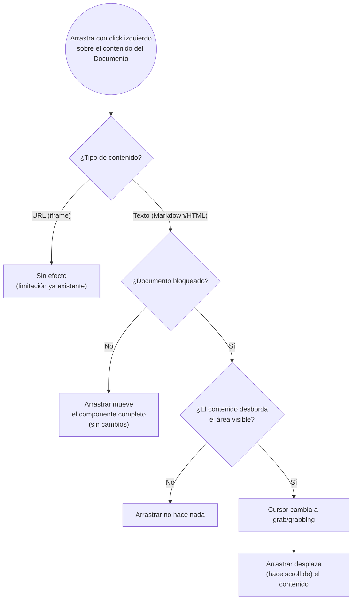

- **Nombre**: Arrastrar para desplazarse por el contenido de un Documento bloqueado en modo juego
- **Código**: 00209
- **Tipo**: change
- **Fecha creación**: 2026-08-14

## Descripción completa

En modo juego, arrastrar con click izquierdo sobre el contenido de un componente "Documento" permite desplazarse (hacer scroll) por él, cuando ese componente está bloqueado.

El arrastre sobre el contenido del Documento se resuelve según el estado de bloqueo del componente (o del grupo, si pertenece a uno):

- **Desbloqueado** (valor por defecto): arrastrar mueve el componente completo por la mesa, exactamente igual que hoy — sin cambios.
- **Bloqueado**: arrastrar ya no mueve el componente; en su lugar, si el contenido desborda el área visible fijada del Documento, el arrastre desplaza el contenido dentro de ese tamaño. El cursor cambia a "grab"/"grabbing" sobre el contenido mientras el documento está bloqueado y tiene contenido desbordado, como pista visual del nuevo gesto. Si el contenido no desborda (cabe entero), arrastrar no hace nada.

### Casos límite y alcance resueltos

- **Alcance**: solo modo juego. En modo edición el arrastre sigue moviendo el componente exactamente igual que hoy, sin verse afectado por este cambio.
- **Tipos de contenido**: aplica a contenido de tipo Texto (Markdown/HTML). En tipo URL (página embebida) el arrastre no puede interceptarse — misma limitación que ya existe hoy para mover el componente arrastrando sobre él; sin cambios en ese caso.
- **Sin overflow**: si el contenido cabe entero en el tamaño fijado del Documento bloqueado, arrastrar no hace nada (no hay nada que desplazar).
- **Rueda del ratón y scrollbar nativos**: siguen funcionando igual que hoy, en cualquier estado de bloqueo — el arrastre es un gesto adicional, no sustituye a estos.
- **Pantallas táctiles**: el scroll nativo por arrastre sobre el contenido ya funciona hoy sin necesidad de bloqueo; este cambio no lo modifica, solo añade el gesto de arrastre con ratón para cuando el documento está bloqueado.
- **Persistencia**: no se guarda la posición de scroll alcanzada; se pierde al recargar o al volver a renderizar el componente, igual que cualquier otro estado de scroll no persistido.
- **Definición visual**: no aparece ningún elemento nuevo en pantalla. El único cambio perceptible además del propio gesto es el cursor grab/grabbing.

## Apuntes técnicos

- Componente implementado en `src/ui/componentRenderer.js`, rama `component.type === 'documento'` (dentro de `renderComponentsOnTable`). El drag-to-move actual se adjunta con `documentViewer.addEventListener('mousedown', ...)` cuando `onMove && canMove(component)` es `true`.
- `src/modes/play/playMode.js` pasa `canMove: (component) => getEffectiveGeneralProps(component, groups).bloqueado === 'ninguno'` a `renderComponentsOnTable` — este cambio necesita la condición inversa (`bloqueado !== 'ninguno'`) para activar el nuevo gesto de scroll, evaluada con el mismo helper `getEffectiveGeneralProps` para respetar grupos.
- El contenido vive en `.document-viewer__content` (`overflow-y: auto`, `overflow-x: hidden`), estilos en `src/styles/main.css` (línea ~955).
- No hay incongruencias detectadas entre la documentación técnica (`design/docs/architecture/04-modes.md`, `05-ui-layer.md`) y el código explorado.
