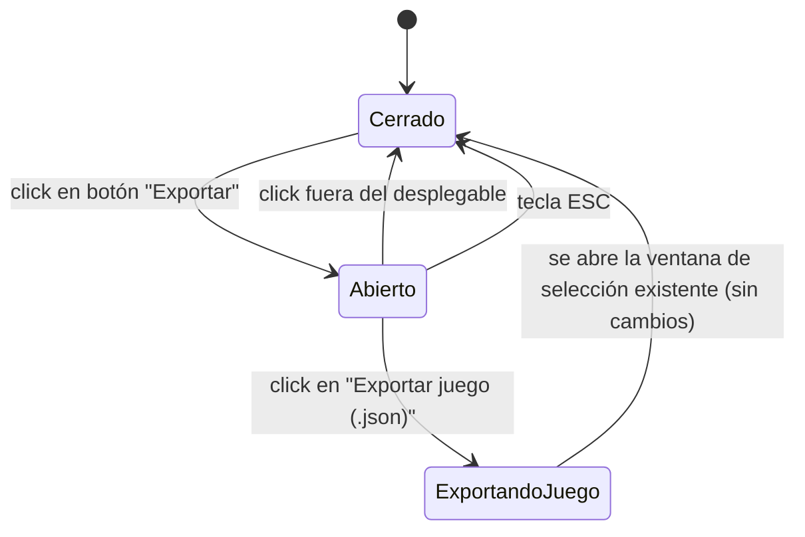

# Navegación — desplegable "Exportar" de la barra de modo edición

**Notas:**
- Este cambio solo rediseña la barra; el flujo de "Exportar juego (.json)" en sí (ventana de selección de componentes/recursos/grupos) no cambia — se representa aquí solo para mostrar cómo se llega a él desde el nuevo desplegable.
- Las filas "Exportar recursos (.zip)" y "Exportar hoja de producción (.csv)" aparecen en la maqueta visual dentro de este mismo desplegable, mostradas como no interactivas (sin transición posible) con la etiqueta "Próximamente" — no están conectadas a ningún flujo real todavía (fuera de alcance de este cambio).
- La acción "Guardar" (que existía en el diseño anterior de la barra) se elimina por completo en este cambio: no aparece en ningún estado ni maqueta.
