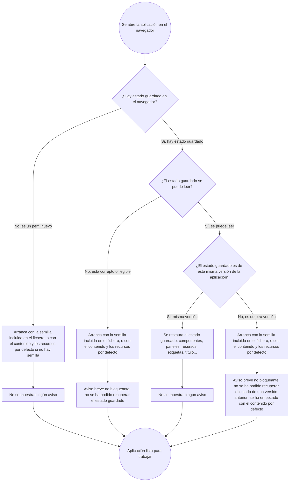

- **Name**: El primer arranque de una versión nueva muestra un error de "estado guardado" que no debería
- **Code**: 00230
- **Type**: fix
- **Creation date**: 2026-09-02

## Full description

### Qué está mal

Cada vez que se abre por primera vez en el navegador una versión nueva de la aplicación, aparece un modal de error bloqueante con el texto **"No se ha podido recuperar el estado guardado."** y un botón "Cerrar". Hay que cerrarlo para poder empezar a trabajar. El error sale siempre en ese primer arranque de cada versión nueva, aunque no haya ocurrido ningún fallo real.

### Cómo reproducirlo

1. Trabajar normalmente con una versión de la aplicación (esto deja un estado guardado en el navegador).
2. Abrir una versión distinta (nueva) de la aplicación en el mismo navegador y perfil.
3. En ese primer arranque aparece el modal de error "No se ha podido recuperar el estado guardado.".

### Por qué ocurre (en términos funcionales)

Cuando se estrena una versión nueva, el navegador todavía conserva el estado guardado de la versión anterior. Ese estado es perfectamente válido, pero pertenece a otra versión de la aplicación. La aplicación, al detectar que el estado guardado no es de la versión actual, lo interpreta como un fallo al recuperar el estado y muestra el modal de error, cuando en realidad "el estado guardado es de una versión anterior" es una situación normal y esperable justo al estrenar una versión.

Además, hoy la aplicación mete en el mismo saco tres situaciones que son distintas:

- **No hay nada guardado** (navegador/perfil totalmente nuevo): arranque limpio, sin aviso. Esto ya funciona bien.
- **Hay estado guardado pero es de otra versión**: es el caso que dispara este error. Es esperable y no debería tratarse como fallo.
- **Hay estado guardado y está realmente corrupto / ilegible**: es el único caso en el que tiene sentido avisar de que no se ha podido recuperar el estado.

### Comportamiento esperado

- Un estado guardado que pertenece a una versión distinta de la aplicación **no** debe mostrar un modal de error bloqueante. La aplicación debe continuar su arranque con normalidad (cargando la semilla incluida en el propio fichero o, si no la hay, el contenido y los recursos por defecto).
- En ese caso "estado de otra versión", como mucho se muestra un aviso breve **no bloqueante** (toast) del estilo "No se ha podido recuperar el estado de una versión anterior; se ha empezado con el contenido por defecto". No obliga a hacer clic en nada ni interrumpe el trabajo.
- El aviso de "no se ha podido recuperar el estado guardado" solo debería aparecer (y aun así, preferiblemente como toast no bloqueante y no como modal) cuando el estado guardado esté **realmente corrupto**, no cuando simplemente sea de otra versión.
- El caso "no hay nada guardado" sigue igual que ahora: arranque limpio y silencioso.

### Flujo de arranque esperado (tras el fix)

Notas sobre el diagrama:

- El bug actual está en la rama **"No, es de otra versión"**: hoy ese caso muestra un **modal de error bloqueante** ("No se ha podido recuperar el estado guardado.") que obliga a cerrarlo. Lo esperado es un **aviso no bloqueante (toast)** y que el arranque continúe solo.
- En **ningún** caso del diagrama aparece un modal bloqueante: los dos casos con aviso ("otra versión" y "corrupto") usan toast; los dos casos normales ("perfil nuevo" y "misma versión válida") no muestran nada.
- La diferencia entre los dos casos con toast es solo el **texto** del aviso. Si se prefiere, pueden unificarse en un único mensaje genérico — decisión para `pv-how`.
- "Arranca con la semilla incluida / contenido y recursos por defecto" es el mismo flujo de reserva que ya existe hoy para "no hay nada guardado"; el fix hace que "otra versión" y "corrupto" caigan también en él en lugar de en el modal de error.

## Technical notes

- El arranque está en `src/main.js` (aprox. líneas 89-130): llama a `loadState()` y, si el resultado tiene `error`, hace `showErrorModal('Error', 'No se ha podido recuperar el estado guardado.')` + `seedDefaultResources()`.
- `src/core/persistence.js`:
  - `loadState()` devuelve `null` cuando `localStorage` no tiene la clave `bgfactory:state` (caso "no hay nada guardado", ya se gestiona bien en la rama `else` de `main.js` con `readSeedState()`).
  - `parseState(raw)` devuelve `{ error: true }` **tanto** cuando `JSON.parse` falla (estado realmente corrupto) **como** cuando `parsed.version !== CURRENT_VERSION` (estado de otra versión) o `components` no es un array. Esos dos casos hoy son indistinguibles para `main.js`, y ambos acaban en el modal de error. El disparador real de este bug es la rama `parsed.version !== CURRENT_VERSION`.
  - `readSeedState()` ya trata cualquier `error` de `parseState` como "no hay semilla utilizable" y cae al flujo por defecto de forma silenciosa; conviene que el arranque desde `localStorage` con estado incompatible por versión se comporte de forma análoga (sin modal).
- Existe `showToast(message)` en `src/ui/toast.js` (aviso breve no bloqueante, 3 s, ya usado en varios sitios del proyecto) como alternativa al `showErrorModal`.
- **Inconsistencia doc/código detectada por `pv-internal-tech-analysis`**: `previo-sdd/design/docs/architecture/06-persistence-build.md` (diagrama de "Arranque (main.js)", aprox. línea 16) describe que el caso "corrupto/incompatible" debería resolverse con `showToast(aviso)` + componente de ejemplo + recursos por defecto, pero el código actual muestra un `showErrorModal` bloqueante. La documentación tampoco distingue "no hay estado" / "estado de otra versión" / "estado corrupto". Al implementar el fix hay que alinear ese documento con el comportamiento resultante (y, si el fix separa los tres casos, reflejarlo en el diagrama).
- Ámbito estimado: `src/main.js` y `src/core/persistence.js`, más el ajuste del documento de arquitectura `06-persistence-build.md`. Sin cambios de red ni datos sensibles (solo persistencia local en `localStorage` y lógica de arranque en cliente); revisión de seguridad sin puntos pendientes.
