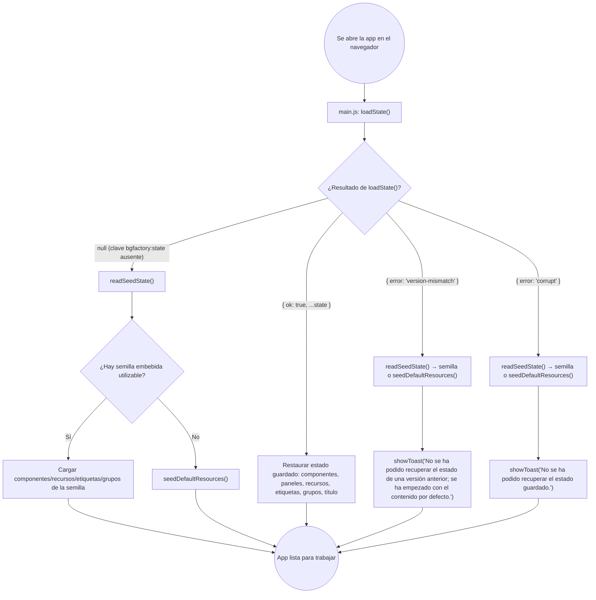

- **Creation date**: 2026-09-02
- **Risk**: 2/10 — Riesgo mínimo (cambio local, fácilmente reversible)

## (a) Functional notes

**Out of scope:**

- No se cambia el caso "no hay nada guardado" (clave `bgfactory:state` ausente): sigue arrancando limpio y en silencio por la rama `else` de `main.js` con `readSeedState()`.
- No se cambia el caso "estado válido de la misma versión": sigue restaurando componentes, paneles, recursos, etiquetas y grupos sin ningún aviso.
- No se toca `parseImportedComponents()` ni `readSeedState()` de `src/core/persistence.js`: la importación de ficheros y la lectura de la semilla embebida ya toleran versiones distintas por diseño y no muestran modal. El cambio se limita al arranque desde `localStorage`.
- No se elimina `src/ui/errorModal.js` ni `showErrorModal`: se deja de usar **solo** en el arranque de `main.js`; el resto de usos del modal de error en la app siguen igual.
- No se añade telemetría, logging ni distinción de subtipos de corrupción (JSON ilegible vs. forma inválida): ambos caen en el mismo caso `'corrupt'`.
- Aunque `description.md` deja abierta la posibilidad de unificar los dos textos de toast en uno genérico, este plan mantiene **dos textos distintos** (uno para "otra versión", otro para "corrupto") por ser más informativos y no costar nada; si se prefiere unificar, es un cambio de una sola línea.

**Doubts resolved with the user:** no quedaron dudas abiertas: `description.md`, sus notas técnicas y el diagrama de arranque esperado definen sin ambigüedad los cuatro casos y qué hace cada uno; la documentación de arquitectura (`06-persistence-build.md`, `05-ui-layer.md`) ya anticipa `showToast` para el caso "corrupto/incompatible", así que el fix alinea el código con la intención ya documentada.

## (b) Technical solution

Flujo de arranque resultante en `src/main.js` tras el fix:



Notas:

- En **ningún** caso del arranque se usa ya `showErrorModal`.
- Las ramas "version-mismatch" y "corrupt" ejecutan exactamente el mismo camino de reserva que hoy usa la rama "no hay nada guardado" (`readSeedState()` → semilla, o `seedDefaultResources()` si no hay semilla), y solo se diferencian entre sí por el texto del toast.

- [x] **`src/core/persistence.js` — `parseState()` devuelve un resultado discriminado en vez de `{ error: true }` genérico.** En `parseState(raw)` (líneas ~10-36):
  - Sustituir `catch { return { error: true }; }` (línea ~14) por `catch { return { error: 'corrupt' }; }`.
  - Sustituir la comprobación combinada `if (!parsed || parsed.version !== CURRENT_VERSION || !Array.isArray(parsed.components)) { return { error: true }; }` (líneas ~17-19) por dos ramas separadas, en este orden:
    ```js
    if (parsed && parsed.version !== CURRENT_VERSION) {
      return { error: 'version-mismatch' };
    }
    if (!parsed || !Array.isArray(parsed.components)) {
      return { error: 'corrupt' };
    }
    ```
    Un `parsed` que es objeto pero con `version` distinta se clasifica como `'version-mismatch'` aunque además le falten `components`; un `parsed` con la versión correcta pero sin `components` array (o `null`/no-objeto) es `'corrupt'`.
  - El camino de éxito no cambia: sigue devolviendo `{ components, panelState, resources, resourcePanelState, resourcesSeeded, tags, tagPanelState, componentGroups, appTitle }` (sin campo `error`).

- [x] **`src/core/persistence.js` — `readSeedState()` sigue tratando cualquier `error` como "sin semilla".** En `readSeedState()` (líneas ~53-59), la línea `return result.error ? null : result;` ya funciona con el nuevo formato (cualquier valor truthy en `result.error` —`'corrupt'` o `'version-mismatch'`— es falsy-check correcto). **No requiere cambio**, pero verificar que queda así: la semilla embebida de otra versión se sigue descartando en silencio y se cae al flujo por defecto, que es el comportamiento actual y deseado.

- [x] **`src/main.js` — el arranque distingue los tres resultados de `loadState()` y no usa `showErrorModal`.** En el bloque de arranque (líneas ~89-130):
  - Importaciones (líneas ~20-21): quitar `showErrorModal` del `import` de `./ui/errorModal.js` (eliminar la línea `import { showErrorModal } from './ui/errorModal.js';` entera si no queda ningún otro uso en el fichero —hoy es el único—). Añadir `import { showToast } from './ui/toast.js';`.
  - Extraer el camino de reserva a una función local reutilizable, justo después de `seedDefaultResources()` (línea ~81), p. ej.:
    ```js
    // Arranque de reserva: semilla embebida si la hay, si no recursos por defecto.
    // Mismo camino para "no hay nada guardado", "estado de otra versión" y
    // "estado corrupto".
    function bootFromSeedOrDefaults() {
      const seed = readSeedState();
      if (seed) {
        loadAppTitle(seed.appTitle);
        loadResourcesSeeded(seed.resourcesSeeded === true);
        loadComponents(seed.components);
        loadResources(seed.resources);
        loadTags(seed.tags ?? []);
        loadGroups(deriveMissingGroups(getComponents(), seed.componentGroups ?? []));
        if (!getResourcesSeeded()) {
          seedDefaultResources();
        }
      } else {
        seedDefaultResources();
      }
    }
    ```
    (es el cuerpo actual de la rama `else` final, líneas ~116-129, movido tal cual).
  - Reescribir el `if (saved?.error) { ... } else if (saved) { ... } else { ... }` (líneas ~90-130) como:
    ```js
    const saved = loadState();
    if (saved?.error === 'version-mismatch') {
      bootFromSeedOrDefaults();
      showToast('No se ha podido recuperar el estado de una versión anterior; se ha empezado con el contenido por defecto.');
    } else if (saved?.error === 'corrupt') {
      bootFromSeedOrDefaults();
      showToast('No se ha podido recuperar el estado guardado.');
    } else if (saved) {
      // ...bloque de restauración actual (líneas ~94-114), sin cambios...
    } else {
      bootFromSeedOrDefaults();
    }
    ```
  - El bloque de restauración de la rama `else if (saved)` (hidratación de `panelState`/`resourcePanelState`/`tagPanelState`, `loadAppTitle`, `loadResourcesSeeded`, `loadComponents`, `loadResources`, `loadTags`, `loadGroups`, backfill de recursos) **no se toca**.
  - `syncFontFaces(getResources())` de la última línea (línea ~132) se mantiene igual, fuera del `if`.

## (c) Architecture changes

`previo-sdd/design/docs/architecture/06-persistence-build.md` — el bloque de código "Arranque (main.js)" (líneas ~12-20) describe hoy tres ramas (`válido` / `corrupto/incompatible` / `nada guardado`) y ya menciona `showToast(aviso)` para "corrupto/incompatible", pero (1) el código real usaba `showErrorModal` —el fix lo corrige— y (2) no separa "estado de otra versión" de "estado corrupto". Actualizar ese bloque para reflejar las **cuatro** ramas resultantes:

- `loadState()` → `null` (clave ausente) → `readSeedState()` → semilla, o recursos por defecto si no hay. Sin aviso.
- `loadState()` → estado válido de la misma versión → restaurar estado. Sin aviso.
- `loadState()` → `{ error: 'version-mismatch' }` (estado de otra versión de la app) → semilla / recursos por defecto + `showToast('No se ha podido recuperar el estado de una versión anterior; se ha empezado con el contenido por defecto.')`. **Nunca modal bloqueante.**
- `loadState()` → `{ error: 'corrupt' }` (`JSON.parse` falla o `components` no es array) → semilla / recursos por defecto + `showToast('No se ha podido recuperar el estado guardado.')`. **Nunca modal bloqueante.**

Añadir también, en ese mismo documento (o en la sección "Recursos por defecto y backfill", línea ~54, donde ya se enumeran los casos que siembran recursos por defecto), que "estado de otra versión" y "estado corrupto" caen en el mismo camino de reserva que "nada guardado", y que `parseState()` devuelve un resultado discriminado (`error: 'version-mismatch' | 'corrupt'`) en lugar de un `error: true` genérico.

`previo-sdd/design/docs/architecture/05-ui-layer.md` — la entrada de `ui/toast.js` (línea ~74) dice que lo usa "arranque (estado guardado corrupto/incompatible)". Precisar que el arranque lo usa en **dos** casos —estado de otra versión y estado corrupto— y que en ninguno de ellos se muestra ya un modal de error bloqueante.

## (e) Verification

- [x] **Estreno de versión nueva no muestra modal.** Trabajar con una versión de la app (deja estado en `localStorage`), luego abrir en el mismo navegador/perfil una versión con `CURRENT_VERSION` distinto: en el primer arranque **no** aparece el modal "No se ha podido recuperar el estado guardado." con botón "Cerrar"; la app arranca sola con el contenido por defecto (o la semilla embebida) y, como mucho, aparece brevemente un toast no bloqueante con el texto "...estado de una versión anterior; se ha empezado con el contenido por defecto.".
- [x] **Estado corrupto muestra toast, no modal.** Con la app cerrada, poner en `localStorage` la clave `bgfactory:state` con un valor que no sea JSON válido (p. ej. `"{"` ) o un JSON cuyo `version` sea el actual pero sin `components` array; abrir la app: arranca con el contenido por defecto y aparece un toast no bloqueante "No se ha podido recuperar el estado guardado.", sin ningún modal que haya que cerrar.
- [x] **Perfil nuevo sigue silencioso.** En un navegador/perfil sin la clave `bgfactory:state` (o tras borrarla), abrir la app: arranca limpio con la semilla embebida o los recursos por defecto, **sin ningún aviso** (ni toast ni modal).
- [x] **Estado válido de la misma versión se restaura sin aviso.** Trabajar con la app (crear algún componente), recargar la página: se restauran los componentes, paneles, recursos y etiquetas tal cual estaban, sin ningún toast ni modal.
- [x] **No queda ningún `showErrorModal` en el arranque.** Revisar `src/main.js`: no importa ni invoca `showErrorModal`; el único aviso posible durante el arranque es vía `showToast`.
- [x] **La semilla embebida de otra versión no rompe el arranque.** Un fichero entregable (HTML autocontenido) cuyo `#initial-state` tenga un estado de otra versión: al abrirlo con doble clic arranca con los recursos por defecto sin modal (comportamiento de `readSeedState()` intacto).
