- **Name**: Correcciones del editor visual redimensionable (restaurar, caras lado a lado, botón "Ajustar imagen…")
- **Code**: 00233
- **Type**: fix
- **Creation date**: 2026-09-02

## Full description

Relacionado con el cambio 00225 (la ventana del editor visual de cartas y de tableros personalizados pasó a poder redimensionarse manualmente arrastrando dos manejadores de esquina). Se han detectado tres comportamientos que no funcionan como se espera:

### 1. El botón de reducir/restaurar debe volver al tamaño por defecto

Hoy, si el usuario redimensiona la ventana del editor con los manejadores de esquina y luego pulsa "Maximizar", al pulsar después "Restaurar" la ventana vuelve al tamaño personalizado que había fijado a mano.

El comportamiento esperado (confirmado con el usuario: "siempre al tamaño por defecto") es que **"Restaurar" devuelva siempre la ventana a su tamaño por defecto** — el tamaño normal, centrado y ajustado a su contenido, con el que arranca el editor al abrirse — descartando el tamaño manual que se hubiera fijado con los manejadores. Es decir: tras "Maximizar" → "Restaurar", la ventana queda en el tamaño por defecto, no en el tamaño manual previo.

El resto del ciclo no cambia: el editor sigue arrancando siempre en el tamaño por defecto cada vez que se abre (no recuerda ni el tamaño manual ni el estado maximizado entre aperturas), y arrastrar un manejador de esquina sigue fijando un tamaño manual mientras no se maximice.

```mermaid
stateDiagram-v2
    [*] --> TamañoPorDefecto : abrir el editor
    TamañoPorDefecto --> TamañoManual : arrastrar un ancla de esquina
    TamañoManual --> TamañoManual : arrastrar otra vez un ancla (actualiza el tamaño)
    TamañoPorDefecto --> Maximizado : pulsar "Maximizar"
    TamañoManual --> Maximizado : pulsar "Maximizar"
    Maximizado --> TamañoPorDefecto : pulsar "Restaurar" (siempre; el tamaño manual se descarta)
    TamañoPorDefecto --> [*] : cerrar el editor
    TamañoManual --> [*] : cerrar el editor
    Maximizado --> [*] : cerrar el editor
    note right of Maximizado
        Cambio respecto al comportamiento anterior:
        "Restaurar" ya no vuelve al tamaño manual previo,
        sino siempre al tamaño por defecto.
    end note
    note left of TamañoPorDefecto
        Al reabrir el editor siempre se arranca aquí:
        no se persiste el tamaño manual ni el maximizado.
    end note
```

### 2. Las dos caras de la carta se apilan y se desalinean al redimensionar

En el editor de cartas (dos caras: frontal y trasera), al redimensionar la ventana con los manejadores de esquina, a veces la distribución de las dos caras cambia: en lugar de mostrarse una al lado de otra —lo habitual—, se colocan una encima de otra y además desalineadas entre sí.

El comportamiento esperado es que **las dos caras se mantengan siempre lado a lado y alineadas** mientras se redimensiona la ventana. Al agrandar o encoger la ventana los lienzos de las caras deben escalar para caber en el espacio realmente disponible —tanto a lo ancho como a lo alto—, nunca crecer tanto que dejen de caber una junto a otra y una de ellas salte a una fila inferior.

### 3. El botón "Ajustar imagen…" queda descolgado muy abajo en el editor de tableros

En el editor de tableros personalizados (una sola cara), tras redimensionar la ventana con los manejadores de esquina, el botón "Ajustar imagen…" a veces aparece colocado muy por debajo de la cara, despegado de ella.

El comportamiento esperado es que **el botón "Ajustar imagen…" quede siempre alineado verticalmente junto a la cara**, centrado respecto al lienzo, igual que ocurre con el tamaño por defecto o con la ventana maximizada — sin quedarse descolgado al cambiar el tamaño de la ventana a mano.

### Alcance

La corrección se limita estrictamente a estos tres comportamientos del editor redimensionable introducido en el cambio 00225. No se modifica ningún otro aspecto del editor ni de los manejadores de redimensionado.

## Technical notes

- Ficheros implicados: `src/ui/visualEditorModal.js` (funciones `getEffectiveCanvasMaxSide`, `renderFaces`, y el listener de `maximizeBtn`) y `src/styles/main.css` (reglas `.card-editor-modal__faces` con `flex-wrap: wrap` y `.card-editor-modal__adjust-image` con `margin-top: 8.75rem` fijo).
- **Punto 2**: `getEffectiveCanvasMaxSide()`, en su rama `manualSize`, deriva el lado del lienzo únicamente del alto (`manualSize.height - EDITOR_CHROME_V`), acotado por `window.innerWidth * 0.42` pero **no** por el ancho interior real de la modal manual. Con `.card-editor-modal__faces` en `flex-wrap: wrap`, si `2 × canvasWidth + gap` (más el botón "Ajustar imagen…" intercalado entre caras en `renderFaces()`) no cabe en `manualSize.width`, la segunda cara envuelve a una fila inferior. El plan técnico debe acotar también el lado del lienzo por el ancho disponible de la ventana (repartido entre el número de caras).
- **Punto 3**: `.card-editor-modal__adjust-image` tiene `margin-top: 8.75rem` fijo en CSS, valor que asume el alto de lienzo del tamaño por defecto. `renderFaces()` solo recalcula `adjustImageBtn.style.marginTop` en la rama `maximized` (con la fórmula `canvasHeight / 2 - adjustImageBtn.offsetHeight / 2`); en la rama `manualSize` lo deja en `''` y cae al valor fijo del CSS, que ya no centra el botón junto a un lienzo de tamaño distinto al por defecto. El plan debe extender ese cálculo también al caso `manualSize`.
- **Punto 1**: contradice lo que hoy afirma la style bible en `previo-sdd/design/docs/style/03-modales-menus.md` — §12.4.1 ("maximizar ignora temporalmente el tamaño manual sin borrarlo, restaurar vuelve a él") y la fila `.card-editor-modal` de la tabla de §12.3 ("Ni el maximizado ni el tamaño manual se persisten entre aperturas" — la parte de "restaurar vuelve al tamaño manual" queda invalidada). Esa documentación de estilo debe actualizarse en el plan técnico (secciones (c)/(d) de `plan.md`) para reflejar que "Restaurar" vuelve siempre al tamaño por defecto y descarta el tamaño manual. El cambio de código en sí es pequeño: en el listener de `maximizeBtn`, la rama de restaurar debe limpiar la geometría inline (`clearModalInlineGeometry()`) y poner `manualSize = null` en vez de reaplicar `manualSize`.
- Sin puntos de seguridad pendientes: cambios puramente de layout de UI en un editor local del navegador, sin red, sin entrada de usuario que llegue a un parser/consulta, sin datos sensibles ni dependencias nuevas.
