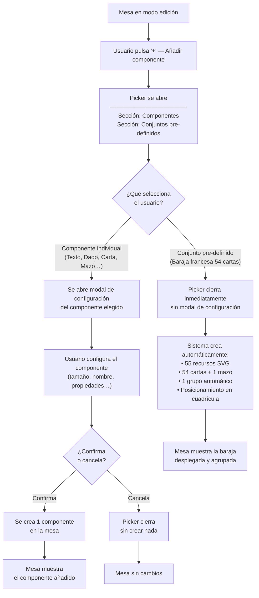

# Navegación 00236 — Flujo del picker: componente individual vs conjunto pre-definido

Caso de uso: ¿Cómo responde el picker a la selección según el tipo de entrada?

Esta es la única distinción de navegación relevante del cambio: seleccionar un componente individual abre un modal de configuración (comportamiento existente), mientras que seleccionar un conjunto pre-definido dispara la creación inmediata sin paso intermedio.

**Nota:** el picker no tiene estado de "loading" visible entre la selección del preset y el resultado — la creación es síncrona desde el punto de vista del usuario (o con un indicador breve si el tiempo de generación de 55 SVGs lo requiere; `pv-how` lo decide).
