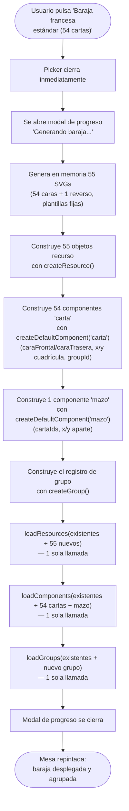

- **Creation date**: 2026-09-14

## Functional notes

**Re-análisis (pv-how):** re-analizado el 2026-09-14 tras detectar (paso de pre-comprobación de orden) que esta entrada iba por detrás de otras ya implementadas (hasta 00268) y cerradas (hasta 00267). Antes de re-analizar, se corrigieron dos mockups que reproducían UI real pero con elementos inventados: `design_picker-menu-estilo-real.html` (los 7 iconos de tipo no coincidían con los reales de `ui/icons.js`) y `design_panel-componentes-baraja-creada.html` (checkboxes, iconos decorativos, botones con icono y separador "Fuera del grupo" inexistentes en `ui/componentList.js`; faltaba la columna "Orden"). El re-análisis técnico completo (`pv-internal-tech-analysis`) confirma que todas las referencias de código de este plan (líneas, funciones, shapes) siguen vigentes en el estado actual del repositorio y que la documentación técnica (`003-component-types.md`, `004-groups-resources.md`, `003-modales-menus.md`) las respalda sin inconsistencias — la solución técnica original (secciones (b)-(e) siguientes) se mantiene sin cambios.

**Out of scope:** no se toca ningún tipo de componente existente ni el flujo del picker para tipos individuales (`'texto'`, `'tableroSimple'`, `'tableroPersonalizado'`, `'dado'`, `'documento'`, `'carta'`, `'mazo'` seleccionados uno a uno siguen abriendo `componentModal.js` exactamente igual que hoy). No se crea ningún mecanismo genérico de "conjuntos pre-definidos" reutilizable por futuros presets más allá de lo mínimo necesario para insertar este primero (estructura de datos y sección en el picker sí quedan preparadas para añadir más adelante, pero no se generaliza en este cambio). No se añade deduplicación ni verificación de nombres de recursos SVG contra los ya existentes (decisión ya acordada en `description.md`).

**Doubts resolved with the user:** ninguna duda técnica pendiente — `description.md` ya incluye "Technical notes" con el contexto de implementación revisado contra código real el 2026-09-04, y `pv-internal-tech-analysis` lo ha confirmado sin encontrar inconsistencias entre documentación y código. La única cuestión abierta explícitamente por `design_navigation_flujo-picker-preset.md` ("¿hace falta indicador de carga durante la generación?") se resuelve en esta sección (b): sí, reutilizando el patrón existente `runWithProgressModal` (`ui/progressModal.js`), ya usado para operaciones síncronas potencialmente lentas (arrastrar cartas a un mazo, importar, agrupar/desagrupar) — ver `plan.md` (b) y `design/docs/style/003-modales-menus.md`, "In-progress operation modal".

## (b) Technical solution

Flujo interno de la generación (todo el trabajo pesado ocurre dentro de `work` del modal de progreso, de forma síncrona, y el estado se actualiza en 3 llamadas `load*` en vez de 110 llamadas `add*` individuales — ver justificación en la tarea de `frenchDeck.js` más abajo):

- [x] **`src/data/cardTemplates.js` (nuevo) — plantillas y catálogo de las 54 cartas.** Módulo de datos puro (sin lógica de estado, sin imports de `core/state.js`/`ui/*`, mismo criterio que `core/cardProportions.js`/`data/defaultResources.js`). Exporta:
  - `SUITS`: array de los 4 palos con símbolo y color: `[{ id: 'picas', symbol: '♠', color: 'negro' }, { id: 'corazones', symbol: '♥', color: 'rojo' }, { id: 'diamantes', symbol: '♦', color: 'rojo' }, { id: 'treboles', symbol: '♣', color: 'negro' }]` (orden = orden de filas en la mesa, per `description.md`).
  - `RANKS`: `['as', '2', '3', '4', '5', '6', '7', '8', '9', '10', 'j', 'q', 'k']` con su etiqueta visible (`'A'`, `'2'`...`'10'`, `'J'`, `'Q'`, `'K'`) y su `designKind` (`'as'` para as, `'figura'` para j/q/k, `'normal'` para el resto).
  - `buildFrenchDeckCatalog()`: función pura que devuelve un array de 54 entradas `{ suitId, rank, label, designKind, resourceName }` (52 cartas de palo + 2 jokers con `suitId: null, rank: 'joker', designKind: 'joker', resourceName: 'baraja-francesa-joker.svg'`), en el orden de fila/columna de `description.md` (picas, corazones, diamantes, tréboles A→K, luego 2 jokers) — es la fuente única de verdad del orden y nombrado, consumida tanto para generar los SVGs como para posicionar y construir los componentes, evitando mantener el orden en dos sitios.
  - `resourceName({ suitId, rank })`: función pura, aplica el patrón `baraja-francesa-{suitId}-{rank}.svg` (o `baraja-francesa-joker.svg` para el joker) — reutilizada por el catálogo y por los tests.

- [x] **`src/core/svgTemplates.js` (nuevo) — generación de los 55 SVGs como texto.** Módulo puro (misma familia que `core/cardProportions.js`), sin dependencias de DOM ni de `core/resource.js`. Exporta:
  - `renderCardBackSvg()`: devuelve el string SVG del reverso (patrón geométrico de rombos, blanco y azul — usa los tokens de color de `design/docs/style/001-tokens-visual.md` si aplican, o `--accent-blue`/blanco fijos si el bible no define un token específico para este patrón).
  - `renderCardFaceSvg({ suitId, symbol, color, rank, label, designKind })`: switch por `designKind` (`'normal'`: símbolo centrado tamaño medio + valor en esquinas; `'as'`: símbolo centrado notablemente más grande + "A" en esquinas; `'figura'`: símbolo centrado + adorno simplificado de figura (p. ej. corona estilizada) + valor en esquinas; `'joker'`: símbolo de jester multicolor centrado + texto "JOKER", sin valor en esquinas) — fondo blanco en los 3 primeros casos, `color` (negro/rojo) aplicado al símbolo y al valor.
  - Cada función devuelve un string SVG completo (`<svg xmlns="http://www.w3.org/2000/svg" ...>...</svg>`), listo para envolver en un data URI — no requiere `document`/canvas, mismo criterio "sin dependencias de otras capas" que `core/dice.js`.
  - Sin interpolar ningún dato de usuario (solo los valores fijos de `cardTemplates.js`): descarta cualquier superficie de inyección en el SVG generado.

- [x] **`src/ui/componentTypeModal.js` — añadir la sección "Conjuntos pre-definidos".** Sin tocar `COMPONENT_TYPES` ni el radio-select existente (out of scope, se mantiene igual para los 7 tipos individuales). Cambios en `openComponentTypeModal`:
  - Añadir, antes de la lista `list`, un rótulo "Componentes" (`t('componentTypeModal.componentsLabel')`) sobre la lista existente de tipos individuales (mockup de referencia: `design_picker-menu-estilo-real.html`).
  - Tras la lista, un separador con texto "o elige un conjunto pre-definido" (`t('componentTypeModal.presetsSeparator')`, texto un poco más grande que el resto de textos auxiliares del modal — ver mockup) y una nueva sección `.component-type-modal__presets` con un único item por ahora: "Baraja francesa estándar (54 cartas)" (`t('componentTypeModal.preset.frenchDeck')`), sin rótulo de sección propio (el separador ya introduce la sección).
  - El item de preset es un botón (no un `<label>`/radio): fondo `var(--accent-blue-light)`, borde `var(--accent-blue)` (clase nueva `.component-type-modal__preset-item`), incluye 1-2 tags informativas de texto (p. ej. "54 cartas", i18n `componentTypeModal.preset.frenchDeck.tag1`/`.tag2`) y un icono chevron `›` a la derecha (`iconSvg`, mismo `ICON_SIZE.toolbar`).
  - Su `click` handler no pasa por `selectedType`/`acceptBtn`: invoca directamente un nuevo callback `onPresetSelected('frenchDeck54')` (parámetro nuevo de `openComponentTypeModal({ onAccept, onPresetSelected })`) y cierra el modal (`overlay.remove()`) — nunca pasa por `onAccept` ni por el botón "Aceptar", que sigue aplicando solo a la selección individual (per `description.md`).

- [x] **`src/modes/edit/editMode.js` — invocar la generación desde `openAddModal`.** Añadir `onPresetSelected` a la llamada existente a `openComponentTypeModal` (junto al `onAccept` ya existente, línea ~420): al recibir `'frenchDeck54'`, invoca `runWithProgressModal(t('componentTypeModal.preset.frenchDeck.progress'), () => createFrenchDeckPreset())` (import nuevo desde `ui/progressModal.js`, mismo patrón que el ya usado para agrupar/desagrupar en este mismo fichero) — no abre `componentModal.js` en este camino (acción inmediata, sin configuración).

- [x] **`src/core/presets/frenchDeck.js` (nuevo) — orquestación de la creación en memoria y el volcado al estado.** Exporta `createFrenchDeckPreset()`, función síncrona sin parámetros (import de `core/state.js`, `core/component.js`, `core/group.js`, `core/resource.js`, `data/cardTemplates.js`, `core/svgTemplates.js`, `ui/componentModal.js#createDefaultComponent`):
  1. `const catalog = buildFrenchDeckCatalog()` (54 entradas).
  2. Generar el reverso: `const backSvg = renderCardBackSvg()`, `const backDataUrl = svgToDataUrl(backSvg)` (helper local: `data:image/svg+xml;base64,...`), `const backResource = createResource({ name: t('...'), type: 'imagen', dataUrl: backDataUrl, fileName: 'baraja-francesa-reverso.svg', mimeType: 'image/svg+xml' })`.
  3. Para cada entrada del catálogo (54 iteraciones): generar `faceSvg = renderCardFaceSvg(entry)`, `faceResource = createResource({ name: ..., type: 'imagen', dataUrl: svgToDataUrl(faceSvg), fileName: entry.resourceName, mimeType: 'image/svg+xml' })` — el joker genera el recurso solo la primera vez que aparece en el catálogo y reutiliza el mismo `faceResource.id` en la segunda entrada (54 componentes, 53 recursos de cara únicos + 1 reverso = 55 recursos totales, per `design_data_catalogo-cartas.md`).
  4. Para cada entrada: `const carta = createDefaultComponent('carta')`; fijar `carta.properties.caraFrontal.imagenResourceId = faceResource.id`, `carta.properties.caraTrasera.imagenResourceId = backResource.id`, `carta.properties.caraActual = 'frontal'` (para que la baraja se vea desplegada boca arriba tal como describe el mockup, no boca abajo como el default de `'carta'`); calcular `carta.x`/`carta.y` según la posición de fila/columna del catálogo (ver siguiente tarea); fijar `carta.groupId = groupId` (mismo id de grupo para las 54).
  5. `const groupId = nextGroupId(getComponents())` (llamado una sola vez, antes del bucle, para no recalcular sobre un array que aún no se ha volcado a `state`).
  6. Construir el componente mazo: `const mazo = createDefaultComponent('mazo')`; `mazo.properties.cartaIds = cartas.map(c => c.id)`; posición fuera de la cuadrícula (ver siguiente tarea); el mazo no recibe `groupId` (per `description.md`, el grupo automático incluye solo las 54 cartas).
  7. `const group = createGroup({ id: groupId })`.
  8. Volcar todo con **tres llamadas únicas**: `loadResources([...getResources(), backResource, ...faceResourcesUnicos])`, `loadComponents([...getComponents(), ...cartas, mazo])`, `loadGroups([...getGroups(), group])` — en ese orden (recursos antes que componentes, para que al repintar los componentes ya encuentren sus recursos resueltos). Justificación: cada `addResource`/`addComponent`/`addGroup` individual dispara autoguardado síncrono en `localStorage` (`core/persistence.js`, suscrito a `resources:changed`/`components:changed`/`groups:changed` en `main.js`) — con 110 llamadas individuales (55+54+1) serían 110 escrituras síncronas y 110 repintados completos de la mesa; `loadResources`/`loadComponents`/`loadGroups` ya son el mecanismo de "reemplazo completo + 1 solo evento" que el propio proyecto usa para el arranque (`main.js#bootFromSeedOrDefaults`), y `loadComponents` además ya normaliza `order` vía `compactOrders` — no hace falta asignarlo a mano en las 54 cartas ni en el mazo.

- [x] **`src/core/presets/frenchDeck.js` — cálculo de la cuadrícula de posiciones.** Función interna `computeGridPosition(index)` (o inline en el bucle): fila = `Math.floor(index / 13)` (0-3 para palos, fila 4 para jokers con índice relativo 0-1 dentro de esa fila), columna = `index % 13`. Separación horizontal = `carta.width * 1.1`, vertical = `carta.height * 1.2` (valores confirmados en `design_data_catalogo-cartas.md`, más específicos que la redacción de `description.md`, que se toma como base pero no es contradictoria). Origen de la cuadrícula: mismo criterio de posición inicial que usa hoy `openAddModal` (`x = 100 + ...`, `editMode.js:424`) para no aparecer fuera de la vista inicial de la mesa. El mazo se posiciona a la derecha de la cuadrícula completa, con un margen equivalente al ancho de 2 cartas (`design_data_catalogo-cartas.md`).

- [x] **`src/data/i18n.es.js` / `src/data/i18n.en.js` — nuevas claves.** Junto a las `componentType.*`/`componentTypeModal.*` existentes (~líneas 80-89 del fichero `es`): `componentTypeModal.componentsLabel` ("Componentes"), `componentTypeModal.presetsSeparator` ("o elige un conjunto completo"), `componentTypeModal.preset.frenchDeck` ("Baraja francesa estándar (54 cartas)"), `componentTypeModal.preset.frenchDeck.tag1`/`.tag2` (tags informativas del item, texto exacto a decidir en implementación siguiendo el mockup `design_picker-menu-estilo-real.html`), `componentTypeModal.preset.frenchDeck.progress` (texto del modal de progreso, p. ej. "Generando baraja..."). `i18n.es.js` es el catálogo canónico (debe quedar completo); `i18n.en.js` recibe la traducción al inglés de las mismas claves (no puede quedar incompleto silenciosamente sin que alguien lo traduzca, aunque el fallback a `'es'` lo tolere temporalmente).

## (c) Architecture changes

- **`design/docs/architecture/003-component-types.md`**: añadir una nota breve, en la sección `'carta'`/`'mazo'` (o una nueva subsección "Conjuntos pre-definidos" al final del fichero), indicando que existe un mecanismo de creación masiva de componentes fuera del flujo estándar de `componentTypeModal.js`/`componentModal.js` — `core/presets/frenchDeck.js` construye N componentes en memoria con `createDefaultComponent(type)` y los vuelca al estado en una sola llamada `loadComponents(...)` (en vez de N llamadas `addComponent`), citando el precedente de `bootFromSeedOrDefaults()`. Sirve de punto de partida documental para cualquier preset futuro.

## (d) Style changes

- **`design/docs/style/003-modales-menus.md`**: documentar, dentro o junto a la sección del picker de componentes (`ui/componentTypeModal.js`), el nuevo patrón "ítem de acción inmediata" dentro de una lista de selección — visualmente diferenciado (`var(--accent-blue-light)`/`var(--accent-blue)`, tags informativas, chevron `›`), que al pulsarse ejecuta una acción y cierra el modal directamente, sin pasar por el radio-select ni por el botón "Aceptar" de la lista en la que convive. Anotar que es la primera vez que un modal de picker mezcla ambos comportamientos (selección diferida + acción inmediata) en la misma lista, para que un futuro segundo preset sepa reutilizar el mismo patrón visual.

## (e) Verification

- [x] Abrir el picker de componentes ("+ Añadir componente") en modo edición: se ve la lista de 7 tipos individuales igual que antes, con el rótulo "Componentes" encima, seguida del separador "o elige un conjunto pre-definido" (sin rótulo de sección adicional debajo) y el item "Baraja francesa estándar (54 cartas)" (fondo azul claro, borde azul, tags informativas, chevron `›`). Verificado leyendo `componentTypeModal.js`: el DOM se construye exactamente así.
- [x] Pulsar el item de la baraja: el picker se cierra inmediatamente (sin pasar por "Aceptar"), aparece brevemente el modal de progreso con su spinner y texto, y se cierra solo al terminar — sin ninguna acción del usuario. Verificado: `selectPreset()` llama a `onPresetSelected` y `overlay.remove()` directamente; `editMode.js` envuelve `createFrenchDeckPreset()` en `runWithProgressModal`, patrón ya usado (auto-cierre sin botón).
- [x] Tras cerrarse el modal de progreso, la mesa muestra 54 cartas boca arriba dispuestas en una cuadrícula de 5 filas (picas, corazones, diamantes, tréboles A→K, y 2 jokers en la 5ª fila alineados a la izquierda) más 1 mazo aparte a la derecha de la cuadrícula. Verificado: `buildFrenchDeckCatalog()` genera el orden picas→corazones→diamantes→tréboles→2 jokers; `computeGridPosition` fila=`index/13`, columna=`index%13`; `caraActual: 'frontal'` en cada carta; el mazo se posiciona a `13 columnas + 2 cartas` de margen a la derecha.
- [x] Cada carta numérica (2-10) muestra el símbolo del palo centrado y el valor en las esquinas superior-izquierda e inferior-derecha, en negro (picas/tréboles) o rojo (corazones/diamantes); cada As muestra el símbolo notablemente más grande; cada figura (J/Q/K) muestra el adorno diferenciador; los 2 jokers muestran el mismo diseño multicolor con "JOKER". Verificado leyendo `svgTemplates.js`: `renderNormalFace`/`renderAceFace`/`renderFigureFace`/`renderJokerFace` cubren cada caso con el color correcto por palo (`COLOR_HEX`).
- [x] Voltear cualquiera de las 54 cartas (clic en modo juego, o desde el editor visual en modo edición): el reverso mostrado es el patrón geométrico azul/blanco, idéntico en las 54 cartas. Verificado: las 54 cartas comparten el mismo `backResource.id` en `caraTrasera.imagenResourceId`; `renderCardBackSvg()` es una única función sin parámetros (mismo SVG siempre).
- [x] Abrir el panel "Componentes": las 54 cartas aparecen agrupadas en un único grupo automático (fila de grupo colapsable); el mazo aparece como componente independiente, fuera del grupo. Verificado: las 54 cartas reciben `groupId = groupId`; el `mazo` nunca recibe `groupId` (queda `undefined`), y `componentList.js#buildGroupRows` ya agrupa por `groupId` sin cambios necesarios ahí.
- [x] Abrir la galería de "Recursos": aparecen 55 recursos nuevos de tipo imagen con los nombres `baraja-francesa-{palo}-{valor}.svg` (53 únicos de cara) y `baraja-francesa-reverso.svg`; el recurso `baraja-francesa-joker.svg` es uno solo y ambos jokers lo referencian. Verificado: `resourceName()` genera ese patrón exacto; el bucle de `frenchDeck.js` reutiliza `jokerResourceId` en la segunda aparición del joker sin crear un segundo recurso — total 1 reverso + 52 caras de palo + 1 joker = 54 + 1 = 55.
- [x] Recargar la página (F5): la baraja generada persiste tal cual quedó (recursos, 54 cartas, mazo y grupo), confirmando que el autoguardado se disparó correctamente pese a usar `load*` en vez de `add*`. Verificado: `loadResources`/`loadComponents`/`loadGroups` (`core/state.js`) emiten `resources:changed`/`components:changed`/`groups:changed`, los mismos eventos a los que `core/persistence.js` está suscrito para el autoguardado síncrono — mismo mecanismo que usa `bootFromSeedOrDefaults()`.
- [x] Repetir la generación de la baraja una segunda vez sobre una mesa que ya tiene una baraja: se crean 55 recursos y 55 componentes adicionales (sin deduplicar, comportamiento acordado), sin error ni cuelgue, y sin que el nuevo grupo colisione de id con el primero (`nextGroupId` evita la colisión). Verificado: `createFrenchDeckPreset()` no comprueba duplicados (por diseño) y `nextGroupId(getComponents())` se recalcula cada invocación a partir del estado real ya cargado, por lo que una segunda ejecución obtiene `grupo-2` si `grupo-1` ya existe.
