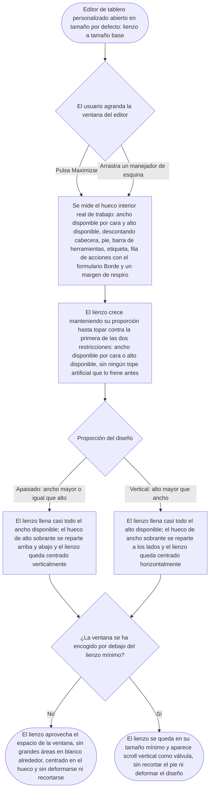

- **Name**: El lienzo del editor visual sigue sin llenar la ventana al maximizar/redimensionar (re-report del fix 00235)
- **Code**: 00237
- **Type**: fix
- **Creation date**: 2026-09-03

## Full description

Re-report del fix 00235 (continuación a su vez de 00225 y 00233). Tras aquel cambio, el editor visual de **cartas** ya redimensiona y aprovecha el espacio correctamente; el problema **solo persiste en el editor visual de tableros personalizados** (una única cara), que **sigue sin aprovechar el espacio de la ventana**. El alcance de este fix queda acotado a ese caso.

### Qué sigue fallando

- **Al pulsar "Maximizar"**, la ventana sí pasa a ocupar casi toda la pantalla, pero el lienzo de diseño dentro se queda pequeño: no crece lo suficiente y queda mucho espacio en blanco alrededor, sobre todo **por debajo** del lienzo, y también a los lados.
- **Al redimensionar la ventana con los manejadores de esquina**, ocurre lo mismo: el lienzo no llega a llenar el hueco disponible y queda un área en blanco grande, muy visible **debajo** del lienzo. En la captura aportada, con un tablero personalizado apaisado (los días de la semana) y la ventana casi a pantalla completa, el lienzo ocupa aproximadamente la mitad superior del área de trabajo y todo el resto queda vacío; el propio lienzo tampoco llega a topar los laterales.
- El comportamiento esperado ya se documentó en el fix 00235 ("el lienzo escala para ser lo más grande posible dentro del hueco interior real de la ventana, manteniendo su proporción, y queda centrado en el espacio sobrante") pero en la práctica **no se cumple**: ni el lienzo crece hasta el ancho/alto realmente disponibles, ni queda centrado verticalmente — se queda pegado a la parte de arriba con todo el hueco sobrante debajo.

### Qué se espera (mismo criterio ya acordado en 00235, aplicado al editor de tablero personalizado)

Tanto al maximizar como al redimensionar con las anclas, el único lienzo del editor de tablero personalizado debe escalar hasta ser **lo más grande posible dentro del área interior disponible de la ventana** (el hueco de trabajo, descontando cabecera, pie, la fila de acciones/borde y un pequeño margen), **manteniendo su proporción**:

- El lienzo crece hasta topar contra la **primera** de las dos restricciones — el ancho disponible o el alto disponible — sin ningún tope artificial que lo frene antes de llegar a ese límite real.
- Un diseño **apaisado** (como el tablero de los días de la semana de la captura) normalmente topará primero el **ancho**: llenará casi todo el ancho disponible y quedará **centrado verticalmente**, con el hueco de alto sobrante repartido arriba y abajo (no todo debajo, que es lo que ocurre ahora).
- Un diseño **vertical** normalmente topará primero el **alto**: crecerá hasta casi llenar el alto disponible y quedará **centrado horizontalmente**.
- Nunca se deforma el diseño ni se recorta; no aparece scroll salvo que la ventana se encoja por debajo del lienzo mínimo, en cuyo caso aparece scroll vertical como válvula.

El editor de **cartas** no se toca: ya funciona bien tras el 00235 y este fix no debe alterar su comportamiento (dos caras lado a lado, "Ajustar imagen…" intercalado, etc.). Cualquier ajuste debe verificarse contra ambos casos, pero el objetivo es corregir únicamente el de tablero personalizado.

Los controles del editor de tablero ("Añadir elemento", borde, botón "Ajustar imagen…") siguen siempre visibles; el botón "Ajustar imagen…" queda alineado al centro vertical del lienzo. El resto del comportamiento no cambia: la ventana no baja de su tamaño mínimo ni se sale del área visible; "Restaurar" vuelve al tamaño por defecto; ni el tamaño maximizado ni el elegido a mano se recuerdan entre aperturas.

### Flujo del comportamiento esperado (tablero personalizado, una cara)

### Preguntas de alcance

- **¿Afecta también al editor de cartas?** No. Confirmado por el usuario: tras el 00235 el editor de cartas ya redimensiona y aprovecha el espacio correctamente. El re-report se acota **solo** al editor de tableros personalizados (una cara). El fix no debe alterar el comportamiento del editor de cartas.
- Sin más preguntas nuevas: el criterio funcional esperado es el ya acordado en 00235, aplicado al caso de una sola cara.

## Technical notes

- Ficheros implicados: `src/ui/visualEditorModal.js` (`getEffectiveCanvasMaxSide()`, `getEditorWorkArea()`, `currentCanvasMaxSide`, `renderFaces()`, `renderFace()`; constantes `CANVAS_MAX_SIDE = 380`, `CANVAS_MIN_SIDE = 140`, `EDITOR_CHROME_V = 210`, `EDITOR_WORK_MARGIN = 24`) y `src/styles/main.css` (`.card-editor-modal--maximized`, `.card-editor-modal .modal__content`, `.card-editor-modal__faces`).
- **Acotación importante:** el editor de cartas (dos caras, `showProporcionSelector: true`, con `.card-editor-modal__toolbar` visible y `.card-editor-modal__face-label` presente) **ya funciona bien**; el editor de tablero personalizado (`showProporcionSelector: false`, una cara, `label: null`, toolbar vacía) es el que falla. Es probable que la causa raíz sea específica de ese caso (p. ej. medir el cromo vertical cuando no hay etiqueta ni toolbar reales, o el techo artificial que se nota más con un diseño apaisado, típico de tablero). `pv-how` debe partir de reproducir **solo** ese caso y comparar por qué el de carta sí converge.
- **Sospechas de causa raíz (a confirmar en el plan / reproduciendo en la app, solo caso tablero personalizado):**
  1. **Techo artificial `CANVAS_MAX_SIDE * 3 = 1140`** dentro de `getEffectiveCanvasMaxSide()` (rama `maximized || manualSize`): limita el lado largo del lienzo a 1140 px aunque el hueco interior real de una ventana maximizada (~90vw) ofrezca mucho más ancho → margen en blanco a los lados. Un tablero apaisado topa el ancho, así que este techo le afecta de lleno (una carta vertical topa antes el alto y no lo llega a notar). Era un "techo prudente" heredado del diseño previo a 00235 y ahora impide "aprovechar todo el espacio".
  2. **`actionsH` mal medido → lienzo infradimensionado + hueco vertical.** `getEditorWorkArea()` resta del alto disponible la altura de `.card-editor-modal__face-actions` (fila "Añadir elemento" + título "Borde" + formulario de borde), medida del render **anterior**, cuyo lienzo era más pequeño. Esa fila tiene `flex-wrap: wrap` y su anchura es la del lienzo: con el lienzo pequeño del render previo envuelve en más filas (más alta) que con el lienzo grande del render nuevo (menos filas, más baja). Resultado: `availHeight` queda infravalorado, el lienzo sale más pequeño de lo posible y, además, la fila de acciones ya reducida deja un gran hueco debajo. Es un problema de convergencia: una sola pasada de `renderFaces()` mide un layout que ya no coincide con el que produce. Con un lienzo apaisado (muy ancho) el efecto es más acusado que con dos lienzos verticales estrechos.
  3. **Centrado vertical no efectivo.** En la captura el bloque de la cara queda pegado arriba con todo el hueco debajo, pese a `.card-editor-modal__faces { flex: 1 1 auto; align-items: center }`. Hay que confirmar si `.card-editor-modal__faces` realmente se estira para llenar `.modal__content` (cadena flex: `.modal` columna → `.modal__content` `flex:1` + `display:flex;flex-direction:column` → `.card-editor-modal__faces` `flex:1 1 auto`) o si el `.card-editor-modal__toolbar` vacío (presente pero sin contenido en tablero personalizado), el `overflow-y:auto` de `.modal__content`, o la ausencia de `min-height: 0` están anulando el estiramiento — y por qué en el caso de carta (toolbar con contenido, etiquetas) no se manifiesta.
- **Estructura DOM real dentro de `.modal__content`** (tablero personalizado, `showProporcionSelector: false`, una cara, `label: null`): `.card-editor-modal__toolbar` (vacío, 0 de alto) + `.card-editor-modal__faces` → `.card-editor-modal__face` (columna) → `.card-editor-modal__canvas` + `.card-editor-modal__face-actions` (contiene "Añadir elemento", título "Borde" y el `.modal__field` del borde con `width:100%` inline). No hay `.card-editor-modal__face-label` en tablero personalizado.
- **Sin puntos de seguridad pendientes**: cambio puramente de layout/CSS de UI en un editor local del navegador, sin red, sin entrada de usuario que llegue a un parser/consulta, sin datos persistentes nuevos ni dependencias nuevas.
- **Documentación técnica a actualizar tras el fix** (no hay inconsistencia actual doc-vs-código; 00235 está bien documentado, pero el nuevo criterio de escalado hará que quede desfasado): `previo-sdd/design/docs/style/003-modales-menus.md` §"Wide modals" fila `.card-editor-modal` y `previo-sdd/design/docs/architecture/006-ui-layer.md` §`ui/visualEditorModal.js` ("Window size", `getEffectiveCanvasMaxSide`/`getEditorWorkArea`). Lo integra `pv-how` en las secciones (c)/(d) del `plan.md`.
- **Regresión a vigilar:** el editor de cartas ya funciona bien tras 00235. Cualquier cambio en `getEffectiveCanvasMaxSide()`, `getEditorWorkArea()` o el CSS compartido `.card-editor-modal*` debe verificarse también con una carta (dos caras, vertical y apaisada) para no romper su comportamiento actual.
- Alcance estrictamente acotado a que el lienzo del editor de **tablero personalizado** aproveche el espacio real de la ventana al maximizar/redimensionar; no se refactoriza ni se toca nada ajeno a esa causa, ni se modifica el editor de cartas.
