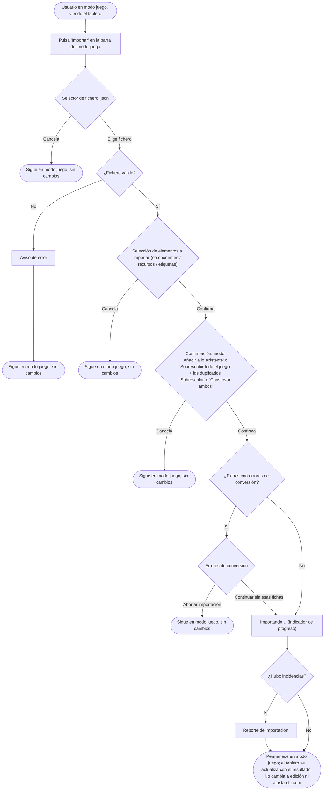

- **Name**: Botón "Importar" también en modo juego (y permanecer en modo juego al importar)
- **Code**: 00238
- **Type**: change
- **Creation date**: 2026-09-03

## Full description

Hoy el botón "Importar" (importar un juego desde un fichero `.json`) solo está disponible en el modo edición, dentro de su barra de herramientas. Si alguien está jugando (modo juego) y quiere cargar otro juego, primero tiene que entrar en modo edición, importar, y luego volver a salir a modo juego.

Este cambio pide dos cosas:

1. Que el botón "Importar" esté también disponible en el modo juego.
2. Que si la importación se lanza desde el modo juego, al terminar la aplicación se quede en modo juego (no cambie a modo edición).

### Cómo debe comportarse

**Ubicación y aspecto del botón en modo juego**

- El botón "Importar" aparece en la misma zona superior donde el modo juego muestra el botón "Entrar en modo edición", colocado a su izquierda. El orden visible es: "Importar" · "Entrar en modo edición". El botón cuadrado "Ajustar zoom" que ya existe en esa esquina se mantiene igual.
- En el modo juego el botón adopta el aspecto de esa zona (el mismo estilo visual que "Entrar en modo edición"), no el aspecto que tiene dentro de la barra del modo edición. Usa el mismo icono de importar que ya se usa hoy.
- En el modo edición el botón "Importar" sigue exactamente igual que ahora (misma ubicación, mismo aspecto dentro de la barra de edición).

**Qué hace al pulsarlo**

Al pulsar "Importar" en modo juego ocurre exactamente el mismo proceso que al pulsarlo en modo edición:

1. Se abre el selector de fichero del sistema, filtrado a ficheros `.json`.
2. Si el fichero no es válido, se muestra el mismo aviso de error de siempre y no cambia nada.
3. Si el fichero es válido, aparece el modal para elegir qué elementos importar (componentes, recursos, etiquetas).
4. Después, el modal de confirmación con la elección de modo ("Añadir a lo existente" o "Sobrescribir todo el juego") y el tratamiento de identificadores duplicados ("Sobrescribir" o "Conservar ambos").
5. Si hay fichas que necesitan conversión y dan error, aparece el mismo modal de errores de conversión, con las opciones "Abortar importación" o "Continuar sin esas fichas".
6. Durante la importación se muestra el mismo indicador de progreso ("Importando…").
7. Si al terminar hubo incidencias, se muestra el mismo modal de reporte de importación.

En cualquier punto en el que la persona cancele o aborte (selector de fichero, modal de selección, modal de confirmación, modal de errores de conversión), no se modifica nada y se permanece en modo juego.

**Modo tras la importación**

- Si la importación se lanzó desde **modo juego**: al terminar se **permanece en modo juego**. El tablero de juego se actualiza y muestra el resultado de la importación (los componentes añadidos o el juego sobrescrito, según el modo elegido).
- Si la importación se lanzó desde **modo edición**: sin cambios respecto a hoy, se permanece en modo edición.
- No se hace ningún "Ajustar zoom" automático tras importar: la vista no se reencuadra sola. La persona tiene disponible el botón "Ajustar zoom" de siempre si lo quiere.

**Sobrescribir todo el juego desde modo juego**

Está permitido igual que desde edición. Tras sobrescribir, la persona sigue en modo juego viendo el juego recién importado. Si el fichero trae título de juego y el modo elegido es "Sobrescribir todo el juego", ese título se aplica (comportamiento ya existente, no se modifica).

### Diagrama funcional — importar desde el modo juego

Este flujo es idéntico al de importar desde el modo edición salvo en dos puntos: (a) el punto de entrada es el botón "Importar" de la barra del modo juego (en edición es el de la barra de herramientas de edición); (b) el modo final es "modo juego" (importando desde edición, el modo final sigue siendo "modo edición").

## Technical notes

- El botón "Importar" y su `<input type="file" accept=".json" hidden>` se crean hoy en `renderEditToolbar()` de `src/ui/editModeToggle.js` (aprox. líneas 243-310), dentro de un `.toolbar-group` de persistencia junto al botón "Exportar". `importComponentsFromFile(file)` (mismo archivo) contiene todo el flujo de importación (parseo, modales de selección/confirmación/conversión/reporte, `runWithProgressModal`, `mergeImportedGame`, `loadComponents`/`loadResources`/`loadTags`/`loadGroups`). Esta función debe reutilizarse tal cual desde el modo juego, sin duplicarla.
- `renderModeSwitcher(container)` (mismo archivo, aprox. líneas 230-241) pinta el contenido del modo juego en `#mode-switcher`: botón "Entrar en modo edición" (`setMode(MODES.EDIT)`) + botón flotante "Ajustar zoom" (`createFitButton('mode-switcher__fit-btn')`). Aquí es donde habría que añadir el nuevo botón "Importar" y su input oculto.
- Ambos contenedores (`#mode-switcher` y `#edit-toolbar`) se montan siempre en cada `renderAll()` de `src/main.js` (líneas ~42-47); cada función hace `container.innerHTML = ''` y retorna pronto si el modo activo no es el suyo, de modo que solo uno pinta contenido a la vez.
- `setMode()` de `core/state.js` emite `mode:changed`; `main.js` re-renderiza todo (`on('mode:changed', renderAll)`). La importación actual **no** llama a `setMode` en ningún punto: hoy se permanece en modo edición tras importar simplemente porque nunca se salió de él. Por tanto, para "quedarse en modo juego" basta con no forzar cambio de modo; `loadComponents`/`loadResources`/etc. emiten `components:changed`/`resources:changed`, que ya disparan `renderAll` y repintan la pantalla de juego.
- El estilo de los botones de `#mode-switcher` es fondo `var(--accent-blue)` + texto claro (regla `#mode-switcher button` en `src/styles/main.css`), distinto del estilo transparente-con-borde de los botones "Importar"/"Exportar" dentro de `.edit-toolbar`. Al colocar "Importar" en `#mode-switcher` heredará el azul automáticamente; conviene revisar que no haga falta una regla específica.
- App 100% cliente estático, persistencia en `localStorage`, sin roles ni autenticación. Sin inconsistencias entre documentación y código detectadas durante el análisis. Sin puntos de seguridad pendientes: el flujo de importación en sí (parseo, validación, merge) no se modifica.
- Documentación que probablemente haya que actualizar al implementar: `previo-sdd/design/docs/architecture/005-modes.md` (describe explícitamente que `.edit-toolbar` ofrece "Importar | Exportar | Salir del modo edición" y que en modo juego `#mode-switcher` solo tiene el botón "Entrar en modo edición"), `previo-sdd/design/docs/architecture/007-persistence-build.md` (flujo Export/Import) y `previo-sdd/design/docs/style/002-componentes-layout.md` (estilos de botones de `#mode-switcher` frente a `.edit-toolbar`).
