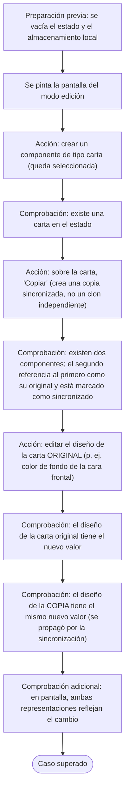
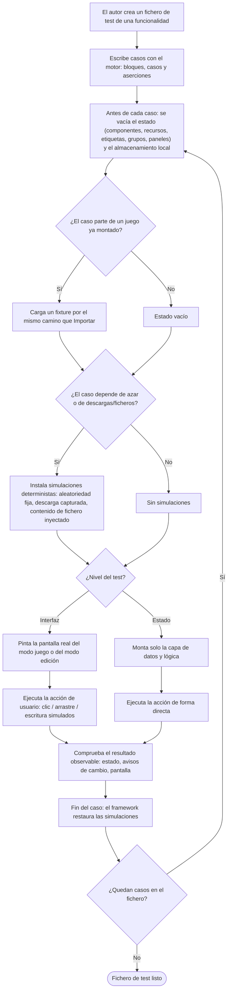
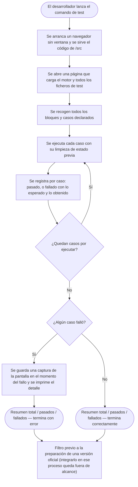

- **Name**: Framework de tests funcionales
- **Code**: 00238
- **Type**: change
- **Creation date**: 2026-09-05

## Full description

Se define (no se implementa todavía) un framework de tests funcionales para BG Factory: un conjunto de piezas que permitan **escribir, organizar y ejecutar de forma automática** pruebas que validen funcionalidades de usuario completas del editor, ejercitando el proyecto real tal y como está organizado en `/src` (no la versión entregable ya construida).

### Qué es un "test funcional" en este contexto

Un test que reproduce una funcionalidad de usuario de principio a fin —crear un componente, importar o exportar un juego con selección y fusión, agrupar y desagrupar, alternar entre modo juego y modo edición, arrancar la aplicación con distintos estados guardados, cambiar de idioma, usar copias sincronizadas— y comprueba el **resultado observable**: el estado interno de la aplicación tras la acción, los avisos de cambio que se emiten, y/o lo que queda pintado en pantalla.

Queda **fuera de alcance**: los tests unitarios de funciones internas aisladas (eso sería otro framework distinto), los tests visuales píxel a píxel, la medición de rendimiento, la validación del proceso de build en sí, y las pruebas de extremo a extremo sobre el fichero HTML entregable ya generado (este framework trabaja siempre sobre `/src`).

### Dos niveles de test, un mismo framework

Cada test declara con qué profundidad se ejecuta:

- **Nivel estado/lógica**: monta solo la capa de datos y lógica, dispara la acción de forma directa y comprueba el estado y los avisos de cambio. Sin pantalla.
- **Nivel interfaz**: pinta de verdad la pantalla del modo juego o del modo edición, simula clics, escritura y arrastres reales, y comprueba tanto lo que se ve como el estado resultante.

### Cómo se ejecuta

La ejecución es **automática y sin intervención manual**. Se descarta expresamente cualquier vía que consista en abrir una página y mirarla: no hay "runner visual" como mecanismo principal.

Se lanza con un único comando desde la línea de órdenes (`npm test`). Ese comando abre un navegador **sin ventana** (headless), sirve el código de `/src` y ejecuta toda la batería de tests. La elección de un navegador real, en lugar de un simulador de pantalla más ligero, es deliberada: las funcionalidades más frágiles de BG Factory dependen de geometría real —arrastre de bloques manteniendo distancias, encuadre automático, redimensionado de paneles, solape de una carta sobre un mazo, posición de los menús contextuales, dibujo de dados y mazos en lienzo—, y solo un navegador real las reproduce con fidelidad.

Al terminar imprime un resumen (total de tests, cuántos pasan y cuántos fallan). Por cada fallo muestra qué se esperaba y qué se obtuvo, y guarda una captura de la pantalla en el momento del fallo. Si algo falla, el comando termina con error (apto para integración continua); si todo pasa, termina correctamente.

Este comando está pensado como **filtro previo** a la preparación de una versión oficial. Enganchar esa comprobación *dentro* del propio proceso de generación de versión es una decisión posterior, fuera del alcance de esta definición.

### Node como herramienta solo de desarrollo

Para esta vía de tests, Node pasa a ser una dependencia **de desarrollo** (se declara junto con el navegador headless y su carpeta de dependencias queda excluida del control de versiones). Es importante dejar claro y documentado que **el proceso que genera el entregable no cambia en absoluto**: sigue sin necesitar Node ni ningún gestor de paquetes, y el fichero HTML final es idéntico. Nadie debe asumir que "el proyecto ahora necesita npm" para funcionar o para construirse: solo para pasar los tests.

### Aislamiento entre tests

Cada test arranca desde cero. Antes de cada caso se vacía por completo el estado de la aplicación (componentes, recursos, etiquetas, grupos, estado de los paneles) y el almacenamiento local del navegador. Sin esta limpieza los tests se contaminarían entre sí, porque la aplicación guarda automáticamente cualquier cambio.

### Datos de prueba (fixtures)

Los juegos de ejemplo ya existentes (en formato de "Exportar") pasan a ser **fixtures**: se reubican en una carpeta propia dentro del área de tests y se cargan desde un test recorriendo exactamente el mismo camino que la función "Importar" de la aplicación. Los dos ficheros de ejemplo actuales, que son muy grandes, se conservan como fixtures de estrés y regresión, no para el uso habitual. Se irán añadiendo fixtures nuevos, pequeños y con un propósito único cada uno, según haga falta.

### Simulaciones (mocks) mínimas

Solo se sustituye lo que no es determinista o lo que toca el entorno del navegador:

- La aleatoriedad (barajar un mazo, tirar un dado) se fija a una secuencia conocida.
- La descarga de un fichero se captura en memoria en lugar de descargarse.
- La selección de un fichero por el usuario se sustituye inyectando directamente su contenido.

Todo lo demás se ejecuta de verdad. Al terminar cada test, el framework restaura estas sustituciones.

### Organización de los ficheros del framework

- Una carpeta de **casos de test**, con un fichero por funcionalidad o grupo de funcionalidades relacionadas (importar/exportar, agrupación, juego frente a edición, persistencia y arranque, idioma, copias sincronizadas, sanitización de contenido).
- Una carpeta de **fixtures** con los juegos de ejemplo.
- Un **motor de test** propio (declaración de bloques y casos, aserciones, preparación previa a cada caso), escrito de forma independiente del entorno para poder evolucionar sin reescribir los tests.
- Un fichero de **ayudas** con la limpieza de estado, la carga de fixtures y las simulaciones.
- Un **punto de entrada de línea de órdenes** que arranca el navegador headless, sirve el código, ejecuta todos los casos y produce el informe.
- Un fichero de **configuración del proyecto de desarrollo** con la dependencia del navegador headless y el comando de test.

#### Árbol de carpetas y ficheros

```
bgfactory/
├── package.json                     configuración del proyecto de desarrollo: dependencia del
│                                    navegador headless (dev) y comando de test. NO afecta al build.
├── .gitignore                       + carpeta de dependencias de desarrollo (fuera del control de versiones)
└── src/
    ├── ...                          (el resto del proyecto no cambia)
    └── test/
        ├── run.js                   punto de entrada de línea de órdenes: arranca el navegador
        │                            headless, sirve src/ por http, abre la página de ejecución,
        │                            recoge los resultados, guarda captura al fallar, fija el
        │                            código de salida (0 / error).
        ├── runner-page.html         página que se carga en el navegador headless: importa el motor
        │                            y todos los ficheros de casos, y expone los resultados a run.js.
        ├── harness.js               motor de test propio: declaración de bloques y casos,
        │                            aserciones y preparación previa a cada caso. Independiente
        │                            del entorno; se ejecuta dentro del navegador.
        ├── helpers.js               ayudas: limpieza de estado, carga de fixtures y simulaciones
        │                            (aleatoriedad fija, descarga capturada, contenido de fichero
        │                            inyectado).
        ├── functional/              un fichero por funcionalidad o grupo de funcionalidades
        │   ├── import-export.test.js
        │   ├── grouping.test.js
        │   ├── play-vs-edit.test.js
        │   ├── persistence-boot.test.js
        │   ├── i18n.test.js
        │   ├── synced-copies.test.js         (incluye el caso de ejemplo descrito más abajo)
        │   └── sanitization.test.js
        └── fixtures/                juegos de ejemplo en el formato que produce "Exportar"
            ├── errantes-componentes.json     (movido desde src/test/; fixture de estrés)
            ├── mazo-repetido.json            (movido desde src/test/; fixture de estrés)
            └── ...                           (fixtures pequeños nuevos, uno por propósito)
```

### Caso de ejemplo: copia sincronizada de una carta

Este caso ilustra el nivel interfaz completo y sirve de referencia para escribir el resto. Vive en `src/test/functional/synced-copies.test.js` y no necesita ningún fixture (parte de estado vacío y construye lo que necesita).

**Qué comprueba**, en un único caso de test:

1. Se crea un componente de tipo **carta**.
2. Se crea una **copia sincronizada** de esa carta.
3. Se cambia algo del **diseño de la carta original** (por ejemplo, el color de fondo, o el texto de un cuadro de texto de la cara frontal).
4. Se verifica que ese cambio **se refleja tanto en la carta original como en la copia**, porque la copia está sincronizada con su original.

**Cómo se desarrolla el caso** (secuencia funcional):



**Notas del caso:**

- Es un test de **nivel interfaz**: monta el modo edición real y las acciones se hacen como las haría el usuario (crear componente, "Copiar" desde el menú/panel, abrir el editor de la carta y cambiar una propiedad de diseño).
- La distinción **copia frente a clon** es deliberada: "Copiar" crea una copia vinculada y sincronizada; "Clonar" crea un duplicado independiente. El caso usa "Copiar" para que la propagación tenga sentido.
- Se comprueba la propagación **del original a la copia**. La opción de romper la sincronización de una copia concreta (para lock/visibilidad) queda fuera de este caso; podría cubrirse en un caso hermano dentro del mismo fichero.
- No usa simulaciones: crear una carta, copiarla y editar su diseño son operaciones deterministas.

### Correspondencia con la documentación funcional

Los tests funcionales **deben corresponderse con la documentación funcional** del proyecto (`design/docs/features/`, un fichero por funcionalidad con un número identificador estable `NNN`): cada test valida una funcionalidad documentada ahí.

Reglas:

- Cada test tiene un **código único y estable** con el formato `FT-<NNN>-<nn>`, **ligado a la funcionalidad**: `<NNN>` es el número de la ficha de `design/docs/features/` que el test valida como funcionalidad principal, y `<nn>` es un correlativo de dos dígitos dentro de esa funcionalidad (`FT-022-01`, `FT-022-02`, …). El código no se reutiliza aunque el test se borre o se renombre.
- Un test que además ejercite de forma incidental **otras** funcionalidades puede declararlas como **cobertura secundaria** (por su número `NNN`); su código sigue tomando el `<NNN>` de la funcionalidad principal. En `TRACEABILITY.md` ese test aparece bajo su funcionalidad principal y también listado (marcado como secundario) bajo las demás.
- La declaración de funcionalidad principal y secundarias vive **solo del lado del test** (en sus propios metadatos, dentro de `src/test/`), nunca en la documentación funcional.
- El framework **genera** un documento de trazabilidad, `src/test/TRACEABILITY.md`, en cada ejecución de la batería: una tabla que relaciona cada funcionalidad documentada con los tests que la cubren (principal y secundarios), más una sección de anomalías. Se versiona (así un cambio de cobertura se ve en el diff), lleva cabecera de "generado automáticamente, no editar", y no contiene datos volátiles (ni fechas ni resultado de la última ejecución — eso va a consola/CI).
- **Anomalía de funcionalidad inexistente = fallo de la batería** (exit ≠ 0): si un test declara —como principal o como secundaria— una funcionalidad `NNN` que no tiene ficha en `design/docs/features/`, la ejecución falla. Es un error real: ficha borrada/renombrada, o número mal puesto en el test.
- **Funcionalidad sin ningún test = solo informe**: se lista en `TRACEABILITY.md` como "sin cobertura", pero no hace fallar la batería (habrá funcionalidades sin cubrir durante mucho tiempo).
- **No se toca nada del framework Previo ni de la documentación funcional a nivel estructural**: ni la plantilla de las fichas de funcionalidad, ni su proceso, ni ningún fichero de `.claude/skills/pv-*`. La ficha de funcionalidad se sigue rellenando exactamente como hoy; no se le añade ningún campo ni sección para tests. La única relación test ↔ funcionalidad materializada es `TRACEABILITY.md`, que es un fichero del framework de tests.
- La documentación funcional actual (40 fichas, `INDEX.md` incluido) **ya cubre** las funcionalidades que ejercitan los primeros tests, así que este cambio **no crea ni modifica ninguna ficha**. Si en el futuro, al escribir un test, se detecta que una ficha no es fiel, se corrige por el flujo estándar de Previo (`pv-new` / `pv-how` / `pv-do`), fuera del alcance de este cambio.

#### Ejemplo de `src/test/TRACEABILITY.md`

```markdown
<!-- GENERADO AUTOMÁTICAMENTE por `npm test`. No editar a mano: cualquier cambio se sobrescribe. -->

# Trazabilidad funcionalidad ↔ tests

Relaciona cada funcionalidad de `design/docs/features/` con los tests funcionales que la
cubren. "principal" = el test toma su código de esta funcionalidad; "secundaria" = el test
la ejercita de forma incidental.

| Funcionalidad (design/docs/features/) | Tests |
|---|---|
| 002 — Alta/edición/borrado de componentes con modal de tabs | FT-002-01, FT-002-02, FT-002-03 |
| 005 — Elementos tipo Copia, vinculados y sincronizados con un original | FT-005-01 |
| 016 — Componente oculto en modo juego | FT-016-01 |
| 022 — Componente "carta" | FT-005-01 (secundaria) |
| 029 — Autoguardado en el navegador | FT-029-01, FT-029-02 |
| 032 — Exportar/importar componentes en JSON, con selección | FT-032-01 |
| 036 — Contenido de ejemplo al arrancar una partida nueva | FT-036-01 |
| 039 — Barra de controles superior: modos, importar y exportar | FT-039-01, FT-039-02 |
| 034 — Agrupación de elementos: agrupar y desagrupar | — |

## Anomalías

### Tests que declaran una funcionalidad inexistente (hacen fallar la batería)
| Test | Funcionalidad declarada |
|---|---|
| FT-041-01 | 041 (sin ficha en design/docs/features/) |

### Funcionalidades sin ningún test (solo informativo)
| Funcionalidad |
|---|
| 034 — Agrupación de elementos: agrupar y desagrupar |
```

(Contenido ilustrativo. Los `FT-*` de la tabla se corresponden con la lista de "Primeros tests a implementar".)

### Primeros tests a implementar

Lista inicial, ordenada de más básico a menos, para levantar el framework con la funcionalidad mínima imprescindible y validar el propio andamiaje (motor, limpieza de estado, montaje de UI, aserciones) antes de atacar los casos complejos. La columna "Func." es el número de ficha de `design/docs/features/` que el test valida como funcionalidad principal (y de la que toma su código).

| Código | Func. | Fichero | Nivel | Qué comprueba | Depende de |
|---|---|---|---|---|---|
| `FT-002-01` | 002 | `functional/component-crud.test.js` | estado | Crear un componente de tipo carta: el estado pasa a contener uno, con su tipo e id, y queda seleccionado. | motor + limpieza de estado |
| `FT-002-02` | 002 | `functional/component-crud.test.js` | estado | Crear un componente de cada tipo básico (cuadro de texto, tablero simple, dado, carta, mazo): el estado contiene uno de cada. | `FT-002-01` |
| `FT-002-03` | 002 | `functional/component-crud.test.js` | estado | Eliminar un componente recién creado: el estado vuelve a quedar sin componentes. | `FT-002-01` |
| `FT-039-01` | 039 | `functional/top-controls.test.js` | estado | Alternar entre modo juego y modo edición: el modo activo cambia y se emite el aviso de cambio de modo. | motor + limpieza de estado |
| `FT-039-02` | 039 | `functional/top-controls.test.js` | interfaz | En modo edición se pinta la barra con "Importar", "Exportar" y "Salir del modo edición"; en modo juego se pinta "Importar" y "Entrar en modo edición". | montaje de UI |
| `FT-036-01` | 036 | `functional/fresh-boot.test.js` | estado | Arrancar sin nada guardado: sin componentes y con los recursos de ejemplo sembrados. | motor + limpieza de estado |
| `FT-029-01` | 029 | `functional/autosave.test.js` | estado | Tras crear un componente, el estado guardado en el almacenamiento local lo contiene. | `FT-002-01` |
| `FT-029-02` | 029 | `functional/autosave.test.js` | estado | Partiendo de un estado guardado con un componente, una nueva carga lo recupera. | `FT-029-01` |
| `FT-016-01` | 016 | `functional/hidden-in-play.test.js` | interfaz | Un componente marcado como oculto no se pinta en la mesa en modo juego; el mismo en modo edición sí se pinta, con su distintivo de oculto. | `FT-002-01`, montaje de UI |
| `FT-032-01` | 032 | `functional/export-import.test.js` | estado | Exportar un juego con un componente produce un fichero en el formato esperado (versión + listas); reimportarlo en un estado vacío reproduce ese componente. | `FT-002-01`, captura de descarga, inyección de fichero |
| `FT-005-01` | 005 | `functional/synced-copies.test.js` | interfaz | Caso de ejemplo completo: crear carta → crear copia sincronizada → cambiar el diseño de la original → comprobar el cambio en original y copia (ver "Caso de ejemplo: copia sincronizada de una carta"). Cobertura **secundaria**: 022. | `FT-002-01`, montaje de UI |

Notas:

- Los de **nivel estado** (`FT-002-*`, `FT-039-01`, `FT-036-01`, `FT-029-*`) se pueden implementar en cuanto existan el motor y la limpieza de estado. Sirven de prueba de vida del framework.
- Los de **nivel interfaz** (`FT-039-02`, `FT-016-01`, `FT-005-01`) requieren que el montaje de la pantalla real (modo juego / modo edición) ya funcione en el navegador headless.
- `FT-032-01` es el primero que ejercita las simulaciones (captura de descarga, inyección de contenido de fichero).
- Todas las funcionalidades referenciadas (002, 005, 016, 022, 029, 032, 036, 039) tienen ya su ficha en `design/docs/features/`; ninguna anomalía de trazabilidad esperada en esta primera batería.

### Ciclo de vida de un test



### Ejecución de la batería completa



### Procedimiento de uso

**Escribir un test**
1. Identificar la funcionalidad de usuario a cubrir y su nivel (estado o interfaz).
2. Crear o abrir el fichero de test de esa funcionalidad.
3. Declarar un bloque para la funcionalidad, con la limpieza de estado previa a cada caso.
4. En cada caso: opcionalmente cargar un fixture y/o instalar simulaciones; montar (solo lógica, o pintando la pantalla del modo correspondiente); ejecutar la acción; comprobar el estado, los avisos de cambio y/o la pantalla.
5. Lanzar el comando de test y comprobar que pasa.

**Ejecutar la batería**
1. Lanzar el comando de test.
2. Se arranca el navegador headless, se sirve el código y se abre la página que ejecuta todos los casos.
3. Se ejecutan todos con aislamiento por caso.
4. Se obtiene el resumen; en caso de fallo, lo esperado, lo obtenido y una captura; el comando termina con error o correctamente.
5. Usarlo como filtro antes de preparar una versión oficial.

**Añadir un fixture**
1. Exportar el juego desde la aplicación, o construir el fichero en el mismo formato que produce "Exportar".
2. Guardarlo en la carpeta de fixtures, pequeño y con un propósito único.
3. Cargarlo desde un test por su nombre.

### Funcionalidades candidatas prioritarias

Una vez asentados los primeros tests (ver "Primeros tests a implementar"), el siguiente bloque de cobertura, más completo: importar/exportar con selección y fusión (modos añadir/sobrescribir, conflictos de id, informe); agrupar/desagrupar y las propiedades efectivas de un grupo; modo juego frente a modo edición (ocultos que no se pintan, cartas dentro de un mazo que no se dibujan); persistencia y arranque (estado corrupto, de versión anterior, semilla embebida, recursos por defecto); idioma activo y su preferencia guardada; copias sincronizadas (propagación y ruptura de sincronización por copia); y regresión de la sanitización de contenido de usuario (Markdown/HTML e importación de JSON) frente a contenidos maliciosos.

## Technical notes

- **Ubicación y ficheros previstos** (a afinar en `pv-how`):
  - `package.json` en la raíz — `devDependencies: playwright`; script `"test": "node src/test/run.js"`. Añadir `node_modules/` al `.gitignore`.
  - `src/test/run.js` — punto de entrada CLI: arranca Playwright headless, levanta un servidor HTTP estático sobre `src/`, abre la página de runner, ejecuta, recoge resultados, captura screenshot al fallar, fija el exit code. Único fichero que conoce Playwright y Node.
  - `src/test/runner-page.html` — página cargada en el navegador headless; importa `harness.js` y todos los `functional/*.test.js` (por índice o glob) y expone los resultados a `run.js`.
  - `src/test/harness.js` — `describe`/`it`/`expect`/`beforeEach`/`afterEach` propios + registro y ejecución de la suite. No importa nada de Playwright ni de Node; corre dentro del navegador. Escrito de forma agnóstica al entorno.
  - `src/test/helpers.js` — `resetState()`, `loadFixture(nombre)`, `mockRandom(seq)`, `captureDownload()`, `injectFileContent()`.
  - `src/test/functional/` — un fichero por funcionalidad o grupo de funcionalidades. Batería inicial: `component-crud.test.js`, `top-controls.test.js`, `fresh-boot.test.js`, `autosave.test.js`, `hidden-in-play.test.js`, `export-import.test.js`, `synced-copies.test.js` (contiene el caso de ejemplo carta → copia → cambio de diseño → verificación en original y copia). Más adelante: `grouping.test.js`, `i18n.test.js`, `sanitization.test.js`, etc.
  - `src/test/fixtures/` — juegos exportados en formato `buildComponentsExport` (`{ version, components, resources, tags, componentGroups, appTitle }`).
- **Códigos de test `FT-<NNN>-<nn>`**: `<NNN>` = número de ficha de `design/docs/features/` (funcionalidad principal), `<nn>` = correlativo de dos dígitos dentro de esa funcionalidad. Los metadatos de cada test (funcionalidad principal + secundarias) se declaran en el propio fichero de test; `pv-how` decide el formato exacto (p. ej. un objeto pasado a `describe`/`it`, o una convención en el nombre).
- **Generador de `src/test/TRACEABILITY.md`** (en alcance de este cambio): lo produce `run.js` (o un módulo que este invoque) tras recoger la suite. Lee los nombres de ficha reales de `design/docs/features/` (ficheros `NNN-*.md` / `INDEX.md`), cruza con las declaraciones de los tests, y:
  - escribe la tabla funcionalidad → tests (principal + secundarios) ordenada por `NNN`;
  - lista funcionalidades sin ningún test (solo informativo);
  - si algún test declara un `NNN` sin ficha, lo lista en anomalías y `run.js` termina con exit ≠ 0.
  - Sin datos volátiles (ni fechas ni resultado de la última ejecución). Cabecera de "generado automáticamente, no editar". Se versiona.
- **Caso de ejemplo `synced-copies.test.js`** — nivel UI, sin fixture. Guion técnico previsto (a afinar en `pv-how`):
  - Montaje: `initI18n()` + `modes/edit/editMode.js#renderEditMode` sobre el DOM de la página headless.
  - Paso 1: crear carta — vía "+ Añadir componente" con tipo `'carta'`, o `core/component.js` + `addComponent` de `core/state.js` seguido de repintado. Queda en `selectedComponentIds`.
  - Paso 2: copiar — acción "Copiar" (menú contextual del componente o botón "Copiar" del panel), que usa `core/component.js#createCopy` + `addComponent`. Distinta de "Clonar" (`cloneComponent`, duplicado independiente). La copia lleva `copyOf` = id del original y `sincronizado: true`.
  - Paso 3: editar diseño del original — abrir `ui/componentModal.js` (o el editor visual de la carta) y cambiar una propiedad de diseño de la cara frontal (color de fondo o texto de un cuadro de texto), confirmar con `replaceComponent`/`updateComponent`.
  - Comprobaciones: el componente original tiene el nuevo valor; el componente con `copyOf` apuntando a él y `sincronizado: true` tiene el mismo valor (propagación de la sincronización); en el DOM, ambas representaciones (`ui/componentRenderer.js`) reflejan el cambio.
  - `pv-how` debe confirmar en el código el mecanismo exacto de propagación original→copia para diseño de carta (qué campos se sincronizan y en qué punto), y si `groupId`/posición quedan excluidos como indica la doc (`005-modes.md`: la pertenencia a grupo y la posición no se sincronizan entre copia y original).
- **Mover** `src/test/errantes-componentes.json` y `src/test/mazo-repetido.json` a `src/test/fixtures/`. Actualizar cualquier referencia.
- **`loadFixture`** debe recorrer el mismo camino que "Importar": `core/persistence.js#parseImportedComponents` + `core/importMerge.js#mergeImportedGame`.
- **`resetState`** debe vaciar todas las colecciones de `core/state.js` suscritas al autosave de `core/persistence.js` (`components`, `panelState`, `resources`, `resourcePanelState`, `resourcesSeeded`, `tags`, `tagPanelState`, `componentGroups`, `appTitle`, `tableText`) y el `localStorage` (claves `bgfactory:state` y, según el test, `bgfactory:lang`). El autosave está suscrito a los eventos `*:changed` de `core/eventBus.js`.
- **`mockRandom`** debe cubrir `core/deck.js` (baraja) y `core/dice.js` (tiradas). Confirmar en `pv-how` si ambos usan `Math.random` directamente o alguna abstracción intermedia.
- **`captureDownload`** intercepta `core/fileExport.js#downloadJson` (única función de descarga que expone hoy ese módulo).
- **Nivel UI**: montar con `modes/play/playMode.js#renderPlayMode` o `modes/edit/editMode.js#renderEditMode`, previo `initI18n()` de `core/i18n.js` (primer paso real del arranque en `main.js`).
- **Servir por HTTP, no `file://`**: los ES modules lo exigen — mismo motivo que Live Server en desarrollo (doc `007-persistence-build.md`).
- **Build intacto**: ningún fichero de `src/test/` entra en el grafo de imports desde `src/main.js`, así que `src/scripts/build.py` no lo incluye en el entregable (confirmado con doc `007`). `src/scripts/generate-version.py` tampoco cambia.
- **Inconsistencia doc vs. realidad detectada**: `design/docs/architecture/008-code-conventions.md` afirma que "`src/test/` contiene `.json` de ejemplo para importar manualmente". Con este cambio, los `.json` pasan a `src/test/fixtures/` y su uso es automático vía `loadFixture`. `pv-how`/`pv-do` deben actualizar esa línea de `008` y añadir a la documentación de arquitectura una entrada (o doc nuevo) que describa `src/test/`, su relación con `build.py` y que Node es solo dependencia de desarrollo.
- **Documentación funcional ya completa**: `design/docs/features/` tiene 40 fichas y cubre las funcionalidades de la batería inicial (002, 005, 016, 022, 029, 032, 036, 039). Este cambio **no crea ni modifica ninguna ficha funcional**. La regla "funcionalidad inexistente = fallo" se aplica contra ese conjunto real.
- **Punto de seguridad pendiente para `pv-how`**: decidir si `sanitization.test.js` (payloads maliciosos en render de Markdown/HTML e importación de JSON, regresión de `core/sanitizeHtml.js` y `core/markdown.js`) entra en el alcance de este framework o se deja como añadido posterior. La recomendación del análisis es incluirlo.
- **Punto de seguridad cubierto**: `playwright` es `devDependency`; no entra en el bundle (`build.py` solo embebe lo importado desde `main.js`). Mantener `node_modules` fuera de `/src` y en `.gitignore`.
