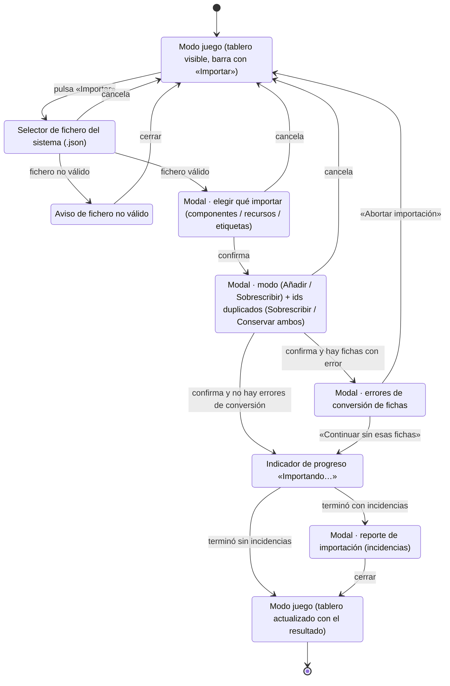

# Navegación — Importar un juego desde el modo juego (00238)

Caso de uso: la persona está en el **modo juego** y usa el nuevo botón «Importar» de la barra superior. Se representa la cadena de pantallas/modales que atraviesa y en qué estado acaba la navegación. Los puntos de cancelación/aborto devuelven siempre al modo juego sin cambios.

## Notas

- **Punto de entrada nuevo:** el botón «Importar» de la barra del modo juego (`#mode-switcher`). En el modo edición el punto de entrada sigue siendo el botón «Importar» de la barra de herramientas de edición.
- **Estado final:** al completar la importación desde el modo juego, la navegación **permanece en el modo juego** con el tablero repintado (componentes añadidos o juego sobrescrito según el modo). No hay transición a modo edición ni reencuadre («Ajustar zoom») automático.
- **Cancelar/abortar en cualquier modal** (selector de fichero, selección, confirmación, errores de conversión → «Abortar importación») devuelve al modo juego sin ninguna modificación del juego actual.
- El contenido interno de cada modal (qué casillas ofrece, validaciones) es el ya existente y no se altera; este diagrama solo cubre la navegación entre ellos y el modo en el que se queda la app.
- Diferencia única frente a «importar desde modo edición»: el punto de entrada y el modo final. Todo lo demás de la cadena de modales es idéntico.
