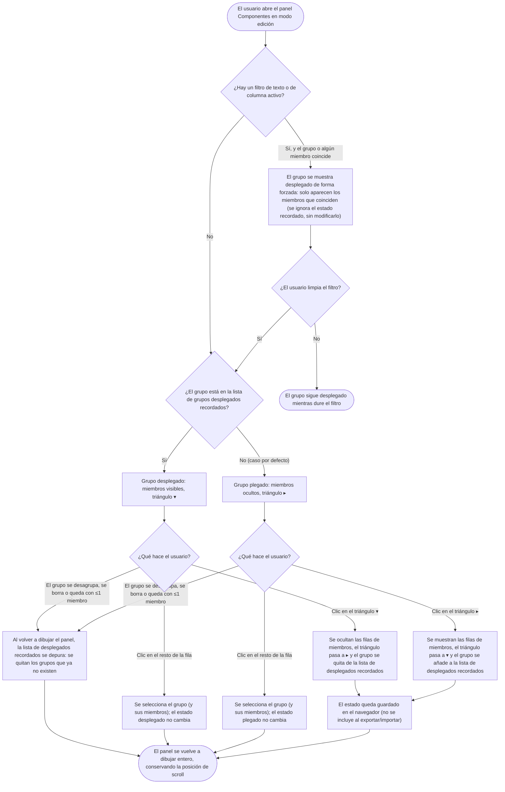

- **Name**: Grupos plegables/desplegables en el panel de componentes
- **Code**: 00239
- **Type**: change
- **Creation date**: 2026-09-03

## Full description

En el panel flotante «Componentes» del modo edición, los componentes que forman un grupo (2 o más miembros) se muestran hoy como una fila de grupo seguida, siempre, de las filas de sus miembros justo debajo, indentadas y con un fondo distinto. Esas filas de miembros no se pueden ocultar: el grupo está permanentemente «abierto».

Este cambio permite **plegar y desplegar cada grupo** de forma individual, para que el usuario pueda contraer los grupos que no está tocando y ver la lista más compacta.

### Comportamiento

- **Control de plegado**: en la fila de grupo aparece un triángulo al principio de la celda del identificador, delante del nombre del grupo:
  - `▸` cuando el grupo está **plegado** (sus miembros no se ven).
  - `▾` cuando el grupo está **desplegado** (sus miembros se ven debajo, como ahora).
  - Es el mismo símbolo que ya se usa para plegar/desplegar los paneles flotantes enteros, para mantener un lenguaje visual coherente, pero **algo más grande** que aquel, para que sea más fácil de pulsar y de leer como control de la fila.
- **Nombre del grupo en negrita**: el identificador del grupo en su fila se muestra en **negrita**, para distinguir de un vistazo la fila de grupo de las filas de componente suelto y de miembro.
- **Al hacer clic en el triángulo** se alterna entre plegado y desplegado: las filas de miembros aparecen o desaparecen y el triángulo cambia de estado. Hacer clic en el triángulo **no** selecciona el grupo.
- **Hacer clic en el resto de la fila de grupo** sigue seleccionando el grupo (y sus miembros) exactamente como hasta ahora. Seleccionar un grupo **no** cambia si está plegado o desplegado, y seleccionar un grupo plegado **no** lo despliega.

### Estado por defecto

Los grupos aparecen **plegados por defecto**. Cuando se forma un grupo nuevo, o cuando se abre el proyecto y no hay ningún estado guardado, los miembros de los grupos no se ven hasta que el usuario despliega cada grupo.

### Qué se recuerda

Se recuerda qué grupos ha desplegado el usuario explícitamente. Ese dato se guarda en el navegador junto con el resto de preferencias del panel «Componentes» (posición, tamaño, si el panel entero está plegado). Al volver a abrir el proyecto, los grupos que el usuario había desplegado aparecen desplegados; el resto, plegados.

Este dato es una preferencia local de visualización: **no** se incluye al exportar el juego a un fichero ni se aplica al importar uno, igual que las demás preferencias del panel.

Si un grupo deja de existir (se desagrupa, se borra, o se queda con un solo miembro), su rastro en la lista de grupos desplegados recordados se limpia automáticamente la próxima vez que se dibuja el panel, para que un identificador de grupo reutilizado más adelante no aparezca desplegado por sorpresa.

### Interacción con el filtro

El panel «Componentes» tiene un filtro de texto y filtros por columna. Cuando hay un filtro activo y un grupo coincide con él (por sí mismo o porque alguno de sus miembros coincide), ese grupo se muestra **desplegado de forma forzada**, enseñando solo los miembros que coinciden, aunque estuviera plegado. Esto es temporal y no cambia lo que se recuerda: al limpiar el filtro, el grupo vuelve a su estado recordado (plegado, salvo que el usuario lo hubiera desplegado antes).

### Alcance

- Afecta **solo al panel «Componentes»**. Los paneles «Recursos» y «Etiquetas» no tienen filas de grupo y no se tocan.
- El lienzo (la mesa con los componentes) no se ve afectado: plegar un grupo solo cambia el panel.
- El contador del título «Componentes (N)» no cambia al plegar o desplegar: sigue contando componentes reales, se vean sus filas o no.
- **No** se añade una acción de «plegar todos» / «desplegar todos»; el plegado es individual por grupo.

### Flujo

## Technical notes

- **Filas de grupo**: se derivan en tiempo de render a partir de `component.groupId` en `src/ui/componentList.js` (`buildGroupRows` / `computeDisplayedList`). No son una colección persistida. El identificador estable de un grupo es su `groupId`, que coincide con el `id` de la entrada correspondiente en la colección `componentGroups` de `core/state.js`.
- **Persistencia**: `panelState` en `src/core/state.js` es hoy `{ collapsed, position, width, height }`. Se persiste en `localStorage` mediante el autoguardado existente (evento `panelState:changed`, ver `previo-sdd/design/docs/architecture/007-persistence-build.md`) y **se excluye siempre** de export/import JSON. La lista de grupos desplegados sería un campo nuevo de `panelState` (semántica de «lista de `groupId` desplegados explícitamente»; ausencia = plegado, acorde con el estado por defecto plegado).
- **Poda de identificadores huérfanos**: al re-renderizar, cotejar la lista contra los grupos realmente existentes (2+ miembros) y descartar los `groupId` que ya no correspondan.
- **Iconografía**: los triángulos `▾` / `▸` ya se usan como texto en las cabeceras de los tres paneles flotantes (`componentList.js`, `resourceList.js`, `tagList.js`).
- **Render**: el panel se redibuja entero ante cualquier cambio (`renderList()` en `src/modes/edit/editMode.js`) y ya conserva `scrollTop` entre renders.
- **Wiring del panel**: `renderComponentList` se invoca desde `editMode.js` (~línea 790) pasando `collapsed`, `onToggleCollapse`, `onPanelResize`, `bodyHeight`, etc.; `getPanelState()` / `setPanelState(partial)` en `core/state.js` son el punto de lectura/escritura, y `setPanelState` hace merge parcial y emite `panelState:changed`.
- **Estilos afectados**: `previo-sdd/design/docs/style/002-componentes-layout.md`, sección «Nested row under a parent block (`.component-list__row--member`, 00204)» — describe el patrón de fila de miembro (fondo `--accent-blue-light`, indentación solo en la celda de id, sin línea conectora); habrá que añadir el triángulo de plegado en la celda de id de la fila de grupo respetando ese criterio.
- **Ajustes visuales de la fila de grupo (00239)**: el identificador del grupo va en negrita en su celda de id; el triángulo de plegado se pinta a un tamaño algo mayor que el `▾`/`▸` de la cabecera del panel (mantiene el estilo: carácter de texto, gris, sin fondo). Documentar en `002-componentes-layout.md` junto al patrón de fila anidada.
- No hay puntos de seguridad pendientes: cambio de UI puramente local en el navegador, sin backend, red ni datos sensibles.
