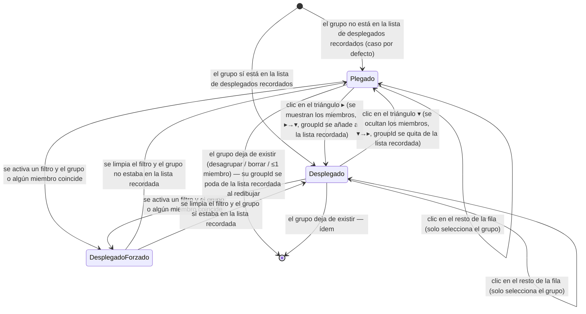

# Navegación — Plegar / desplegar un grupo en el panel «Componentes»

Caso de uso: cómo cambia el estado visual de la fila de un grupo y de sus miembros dentro del panel «Componentes» del modo edición, en respuesta a las acciones del usuario sobre el triángulo de plegado y al filtro activo.

No hay cambio de pantalla ni de modal: todo ocurre dentro del mismo panel. Los estados representados son estados visuales de la fila de grupo.

## Notas

- **Plegado**: la fila de grupo muestra `▸`; sus filas de miembros no se pintan. Es el estado inicial de cualquier grupo salvo que el usuario lo haya desplegado antes.
- **Desplegado**: la fila de grupo muestra `▾`; debajo se pintan las filas de miembros indentadas (sin cambios respecto al comportamiento actual).
- **DesplegadoForzado**: mientras hay un filtro activo con coincidencia, el grupo se ve desplegado enseñando solo los miembros que coinciden, independientemente de su estado recordado. Este estado **no** modifica la lista de grupos desplegados recordados; al limpiar el filtro se vuelve al estado que dictara esa lista.
- El clic sobre el triángulo lleva `stopPropagation`: alterna plegado/desplegado y **no** dispara la selección del grupo. El clic en cualquier otra parte de la fila mantiene el comportamiento actual (seleccionar el grupo y sus miembros) y no altera el plegado.
- Cualquier transición provoca un redibujado completo del panel, que conserva la posición de scroll. En ese redibujado también se depura la lista de grupos desplegados recordados, quitando los `groupId` que ya no correspondan a ningún grupo existente (2+ miembros).
- La lista de grupos desplegados recordados se guarda en el navegador junto con las demás preferencias del panel «Componentes»; no se incluye al exportar ni se aplica al importar.
