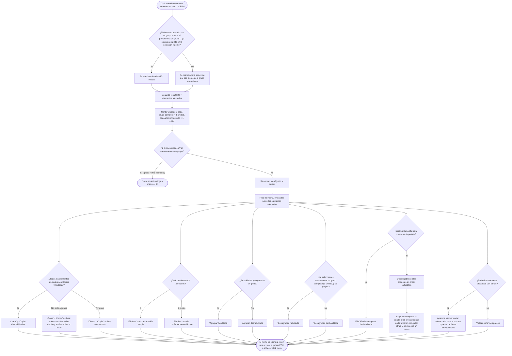

- **Name**: Batería de tests funcionales para la funcionalidad 027
- **Code**: 00242
- **Type**: change
- **Creation date**: 2026-09-06

## Full description

Se añade una batería de tests funcionales que cubra la funcionalidad 027 — "Menú
contextual de elemento en modo edición", que actualmente no tiene ningún test que
la valide. El objetivo es dejar comprobado, de forma automática, que el menú
contextual de modo edición se comporta como está descrito en su ficha funcional:
qué elementos quedan afectados al pulsar el botón derecho, cuándo se muestra o no
el menú, y qué ofrece y con qué condiciones cada una de sus filas.

Este cambio no modifica ninguna funcionalidad de la aplicación: solo añade
pruebas. Es una entrada hermana de la 00240 (batería de tests para la
funcionalidad 026), con la misma forma pero referida a otra funcionalidad.

### Comportamiento que se pone bajo prueba

Al pulsar el botón derecho sobre un elemento de la mesa en modo edición:

1. **Resolución de la selección.** Si el elemento pulsado —o, si pertenece a un
   grupo, el grupo entero— no estaba ya completo dentro de la selección vigente,
   el click derecho reemplaza la selección por ese elemento o grupo en solitario.
   Si ya formaba parte de una selección múltiple, esa selección se mantiene
   intacta. El conjunto resultante es el que llamamos "elementos afectados", y el
   menú actúa siempre sobre él.

2. **Decisión de si se muestra el menú.** Se cuentan "unidades": cada grupo
   completo cuenta como una unidad y cada elemento suelto cuenta como una unidad.
   Si hay dos o más unidades y al menos una es un grupo, no se muestra ningún
   menú. En cualquier otro caso el menú se abre junto al cursor.

3. **Contenido del menú y habilitación de cada fila** (siempre sobre los
   elementos afectados):
   - **"Clonar" y "Copiar"**: si todos los elementos afectados son Copias
     vinculadas, ambas filas aparecen deshabilitadas. Si solo algunos lo son, la
     acción omite esas Copias en silencio y se aplica al resto.
   - **"Eliminar"**: siempre disponible; con dos o más elementos afectados abre
     la ventana de confirmación en bloque en lugar de la confirmación simple.
   - **"Agrupar"**: habilitada solo si hay dos o más unidades y ninguna es un
     grupo.
   - **"Desagrupar"**: habilitada solo si la selección es exactamente un grupo
     completo (una única unidad, y es un grupo).
   - **"Añadir a etiqueta"**: desplegable con las etiquetas existentes en orden
     alfabético; si no hay ninguna etiqueta creada en la partida, la fila aparece
     deshabilitada. Elegir una etiqueta la añade a todos los elementos afectados
     que todavía no la tuvieran, sin quitarles ninguna otra etiqueta, y muestra
     un aviso breve de confirmación.
   - **"Voltear carta"**: aparece solo cuando todos los elementos afectados son
     cartas; al pulsarla, cada carta pasa a mostrar su cara opuesta de forma
     independiente de las demás.

4. **Cierre del menú**: al elegir cualquiera de sus acciones, al pulsar ESC o al
   hacer click fuera de él.

### Diagrama funcional del comportamiento bajo prueba

Notas al diagrama: una "unidad" es un grupo completo o un elemento suelto; el
caso "un grupo más otro elemento en la misma selección" es el único que no abre
menú en absoluto.

### Alcance acordado de la batería

Batería completa: 15 casos, cada uno con su código `FT-027-nn`.

| Código | Qué valida |
|---|---|
| FT-027-01 | Click derecho sobre un elemento no seleccionado: lo selecciona en solitario (reemplaza la selección anterior) y abre el menú. |
| FT-027-02 | Click derecho sobre un elemento que ya estaba en una selección múltiple: la selección se mantiene intacta. |
| FT-027-03 | Click derecho sobre un miembro de un grupo: selecciona el grupo entero. |
| FT-027-04 | "Clonar" sobre varios elementos: se clonan todos. |
| FT-027-05 | "Copiar" sobre varios elementos: se crean copias vinculadas de todos. |
| FT-027-06 | "Clonar"/"Copiar" con una Copia vinculada dentro de la selección: la omite y actúa sobre el resto. |
| FT-027-07 | "Clonar"/"Copiar" cuando todos los elementos afectados son Copias: ambas filas aparecen deshabilitadas. |
| FT-027-08 | "Eliminar" sobre dos o más elementos: abre la confirmación en bloque. |
| FT-027-09 | "Agrupar" habilitada solo con dos o más unidades sin ningún grupo; deshabilitada con una sola unidad. |
| FT-027-10 | "Desagrupar" habilitada solo con un único grupo completo como selección. |
| FT-027-11 | Selección que mezcla un grupo con otro elemento: no se muestra ningún menú. |
| FT-027-12 | "Añadir a etiqueta": añade la etiqueta a todos los afectados que no la tuvieran, sin quitarles ninguna otra. |
| FT-027-13 | "Añadir a etiqueta" sin ninguna etiqueta creada: la fila aparece deshabilitada. |
| FT-027-14 | "Voltear carta" aparece solo si todos los afectados son cartas y voltea cada una a su cara opuesta de forma independiente. |
| FT-027-15 | El menú se cierra al elegir una acción, al pulsar ESC y al hacer click fuera. |

## Technical notes

- El menú contextual de modo edición se implementa en
  `modes/edit/editMode.js#handleComponentContextMenu` (función interna, no
  exportada), conectada como `onContextMenu` en la llamada a
  `renderComponentsOnTable`. Usa `ui/contextMenu.js#openContextMenu`. Al no estar
  exportada, la batería la ejercita disparando el evento `contextmenu` real sobre
  el nodo del componente renderizado en la mesa (el listener lo añade
  `renderComponentsOnTable` sobre el nodo exterior de cada tipo con
  `preventDefault` + `stopPropagation`): `node.dispatchEvent(new MouseEvent('contextmenu', { bubbles: true, clientX, clientY }))`.
- A diferencia del menú de modo juego (`modes/play/playMode.js`), este no se
  gatea por `accionClickDerecho` ni por `bloqueado`.
- Lógica de selección: `getSelectionUnit(component)` devuelve el grupo entero si
  el componente tiene `groupId`, o solo su id. Si la unidad no está ya
  completamente en `selectedComponentIds`, se reemplaza la selección por esa
  unidad y `primarySelectedIds = new Set([component.id])`; si ya lo está, se
  mantiene. `affectedComponents` = componentes cuyos ids están en
  `selectedComponentIds` tras esa resolución.
- Decisión de mostrar menú: `unitCount` = nº de `groupId` distintos en la
  selección + nº de componentes sueltos; `hasGroup` = hay algún `groupId`. Si
  `unitCount >= 2 && hasGroup` → `return` sin abrir menú.
  `canGroup = unitCount >= 2 && !hasGroup`; `canUngroup = unitCount === 1 && hasGroup`.
- Filas (`generalItems`): "Ocultar/Mostrar" (fuera del alcance de esta ficha —
  proviene de 016/034), "Clonar" y "Copiar" (`disabled` si
  `cloneables.length === 0`, con `cloneables = affectedComponents.filter(c => !c.copyOf)`;
  en selección mixta omiten en silencio las que tienen `copyOf`), "Eliminar"
  (`attemptDeleteComponents`, mismo camino que SUPR: `ui/bulkDeleteConfirmModal.js`
  si 2+), "Agrupar" (`disabled: !canGroup`, envuelto en `runWithProgressModal`),
  "Desagrupar" (`disabled: !canUngroup`, `runWithProgressModal`).
- Filas (`specificItems`): "Voltear carta" solo si
  `allCartas = affectedComponents.length > 0 && affectedComponents.every(c => c.type === 'carta')`;
  voltea cada carta con `properties.caraActual` `'frontal' <-> 'trasera'` de forma
  independiente. Fila "Añadir a etiqueta": `select` con
  `sortByName(getTags())`; `onChange` añade el `tagId` a `etiquetaIds` de cada
  afectado que no lo tuviera (sin tocar el resto) y `showToast(t('toast.tagAdded'))`;
  si `getTags()` está vacío el `<select>` sale `disabled` (por `options.length === 0`).
- DOM del menú (`ui/contextMenu.js`): `div.context-menu` añadido a
  `document.body` con `position: fixed`. Filas de acción: `div.context-menu__item`
  (+ `--disabled` y sin listener de click si `disabled`). Filas con select:
  `div.context-menu__select-row` con un `<select>` (`select.disabled` si
  `disabled` o sin opciones). Cierra con: click en una fila, `mousedown` fuera del
  menú, tecla `Escape`. Singleton (`closeCurrentMenu` antes de abrir otro).
- Framework de tests (`design/docs/architecture/011-functional-test-framework.md`):
  motor propio en `src/test/harness.js` (`describe`/`it`/`expect`/`beforeEach`/
  `registerFeature`). `src/test/helpers.js`: `resetState()`, `mountEditMode()` →
  devuelve `#content`, `loadFixture(nombre)`, `mockRandom(seq)`. Un fichero por
  funcionalidad en `src/test/functional/*.test.js`. Convención de código de caso:
  `FT-<NNN>-<nn>` como prefijo del nombre del `it`. `src/test/TRACEABILITY.md` se
  regenera solo en cada `npm test` — la 027 pasará de "sin ningún test" a la tabla
  de cobertura, sin edición manual.
- Plan de implementación previsto (a confirmar en `pv-how`):
  - Fichero nuevo `src/test/functional/edit-context-menu.test.js` con
    `registerFeature({ primary: 27, secondary: [34] })` (34 = agrupación,
    ejercitada de forma incidental por los casos de Agrupar/Desagrupar y por el
    caso de mezcla grupo + elemento).
  - Nivel interfaz para casi todos los casos: `mountEditMode()` + `dispatchEvent`
    de `contextmenu` + aserción sobre el DOM `.context-menu` y sobre
    `getComponents()`.
  - Helper local en el propio fichero (`rightClick(node)`); no se toca
    `helpers.js`.
  - Sin fixtures nuevos: los componentes se construyen con
    `createDefaultComponent(tipo)` + `addComponent`, como en
    `synced-copies.test.js`.
  - Los casos de Agrupar/Desagrupar (FT-027-09/10) comprueban sobre todo la
    habilitación de las filas (`--disabled`); si `runWithProgressModal` interfiere
    en headless, la ejecución real de agrupar se deja para el test de la ficha
    034.
  - Toast: se comprueba el efecto en estado (`etiquetaId` añadido), no el nodo del
    toast.
- i18n (`src/data/i18n.es.js` / `i18n.en.js`): `'menu.flipCard'` ("Voltear
  carta"), `'contextMenu.clone'`, `'contextMenu.copy'`, `'contextMenu.delete'`,
  `'contextMenu.group'`, `'contextMenu.ungroup'`, `'contextMenu.addToTag'`,
  `'toast.tagAdded'`.
- No se ha detectado ninguna inconsistencia entre la documentación técnica y el
  código. No hay ningún punto de seguridad aplicable: el añadido es dev-only bajo
  `src/test/`, nunca entra en el deliverable (`build.py` solo camina imports desde
  `src/main.js`), y no toca red, persistencia, secretos ni datos sensibles.
