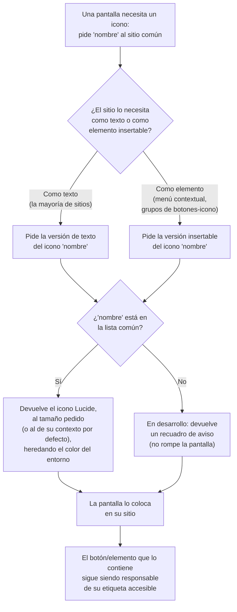

- **Name**: Sistema de iconos
- **Code**: 00244
- **Type**: change
- **Creation date**: 2026-09-06

## Full description

### Qué se pide

Hoy los iconos de la aplicación son dibujos vectoriales hechos a mano, escritos uno por uno dentro de una decena larga de archivos de interfaz que no tienen nada que ver con "iconos" (la barra de herramientas, el editor de título, los paneles flotantes de componentes/recursos/etiquetas, los menús de columna, los modales de forma y de texto de carta, el modal de recurso, el modal de tipo de componente, el editor visual, el menú contextual, y los distintivos de "bloqueado"/"oculto" sobre las piezas de la mesa). En total hay alrededor de 30 iconos.

Esto genera varios problemas de coherencia y de mantenimiento:

- **Dispersión**: para tocar un icono hay que encontrar el fragmento correcto dentro de un archivo de otra cosa.
- **Tamaños inconsistentes**: conviven iconos pensados a un tamaño (barra de herramientas y selección de tipo de componente) y a otros dos tamaños distintos (menús y columnas por un lado, controles de zoom por otro), sin ningún criterio escrito.
- **Estilo desigual**: unos son de línea, otros de relleno, con grosores de trazo que no siempre coinciden; y unos pocos con formas propias más recargadas que otros.
- **Sin vocabulario común**: no existe una lista de nombres ("el icono de eliminar", "el icono de bloquear") compartida entre archivos, así que nada garantiza que dos sitios que hacen lo mismo usen el mismo icono.

Se pide **adoptar una única familia de iconos** (la librería **Lucide**, de estilo lineal muy homogéneo y libre de uso) y **centralizar todos los iconos de la aplicación en un único sitio**. A partir de ese cambio, ningún otro archivo vuelve a dibujar iconos por su cuenta: todos los piden a ese sitio común por su nombre.

### Por qué Lucide

Frente a otras familias libres equivalentes, Lucide destaca por tener un único estilo base (todos los iconos "pegan" entre sí sin esfuerzo), por heredar de forma natural el color del texto donde se colocan, y por permitir ajustar el grosor del trazo. No requiere ninguna instalación ni descarga en tiempo de uso: se incorpora copiando el dibujo de cada icono concreto que la aplicación necesita.

### Cómo debe comportarse el resultado

- **Lo único que cambia es el dibujo de cada icono.** No se mueve ni se reordena ningún icono, botón, barra, menú ni panel; no cambia la disposición de ninguna pantalla; no aparece ni desaparece ningún elemento; no cambia ningún texto, ninguna etiqueta ni ninguna interacción; no hay pantallas de carga ni de error asociadas. Cada icono se queda **exactamente en la misma posición, en el mismo orden y al mismo tamaño** que hoy. En concreto:
  - La barra de herramientas conserva sus mismos botones en el mismo orden. "Importar" y "Exportar" siguen llevando su texto; el desplegable de "Exportar" sigue saliendo del propio botón "Exportar" (con su flechita pegada al icono, dentro del mismo botón), tal cual funciona ahora. "Ajustar zoom" y "Configuración" siguen siendo botones cuadrados icono-solo.
  - Los menús contextuales conservan sus filas en el mismo orden y con el mismo texto.
  - Los grupos de botones de alineación/estilo de las carta conservan su orden y su comportamiento (opción única o interruptores combinables, según el grupo).
  - Los distintivos de "bloqueado"/"oculto" siguen en la misma esquina de la pieza.
- **El color se sigue heredando** del elemento donde está el icono (sobre fondo oscuro sale claro, junto a un texto sale del color de ese texto).
- El único cambio que el usuario podría llegar a percibir es una ligera diferencia de **trazo o forma** en algún icono concreto, por pasar de un dibujo a mano a la versión de Lucide.
- **Un tamaño de referencia común.** Todos los iconos se definen sobre el mismo lienzo de referencia. Lo que cambia de un sitio a otro es a qué tamaño se muestran, y para eso hay tres tamaños con nombre: uno para la barra de herramientas y los botones grandes, otro (más pequeño) para los menús contextuales, las columnas de tabla y los botones de alineación/estilo dentro de modales, y un tercero para los controles de zoom. Cada contexto conserva el tamaño visible que tiene hoy; lo que se unifica es el punto de partida, no el resultado final.
- **Un color único de criterio.** Todos heredan el color de su entorno; ninguno lleva un color fijo escrito dentro.
- **Un grosor de trazo único.** Se arranca con el grosor estándar de Lucide (el mismo que usa hoy la mayoría de los iconos del proyecto). Queda como algo ajustable por si, una vez visto en pantalla, se prefiere un trazo algo más fino.
- **Un aviso claro si se pide un icono que no existe.** Si algún sitio pide por error un nombre que no está en la lista común, durante el desarrollo se muestra un recuadro de aviso en su lugar, en vez de romper la pantalla.

### Accesibilidad (criterio que ya existe y se mantiene)

Un icono que es lo único que contiene un botón necesita que ese botón tenga una etiqueta accesible (un texto alternativo o de ayuda); un icono meramente decorativo que acompaña a un texto se marca como decorativo para que las ayudas técnicas lo ignoren. Este cambio no introduce ese criterio ni lo modifica: el sitio común entrega solo el dibujo del icono, y cada pantalla sigue siendo responsable de su etiqueta, igual que hoy.

### Inventario de iconos

La lista completa de iconos de la aplicación, con su nombre común, dónde se usa cada uno, el icono de Lucide que le corresponde y a qué tamaño se muestra, está en el documento de datos adjunto ([design_data_inventario-iconos.md](design_data_inventario-iconos.md)). Esa lista es parte de la definición de este cambio: es "qué iconos tiene la aplicación y qué significa cada uno".

Puntos del inventario que se cerraron durante el análisis:

- **Icono de "importar"**: se mantiene el gesto actual de "subir/entrante" (equivalente Lucide `upload`), no se cambia a "abrir carpeta".
- **Icono de "exportar"**: un único botón (equivalente Lucide `download`) que, al pulsarlo, despliega sus opciones de exportación, exactamente como se comporta hoy. No hay un segundo icono de "flecha hacia abajo" para el desplegable.
- **Icono de "modo juego"**: se mantiene el gesto actual de "salir hacia el juego" (equivalente `log-out`), no se cambia a "reproducir".
- **Icono del tipo "texto"**: se mantiene el gesto actual de "líneas de texto" (equivalente `align-left`), no se cambia a "una T".
- **Icono del tipo "tablero personalizado"**: se usa un icono de panel/rejilla con matiz de edición (equivalente `layout-dashboard`).
- **Icono de "cuadrado redondeado"** (formas de carta): Lucide no tiene uno exacto; se parte del cuadrado de Lucide con las esquinas redondeadas, dibujado con el mismo estilo que el resto.
- **Iconos de menú contextual**: se auditaron todos los que existen hoy de verdad y se listan en el inventario. Los que el plan de partida daba como "esperados" pero que hoy no existen como opción de menú ("tirar dado", "subir/bajar capa", "sacar de mazo") quedan fuera del inventario; si en el futuro se añaden esas opciones, se añadirán entonces sus iconos.

### Fuera del alcance

- **No cambia la disposición, el orden ni la posición de nada.** No se reorganiza ninguna barra, menú, panel ni modal; no se mueve, añade ni quita ningún botón o control; no se reescala ningún icono respecto a su tamaño actual. Si al planificar o implementar apareciera la tentación de "de paso" recolocar o unificar algo visualmente, queda **fuera de este cambio** y necesitaría su propia entrada.
- No cambia ningún texto, etiqueta, tooltip ni microcopy.
- No se decide aquí el detalle interno de cómo se guardan o se sirven los iconos en el código: eso lo resuelve la fase técnica a partir de este inventario.
- No entra el icono de ayuda ("?") de la aplicación, que es texto y no un dibujo vectorial.
- No cambia el comportamiento de ninguna función, ni cómo se guardan los datos, ni el proceso de generación del entregable.

### Dudas de alcance planteadas y su respuesta

- **¿Se unifica el tamaño visible de los iconos o solo el criterio interno?** → Solo el criterio (lienzo de referencia y familia). El tamaño visible de cada contexto se mantiene como está hoy, para no arriesgar cambios visuales en la barra de herramientas.
- **¿El inventario y la asignación a Lucide se cierran en esta fase o en la técnica?** → Se cierra en esta fase la lista de nombres, su significado y su icono Lucide asignado. La fase técnica solo extrae el dibujo exacto de cada uno y decide la forma del sitio común.
- **¿Se cambia el grosor de trazo a uno más fino?** → Se arranca con el estándar. Se deja preparado para ajustarlo tras verlo renderizado; la propuesta visual adjunta incluye una comparación de ambos grosores para poder decidir.
- **¿Hay algún cambio hermano (otras áreas del sistema de diseño) con el que enlazar?** → Pendiente de confirmar por el usuario. Este es el "Área 3" de un trabajo de sistema de diseño más amplio; no se ha encontrado una entrada en curso directamente relacionada.

## Technical notes

- **Alcance para `pv-how`/`pv-do`**: la sustitución es **1 a 1 en el sitio**. Cada `create*Icon()` / constante `ICON_*` / literal SVG se reemplaza por la llamada equivalente al módulo (`iconSvg(name)` / `iconEl(name)`) **sin tocar el `append`/`innerHTML` que lo coloca, ni el orden de construcción del DOM, ni las clases contenedoras, ni los `title`/`aria-label`, ni el markup de texto adyacente** (p. ej. el `` de texto de `iconTextButton`, o el `insertAdjacentHTML('beforeend', ICON_EXPORT_CHEVRON)` que mete la flecha dentro del botón "Exportar"). No se reordena `renderModeSwitcher`/`renderEditToolbar` ni ningún `generalItems`/`specificItems`. Si aparece la tentación de recolocar o unificar disposición "de paso", queda fuera de 00244.
- **El `chevron` de "Exportar" ya existe hoy** (`ICON_EXPORT_CHEVRON`, insertado dentro del propio botón "Exportar" con `insertAdjacentHTML('beforeend', ...)`). Se mantiene: es un icono más del inventario (`chevron-down`), no se elimina ni se convierte en botón aparte.
- **Archivos con SVG inline hoy (11)**: `src/ui/editModeToggle.js` (constantes `ICON_*` de barra + helper `iconTextButton`), `src/ui/appTitle.js` (lápiz), `src/ui/componentList.js` / `src/ui/resourceList.js` / `src/ui/tagList.js` (aspa de limpiar filtro), `src/ui/tableColumnMenu.js` (embudo, `viewBox 0 0 16 16`), `src/ui/cardTextBoxModal.js` (9 SVG: alineación H/V + negrita/cursiva/subrayado), `src/ui/cardShapeModal.js` (3 SVG: círculo/cuadrado/cuadrado redondeado, `18×18`), `src/ui/componentTypeModal.js` (7 SVG por tipo, propiedad `icon` de `COMPONENT_TYPES`), `src/ui/resourceModal.js` (zoom +/− y reset), `src/ui/componentRenderer.js` (badges candado y ojo-tachado — `createLockBadge`/`createHiddenBadge`).
- **Helpers `create*Icon()` a retirar**: `src/modes/edit/editMode.js` (`createCloneIcon`/`createCopyIcon`/`createRemoveIcon`/`createHiddenIcon`/`createGroupIcon`/`createUngroupIcon`/`createFlipIcon`), `src/modes/play/playMode.js` (`createLockIcon`/`createShuffleIcon`/`createEyeIcon`/`createInsertIcon`), `src/ui/visualEditorModal.js` (`createDeleteIcon`/`createBringToFrontIcon`/`createSendToBackIcon`/`createRotateIcon`/`createCopyIcon`/`createPasteIcon`/`createMaximizeIcon`/`createRestoreIcon`).
- **El plan base `.claude/plans/area-3-sistema-iconos.md` no listaba `componentRenderer.js` ni `visualEditorModal.js`** entre los afectados. Sí lo están.
- **El plan base daba "colores hardcodeados `fill="#xyz"`" como problema**; en el código de UI actual no se han encontrado — ya usan `currentColor` de forma bastante consistente. Única variante: los puntos del dado en `componentTypeModal.js` usan `fill="currentColor" stroke="none"` (sigue siendo `currentColor`).
- **Dos patrones de inyección a cubrir**:
  1. `document.createElementNS(...)` + `svg.innerHTML = ...` → devuelve un **nodo `SVGElement`**. Lo usan los menús contextuales y los grupos de botones-icono (`.align-group`).
  2. `elemento.innerHTML = "<svg…>"` → **string**. Lo usa la barra de herramientas, los tipos, los filtros, el zoom, las formas, la alineación de texto, el lápiz de título y los badges.
- **`src/ui/contextMenu.js` NO acepta un string SVG**: `addRow({ icon, ... })` hace `iconWrap.appendChild(icon)`, es decir exige un nodo DOM. Por eso el módulo debe ofrecer una función que devuelva string y otra que devuelva nodo (la de nodo puede ser la de string + parseo).
- **Llamadores reales de `openContextMenu`**: `src/modes/edit/editMode.js`, `src/modes/play/playMode.js`, `src/ui/visualEditorModal.js`. No hay más (los `src/_output/versions/*.html` son artefactos de build, se ignoran).
- **Tamaños actuales**: barra de herramientas y tipos de componente con `viewBox="0 0 24 24"`; modales de carta (`cardShapeModal`, `cardTextBoxModal`) con `18×18`; `tableColumnMenu` con `16×16`. Grosor `stroke-width` casi siempre `2`.
- **Contrato propuesto del módulo `src/ui/icons.js`** (a confirmar en `pv-how`):
  - `iconSvg(name, { size, strokeWidth } = {})` → string SVG.
  - `iconEl(name, opts)` → `SVGElement`.
  - `ICON_SIZE` con `toolbar: 20`, `menu: 16`, `zoom: 18` (valores en px; el `viewBox` sigue siendo `0 0 24 24`).
  - Nombre inexistente → placeholder de aviso en desarrollo.
- **La clase CSS `.icon-frame`** no tiene regla base en `src/styles/main.css`; el tamaño lo pone cada contexto. Documentada en `previo-sdd/design/docs/style/003-modales-menus.md`.
- **Build**: `src/scripts/build.py` recorre el grafo de `import` ES desde `src/main.js`; `src/ui/icons.js` como módulo ES normal se resuelve automáticamente, **sin cambios en el build**. Los SVG serían literales JS embebidos en el bundle — sin assets externos, sin CDN, sin npm (cumple `previo-sdd/design/docs/architecture/008-code-conventions.md`: una librería solo se incorpora si su bundle se puede embeber entero).
- **Seguridad**: sin puntos pendientes. Dependencia (Lucide MIT, solo se copia el markup SVG, sin npm/CDN) y endurecimiento de cliente (SVG estáticos, sin interpolación de datos de usuario/juego, mismo patrón `innerHTML` de constantes ya presente) quedan cubiertos por la convención existente.
- **Documentación técnica a tocar en `pv-do`**: `previo-sdd/design/docs/architecture/006-ui-layer.md` (nuevo módulo `ui/icons.js`), `previo-sdd/design/docs/style/003-modales-menus.md` (criterio de iconografía: familia Lucide, `viewBox 24`, tamaños con nombre, `currentColor`, grosor), y posiblemente una entrada de features.
- **Diagrama funcional** de resolución `iconSvg`/`iconEl` (incluido el caso nombre inexistente → placeholder) en este `description.md`, sección siguiente.

### Propuestas visuales adjuntas

- [design_iconos-catalogo.html](design_iconos-catalogo.html) — hoja de contacto: los iconos Lucide en sus 8 contextos reales, con la comparación de grosor de trazo 2 vs 1.75.
- [design_app_modal-anadir-componente.html](design_app_modal-anadir-componente.html) — el modal real "Añadir componente" con los 7 iconos de tipo de Lucide.
- [design_app_editor-texto-carta.html](design_app_editor-texto-carta.html) — el sub-modal real "Cuadro de texto" de la carta, con los grupos de alineación y estilo en Lucide.
- [design_app_menu-contextual-en-mesa.html](design_app_menu-contextual-en-mesa.html) — el menú contextual de edición abierto sobre una pieza en la mesa, con los iconos de acción en Lucide.

## Diagrama funcional — resolución de un icono

