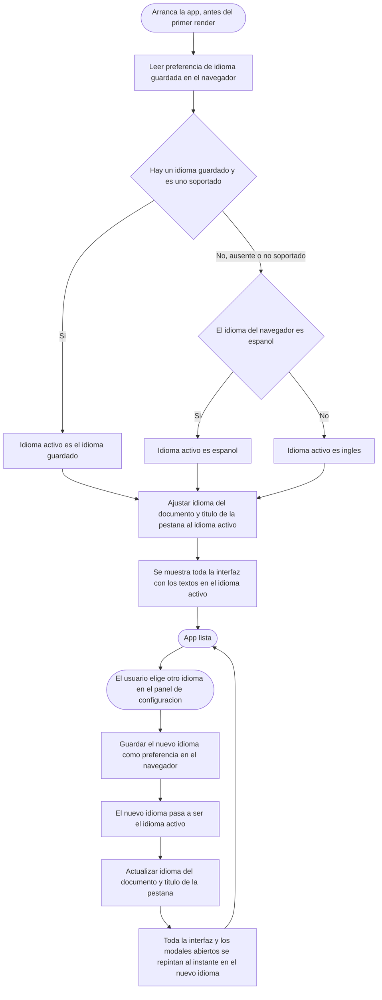
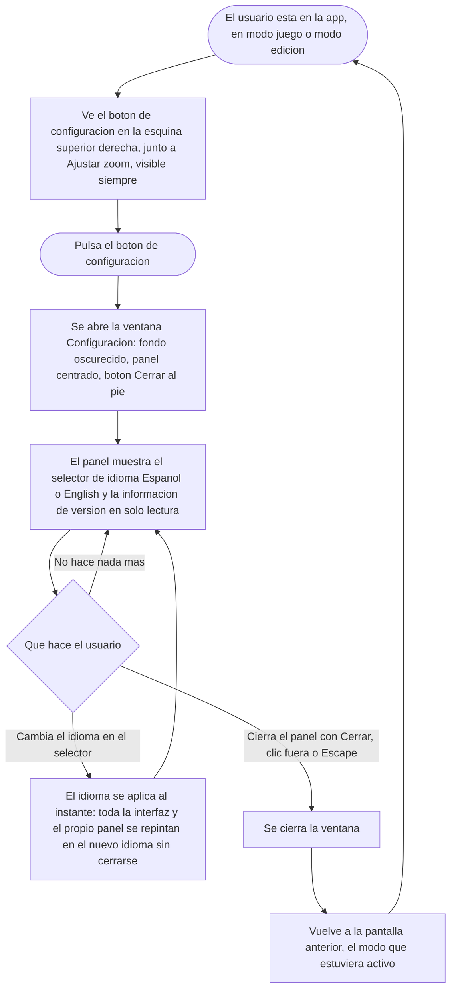

- **Name**: Aplicación multi-idioma (español e inglés), panel de configuración y reorganización de la barra de controles superior
- **Code**: 00244
- **Type**: change
- **Creation date**: 2026-09-03

## Full description

Esta entrada tiene dos partes que se implementan juntas: (1) convertir la aplicación en **multi-idioma** con un sistema de traducción desacoplado, y (2) una **reorganización de la barra de controles superior** (renombrado de botones, colocación y estilo), que incluye el nuevo **botón y panel de configuración** donde vive el selector de idioma.

### Parte 1 — Multi-idioma

La aplicación se convierte en multi-idioma. Hoy todos los textos que muestra la interfaz y que no ha escrito el usuario —etiquetas de botón, títulos y campos de las ventanas, menús contextuales, textos de ayuda, mensajes de aviso, textos de los iconos al pasar el ratón, textos de los campos vacíos, etiquetas de tipo de componente, textos "Próximamente", el enlace "Ver en Github", el título de la pestaña del navegador— están escritos directamente en español dentro de la aplicación. Se introduce un sistema de traducción que permite ofrecer la aplicación en varios idiomas. En esta primera versión: **español** (el idioma actual) e **inglés** (traducción nueva y completa de todos esos textos).

### Qué se traduce y qué no

**Se traduce** todo el texto de la aplicación en sí: el descrito arriba, más el título de la pestaña del navegador, el idioma declarado del documento, el enlace "Ver en Github" y los mensajes de aviso que pueden aparecer al arrancar. También el **nombre de los recursos de ejemplo** que la aplicación siembra al empezar una sesión totalmente nueva: se crean en el idioma activo en ese momento; a partir de ahí son datos del usuario y no cambian aunque después se cambie de idioma.

**No se traduce** nada que haya introducido el usuario: el título libre de la aplicación, los identificadores de los componentes, el contenido de los componentes de texto, los nombres de recursos y etiquetas ya creados, y los textos configurables de cada componente (incluido el que se muestra al pasar el ratón por encima). Tampoco se traduce el nombre "BG Factory" (es una marca) ni el número de versión.

### Idiomas y cómo se elige

- En esta versión hay dos idiomas: español e inglés. El sistema queda preparado para añadir más idiomas en el futuro solo aportando su lista de textos traducidos, sin necesidad de tocar nada más.
- **Idioma por defecto cuando el usuario todavía no ha elegido ninguno**: se detecta automáticamente a partir del idioma del navegador. Si el navegador está en español, la aplicación arranca en español; en cualquier otro caso, arranca en inglés. Si el usuario ya eligió un idioma en una visita anterior, se respeta esa elección por encima de la detección automática.
- **Dónde se elige**: se añade un **panel de configuración** nuevo. Un botón de configuración (icono de engranaje, sin texto, del mismo tamaño 36×36 que el botón "Ajustar zoom", pero **en blanco/negro** —contorno claro sobre el fondo oscuro de la cabecera, no azul como "Ajustar zoom"—) aparece **siempre visible** en la fila de controles de la cabecera, a la derecha de "Ajustar zoom", tanto en modo juego como en modo edición. Al pulsarlo se abre una ventana de "Configuración" con el mismo aspecto que el resto de ventanas de la aplicación (fondo oscurecido, panel centrado, botón "Cerrar" al pie; se cierra con "Cerrar", pulsando fuera del panel o con la tecla Escape). Esa ventana contiene, de momento, dos cosas: un **selector de idioma** (con las opciones "Español" y "English", cada una escrita en su propio idioma) y la **información de la versión actual** (solo lectura).
- Está previsto que el contenido del changelog del cambio 00231 (que hoy plantea su propio botón y ventana en esa misma esquina) se integre más adelante como una sección más dentro de esta ventana de configuración. Eso obligará a replantear el cambio 00231, pero no forma parte del alcance de este cambio: aquí solo se deja dicho.
- **Al cambiar de idioma**, el cambio se aplica al instante, sin recargar la página: se actualiza toda la interfaz y también las ventanas que estuvieran abiertas en ese momento —incluida la propia ventana de configuración, que se queda abierta y pasa a mostrarse en el nuevo idioma.

### Dónde se guarda el idioma elegido

- La elección de idioma se guarda en el navegador, en un sitio **separado del resto de la información de la partida**. El motivo: cuando cambia la versión de la aplicación, la partida guardada se descarta y se empieza de cero, pero la preferencia de idioma no debe perderse por eso.
- Se guarda una sola elección por navegador y perfil. No se sincroniza entre dispositivos ni navegadores.
- Si no hay ninguna elección guardada, o el valor guardado no corresponde a un idioma disponible, se vuelve a la detección automática. No hace falta ninguna conversión de datos antiguos: las partidas ya guardadas simplemente no tienen esa preferencia y arrancan por detección automática.
- El fichero que se genera al exportar una partida **no incluye** el idioma. Importar una partida no cambia el idioma de la aplicación.

### Comportamiento en situaciones límite

- **Cuando falta un texto traducido**: si un texto no está en el idioma activo, se usa el del español (que es la referencia y siempre está completo). Si tampoco estuviera ahí, se muestra el identificador interno de ese texto en vez de dejar un hueco. Nunca se rompe la interfaz por una traducción que falte. Esto implica que la lista de textos en inglés puede estar incompleta durante el desarrollo sin causar ningún fallo.
- **Textos con cantidades o con partes destacadas** (por ejemplo "N componentes", o un mensaje con un número en negrita): el sistema permite insertar el valor que varía dentro del texto y elegir la forma correcta según sea singular o plural. Los valores que varían (cantidades, identificadores, nombres) se insertan por separado; nunca se mezcla texto escrito por el usuario dentro de un texto traducible.
- **Orden alfabético y comparación de nombres**: hoy la aplicación ordena y compara algunos nombres (por ejemplo, la lista de recursos) usando reglas del español. Pasa a usar las reglas del **idioma activo**.
- El modo de la aplicación (juego o edición) y el idioma son independientes: el idioma se aplica igual en los dos modos.

### Principio rector: desacoplamiento total y riesgo cero al editar traducciones

Este es un requisito explícito del cambio, no un detalle de implementación:

- Las listas de textos de cada idioma son **datos puros**: pares "identificador → texto", sin ninguna lógica y sin depender de ninguna otra parte de la aplicación. Corregir o retocar una traducción consiste en cambiar una frase en un fichero de datos; hacerlo no puede romper ningún comportamiento de la aplicación.
- Toda la lógica del sistema (buscar el texto de un identificador, la cadena de respaldo cuando falta, la inserción de valores, el singular/plural, cuál es el idioma activo, avisar de que ha cambiado el idioma) queda concentrada en un único sitio. El resto de la aplicación solo pide "el texto del identificador X" y nunca necesita saber cómo están organizadas las listas de textos.
- Añadir un idioma nuevo consiste en aportar su lista de textos y añadirlo a la lista de idiomas disponibles. No obliga a cambiar la lógica ni ninguno de los elementos de la interfaz.

### Calidad de la traducción: sensible al contexto, no literal

- Cada texto se traduce según **dónde aparece y para qué sirve**, no palabra por palabra. Un mismo texto en español puede tener traducciones distintas si cumple funciones distintas en la interfaz.
- Se respeta el tono y la brevedad del original: etiquetas de botón cortas y directas, títulos concisos, mensajes claros. Sin alargar las frases.
- Se usa un **glosario fijo de términos de juegos de mesa**, aplicado de forma consistente en toda la aplicación: mazo → *deck*, carta → *card*, ficha → *token*, tablero → *board*, dado → *die* / *dice* (según sea singular o plural), etiqueta → *tag*, recurso → *resource*, componente → *component*, modo juego → *play mode*, modo edición → *edit mode*.
- Se siguen las convenciones habituales de interfaz en inglés, coherentes con el estilo actual del proyecto, y las formas naturales de plural y de cantidades ("1 component" / "2 components").
- Al traducir textos con valores variables o con formato, la posición del valor dentro de la frase se adapta al inglés, que no tiene por qué coincidir con el orden del español.
- Criterio de aceptación: la traducción al inglés se entrega completa y coherente con el glosario, y se puede revisar texto por texto sin ambigüedad.

### Parte 2 — Reorganización de la barra de controles superior

Junto con el sistema multi-idioma se reorganiza la barra de controles de la parte superior de la aplicación. Cambios respecto al estado actual:

- **Renombrado de los botones de modo**:
  - "Entrar en modo edición" pasa a llamarse **"Modo Edición"**.
  - "Salir del modo edición" pasa a llamarse **"Modo Juego"**.
  - (Su función no cambia: cada uno lleva al modo que nombra.)
- **"Modo Juego" sube a la cabecera**: hoy, en modo edición, el botón para volver al modo juego vive en la franja de herramientas de edición (la segunda franja oscura, bajo la cabecera). Pasa a estar en la **fila de controles de la cabecera**, en la misma posición que ocupa "Modo Edición" cuando se está en modo juego. Así, el botón de cambio de modo está siempre en el mismo sitio, se esté en el modo que se esté.
- **"Importar" con el mismo aspecto en los dos modos**: hoy "Importar" se ve distinto según el modo (en modo juego es un botón azul; en modo edición es blanco sobre fondo oscuro). Pasa a verse **igual en ambos modos: blanco sobre fondo oscuro** (el mismo estilo que ya tiene en modo edición). Lo mismo aplica a "Exportar".
- **Separador vertical nuevo**: en la fila de controles de la cabecera se añade un **separador vertical** entre el bloque de gestión de fichero (Importar / Exportar) y el bloque de botones azules (Modo Edición / Modo Juego, Ajustar zoom). Es un elemento visual nuevo —hoy no existe en esa fila— análogo a los separadores que ya se usan en la franja de herramientas de edición. Deja el bloque de fichero (blanco sobre oscuro) claramente diferenciado del bloque de acciones (azul).
- **Botón de configuración en blanco/negro**: el nuevo botón de configuración es icono-solo, con el mismo tamaño que "Ajustar zoom", pero **no azul**: se dibuja en blanco/negro (contorno claro sobre el fondo oscuro de la cabecera), para diferenciarlo visualmente de las acciones azules. Su icono es un engranaje de silueta rellena, claramente distinto del encuadre de "Ajustar zoom".

Disposición resultante de la fila de controles de la cabecera (de izquierda a derecha, tras el título):

| Modo | Contenido de la fila de la cabecera |
|---|---|
| Juego | Importar · Exportar · **│** (separador) · Modo Edición · Ajustar zoom · Configuración |
| Edición | Modo Juego · Ajustar zoom · Configuración |

En modo edición, la franja de herramientas de edición (segunda franja) mantiene "Importar" y "Exportar" (ahora ya sin "Modo Juego", que ha subido). Los detalles finos de si "Importar"/"Exportar" acaban solo en la cabecera, solo en la segunda franja o duplicados se cierran en la planificación técnica; lo que fija este cambio es: el botón de modo y el de configuración viven siempre en la cabecera, "Importar"/"Exportar" tienen el mismo aspecto en ambos modos, y hay un separador entre fichero y acciones azules.

### Flujo: resolución del idioma al arrancar y al cambiarlo

Aclaración transversal (aplica a cada texto, tanto en el primer dibujado como en cada repintado): para obtener un texto concreto se busca en el idioma activo; si falta, se busca en español (la referencia); si aún falta, se muestra el propio identificador del texto. Los valores variables (cantidades, nombres) se insertan en el texto, eligiendo la forma singular o plural según la cantidad.

### Flujo: abrir el panel de configuración y cambiar el idioma

Nota: queda previsto que el contenido del changelog (cambio 00231) se incorpore más adelante como una sección adicional dentro de esta misma ventana de configuración.

### Fuera del alcance de esta primera versión

- Idiomas distintos de español e inglés (el sistema los admite, pero no se entrega su lista de textos).
- Traducción del contenido que introduce el usuario.
- La integración efectiva del changelog (cambio 00231) dentro de la ventana de configuración: solo se deja previsto.
- Cualquier otro contenido del panel de configuración más allá del selector de idioma y la información de versión.
- Rediseño de la franja de herramientas de edición más allá de quitarle "Modo Juego" y unificar el aspecto de "Importar"/"Exportar".

## Technical notes

### Parte 2 — Barra de controles superior (estado actual del código)

- **Modo juego — `renderModeSwitcher` (`src/ui/editModeToggle.js`)** monta dentro de `#mode-switcher` (contenedor `position: fixed; top: 0.5rem; right: 1rem; z-index: 101`), en este orden: `createImportControls({ buttonClassName: 'mode-switcher__import-btn' })` (botón "Importar"), un `<button>` "Entrar en modo edición" (`setMode(MODES.EDIT)`), y `createFitButton('mode-switcher__fit-btn')` ("Ajustar zoom"). CSS: `#mode-switcher button { background: var(--accent-blue); color: var(--text-light); border: none }` — **todos azules**, incluido "Importar" y "Ajustar zoom".
- **Modo edición — `renderEditToolbar` (`src/ui/editModeToggle.js`)** monta un `
` (CSS: `width: 100%`, `background: var(--bg-toolbar)`, `justify-content: flex-end`, `z-index: 99`) con `.toolbar-group` separados por `.toolbar-divider`: [Importar] | [`createExportMenu()` "Exportar ▾"] | [`.edit-toolbar__exit-btn` "Salir del modo edición", `setMode(MODES.PLAY)`]. Botones de la barra: `border: 1px solid var(--text-light); background: none` (blanco sobre oscuro); excepto `.edit-toolbar__exit-btn` que es `background: var(--accent-blue)`. Después, **fuera** de `.edit-toolbar`, `renderEditToolbar` añade al `container` un `createFitButton('mode-switcher__fit-btn')`; CSS `#edit-toolbar > .mode-switcher__fit-btn { position: fixed; top: 0.5rem; right: 1rem; z-index: 101; background: var(--accent-blue) }` — queda por encima de la franja `.edit-toolbar` (`z-index` 99).
- **Cabecera**: `#app-title` es un `<h1>` (`src/index.html`, `src/ui/appTitle.js` → `renderAppTitle`) con `background: linear-gradient(...) var(--bg-toolbar)`, `height: 3.5rem`, `z-index: 100`. Hoy **no** contiene los controles de modo/importar; estos van en `#mode-switcher` / `#edit-toolbar`, contenedores `fixed` propios de `src/index.html`. La reorganización de la Parte 2 implica decidir en `pv-how` si los controles pasan a montarse dentro de `#app-title`/su fila, o si `#mode-switcher` se recoloca para quedar visualmente en la banda de la cabecera en ambos modos.
- **Textos y función a cambiar (Parte 2)**:
  - `renderModeSwitcher`: `button.textContent = 'Entrar en modo edición'` → **"Modo Edición"**.
  - `renderEditToolbar`: `exitButton` con innerHTML `... Salir del modo edición` → **"Modo Juego"**; y **mover** ese botón de `.edit-toolbar` (`sessionGroup`) a la fila de la cabecera, misma posición que el de "Modo Edición".
  - `createImportControls`: en modo juego hoy recibe `buttonClassName: 'mode-switcher__import-btn'` y hereda el azul de `#mode-switcher button`. Debe pasar a estilo blanco-sobre-oscuro **idéntico** al de `.edit-toolbar button` en ambos modos — vía clase compartida o quitando la herencia azul de `#mode-switcher button` para el botón de importar (y export si aplica).
  - **Separador nuevo**: no existe en la fila de la cabecera. Reutilizar el patrón `.toolbar-divider` ya presente en `.edit-toolbar` (`width: 1px; height: 1.5rem; background: rgba(255,255,255,0.2)`), o una variante BEM propia de la nueva fila. Se coloca entre el bloque Importar/Exportar y el bloque de botones azules. Ver `design_data_separador-barra-controles.md`.
  - **Botón de configuración**: nuevo `createFitButton`-análogo (`src/ui/editModeToggle.js` o módulo propio `src/ui/settingsButton.js`), icono-solo 36×36, **sin** la regla azul — estilo blanco/negro (contorno claro sobre oscuro). Abre el panel de configuración (`src/ui/settingsModal.js`, nuevo).
- **Estas dos partes comparten fichero**: `src/ui/editModeToggle.js` es el punto central tanto para la reorganización de botones (Parte 2) como para engancharse a `language:changed` y traducir sus propios textos (Parte 1). `pv-how` debería planificar ambas sobre ese fichero a la vez para no tocarlo dos veces.
- Convención de clases: BEM (`design/docs/style/004-naming-and-patterns.md`); botones nuevos que no cuelgan de un bloque existente usan el patrón `.btn-<intent>`; excepción histórica `.btn-cancel`/`.btn-accept`/`.btn-eliminar`. `#mode-switcher`/`#edit-toolbar` son IDs de contenedor de layout de `index.html`.
- Estilo/documentación afectada por la Parte 2: `design/docs/style/002-componentes-layout.md` (botones, layout) y `003-modales-menus.md` (patrón de modal para el panel de configuración) — a actualizar en el paso de documentación de `pv-do`.

### Parte 1 — Multi-idioma (estado actual del código)

- **Estado actual**: no existe ningún sistema de i18n, catálogo de strings ni fichero de constantes de texto. Todos los textos de UI son literales en español repartidos por `src/ui/*.js` (~55 módulos), `src/modes/edit/editMode.js`, `src/modes/play/playMode.js` y `src/main.js`. Vías de asignación: `element.textContent = ...`, `element.title = ...`, `input.placeholder = ...`, y `element.innerHTML = ` con plantillas (casi siempre SVG de iconos + texto estático + algún contador interpolado; p. ej. `src/ui/editModeToggle.js` ~línea 139 mete el texto "Exportar" dentro de una plantilla `innerHTML` junto al SVG — hay que separar SVG de texto).
- **Arquitectura por capas** (`design/docs/architecture/001-overview.md`): `core/` (no depende de nadie) → `ui/` (solo depende de `core`) → `modes/` (compone `ui` + `core`) → `main.js` (cablea todo). El módulo de i18n debe vivir en `core/` para que `ui/` y `modes/` puedan importarlo respetando la dirección de dependencias. Los catálogos por idioma encajan en `data/` (datos sin dependencias de capa, como `data/version.js`). Nuevos componentes de UI en `src/ui/`, camelCase, BEM (`design/docs/style/004-naming-and-patterns.md`).
- **Re-render dirigido por eventos**: `core/eventBus.js` (`emit`/`on`). `main.js` engancha `renderAll()` a `mode:changed`, `components:changed`, `resources:changed`, `tags:changed`, `groups:changed`, `appTitle:changed`. Un evento nuevo `language:changed` enganchado a `renderAll` sigue exactamente el patrón existente. Los modales se crean bajo demanda y se auto-desmontan; para el requisito de "todo al vuelo", cada modal abierto necesita reaccionar a `language:changed` re-renderizando su propio contenido — es el punto de más trabajo del cambio.
- **Persistencia** (`src/core/persistence.js`): `saveState`/`loadState` sobre `localStorage`, clave `bgfactory:state`, un slot por navegador/perfil. `parseState` descarta **todo** el guardado si `parsed.version !== CURRENT_VERSION` (hoy `'v00246'`), por eso el idioma va en una clave `localStorage` separada (p. ej. `bgfactory:lang`), nunca dentro del objeto de estado. El objeto serializado de `saveState` es fijo y no debe cambiar por este motivo.
- **Toasts de arranque** en `src/main.js` (~líneas 127 y 130): se emiten muy pronto; el idioma ya debe estar resuelto en ese punto (leer la preferencia de `localStorage` y resolver la autodetección antes del primer render y antes de esos toasts).
- **`index.html`**: `<html lang="es">` y `<title>BG Factory {VERSION}</title>`. El idioma del documento (`document.documentElement.lang`) y `document.title` pasan a fijarse por JS según el idioma activo, al arrancar y en cada cambio. El `{VERSION}` del título se conserva.
- **`src/main.js`** (~línea 43) construye el enlace `<a>Ver en Github</a>` — el texto es traducible; la URL `https://github.com/yeyopepe/bgfactory` no cambia. `#app-version` pinta `"BG Factory {CURRENT_VERSION}"` + ese enlace.
- **`src/core/appTitle.js`**: `DEFAULT_APP_TITLE = 'BG Factory'` (marca, no traducible), `formatVersion()` / `getFullAppTitle()` (sufijo de versión, no traducible).
- **`src/data/defaultResources.js`**: nombres de los recursos semilla — traducibles en el momento de `seedDefaultResources()` (`src/main.js`) según el idioma activo.
- **Comparación de textos fijada a `'es'` hoy**: `src/core/textSort.js` (2 usos de `localeCompare(..., 'es', { sensitivity: 'base' [, numeric: true] })`) y `src/core/resource.js` línea 42 (`findResourceByName` con `localeCompare(name, 'es', { sensitivity: 'base' })`). Pasan a usar el locale del idioma activo, expuesto por el módulo de i18n de `core/`.
- **Contenido de usuario ya separado en el modelo** y que no debe tocarse: `appTitle`, `component.id`, texto de los componentes de texto, nombres de recursos/etiquetas, `component.tooltipTexto` (con `resolveTextVariables` + `sanitizeHtml`/`sanitizeBasicTooltipHtml` en `src/ui/componentRenderer.js`).
- **Client hardening**: mantener el criterio actual — texto de chrome vía `textContent`, no `innerHTML`. Si alguna cadena traducible necesita ir por `innerHTML` (formato con `<strong>`), el catálogo contiene **solo** markup estático de confianza y los datos variables se interpolan aparte; nunca meter texto de usuario en una plantilla de traducción sin escapar. Ninguna clave de traducción debe concatenar entrada de usuario.
- **Build** (`src/scripts/build.py`): recorre el grafo `import`/`export` desde `src/main.js` y produce un HTML único autocontenido. Cualquier módulo nuevo (`core/i18n.js`, `data/i18n.es.js`, `data/i18n.en.js`) entra automáticamente si está en la cadena de imports desde `main.js`. Desarrollo con `src/index.html` + servidor estático local. No añadir librería de i18n externa (regla del proyecto: nada de CDN en runtime, todo incrustable; i18n propio mínimo).
- **Relación con el cambio 00231** (en `inProgress`): 00231 plantea un botón icono-solo en la esquina superior derecha (junto a `.mode-switcher__fit-btn` "Ajustar zoom", montado desde `src/ui/editModeToggle.js` — en modo juego dentro de `#mode-switcher`, en modo edición como elemento `fixed` independiente en `#edit-toolbar`) que abre una modal. Este cambio introduce en esa misma zona el botón de configuración y su modal. Al planificar, tener en cuenta la pregunta abierta 6 de 00231 (cómo conviven los botones icono-solo de esa esquina) — es probable que 00231 acabe siendo una sección de esta modal de configuración.
- **Nota menor no bloqueante** (no es inconsistencia de este análisis): el árbol de trabajo tiene entradas 00242/00243 y una carpeta `previo-sdd/versions/0.9.1/` sin consolidar; `CURRENT_VERSION = 'v00246'`. No afecta al diseño de este cambio.
- **Inconsistencias documentación vs. código**: ninguna detectada en el ámbito de este análisis.
