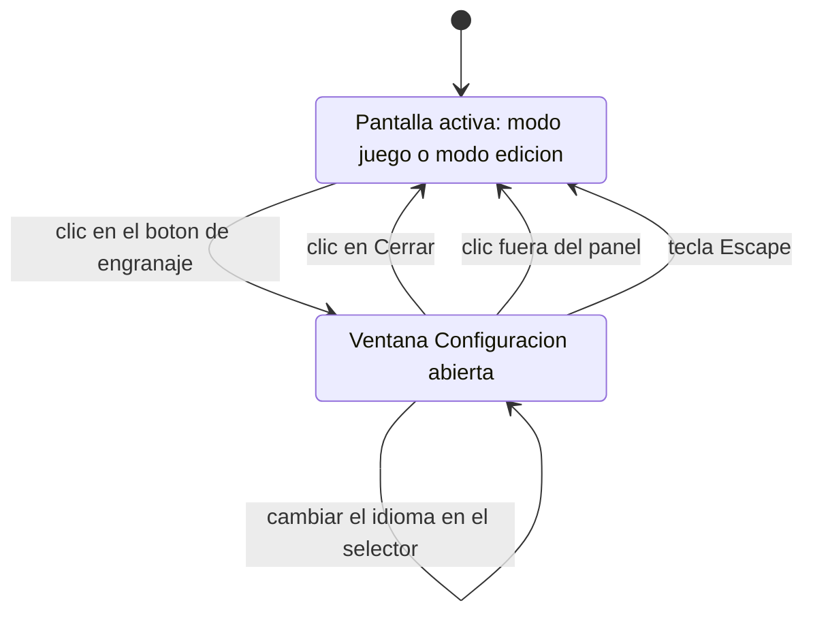

# Navegación — Abrir y cerrar el panel de configuración

Caso de uso: cómo se transita entre la pantalla activa de la aplicación y la ventana modal de configuración, mediante el nuevo botón de engranaje de la esquina superior derecha.

## Notas

- **Botón de engranaje**: está en la esquina superior derecha, **siempre visible**, tanto en modo juego como en modo edición. Abrir el panel no depende del modo y no cambia el modo.
- **Cerrar**: las tres formas de cierre — botón «Cerrar», clic sobre el fondo oscurecido y tecla Escape — son equivalentes, igual que en el resto de ventanas modales de la aplicación. Al cerrar, se vuelve exactamente a la pantalla desde la que se abrió (el modo que estuviera activo). El panel no altera el modo ni el estado de la partida.
- **Autotransición «cambiar el idioma en el selector»**: la ventana **no** se cierra; la interfaz y la propia ventana se repintan en el nuevo idioma. El detalle está en el otro fichero de navegación de esta entrada: `design_navigation_cambiar-idioma-en-el-panel.md`.
