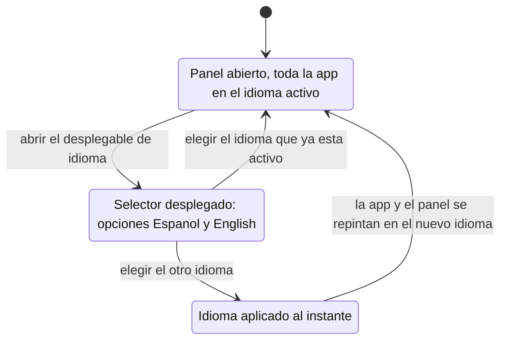

# Navegación — Cambiar el idioma desde el selector del panel

Caso de uso: qué ofrece el selector de idioma dentro del panel de configuración y qué transición visual provoca elegir una opción. Responde a "¿qué opciones ofrece esta interacción y qué efecto tienen?", distinto del caso de uso de abrir/cerrar el panel (fichero `design_navigation_abrir-cerrar-panel-configuracion.md`).

## Notas

- **Opciones del selector**: siempre ofrece **todos los idiomas disponibles** (en esta versión: «Español» y «English»), cada opción escrita en su propio idioma, independientemente de cuál sea el idioma activo.
- **Elegir el idioma que ya está activo**: no produce ningún cambio visible.
- **Elegir el otro idioma**: el cambio es inmediato y sin recargar. Se repinta todo el chrome de la aplicación y también la propia ventana de configuración (título, etiquetas, nota de ayuda, botón «Cerrar»), que **no se cierra**. El selector queda reflejando el nuevo idioma activo.
- La preferencia queda guardada en el navegador en el mismo momento del cambio; al reabrir la aplicación se arranca directamente en ese idioma.
- La información de versión del panel (p. ej. «BG Factory v.00246») no cambia con el idioma.
