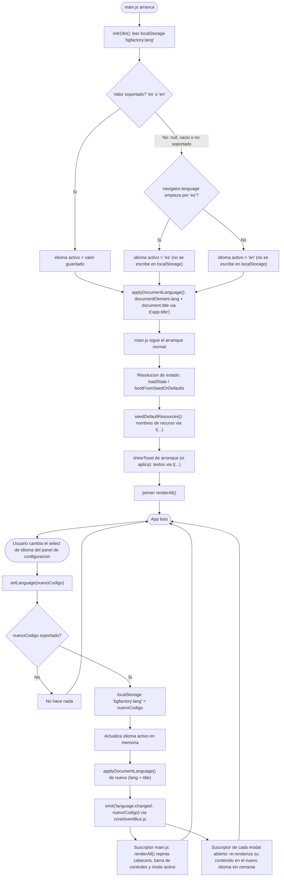
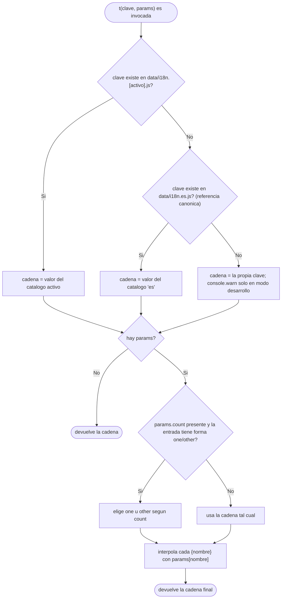

- **Creation date**: 2026-09-03
- **Risk**: 4/10 — Low risk — touches some shared surface or several spots, but doesn't touch contracts or data

## (a) Functional notes

**Out of scope:**
- Idiomas distintos de español e inglés: la arquitectura los admite (basta añadir un catálogo `data/i18n.<código>.js` y registrarlo en la lista de idiomas soportados), pero no se entrega ningún catálogo más.
- Traducción del contenido introducido por el usuario (`appTitle`, ids de componente, contenido de componentes de texto, nombres de recursos/etiquetas, `component.tooltipTexto` y demás textos configurables). No se tocan.
- Integración efectiva del changelog del cambio 00231 dentro del panel de configuración: solo se deja reservado un hueco visual; no se implementa nada de 00231 aquí.
- Rediseño de la franja de herramientas de edición (`.edit-toolbar`) más allá de: quitarle el botón de cambio de modo (que sube a la cabecera) y unificar el aspecto de "Importar"/"Exportar" con el de modo juego.
- Cualquier otro contenido del panel de configuración más allá del selector de idioma y la línea de versión en solo lectura.
- No se añade ninguna librería externa de i18n. No se toca `src/scripts/build.py` (los módulos nuevos entran solos por el grafo de imports desde `main.js`).

**Doubts resolved with the user:**
- *Idioma por defecto en sesión nueva sin preferencia guardada:* autodetección por `navigator.language` (empieza por `es` → español; cualquier otro caso → inglés).
- *Ubicación del selector de idioma:* panel de configuración nuevo, propio de este cambio (botón de engranaje siempre visible en la cabecera). El changelog de 00231 se integrará después como una sección más de ese panel.
- *Efecto al cambiar de idioma:* todo al vuelo, incluidos los modales abiertos.
- *Persistencia del idioma:* clave `localStorage` separada del estado del juego (`bgfactory:lang`).
- *`localeCompare`:* pasa a usar el locale del idioma activo (no se deja fijo en `'es'`).
- *Sistema de traducción totalmente desacoplado, riesgo cero al editar traducciones:* los catálogos son datos puros (pares clave→texto, sin lógica ni imports); editar una traducción no puede romper comportamiento. Toda la lógica vive en un único módulo.
- *Traducción sensible al contexto (no literal), con glosario de dominio fijo:* recogido en `design_data_glosario-de-traduccion.md`.
- *Línea de versión del panel:* muestra la versión actual sea cual sea su codificación (`vXXXXX` en builds de prueba, `x.y.z` en oficiales), reutilizando la función que ya la formatea hoy. Los "00240"/"00246" de los mockups son texto de ejemplo sin valor normativo.
- *Reorganización de la barra de controles (Parte 2):* se implementa junto con el multi-idioma en esta misma entrada (el usuario lo confirmó como "todo dentro del 00244").

### Diagrama — Resolución e inicialización del idioma, y repintado al cambiar

### Diagrama — Resolución de un texto concreto `t(clave, params)`

## (b) Technical solution

### Fase A — Núcleo del sistema i18n

- [x] **`src/core/i18n.js` (nuevo) — módulo de traducción, toda la lógica aislada aquí.** Exporta:
  - `SUPPORTED_LANGUAGES = ['es', 'en']` y `DEFAULT_LANGUAGE = 'es'` (referencia canónica).
  - `initI18n()`: se llama una sola vez desde `main.js` **antes del primer render y antes de los toasts de arranque**. Lee `localStorage.getItem('bgfactory:lang')`; si el valor está en `SUPPORTED_LANGUAGES`, ese es el idioma activo; si no (null, vacío, no soportado, o `localStorage` lanza), resuelve por autodetección: `String(navigator.language || '').toLowerCase().startsWith('es') ? 'es' : 'en'` — **sin** escribir en `localStorage` en este caso. Termina llamando a `applyDocumentLanguage()`.
  - `getLanguage()` → código del idioma activo.
  - `getLocale()` → el código del idioma activo, usado como `locale` de `localeCompare` (hoy `'es'`/`'en'` valen tal cual como BCP 47).
  - `setLanguage(code)`: si `!SUPPORTED_LANGUAGES.includes(code)` no hace nada; si es igual al activo tampoco. Si no: `localStorage.setItem('bgfactory:lang', code)` (envuelto en `try/catch`, igual que `saveState`), actualiza el idioma activo en memoria, llama `applyDocumentLanguage()` y `emit('language:changed', code)` (import de `./eventBus.js`).
  - `t(key, params)`: resuelve la cadena por la cadena de respaldo `catálogo[activo][key]` → `catálogo['es'][key]` → `key` (con `console.warn` **solo** si un flag de desarrollo está activo — ver más abajo). Después, si hay `params`: si `params.count` está presente y la entrada es un objeto `{ one, other }`, elige `one` cuando `count === 1`, `other` en otro caso; sustituye cada `{nombre}` de la cadena por `String(params[nombre])`. La interpolación es de texto plano (sin HTML): el resultado se asigna siempre por `textContent`.
  - `applyDocumentLanguage()` (interno): `document.documentElement.lang = getLanguage()`; `document.title = getFullAppTitle(getAppTitle())` **no** — el título lleva marca + versión, no texto traducible; se deja `document.title = ` `` `${t('app.documentTitle')} ${formatVersion()}` `` con `app.documentTitle = 'BG Factory'` en ambos catálogos (misma cadena, pero pasa por el sistema para que un idioma futuro pueda cambiarla). Import de `formatVersion` desde `./appTitle.js`.
  - Flag de desarrollo para el `console.warn` de clave ausente: constante de módulo `const DEV_WARN = false;` con un comentario telegráfico ("poner a true en desarrollo para detectar claves sin traducir"). No se expone ni se lee de ningún entorno — `build.py` no define variables de entorno.
  - **No importa de `ui/*` ni `modes/*`** (respeta la dirección de capas: `core/` no depende de nadie salvo otros `core/`). Importa solo de `./eventBus.js` y `./appTitle.js`.
- [x] **`src/data/i18n.es.js` (nuevo) — catálogo español, DATOS PUROS.** `export const CATALOG_ES = { ... }`: objeto plano `clave: string` (o `clave: { one, other }` para las entradas con plural). Sin imports, sin lógica, sin funciones. Es la referencia canónica y debe estar **completo** (todas las claves que use la app). Claves organizadas por dominio con prefijo (`modal.common.cancel`, `modal.common.accept`, `modal.common.close`, `modal.common.delete`, `componentType.carta`, `toolbar.modeEdit`, `toolbar.modePlay`, `toolbar.import`, `toolbar.export`, `toolbar.fitZoom`, `toolbar.settings`, `settings.title`, `settings.language.label`, `settings.language.hint`, `settings.version.label`, `toast.stateRecoverFailedVersion`, `toast.stateRecoverFailedCorrupt`, `appVersion.repoLink`, `defaultResource.exampleImage`, `defaultResource.exampleFont`, …). El texto de cada clave = el literal español que hoy está en el código, movido aquí sin cambios.
- [x] **`src/data/i18n.en.js` (nuevo) — catálogo inglés, DATOS PUROS.** `export const CATALOG_EN = { ... }`, mismas claves que `CATALOG_ES`, traducción al inglés. Coherente con el glosario de `design_data_glosario-de-traduccion.md` (mazo→deck, carta→card, ficha→token, tablero→board, dado→die/dice, etiqueta→tag; "Modo Edición"→"Edit Mode", "Modo Juego"→"Play Mode", "Configuración"→"Settings", "Importar"→"Import", "Exportar"→"Export", "Cerrar"→"Close", etc.). Plurales en forma `{ one, other }` con texto natural en inglés (`"1 component"` / `"{count} components"`). Al traducir cadenas con `{nombre}`, la posición del marcador se adapta al orden natural del inglés.
- [x] **`src/core/i18n.js` — registro de catálogos.** Dentro de `i18n.js`, un objeto `const CATALOGS = { es: CATALOG_ES, en: CATALOG_EN };` (imports de `../data/i18n.es.js` y `../data/i18n.en.js`). Añadir un idioma futuro = importar su catálogo, añadir la entrada aquí y el código a `SUPPORTED_LANGUAGES`; nada más.

### Fase B — Integración en el arranque y el repintado global

- [x] **`src/main.js` — inicializar i18n lo primero.** Import `import { initI18n } from './core/i18n.js';`. Llamar `initI18n()` **antes** de cualquier otra cosa que produzca texto: antes del bloque que construye `#app-version` (líneas ~30-47), antes de `renderAll()` y antes de los `showToast(...)` de arranque (líneas ~127, ~130).
- [x] **`src/main.js` — enganchar `language:changed` al repintado global.** Import `t` y añadir `on('language:changed', renderAll);` junto al resto de suscripciones `on(...)` (líneas ~68-82). No hace falta `persistState` aquí (el idioma no está en el estado).
- [x] **`src/main.js` — `#app-version` y enlace "Ver en Github" traducibles.** En el bloque que arma `#app-version` (líneas ~30-47): `nameLine.textContent` mantiene `` `BG Factory ${CURRENT_VERSION}` `` (marca + versión, no traducible); `repoLink.textContent = t('appVersion.repoLink')` (hoy `'Ver en Github'` → `'View on GitHub'`). La URL `https://github.com/yeyopepe/bgfactory` no cambia. Este bloque debe re-ejecutarse en `renderAll()` para que el enlace cambie al vuelo — **mover el bloque de `#app-version` a una función `renderAppVersion(versionEl)`** llamada desde `renderAll()` (hoy corre una sola vez al cargar el módulo; pasa a correr en cada repintado, igual que `renderAppTitle`).
- [x] **`src/main.js` — toasts de arranque traducibles.** `showToast('No se ha podido recuperar el estado de una versión anterior; …')` → `showToast(t('toast.stateRecoverFailedVersion'))`; `showToast('No se ha podido recuperar el estado guardado.')` → `showToast(t('toast.stateRecoverFailedCorrupt'))`. El idioma ya está resuelto porque `initI18n()` se llamó antes.
- [x] **`src/main.js` — nombres de recursos semilla traducibles.** En `seedDefaultResources()`, al construir cada recurso a partir de `DEFAULT_RESOURCES`, sustituir el `name` fijo por `t('defaultResource.' + clave)` (`example-image` → `defaultResource.exampleImage`, etc.). El `id` y el resto de campos no cambian. Como `seedDefaultResources()` corre después de `initI18n()`, el idioma activo ya está fijado. Una vez sembrados, son datos de usuario y no se re-traducen.

### Fase C — Reorganización de la barra de controles superior (`src/ui/editModeToggle.js` + `src/index.html` + `src/styles/main.css`)

- [x] **`src/index.html` — contenedor único de controles de cabecera.** Hoy `#mode-switcher` y `#edit-toolbar` son dos `
` hermanos vacíos que `main.js` puebla. La barra de controles (Importar/Exportar, botón de modo, Ajustar zoom, Configuración) pasa a montarse **dentro de la banda de la cabecera** en ambos modos. Solución mínima sin reescribir el layout: mantener `#mode-switcher` como el contenedor `position: fixed` de la esquina superior derecha (ya está en `z-index: 101`, sobre la cabecera `z-index: 100`) y hacer que **en ambos modos** aloje la fila de controles de la derecha; `#edit-toolbar` sigue alojando **solo** la franja `.edit-toolbar` (segunda franja, con Importar/Exportar), sin el botón de modo ni "Ajustar zoom". No se añaden ni quitan nodos de `index.html`; el `<title>` y `<html lang>` los gestiona `i18n.js` por JS.
- [x] **`src/ui/editModeToggle.js` — `createFitButton`: texto por `t`.** `button.title = t('toolbar.fitZoom')`; `button.setAttribute('aria-label', t('toolbar.fitZoom'))` (o una clave `toolbar.fitZoom.aria` si se quiere distinta). El SVG estático se mantiene en `innerHTML`.
- [x] **`src/ui/editModeToggle.js` — `createSettingsButton(className)` (nuevo).** Análogo a `createFitButton` pero: `button.title = t('toolbar.settings')`, `aria-label` igual, SVG de engranaje de silueta rellena (`fill="currentColor"`, `viewBox="0 0 24 24"`), `class` = la que se le pase (`'mode-switcher__settings-btn'`). `onclick` → `openSettingsModal()` (import de `./settingsModal.js`). No lleva la regla de fondo azul (ver Fase D).
- [x] **`src/ui/editModeToggle.js` — `createImportControls`: texto por `t` y estilo unificado.** El texto "Importar" dentro del `innerHTML` de `importButton` se separa: el `<svg>` se deja en `innerHTML`, y se añade el texto con un `` (`textContent = t('toolbar.import')`) o reconstruyendo el botón con `createElement` + `append(svg, textNode)`. Quitar el parámetro `buttonClassName` / la clase `mode-switcher__import-btn` que hoy fuerza el azul: el botón de importar debe verse **igual en ambos modos** (blanco sobre oscuro). Ver Fase D para el CSS.
- [x] **`src/ui/editModeToggle.js` — `createExportMenu`: textos por `t`.** El texto "Exportar" del `innerHTML` del botón se separa igual que "Importar" (SVG + `` con `t('toolbar.export')`). Los `addItem({ label })` pasan `t('export.menu.gameJson')`, `t('export.menu.resourcesZip')`, `t('export.menu.productionCsv')`; el `tag.textContent = 'Próximamente'` → `t('common.comingSoon')`.
- [x] **`src/ui/editModeToggle.js` — `renderModeSwitcher`: renombrar y recomponer.** El botón de entrar en modo edición: `button.textContent = t('toolbar.modeEdit')` (antes `'Entrar en modo edición'`), sigue llamando `setMode(MODES.EDIT)`. Orden de la fila (append): `createImportControls()` → `createExportMenu()` → **separador** (ver Fase D) → botón `t('toolbar.modeEdit')` → `createFitButton('mode-switcher__fit-btn')` → `createSettingsButton('mode-switcher__settings-btn')`. (Hoy `renderModeSwitcher` no monta "Exportar"; se añade para que el bloque de fichero sea idéntico en ambos modos — confirmar que `createExportMenu` no depende de estar en modo edición: no lo hace, solo llama `openExportFlow`.)
- [x] **`src/ui/editModeToggle.js` — `renderEditToolbar`: mover el botón de modo a la cabecera.** Quitar de `.edit-toolbar` el `sessionGroup` con `exitButton` (y su `toolbar-divider` previo). La `.edit-toolbar` queda con: `persistenceGroup` (Importar) | `toolbar-divider` | `exportGroup` (Exportar). Después de `container.appendChild(toolbar)`, montar en la esquina de la cabecera (mismo contenedor/patrón que `renderModeSwitcher` usa): botón `t('toolbar.modePlay')` (antes `'Salir del modo edición'`, clase `edit-toolbar__exit-btn` → renombrar a algo neutro como `mode-switcher__mode-btn` o mantener la clase por compatibilidad de estilo; ver Fase D), que llama `setMode(MODES.PLAY)` y lleva el mismo SVG de salida; `createFitButton('mode-switcher__fit-btn')`; `createSettingsButton('mode-switcher__settings-btn')`. Es decir: en modo edición, la esquina de la cabecera tiene `[Modo Juego] [Ajustar zoom] [Configuración]`, y la `.edit-toolbar` (segunda franja) tiene `[Importar] | [Exportar]`.
- [x] **`src/ui/editModeToggle.js` — `importComponentsFromFile`: `showErrorModal` traducible.** `showErrorModal('No se ha podido importar el fichero', 'El fichero seleccionado no contiene un listado de componentes válido.', result.detail)` → claves `t('import.error.title')`, `t('import.error.body')`. `result.detail` (mensaje técnico de `JSON.parse`) se deja tal cual.
- [x] **`src/ui/editModeToggle.js` — `runWithProgressModal('Importando…', …)` y demás literales.** `'Importando…'` → `t('import.progress')`. Revisar el fichero completo por si quedan otros literales (`openExportFlow` no tiene ninguno propio).

### Fase D — Estilos de la barra (`src/styles/main.css`)

- [x] **`#mode-switcher` — botones NO todos azules.** Hoy `#mode-switcher button { background: var(--accent-blue); … }` pinta de azul cualquier `<button>` descendiente. Cambiar a que el azul (acción primaria) se aplique **solo** al botón de cambio de modo y a `.mode-switcher__fit-btn` (ya listado aparte), no a Importar/Exportar/Configuración. Opción recomendada: quitar la regla genérica `#mode-switcher button { background: … }` y aplicar el esquema por clase explícita:
  - Botón de modo (`.mode-switcher__mode-btn`, clase nueva compartida por "Modo Edición" y "Modo Juego") y `.mode-switcher__fit-btn`: esquema de acción primaria (`background: var(--accent-blue); color: var(--text-light); border: none;` + hover `opacity: 0.9`), igual que hoy.
  - Importar/Exportar dentro de `#mode-switcher`: esquema "botón sobre fondo oscuro" idéntico al de `.edit-toolbar button` (`background: none; border: 1px solid var(--text-light); color: inherit;` hover `rgba(255,255,255,0.1)`). Reutilizar exactamente esas declaraciones (extraer a una clase compartida `.toolbar-btn--ghost` aplicada tanto en `.edit-toolbar button` como en `#mode-switcher` Importar/Exportar, o duplicar el bloque con un comentario que lo enlace).
  - Configuración (`.mode-switcher__settings-btn`): icono-solo 36×36 con el **mismo** esquema "sobre fondo oscuro" (contorno claro, sin fondo azul). Reutilizar el bloque de tamaño de `.mode-switcher__fit-btn` (`padding: 0; width: 36px; height: 36px; inline-flex; centrado`) añadiendo `.mode-switcher__settings-btn` al selector `#mode-switcher .mode-switcher__fit-btn, #edit-toolbar > .mode-switcher__fit-btn` (y su equivalente en modo edición si se monta como hijo directo de `#edit-toolbar`). El fondo/borde: `background: none; border: 1px solid var(--text-light); color: var(--text-light);` hover `rgba(255,255,255,0.1)`.
- [x] **`.edit-toolbar__exit-btn` → clase de botón de modo compartida.** La regla actual `.edit-toolbar button.edit-toolbar__exit-btn { background: var(--accent-blue); … }` deja de aplicar (el botón ya no vive en `.edit-toolbar`). Sustituir por `.mode-switcher__mode-btn` con el esquema de acción primaria, aplicado en la cabecera en ambos modos. Mantener el mismo aspecto que hoy tiene "Entrar en modo edición" / "Salir del modo edición".
- [x] **`.mode-switcher__fit-btn` en modo edición.** Hoy `#edit-toolbar > .mode-switcher__fit-btn { position: fixed; top: 0.5rem; right: 1rem; z-index: 101; background: var(--accent-blue); … }`. Sigue igual, pero ahora comparte la esquina con `.mode-switcher__mode-btn` (Modo Juego) y `.mode-switcher__settings-btn` a su lado. Si esos tres se montan dentro de un mismo contenedor flex en la esquina (recomendado, para no acumular tres elementos `fixed` solapados), ese contenedor lleva `position: fixed; top: 0.5rem; right: 1rem; z-index: 101; display: flex; align-items: center; gap: 0.5rem;` y los botones internos pierden su `position: fixed` individual. Decidir en implementación: contenedor flex único vs. tres `fixed` con `right` escalonado — el contenedor flex es más limpio y es lo que refleja el mockup.
- [x] **Separador vertical nuevo (`.header-controls-divider` o reutilizar `.toolbar-divider`).** Línea vertical de 1px entre el bloque de fichero (Importar/Exportar) y el bloque de acciones (Modo, Ajustar zoom, Configuración), dentro de la fila de controles de la cabecera. Reutilizar el patrón `.toolbar-divider` ya existente (`width: 1px; height: 1.5rem; background: rgba(255,255,255,0.2);`) — si se monta en el mismo contenedor flex que hoy es `#mode-switcher`, basta con insertar un `
` en la posición correspondiente en `renderModeSwitcher`. En modo edición no aparece en la cabecera (allí no hay bloque de fichero; Importar/Exportar están en la segunda franja, que conserva sus `toolbar-divider` actuales). Ver `design_data_separador-barra-controles.md`.

### Fase E — Panel de configuración

- [x] **`src/ui/settingsModal.js` (nuevo) — modal de configuración.** Expone `openSettingsModal()`. Sigue el patrón estándar de modal (referencia: `src/ui/helpIcon.js`): `overlay.className = 'modal-overlay'`, `modal.className = 'modal'`, `modal__header` con `t('settings.title')`, `modal__content`, `modal__footer` con un único `button.className = 'btn-cancel'` `textContent = t('modal.common.close')` cuyo `onclick` desmonta el overlay. Cierre por clic fuera: mismo patrón `mousedown`/`click` sobre `overlay` que `helpIcon.js`. Cierre por ESC: lo cubre `ui/globalShortcuts.js` automáticamente al encontrar `.modal__footer .btn-cancel` (no hace falta código propio).
  - **Contenido del `modal__content`:**
    - Bloque idioma: `div.modal__field` con `<label>` `t('settings.language.label')` + `<select>` con dos `<option>`: `value="es"` texto `"Español"`, `value="en"` texto `"English"` (cada opción en su propio idioma, **literales fijos** no traducibles, no pasan por `t`). `select.value = getLanguage()`. `onchange` → `setLanguage(select.value)`. Debajo, `` (o `.modal__hint`) con `t('settings.language.hint')` ("El cambio se aplica al instante." / "Changes apply instantly.").
    - Separador `
` (reutilizar el que ya usan otros modales; si no existe una clase, usar el patrón de borde superior `1px solid var(--border-neutral)`).
    - Bloque versión: `div.modal__field` con `<label>` `t('settings.version.label')` + un elemento de solo lectura (`div` con clase propia, p. ej. `.settings-modal__version`, o reutilizar un patrón de valor de solo lectura si lo hay) cuyo `textContent = getFullAppTitle(getAppTitle())` (import de `../core/appTitle.js` y `getAppTitle` de `../core/state.js`). Muestra la versión con su codificación actual (`v.00246` o `v.0.9.0`).
    - Hueco reservado para el changelog de 00231: un comentario HTML/JS (`// TODO 00231: sección de changelog aquí`) — **no** se pinta ningún elemento visible en esta entrega.
  - **Repintado al vuelo:** al abrir, suscribirse `const off = on('language:changed', rerenderContent)` (import de `../core/eventBus.js`), donde `rerenderContent` vacía `modal__header`/`modal__content`/`modal__footer` y los reconstruye con `t(...)` y `getLanguage()` actualizados, **sin** cerrar el overlay ni reemplazar el `<select>` por uno nuevo que pierda el foco si es evitable (aceptable reconstruirlo; el `<select>` no mantiene foco tras elegir). Al desmontar el overlay (cualquier vía de cierre), llamar `off()` para desuscribirse. Patrón general que deben seguir el resto de modales que estén abiertos durante un cambio de idioma (ver Fase F).
- [x] **`src/styles/main.css` — estilos mínimos del panel.** Solo si hacen falta clases nuevas: `.settings-modal__version` (valor de solo lectura: `color: var(--text-muted); font-size: 0.875rem;` o el patrón que se decida). El resto reutiliza `.modal*`, `.modal__field`, `.btn-cancel`, `.field-hint`/`.modal__hint` ya existentes. No introducir `max-width` propio: el ancho por defecto de `.modal` (500px) sobra.

### Fase F — Sustitución de literales en el resto del chrome

- [x] **`src/ui/*.js` (los ~50 módulos restantes) — sustituir literales de UI por `t(...)`.** Para cada módulo con literales de interfaz (todos los `*Modal.js`, `componentList.js`, `resourceList.js`, `tagList.js`, `contextMenu.js`, `toast.js` consumidores, `errorModal.js`, `componentTypeModal.js`, etc.): `import { t } from '../core/i18n.js';` y cambiar cada asignación de texto español (`.textContent =`, `.title =`, `.placeholder =`, `setAttribute('aria-label', …)`, y el texto **dentro** de plantillas `innerHTML` mezclado con SVG — separando el texto a un ``/nodo de texto y dejando solo el SVG estático en `innerHTML`) por `t('clave.correspondiente')`. Cada literal nuevo se añade a `CATALOG_ES` (con su texto español actual) y a `CATALOG_EN` (traducción). Claves por dominio/módulo para que sean navegables. **Textos con cantidades** (p. ej. `` `Eliminar ${n} componentes` ``, `"Añadiendo N carta(s) al mazo…"`, `"Agrupando N elemento(s)…"`): pasan a `t('clave', { count: n })` con entrada `{ one, other }` en los catálogos. **Nunca** meter texto de usuario (ids, nombres) dentro de una clave: se interpola como `{param}` aparte (p. ej. `formatComponentIdentifier` sigue construyendo `"<Tipo>: <id>"` combinando `t('componentType.<tipo>')` + el id crudo).
- [x] **`src/modes/edit/editMode.js` y `src/modes/play/playMode.js` — sustituir literales por `t(...)`.** Mismo criterio. `import { t } from '../../core/i18n.js';`. Incluye los textos de `runWithProgressModal` ("Agrupando…"/"Desagrupando…") con `{ count }`.
- [x] **`src/ui/componentTypeModal.js` — etiquetas de tipo de componente.** El array `COMPONENT_TYPES` tiene un `label` por tipo (`'Carta/Ficha'`, `'Dado'`, …) y `getComponentTypeLabel(type)` lo devuelve. Cambiar a que `getComponentTypeLabel` devuelva `t('componentType.' + type)` (`componentType.carta` = `'Carta/Ficha'` / `'Card/Token'`, etc.). Todos los consumidores (`bulkDeleteConfirmModal.js`, `componentRenderer.js` `formatComponentIdentifier`, `componentList.js`, `elementSelectionModal.js`) heredan el cambio sin tocarse.
- [x] **Modales abiertos durante un cambio de idioma — suscripción a `language:changed`.** Los modales que pueden quedarse abiertos mientras el usuario cambia el idioma (todos los que no se cierran solos: `componentModal.js`, `resourceModal.js`, `visualEditorModal.js`, `settingsModal.js`, los de import/export, `helpIcon.js`, etc.) deben, al abrirse, `const off = on('language:changed', rerender)` y al cerrarse (cualquier vía) `off()`. `rerender` reconstruye el contenido textual del modal con `t(...)`. Para modales con estado interno vivo (p. ej. `visualEditorModal.js` con un lienzo en edición), `rerender` se limita a re-textualizar etiquetas/botones sin recrear el estado. **Alcance realista:** priorizar los modales simples y de uso frecuente; para los complejos, aceptable que el cambio de idioma se aplique al reabrir si re-textualizar en vivo es desproporcionado — decidir caso por caso durante la implementación, documentando en el propio módulo cuáles se re-textualizan en vivo y cuáles no. El requisito "todo al vuelo" se cumple con la cabecera + barra + modo activo + `settingsModal` (el que el usuario está mirando al cambiar el idioma) re-renderizando siempre.

### Fase G — `localeCompare` según idioma activo

- [x] **`src/core/textSort.js` — locale dinámico.** `import { getLocale } from './i18n.js';`. En `sortByName`: `a.name.localeCompare(b.name, getLocale(), { sensitivity: 'base' })`. En `compareValues`: `String(a).localeCompare(String(b), getLocale(), { sensitivity: 'base', numeric: true })`.
- [x] **`src/core/resource.js` — locale dinámico en `findResourceByName`.** `import { getLocale } from './i18n.js';`. `r.name.localeCompare(name, getLocale(), { sensitivity: 'base' })`. (Nota de capas: `core/resource.js` importando `core/i18n.js` es válido — ambos en `core/`, sin ciclo: `i18n.js` importa solo `eventBus.js` y `appTitle.js`.)

## (c) Architecture changes

- **`previo-sdd/design/docs/architecture/006-ui-layer.md`**: añadir una entrada para `src/ui/settingsModal.js` (modal nuevo: patrón estándar, contenido selector de idioma + versión, se re-renderiza ante `language:changed`) y para `src/ui/editModeToggle.js` (nueva función `createSettingsButton`; `createFitButton`/`createImportControls`/`createExportMenu` ahora toman su texto de `i18n`; `renderModeSwitcher`/`renderEditToolbar` reorganizados — botón de modo siempre en la cabecera, Importar/Exportar con el mismo esquema en ambos modos, separador nuevo).
- **`previo-sdd/design/docs/architecture/007-persistence-build.md`**: documentar la nueva clave `localStorage` `bgfactory:lang`, separada del slot de estado `bgfactory:state`, resuelta por `initI18n()` antes del primer render; ausente/inválida → autodetección por `navigator.language`; **no** forma parte de `persistence.serializedFields` ni del JSON de export/import; sobrevive a cambios de `CURRENT_VERSION` (a diferencia del estado, que `parseState` descarta). Añadir que el arranque de `main.js` llama `initI18n()` como primer paso, antes de la resolución de estado y de los toasts.
- **`previo-sdd/design/docs/architecture/00-namespace.md`**: añadir la rama `i18n.*`:
  - `i18n.language.active: enum ∈ {es, en}` — idioma activo en memoria. anchor: `src/core/i18n.js`.
  - `i18n.language.persist.key = 'bgfactory:lang'` — clave `localStorage` separada del estado. anchor: `src/core/i18n.js`.
  - `i18n.language.resolve.rule:` — `localStorage['bgfactory:lang']` si está en `SUPPORTED_LANGUAGES`; si no, `navigator.language` empieza por `'es'` → `'es'`, resto → `'en'`; no se escribe en `localStorage` salvo elección explícita (`setLanguage`).
  - `i18n.catalog.decision.pure-data` — decisión: los catálogos `data/i18n.<código>.js` son objetos planos clave→texto, sin lógica ni imports; `'es'` es la referencia canónica y siempre completa; `t()` hace respaldo activo → `'es'` → la propia clave. `[motivación]` editar una traducción no puede romper comportamiento; añadir un idioma = un catálogo nuevo + una entrada, sin tocar lógica ni componentes.
  - `i18n.event.language-changed` — afirmación: `setLanguage()` emite `'language:changed'` por `core/eventBus.js`; suscriptores: `main.js` (`renderAll`) y cada modal abierto (re-textualiza su contenido).
  - `i18n.compare.locale.rule:` — `core/textSort.js` y `core/resource.js#findResourceByName` usan `getLocale()` (idioma activo) como `locale` de `localeCompare`, no `'es'` fijo.

## (d) Style changes

- **`previo-sdd/design/docs/style/002-componentes-layout.md`** (sección "Buttons" y "Z-index of overlays"):
  - Actualizar el punto **"Same control, two looks by host bar"** de "Importar": deja de haber dos aspectos: "Importar" (y "Exportar") usan el **mismo** esquema "botón sobre fondo oscuro" en ambos modos. Documentar la clase compartida resultante (p. ej. `.toolbar-btn--ghost`) o la unificación de la regla; retirar la mención a `mode-switcher__import-btn` como forzador del azul.
  - Actualizar la **excepción de `.edit-toolbar__exit-btn`**: el botón de cambio de modo ("Modo Edición" / "Modo Juego") ya no vive en `.edit-toolbar`; vive siempre en la fila de controles de la cabecera, con esquema de acción primaria (azul), bajo una clase compartida (p. ej. `.mode-switcher__mode-btn`). El renombrado de las etiquetas ("Entrar en modo edición" → "Modo Edición", "Salir del modo edición" → "Modo Juego") se refleja aquí solo como nota de que el texto ahora viene de `i18n`.
  - Añadir el **botón icono-solo de configuración** (`.mode-switcher__settings-btn`): 36×36, icono-solo, esquema "sobre fondo oscuro" (contorno claro, **sin** fondo azul, a diferencia de `.mode-switcher__fit-btn`), engranaje de silueta rellena; `title`/`aria-label` desde `i18n`. Abre `settingsModal`.
  - Añadir el **separador vertical de la fila de controles de la cabecera**: reutiliza el patrón `.toolbar-divider`; separa el bloque de fichero del bloque de acciones; solo presente cuando ambos bloques coexisten (modo juego). Ver `design_data_separador-barra-controles.md`.
  - Revisar la tabla de **Z-index of overlays**: si los botones de la esquina de la cabecera se agrupan en un contenedor flex `position: fixed`, sigue siendo `z-index: 101` (misma capa que `#mode-switcher` hoy).
- **`previo-sdd/design/docs/style/003-modales-menus.md`**: añadir el **panel de configuración** (`settingsModal.js`) como uso del patrón estándar de modal (`.modal-overlay`/`.modal`/`.btn-cancel` "Cerrar", `z-index: 1000`, cierre por ESC/clic fuera vía `ui/globalShortcuts.js`), con contenido = selector de idioma (`<select>` con opciones fijas `Español`/`English`) + línea de versión en solo lectura; se re-renderiza ante `language:changed` sin cerrarse; hueco reservado (sin pintar) para el changelog de 00231. Nota general aplicable a todos los modales: los que puedan quedar abiertos durante un cambio de idioma se suscriben a `language:changed` para re-textualizar su contenido y se desuscriben al cerrarse.
- **`previo-sdd/design/docs/style/005-text-links-and-external-links.md`**: el enlace externo "Ver en Github" (`#app-version a`) mantiene su estilo; solo cambia que su texto viene de `i18n` (`appVersion.repoLink`) y que el bloque `#app-version` se re-renderiza en cada `renderAll()` (antes una sola vez al cargar).
- **`previo-sdd/design/docs/style/004-naming-and-patterns.md`**: registrar las clases nuevas (`.mode-switcher__settings-btn`, `.mode-switcher__mode-btn`, la clase compartida de botón "ghost" de barra si se crea, `.settings-modal__version`) bajo la convención BEM; el separador reutiliza `.toolbar-divider` (no clase nueva) salvo que se decida `.header-controls-divider`.

## (e) Verification

- [x] Abrir la app sin nada en `localStorage` con el navegador en español: arranca en español, idéntica a como se ve hoy (mismos textos). Con el navegador en un idioma no español (o borrando `bgfactory:lang` y forzando `navigator.language` no `es`): arranca en inglés.
- [x] En la esquina superior derecha de la cabecera hay un botón de engranaje (icono-solo, contorno claro sobre el fondo oscuro, **no** azul), a la derecha de "Ajustar zoom", visible en modo juego y en modo edición.
- [x] Pulsar el engranaje abre una ventana "Configuración" (patrón de modal estándar, botón "Cerrar" al pie). Contiene un selector de idioma (opciones "Español" / "English", con la actual seleccionada) y una línea "Versión" en solo lectura que muestra el nombre de la app + la versión con su codificación actual (`v.NNNNN` o `v.x.y.z`).
- [x] Cerrar la ventana con el botón "Cerrar", con clic fuera del panel y con la tecla Escape: las tres funcionan.
- [x] Con la ventana "Configuración" abierta, cambiar el selector a "English": sin recargar, toda la interfaz (cabecera, botones de la barra, título de la pestaña del navegador, menús, la propia ventana "Configuración" incluido su título y botón "Close") pasa a inglés al instante; el selector queda en "English". Cambiar de nuevo a "Español": vuelve todo al español.
- [x] Tras cambiar el idioma y recargar la página (F5): la app arranca directamente en el idioma elegido (la preferencia persiste).
- [x] Provocar un cambio de versión de la app (o simular `bgfactory:state` de otra versión) para forzar el toast de arranque "no se ha podido recuperar el estado…": el toast sale en el idioma activo. Comprobar que `bgfactory:lang` **no** se pierde al descartarse `bgfactory:state`.
- [x] Modo juego: la fila de la cabecera muestra, en este orden, "Importar" y "Exportar" (blanco sobre fondo oscuro, mismo aspecto), un separador vertical, "Modo Edición" (azul), "Ajustar zoom" (azul) y "Configuración" (contorno claro). Pulsar "Modo Edición" entra en modo edición.
- [x] Modo edición: la fila de la cabecera muestra "Modo Juego" (azul), "Ajustar zoom" (azul) y "Configuración"; la segunda franja (`.edit-toolbar`) muestra "Importar" y "Exportar" (mismo aspecto que en modo juego) y **ya no** contiene el botón de cambio de modo. Pulsar "Modo Juego" vuelve al modo juego.
- [x] "Importar" y "Exportar" tienen exactamente el mismo aspecto visual en modo juego y en modo edición.
- [x] Exportar un juego a JSON: el fichero **no** contiene ningún campo de idioma. Importar un juego: el idioma de la app no cambia.
- [x] Cambiar el idioma a inglés y ordenar una lista de recursos con nombres con tildes/mayúsculas: el orden sigue siendo coherente (insensible a mayúsculas/tildes) usando el locale inglés; en español, igual que hoy.
- [x] Buscar en el código (`grep`) literales de UI en español que hayan quedado sin pasar por `t(...)` en `src/ui/`, `src/modes/`, `src/main.js`: no debe quedar chrome sin traducir (el contenido de usuario y los comentarios sí siguen en español).
- [x] Con un idioma activo `en`, forzar una clave inexistente en `CATALOG_EN` pero presente en `CATALOG_ES`: se muestra el texto español (respaldo), sin romper la interfaz. Forzar una clave inexistente en ambos: se muestra la propia clave, sin romper la interfaz.
- [x] Generar el entregable con `python src/scripts/build.py`: el HTML único resultante incluye `core/i18n.js` y ambos catálogos, arranca correctamente y el cambio de idioma funciona en el fichero autocontenido (abierto con doble clic, `file://`).
- [x] Textos con cantidades (p. ej. borrar 1 vs. varios componentes, "Añadiendo N cartas al mazo…"): la forma singular/plural es correcta en ambos idiomas ("1 component" / "2 components", no "1 component(s)").
