- **Name**: Catálogo de propiedades de componentes, grupos y etiquetas
- **Code**: 00249
- **Type**: change
- **Creation date**: 2026-09-03

## Full description

Se quiere añadir a la documentación funcional una ficha nueva que sea un **catálogo completo y ordenado** de todas las pestañas, secciones y opciones de configuración que ve el usuario en las **tres ventanas de propiedades** de la aplicación:

- **Propiedades del componente** — el modal de edición de un componente, para los 8 tipos (Cuadro de texto, Tablero simple, Tablero personalizado, Dado, Visor de documentos, Carta/Ficha, Mazo) y sus sub-modales.
- **Propiedades del grupo** — el modal "Propiedades del grupo" (una sola pestaña).
- **Propiedades de la etiqueta** — el modal de alta/edición de una etiqueta.

Las tres se documentan con **el mismo criterio y el mismo formato de tablas**.

Hoy esa información existe pero está **dispersa en prosa** por varias fichas (modelo de datos del componente, tipos de componente, capa de interfaz, agrupación, etiquetas) y por las fichas funcionales de cada tipo. No hay ningún sitio que:

- liste, **en el orden en que aparecen en pantalla**, todas las pestañas → secciones → campos de cada ventana de propiedades;
- cruce cada opción del modal de componente con los tipos de componente en los que aparece;
- indique la **posición vertical** de cada opción dentro de su pestaña.

Este cambio cubre ese hueco. Es un trabajo **puramente documental**: no se toca la interfaz ni el comportamiento de la aplicación.

### Qué se va a crear

Una ficha funcional nueva, "Catálogo de propiedades de componentes, grupos y etiquetas", compuesta por:

1. **Diagrama de estructura** (árbol): raíz "Modal de componente" → 4 pestañas → secciones → campos principales, más los sub-modales que se abren desde cada campo. Sirve para ver la organización de un vistazo. (Incluido más abajo en esta misma ficha; se copiará a la ficha funcional final.) Los modales de grupo y de etiqueta, mucho más simples, se cubren solo con las tablas (no necesitan diagrama propio).

2. **Tabla A — Catálogo de elementos**: una fila por cada elemento configurable. Columnas:
   - **(icono)** — primera columna, pista visual del tipo de fila para que la ficha se lea de un vistazo: 🗂️ pestaña, 🔽 sección (o sub-sección), ➖ separador. Las filas de campo van sin icono. Hay una leyenda al final de cada tabla.
   - **Pos.** — posición vertical del elemento dentro de su pestaña (1 = lo más arriba; va creciendo hacia abajo). Cuenta también las líneas que ocupan las secciones y los separadores, así que la numeración tiene huecos de forma intencionada.
   - **Nombre** — el rótulo tal y como se ve en pantalla, en español.
   - **Tipo** — pestaña, sección, texto, número, casilla, desplegable, opción (radio), deslizador, color, área de texto, botón (abre sub-modal), separador. Los valores de un desplegable/opción o el rango de un número se indican entre paréntesis aquí mismo cuando aportan.
   - **Ventana** — a qué ventana de propiedades pertenece la fila: "Componente", "Grupo" o "Etiqueta". (Cada ventana tiene su propio bloque de tablas en la ficha; esta columna se hace explícita solo donde pueda haber duda.)
   - **Dentro de…** — la pestaña o la sección que lo contiene. Para los elementos de sub-modales, la ruta completa (p. ej. "Específicas › Editar diseño de la carta › Editor visual › cara frontal › Añadir elemento").
   - **Aparece en** — lista de tipos de componente en los que se muestra, o "Todos". Solo aplica al modal de componente; en grupo y etiqueta no hay variación por tipo.
   - **Tiene ayuda (?)** — Sí/No según el campo lleve o no un icono de ayuda "?" al lado.
   - **Visible cuando…** — condición para que el elemento se muestre (vacío = siempre visible). Ejemplos: "Lista de valores" del dado solo aparece con el modo de caras en "Lista de valores"; "Orientación" del mazo solo con la forma en "Rectangular"; las casillas de etiquetas solo si existe al menos una etiqueta.
   - **Notas técnicas** — columna de apoyo para lo que ayude a situar el elemento ante un cambio: clave i18n del rótulo, propiedad del modelo que lee/escribe, sub-modal al que enlaza, o cualquier matiz técnico. No pretende duplicar la documentación técnica (tipos de dato, defaults, migraciones): eso vive en las fichas técnicas enlazadas.

3. **Tabla B — Posición por componente**: filas = **solo los elementos que dependen del tipo de componente** (los elementos comunes a todos ya quedan reflejados en la Tabla A con "Aparece en = Todos", no se repiten aquí). Columnas = los 7 tipos de componente. Cada celda contiene la posición vertical (1 = arriba) de ese elemento dentro de su pestaña para ese tipo; vacío = no aparece para ese tipo. Las filas se agrupan por pestaña y sección, respetando el orden de pantalla. **La Tabla B solo aplica al modal de componente**: los modales de grupo y de etiqueta no tienen variación por tipo, así que se documentan solo con su Tabla A.

### Decisiones de alcance ya acordadas

1. **Alcance**: esta ficha cataloga **las tres ventanas de propiedades** de la aplicación, todas con el mismo criterio de documentación:
   - **Modal de propiedades del componente** — pestañas "Generales", "Visuales", "Específicas", "Copias" y los sub-modales que abre (editor de título, Editor visual, editor de figura, editor de cuadro de texto, configuración de fondo de tablero, elegir imagen, elegir tipografía, ajustar imagen, copiar estilo), para los 8 tipos de componente.
   - **Modal "Propiedades del grupo"** — una sola pestaña "General": id del grupo, sección "General" (Bloqueado, Oculto, Mostrar tooltip, Mostrar título de componente, Subir al mover/interactuar — todos con icono de ayuda propio del grupo) y sección "Etiquetas". Footer "Cancelar"/"Guardar".
   - **Modal de alta/edición de etiqueta** — sin pestañas ni secciones: Nombre y, solo al editar una etiqueta existente, la lista de sus elementos (componentes y grupos, cada uno con un botón "Sacar"). Footer "Eliminar" (solo al editar) / "Cancelar" / "Aceptar".

   **No** cubre otras pantallas de la aplicación (paneles flotantes de Componentes y Recursos, barra superior de controles, panel de Configuración general, flujos de importar/exportar, menús contextuales, modales de error/éxito).

   Esta es **la primera de una familia de "fichas de catálogo de pantalla"**: cada pantalla configurable relevante tendrá, si hace falta el mismo nivel de detalle, su propia ficha de catálogo, situada **junto a la ficha funcional que documenta esa pantalla**. Las tres ventanas de propiedades van juntas en esta ficha porque comparten propósito ("editar las propiedades de una entidad") y buena parte de los controles (el grupo reutiliza casi todos los campos y textos de la pestaña "Generales" del componente). No se crea un mega-documento con **todas** las pantallas de la app: se desincronizaría entero y no encaja con el patrón "una ficha = un tema" de la carpeta de funcionalidades. La ficha incluirá una nota "Cómo crear la ficha de catálogo de otra pantalla" con este criterio.

2. **Ubicación**: documentación **funcional** — una ficha nueva en la carpeta de funcionalidades (`design/docs/features/`), con el siguiente número disponible. Es un inventario de lo que el usuario ve y toca, agrupado por interfaz. La documentación técnica seguirá siendo la referencia para tipos de dato, valores admitidos, valores por defecto y migraciones; el catálogo **enlaza** a ella (columna "Notas técnicas" de la Tabla A) y no la duplica. Se añadirán enlaces cruzados desde las fichas técnicas de modelo y de tipos de componente hacia esta nueva ficha.

3. **Ordenación**: ambas tablas se ordenan y agrupan **según aparecen en pantalla** — primero por pestaña (Generales → Visuales → Específicas → Copias), luego por sección en su orden real, luego por campo en su orden real.

4. **Numeración de posición**: es **dentro de la pestaña completa**, no reiniciada en cada sección. Así, "1" es literalmente el primer elemento por arriba de esa pestaña. Los saltos en la numeración (por secciones y separadores intercalados) son esperados.

5. **Sub-modales**: sus campos se catalogan como bloques propios, después de las 4 pestañas, cada uno con su ruta completa en "Dentro de…".

6. **Textos**: los rótulos, títulos de sección, textos de los iconos de ayuda y textos de ejemplo se recogen en español, tal y como se muestran en la aplicación.

7. **Elementos condicionales**: se representan con la columna "Visible cuando…" (vacío = siempre), sin omitir filas ni duplicarlas.

8. **Iconos de ayuda "?"**: se representan con la columna booleana "Tiene ayuda (?)" en la Tabla A, no como filas propias.

9. **Mantenimiento**: la ficha incluirá una nota "Cómo mantener este catálogo" (al añadir, quitar o reordenar un campo del modal hay que actualizar las dos tablas y, si toca un rótulo, revisar la clave i18n de la columna "Notas técnicas"). Además se añadirá ese recordatorio al checklist técnico de cambios transversales.

10. **Representación visual**: la representación estructurada de este cambio son las dos tablas y el diagrama de árbol. **No se generan mockups** de interfaz: redibujar el modal actual no aporta valor (no cambia nada visualmente) y quedaría desincronizado. El usuario revisará y trabajará sobre las tablas y el diagrama.

### Diagrama de estructura del modal de componente

Las flechas continuas representan **contención** (qué pestaña o sección contiene qué campo); las flechas punteadas "abre" indican qué campo lanza cada sub-modal (que no forma parte del árbol del modal principal).

```mermaid
flowchart TD
    ROOT(["Modal de componente"])

    ROOT --> T1[["Pestaña: Generales"]]
    ROOT --> T2[["Pestaña: Visuales"]]
    ROOT --> T3[["Pestaña: Específicas"]]
    ROOT --> T4[["Pestaña: Copias"]]
    ROOT --> FOOT[["Footer (común)"]]

    subgraph SG_GEN [Generales]
        T1 --> G_ID["Identificador (id)"]
        T1 --> G_S1{{"Sección: General"}}
        T1 --> G_S2{{"Sección: Ayuda al jugador"}}
        T1 --> G_S3{{"Sección: Etiquetas"}}
        T1 --> G_S4{{"Sección: Interacciones programadas"}}

        G_S1 --> G_S1a["Bloqueado"]
        G_S1 --> G_S1b["Oculto en modo juego"]
        G_S1 --> G_S1c["Subir al mover/interactuar"]

        G_S2 --> G_S2a["Mostrar título + Editar título…"]
        G_S2 --> G_S2b["Mostrar tooltip + Texto del tooltip"]

        G_S3 --> G_S3a["Casillas de etiquetas"]
        G_S3 --> G_S3b["Crear nueva etiqueta…"]

        G_S4 --> G_S4a["Al hacer clic (dado/carta/mazo)"]
        G_S4 --> G_S4b["Clic derecho"]
    end

    subgraph SG_VIS [Visuales]
        T2 --> V_S1{{"Sección: Tamaño"}}
        T2 --> V_S2{{"Sección: Estilo (solo dado)"}}
        T2 --> V_S3{{"Sección: Visual (tableroSimple / tableroPersonalizado)"}}
        T2 --> V_S4{{"Sección: Extrusión"}}

        V_S1 --> V_S1a["Alto"]
        V_S1 --> V_S1b["Ancho"]
        V_S1 --> V_S1c["Mantener proporción"]

        V_S2 --> V_S2a["Color del cuerpo"]
        V_S2 --> V_S2b["Color de los números"]

        V_S3 --> V_S3a["Biselado"]
        V_S3 --> V_S3b["Sombra"]
        V_S3 --> V_S3c["Borde (color, grosor)"]

        V_S4 --> V_S4a["Profundidad"]
        V_S4 --> V_S4b["Color de extrusión"]
    end

    subgraph SG_ESP [Específicas — contenido según tipo]
        T3 --> E_TX["texto: Contenido, Tamaño de fuente, Color del texto, Color de fondo"]
        T3 --> E_TS["tableroSimple: Fondo → Configurar fondo…"]
        T3 --> E_TP["tableroPersonalizado: Editar diseño del tablero"]
        T3 --> E_DA["dado: Config. de caras, Nº máx. de caras, Lista de valores, Tipografía del resultado"]
        T3 --> E_DO["documento: Tipo de contenido, Contenido, Formato, URL de la página"]
        T3 --> E_CA["carta: Proporción, Editar diseño de la carta, Estilo (Copiar/Pegar estilo)"]
        T3 --> E_MA["mazo: Forma, Cartas reveladas, Imagen, Ver contenido del mazo"]

        E_MA --> E_MA1["Forma: Forma, Orientación"]
        E_MA --> E_MA2["Cartas reveladas: Disposición, Texto, Cara revelada"]
        E_MA --> E_MA3["Imagen"]
    end

    subgraph SG_COP [Copias]
        T4 --> C_1["Lista de copias vinculadas"]
        T4 --> C_2["Sincronizar todas"]
        T4 --> C_3["Desincronizar (Oculto)"]
    end

    FOOT --> F_1["Eliminar"]
    FOOT --> F_2["Cancelar"]
    FOOT --> F_3["Aceptar"]

    subgraph SG_SUB [Sub-modales]
        M_TITLE(["Editar título de componente"])
        M_EDITOR(["Editor visual"])
        M_SHAPE(["Editar figura"])
        M_TEXTBOX(["Editar cuadro de texto"])
        M_BOARDIMG(["Elegir imagen"])
        M_IMGADJ(["Ajustar imagen"])
        M_PATTERN(["Color y patrón de tablero"])
        M_FONT(["Elegir tipografía"])
        M_STYLECLIP(["Copiar estilo — selección"])
    end

    G_S2a -.abre.-> M_TITLE
    E_TS -.abre.-> M_PATTERN
    E_TS -.abre.-> M_BOARDIMG
    E_TP -.abre.-> M_EDITOR
    E_CA -.abre.-> M_EDITOR
    E_CA -.abre.-> M_STYLECLIP
    E_DA -.abre.-> M_FONT
    E_MA3 -.abre.-> M_BOARDIMG
    E_MA3 -.abre.-> M_IMGADJ

    M_EDITOR -.abre.-> M_SHAPE
    M_EDITOR -.abre.-> M_TEXTBOX
    M_EDITOR -.abre.-> M_BOARDIMG
    M_EDITOR -.abre.-> M_IMGADJ
```

### Contenido de las tablas

Las dos tablas completas (Tabla A y Tabla B) están en ficheros aparte para poder revisarlas y trabajarlas cómodamente:

- `design_data_catalogo_elementos.md` — Tabla A (catálogo de elementos).
- `design_data_posicion_por_componente.md` — Tabla B (posición por componente).

Contienen ya la estructura real del modal verificada, pendientes de tu revisión: si cambias columnas, criterio de numeración o alcance, se ajustan antes de pasar a implementar la ficha funcional definitiva.

## Technical notes

- **Tres modales implicados**:
  - `src/ui/componentModal.js` — propiedades del componente. **Cuatro** pestañas, en orden: `general` ("Generales", línea 335), `visual` ("Visuales", línea 340), `specific` ("Específicas", línea 945), `copias` ("Copias", línea 949). Rótulos en `src/data/i18n.es.js:545-548`.
  - `src/ui/groupModal.js` — `openGroupModal({ group, onAccept, onCancel })`. Una sola "pestaña" (`common.general`, no hay `switchTab`). Estructura: campo `idField` (id del grupo, i18n `groupModal.idLabel`, validación `isGroupIdTaken`) → `fieldset.modal__section` "General" (`common.general`) con Bloqueado (`select`, opciones `option.bloqueado.*`, ayuda `help.group.lockedField`), Oculto (`checkbox`, i18n `componentModal.hidden`, ayuda `help.group.hiddenField`), Mostrar tooltip (`checkbox`, i18n `groupModal.showTooltip`, ayuda `help.group.showTooltip`), Mostrar título de componente (`checkbox`, i18n `componentModal.showTitle`, ayuda `help.group.showTitle`), Subir al mover/interactuar (`checkbox`, i18n `componentModal.raiseOnMove`, ayuda `help.group.raiseOnMove`) → `fieldset.modal__section` "Etiquetas" (`componentModal.tagsLegend`) con lista de casillas por etiqueta + "+ Crear nueva etiqueta…" (`componentModal.createNewTag`) + nombre (`componentModal.tagNamePlaceholder`) + "Crear" (`common.create`). Footer: "Cancelar" (`common.cancel`) / "Guardar" (`common.save`, deshabilitado si id inválido). Propiedades del grupo: `id`, `bloqueado`, `oculto`, `mostrarTooltip`, `mostrarTitulo`, `subirAlMoverInteractuar`, `etiquetaIds` (son las propiedades efectivas que el grupo impone a sus miembros — ver `005-modes.md`, `getEffectiveGeneralProps`). Título del modal: i18n `groupModal.title` = "Propiedades del grupo".
  - `src/ui/tagModal.js` — `openTagModal({ tag, onAccept, onDelete, onRemoveFromTag, onRemoveGroupFromTag })`. Sin pestañas ni secciones. Estructura: `nameField` (Nombre, i18n `tagModal.nameLabel`, validación `isTagNameTaken`) → **solo si `tag` no es null (edición)**: `elementsField` con etiqueta "Elementos de la etiqueta ({count})" (`tagModal.elementsLabel`) y lista de componentes + grupos que pertenecen a la etiqueta, cada fila con id (prefijado con el tipo de componente o "Grupo:" `tagModal.groupLabel`) y botón "Sacar" (`tagModal.remove`); si no hay ninguno, "No hay elementos en esta etiqueta." (`tagModal.empty`). Footer: "Eliminar" (`common.delete`, **solo en edición**) / "Cancelar" (`common.cancel`) / "Aceptar" (`common.accept`, deshabilitado si nombre inválido). Título: `tagModal.newTitle` ("Nueva etiqueta") en alta, `tagModal.editTitle` ("Etiqueta: {name}") en edición. Propiedad de la etiqueta: solo `name` (los elementos se gestionan por referencia desde componentes/grupos, no como campo de la etiqueta).
- Las tres ventanas comparten el patrón visual `modal-overlay`/`modal`/`modal__header`/`modal__content`/`modal__footer` y el cierre por clic fuera del overlay + ESC. `componentModal` y `groupModal` usan además `modal component-editor-modal` y `modal__section`/`modal__section-title`.

- **Inconsistencia documentación vs. código (el código manda)**: `previo-sdd/design/docs/architecture/006-ui-layer.md` describe `ui/componentModal.js` como un modal de **dos** pestañas ("Generales" y "Específicas"). El código real tiene cuatro. La pestaña "Visuales" agrupa: sección "Tamaño" (Alto, Ancho, Mantener proporción), sección "Estilo" solo para `dado` (Color del cuerpo, Color de los números), el bloque "Visual" + sub-sección "Borde" para `tableroSimple` y `tableroPersonalizado` (Biselado, Sombra, Color del borde, Grosor del borde), y sección "Extrusión"/"Borde y extrusión" (Profundidad, Color de extrusión). La pestaña "Copias" gestiona las copias vinculadas (contador, "Ver copias vinculadas", "Sincronizar todas las copias", sección "Desincronizar todas las copias" con casilla "Oculto"). **Corregir `006-ui-layer.md`** como parte de la implementación de este cambio.

- Algunos campos "específicos" de tipo se pintan en la pestaña **Visuales**, no en "Específicas": `renderBoardSpecificFields` y `renderDadoSpecificFields` reciben un `visualContainer` además del `container` de "Específicas" (`src/ui/componentModal.js`). El catálogo debe reflejar esa ubicación real (Visuales), no la agrupación conceptual "es específico del tipo".

- Estructura real del modal, verificada en código (orden de aparición):
  - **Generales**: Identificador (id) · sección "General" (Bloqueado [desplegable Ninguno/Solo modo juego/Todos los modos, con ayuda], Oculto en modo juego [casilla, con ayuda], Subir al mover/interactuar [casilla, con ayuda]) · sección "Ayuda al jugador" (Mostrar título de componente [casilla, con ayuda], "Editar título de componente…" [botón→sub-modal], separador, Mostrar tooltip [casilla, con ayuda], Texto del tooltip [área de texto, deshabilitada si "Mostrar tooltip" desmarcado, con ayuda]) · sección "Etiquetas" (lista de casillas por etiqueta, "+ Crear nueva etiqueta…" [botón que despliega fila], Nombre de nueva etiqueta [texto] + "Crear" [botón]) · sección "Interacciones programadas" ("Al hacer clic" / nombre de la interacción [desplegable activa/Ninguna, con ayuda] solo si el tipo tiene interacción de clic izquierdo — `dado`, `carta`, `mazo`; "Clic derecho" [desplegable Ninguno/Abrir menú contextual, con ayuda] siempre).
  - **Visuales**: sección "Tamaño" (Alto [número px min 1], Ancho [número px min 1], Mantener proporción [casilla]) · sección "Estilo" solo `dado` (Color del cuerpo [color], Color de los números [color]) · sección "Visual" solo `tableroSimple`/`tableroPersonalizado` (Biselado [casilla], Sombra [casilla], sub-sección "Borde" con patrón toggle en el título: Color del borde [color], Grosor del borde [número]) · sección "Extrusión" / "Borde y extrusión" en `texto` (Profundidad [número px 0–40, sin efecto en `texto`, con ayuda solo en `texto`], Color de extrusión [color]).
  - **Específicas** (varía por tipo):
    - `texto`: Contenido [área de texto], sub-sección "Visual" (Tamaño de fuente [número px], Color del texto [color], Color de fondo [color] + "Transparente" [casilla]).
    - `tableroSimple`: sección "Fondo" (tipo de fondo + "Configurar fondo…" [botón→`boardPatternModal`/`boardImageModal`]).
    - `tableroPersonalizado`: "Editar diseño del tablero" [botón→`visualEditorModal`, 1 cara].
    - `dado`: Configuración de caras [radio Número máximo/Lista de valores], Número máximo de caras [número 2–100, solo modo "Número máximo"], Lista de valores [texto separado por comas, solo modo "Lista de valores", validación ≥2 valores], Tipografía del resultado [botón→`diceFontModal`].
    - `documento`: Tipo de contenido [Texto/URL], Contenido [área de texto, solo tipo "Texto"], Formato [desplegable Markdown/HTML, solo tipo "Texto"], URL de la página [texto, solo tipo "URL"].
    - `carta`: Proporción [desplegable con 10 opciones: 5:7 Poker vertical, 7:5 Poker horizontal, Tarot vertical, Tarot horizontal, Cuadrada, Circular, Hexagonal vertical, Hexagonal horizontal, Triángulo, Triángulo invertido], "Editar diseño de la carta" [botón→`visualEditorModal`, 2 caras], sección "Estilo" ("Copiar estilo" [botón→`styleClipboardSelectionModal`], "Pegar estilo" [botón], hint).
    - `mazo`: sección "Forma" (Forma [Rectangular/Circular], Orientación [Vertical/Horizontal, solo forma "Rectangular"]) · sección "Cartas reveladas" (Disposición carta revelada [Arriba/Abajo/Derecha/Izquierda] + nota, Texto carta revelada [texto], Cara de la carta revelada [Frontal/Trasera]) · sección "Imagen" (preview + "Elegir imagen…"/"Ajustar imagen…"/"Quitar imagen" [botones→`boardImageModal`/`imageAdjustModal`]) · "Ver contenido del mazo" [botón→`mazoContentModal`, fuera de sección].
  - **Copias**: sin copias → mensaje "Sin copias"; con copias → contador "N copias", "Ver copias vinculadas" [botón], "Sincronizar todas las copias" [botón], sección "Desincronizar todas las copias" con "Oculto" [casilla].
  - **Footer** (común): "Eliminar" [siempre presente], "Cancelar", "Aceptar" [deshabilitado si id inválido o configuración de dado inválida].

- Sub-modales y sus ficheros: editor de título `src/ui/componentTitleModal.js`; Editor visual `src/ui/visualEditorModal.js`; editor de figura `src/ui/cardShapeModal.js`; editor de cuadro de texto `src/ui/cardTextBoxModal.js`; color y patrón de tablero `src/ui/boardPatternModal.js`; elegir imagen `src/ui/boardImageModal.js`; elegir tipografía `src/ui/diceFontModal.js`; ajustar imagen `src/ui/imageAdjustModal.js`; selección de copiar estilo `src/ui/styleClipboardSelectionModal.js`. El deslizador de rotación reutilizable es `src/ui/rotationSlider.js`.

- Fichas técnicas a enlazar/cruzar desde la nueva ficha funcional: `previo-sdd/design/docs/architecture/002-component-model.md` (campos generales, defaults, migraciones), `003-component-types.md` (propiedades específicas por tipo), `006-ui-layer.md` (módulos de interfaz y sub-modales).

- Checklist a actualizar con el recordatorio de mantenimiento: `previo-sdd/design/docs/architecture/009-cross-cutting-checklist.md`.

- La ficha funcional nueva tomará el número siguiente disponible en `previo-sdd/design/docs/features/` (actualmente el último es 039; ver `INDEX.md`), y habrá que regenerar ese `INDEX.md`.
