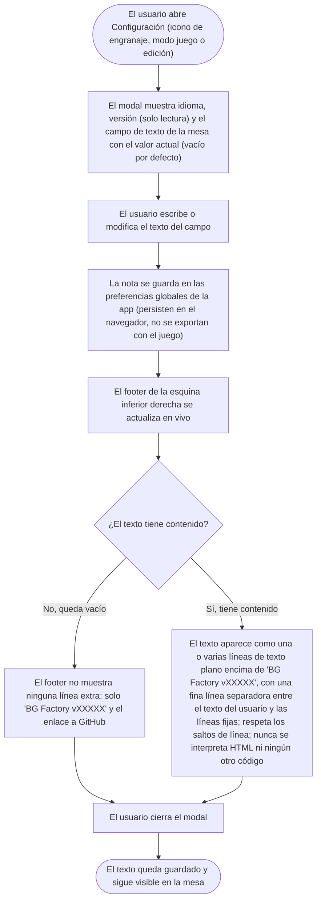

- **Name**: Texto libre en la esquina inferior derecha de la mesa, configurable
- **Code**: 00250
- **Type**: change
- **Creation date**: 2026-09-03

## Full description

Hoy, en la esquina inferior derecha de la mesa se muestra siempre un bloque fijo de dos líneas: el nombre y versión de la aplicación (por ejemplo «BG Factory v00252») y, debajo, un enlace «Ver en Github» / «View on GitHub».

Este cambio añade, en el panel de Configuración (el que se abre con el icono de engranaje), un nuevo campo donde el usuario puede escribir un texto libre. Ese texto se muestra en la mesa, en esa misma esquina inferior derecha, **por encima** de las dos líneas actuales.

### Cómo se comporta

- **Dónde se edita**: en el panel de Configuración, junto al selector de idioma y a la línea de versión (que es de solo lectura), aparece un nuevo campo etiquetado para introducir el texto de la mesa. El campo admite varias líneas.
- **Valor por defecto**: vacío. Mientras el campo esté vacío, la esquina inferior derecha de la mesa se ve exactamente igual que ahora (solo el nombre/versión y el enlace a GitHub), sin ninguna línea extra ni hueco.
- **Con contenido**: en cuanto el usuario escribe algo, ese texto aparece en la mesa como una o varias líneas situadas encima de «BG Factory vXXXXX». Se respetan los saltos de línea que el usuario haya introducido. El estilo es el mismo, discreto, del resto de ese rincón (texto pequeño, atenuado, alineado a la derecha). Entre el texto del usuario y las dos líneas fijas (nombre/versión y enlace a GitHub) se muestra una fina línea separadora horizontal, para distinguir visualmente lo que ha escrito el usuario de lo que pone siempre la aplicación.
- **Sin la línea separadora cuando el campo está vacío**: si no hay texto de usuario, tampoco se muestra la línea separadora; la esquina queda con las dos líneas fijas de siempre.
- **Solo texto plano**: el texto se muestra siempre tal cual, como texto plano. No se interpreta HTML, ni Markdown, ni ningún otro tipo de código o formato: si el usuario escribe algo que parezca una etiqueta o una marca, se ve literalmente ese contenido.
- **Actualización en vivo**: al modificar el campo en Configuración, la esquina de la mesa se actualiza inmediatamente, sin necesidad de cerrar el panel ni recargar. Al vaciar el campo, la línea desaparece al instante.
- **Dónde se guarda y alcance**: el texto es una preferencia global de la aplicación en ese navegador/perfil, igual que el idioma. Se conserva al recargar la página. No viaja con la partida: **no** se incluye al exportar un juego ni se ve afectado al importar uno. Al abrir la aplicación en otro navegador o perfil, el texto no está (empieza vacío).
- **Quién puede cambiarlo**: la aplicación no tiene roles ni permisos. El engranaje de Configuración está disponible tanto en modo juego como en modo edición, así que el texto se puede añadir, cambiar o borrar en cualquier momento.
- **Idioma**: el contenido que escribe el usuario no se traduce (es suyo). Solo se traduce la etiqueta del nuevo campo dentro de Configuración (español e inglés).

### Ajuste del bloque «Versión» del panel de Configuración

Aprovechando este cambio, se corrige y completa el bloque de «Versión» del panel de Configuración:

- **Siempre «BG Factory» + versión**: hoy ese bloque muestra el título de la aplicación tal como lo haya editado el usuario para su juego, seguido de la versión. A partir de ahora muestra **siempre** «BG Factory» y el número de versión, con independencia del título que el usuario le haya puesto a su juego — igual que se ve en la esquina de la mesa.
- **Enlace a GitHub**: debajo de esa línea de versión se añade el **mismo enlace a GitHub** que aparece en la esquina inferior derecha de la mesa (mismo texto y mismo destino).

### Flujo del caso de uso

## Technical notes

- **Render actual de la esquina**: `renderAppVersion(el)` en `src/main.js` pinta el `<footer id="app-version">` (definido en `src/index.html`) con `.app-version__name` (`BG Factory ${CURRENT_VERSION}`) y `.app-version__repo` (enlace a `https://github.com/yeyopepe/bgfactory`, texto vía `t('appVersion.repoLink')`). Ambas líneas se construyen con `textContent`. Estilos en `src/styles/main.css` (`#app-version`, `#app-version a`). La nueva línea de texto de usuario debe insertarse antes de `.app-version__name` y usar `textContent` (o nodo de texto), nunca `innerHTML`; para respetar saltos de línea, `white-space: pre-line` o dividir por `\n`. `renderAppVersion` ya se re-ejecuta desde `renderAll()` ante cualquier evento `*:changed` y `language:changed`.
- **Línea separadora**: cuando (y solo cuando) hay texto de usuario, insertar entre el nodo del texto y `.app-version__name` un separador horizontal fino (p. ej. un `
` con clase propia, o un `border-top` sobre `.app-version__name`), coherente con el estilo discreto del footer (`--border-neutral` o un color aún más tenue sobre el fondo de la mesa). Con el campo vacío no se pinta ni el texto ni el separador. Valorar en `pv-how` si registrar el concepto en `previo-sdd/design/docs/style` (tokens/`ui.class.app-version`).
- **Nuevo campo de estado**: análogo a `appTitle` en `src/core/state.js` (getter `getAppTitle` / setter `setAppTitle` que emite `appTitle:changed` / loader `loadAppTitle` que no emite). Habrá que añadir el equivalente para el nuevo texto (nombre a decidir en `pv-how`; el estado ya usa vocabulario mixto es/en) con su propio evento `*:changed`.
- **Persistencia**: `persistence.serializedFields` (`src/core/persistence.js`, `saveState`/`parseState`) — añadir el campo a la lista serializada a `localStorage` (slot `bgfactory:state`) y suscribir su evento `*:changed` al autoguardado y a `renderAll` en `src/main.js` (junto a `appTitle:changed`). En `parseState`, fallback a `''` si falta o no es string (guardados anteriores no traen la clave; sin migración). **No** añadir a `buildComponentsExport` ni a `parseImportedComponents` (es preferencia local, como `panelState`/idioma). Ver `previo-sdd/design/docs/architecture/00-namespace.md` (`persistence.serializedFields` y su `.rule`) y `007-persistence-build.md` (sección Autosave): documentar ahí el nuevo campo.
- **UI de Configuración**: `src/ui/settingsModal.js` (`openSettingsModal` / `renderContent`). Patrón de bloque: `div.modal__field` con `<label>` + control; ya hay un `
` entre bloques. El modal ya se re-renderiza en vivo con `on('language:changed', renderContent)`; para reflejar cambios externos del propio texto no hace falta más que leer el valor actual al abrir. El `<textarea>` debe escribir el nuevo estado en su evento `input`/`change`.
- **Bloque «Versión» del modal**: hoy `settingsModal.js` pinta `versionValue.textContent = getFullAppTitle(getAppTitle())` (`core/appTitle.js` → `` `${appTitle} ${formatVersion()}` ``), es decir, título editable del usuario + versión. Cambiar para que muestre siempre `` `BG Factory ${formatVersion()}` `` (o `` `${DEFAULT_APP_TITLE} v.${CURRENT_VERSION.slice(1)}` ``), sin depender de `getAppTitle()`. Valorar en `pv-how` si conviene un helper en `core/appTitle.js` (p. ej. `getVersionedProductName()`) reutilizable por `settingsModal.js` y por `renderAppVersion` de `main.js` (que ya arma `` `BG Factory ${CURRENT_VERSION}` `` por su cuenta), para tener una única fuente del literal «BG Factory».
- **Enlace a GitHub en el modal**: replicar bajo la línea de versión el mismo `<a>` que `renderAppVersion` crea en `main.js` — `href` `https://github.com/yeyopepe/bgfactory`, `target="_blank"`, `rel="noopener"`, texto vía `t('appVersion.repoLink')` (misma clave i18n ya existente, «Ver en Github» / «View on GitHub»). Estilo: mismo tratamiento de enlace de texto discreto (`color: inherit; text-decoration: underline`) que `#app-version a`; se puede reutilizar el concepto de estilo `ui.link`/`ui.link.external` de `previo-sdd/design/docs/style` (`005-text-links-and-external-links.md`).
- **i18n**: nuevas claves para la etiqueta (y posible ayuda/placeholder) del campo en `src/data/i18n.es.js` y `src/data/i18n.en.js` (catálogos deben estar completos en ambos idiomas). Bloque «Modal de configuración» ya existe (`settings.title`, `settings.language.label`, `settings.version.label`). Ver `previo-sdd/design/docs/architecture/010-internationalization-i18n.md`.
- **Seguridad (client hardening)**: el nuevo texto se renderiza en el DOM a partir de un valor que puede provenir de un `localStorage` manipulado o de un JSON de estado alterado. Debe renderizarse siempre como texto plano (`textContent`), nunca `innerHTML`. A diferencia de `help.playerHelpText` o el título de componente (que sí admiten HTML básico vía `marked`/`innerHTML` en otras partes de la app), aquí es texto plano exclusivamente — decisión confirmada explícitamente por el usuario.
- No se han detectado inconsistencias entre la documentación técnica y el código durante el análisis.
