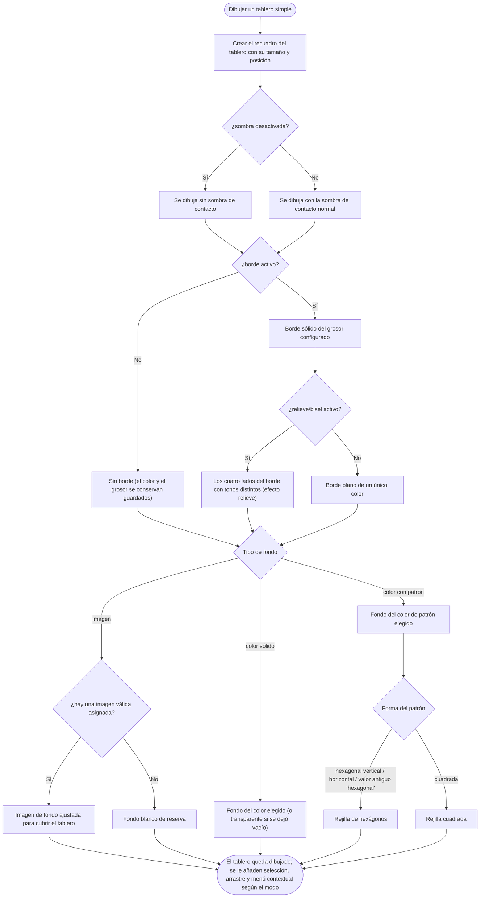

- **Name**: Batería de tests para la funcionalidad 018 "Componente tablero simple"
- **Code**: 00251
- **Type**: change
- **Creation date**: 2026-09-07

## Full description

La funcionalidad 018 ("Componente tablero simple") no tiene actualmente ningún test automatizado que la cubra. Este cambio consiste en crear esa batería de tests: un conjunto de pruebas que verifican, de forma automática y repetible, que el "tablero simple" se comporta y se dibuja como debe.

El "tablero simple" es un tipo de componente: un elemento cuadrado, redimensionable a cualquier proporción (nace a 200×200), pensado para representar el tablero físico de la partida. Tiene un borde configurable (color y grosor entre 1 y 20; se puede activar o desactivar entero; se puede pintar con efecto de relieve/bisel o totalmente plano), una sombra de contacto que lo asienta sobre la mesa (también desactivable), y un fondo que se elige entre tres opciones —color con patrón de rejilla, imagen, o color sólido— cuya configuración no se pierde al alternar de una opción a otra.

La batería no cambia nada del comportamiento del producto: sólo añade pruebas. Se considera terminada cuando la suite de tests del proyecto pasa entera y el informe de trazabilidad funcionalidad↔tests se regenera sin anomalías, dejando la funcionalidad 018 asociada a sus nuevos casos.

### Qué comprueba la batería

Cada caso valida una rama del comportamiento del tablero simple:

1. **Valores por defecto.** Un tablero recién creado nace cuadrado a 200×200, con borde negro de grosor 2, borde activado, relieve activado, sombra activada, fondo de tipo "color con patrón", patrón de forma cuadrada de 8×8 celdas y sin imagen de fondo asignada.
2. **Migración del nombre antiguo.** Una partida guardada cuando este componente se llamaba sólo "tablero" se carga y el componente pasa a ser un "tablero simple" conservando intacta toda su configuración. Un tablero que ya está con el nombre nuevo no se ve afectado por esa migración.
3. **Dibujo del borde.** Con el borde activado, el tablero muestra un borde sólido del grosor configurado; con el relieve activado, los cuatro lados del borde llevan tonos distintos (efecto bisel); con el relieve desactivado, los cuatro lados son del mismo color; con el borde desactivado, no se dibuja ningún borde (pero color y grosor se conservan por si se vuelve a activar).
4. **Dibujo de la sombra.** Con la sombra desactivada, el tablero se dibuja sin la sombra de contacto; con la sombra activada (lo normal), sí la tiene.
5. **Dibujo del fondo.** Con fondo de "color sólido", se aplica ese color (o transparente si se dejó vacío). Con fondo de "color con patrón" y forma cuadrada, se dibuja una rejilla cuadrada. Con fondo de "color con patrón" y forma hexagonal, se dibuja una rejilla de hexágonos. Con fondo de "imagen" pero sin una imagen válida asignada, el tablero queda con fondo blanco de reserva.
6. **Coexistencia de la configuración de fondo.** Al cambiar el tipo de fondo entre "color con patrón", "imagen" y "color sólido", la configuración de las opciones que quedan inactivas (el color del patrón, el color sólido, la imagen asignada…) sigue guardada y disponible: alternar no borra nada.
7. **Compatibilidad de un valor antiguo de patrón.** Un tablero guardado con un valor de forma de patrón antiguo ("hexagonal", sin orientación) se dibuja como rejilla hexagonal, igual que la opción hexagonal actual.
8. **Límites del grosor de borde en la ventana de configuración.** Al editar el tablero, si se escribe un grosor mayor que 20 queda ajustado a 20, y si se escribe 0 (o menos) queda ajustado a 1.
9. **Modo juego.** En modo juego el tablero se pinta con normalidad y no añade ninguna acción propia al hacer clic sobre él (a diferencia de la carta o el dado, el tablero no reacciona al clic en modo juego).

### Fuera de alcance

- El redimensionado libre a cualquier proporción no se prueba aquí: ya está cubierto de forma genérica por la batería de la funcionalidad 015 ("Posición independiente, arrastre y redimensionado de componentes") y no se duplica.
- Al ser una batería de tests, no lleva maquetas visuales, ni diagrama de navegación, ni tablas de datos.

### Diagrama del comportamiento que valida la batería

Árbol de decisión del dibujo de un "tablero simple" — cada caso de la batería recorre una de estas ramas:

## Technical notes

- **Framework de tests**: `src/test/`. Motor propio `src/test/harness.js` (`describe`/`it`/`expect`/`beforeEach`/`registerFeature`), ejecutado en Chromium headless vía Playwright (`src/test/run.js`). No carga `main.js` ni CSS. Helpers en `src/test/helpers.js`: `resetState()`, `mountEditMode()`, `mountPlayMode()` (devuelven `#content`), `loadFixture(name)`, `mockRandom`, etc. Regla de cobertura en `design/docs/architecture/011-functional-test-framework.md`: todo añadido de funcionalidad debe añadir sus tests; `npm test` debe pasar y `TRACEABILITY.md` regenerarse sin anomalías.
- **Fichero propuesto**: `src/test/functional/tablero-simple.test.js`, con `registerFeature({ primary: 18 })`, nivel state + ui. Códigos `FT-018-01`, `FT-018-02`, … Ficheros de referencia por similitud: `src/test/functional/carta.test.js` (state + ui, tipo de componente) y `src/test/functional/component-title.test.js`. La funcionalidad 018 no aparece con ningún test en `src/test/TRACEABILITY.md`.
- **Modelo `'tableroSimple'`**: `DEFAULT_BOARD_PROPERTIES` y `createDefaultComponent` en `src/ui/componentModal.js` (`DEFAULT_BOARD_SIZE = 200`). Propiedades y defaults: `bordeColor` (hex, `#000000`), `bordeGrosor` (1–20, `2`), `bordeActivo` (bool, `true`), `biselado` (bool, `true`), `sombra` (bool, `true`), `fondoTipo` (`'colorPatron' | 'imagen' | 'color'`, `'colorPatron'`), `colorFondo` (`#ffffff`), `patronColor` (`#000000`), `patronGrosor` (1–20, `1`), `patronForma` (`'cuadrada' | 'hex-vertical' | 'hex-horizontal'`, `'cuadrada'`; `'hexagonal'` legacy = alias de `'hex-horizontal'`), `patronFilas`/`patronColumnas` (1–50, `8`), `imagenResourceId` (`null`), `colorSolido` (hex o `''`, `#ffffff`).
- **Render**: `src/ui/componentRenderer.js`, rama `component.type === 'tableroSimple'` (~línea 824). Clase `.board`; `.board--sin-sombra` togglea con `props.sombra === false`; borde biselado con `shadeColor(bordeColor, ±0.35)` (top/left más claro, bottom/right más oscuro), importado de `src/core/colorUtils.js`; con `biselado === false` se fija `board.style.borderColor = bordeColor` (4 lados iguales); con `bordeActivo === false` se fija `board.style.borderStyle = 'none'` sin tocar color/grosor. Patrón cuadrado: 4 `linear-gradient` como `background-image` + `backgroundSize`/`backgroundRepeat`. Patrón hexagonal: un `<svg>` hijo de `.board` + `renderHexGrid(...)` (un `<polygon>` por hexágono), `orientation` `'pointy'` (hex-vertical) o `'flat'` (hex-horizontal/legacy). El alias `patronForma === 'hexagonal'` se resuelve **sólo aquí, al pintar** (no en migración ni al re-guardar). La rama `fondoTipo === 'imagen'` sin recurso encontrado fija `backgroundColor` a `#ffffff`; `fondoTipo === 'color'` fija `backgroundColor` a `colorSolido || 'transparent'`.
- **Modo juego**: `src/modes/play/playMode.js#renderTable` NO pasa `onSelect`/`onToggleSelect` a `renderComponentsOnTable`, así que el `.board` en modo juego no lleva `.board--selectable` ni reacciona a `click`/`dblclick` (a diferencia de carta/dado). En modo edición (`src/modes/edit/editMode.js#renderTable`) sí se pasan ambos.
- **Ventana de configuración**: `openComponentModal({ component, onAccept, onDelete })` en `src/ui/componentModal.js`; rama de campos específicos del tablero en `renderBoardSpecificFields(container, visualContainer)` (opera sobre `workingComponent.properties` por referencia). Clamp del grosor de borde: `<input type="number">` `min=1`/`max=20`, listener en evento **`input`** → `parsed = parseInt(value, 10)`; `props.bordeGrosor = Number.isNaN(parsed) ? 2 : Math.min(Math.max(parsed, 1), 20)`. Es decir `'25'→20`, `'0'→1`, `'-5'→1`, texto no numérico → `2` (default, no 1). Sub-modales de fondo: `openBoardPatternModal({ properties, onAccept })`, `openBoardColorModal({ properties, onAccept })` (checkbox "transparente" deja `colorSolido = ''`), `openBoardImageModal({ properties, resources, onAccept })`; cada `onAccept` escribe sólo sus propias claves, de ahí que la config de la opción no activa se conserve.
- **Migración**: `src/core/state.js`, función `migrateTableroSimple`, invocada dentro de `loadComponents`: cualquier `type === 'tablero'` pasa a `type === 'tableroSimple'` in-place, **sin tocar `properties` en absoluto** (ni `patronForma` legacy). `loadFixture` (helpers) pasa por `loadComponents`, así que un fixture con `type:'tablero'` sale ya migrado; el caso de migración puede hacerse sin fixture, con `loadComponents([...])` directo en el test.
- **[gotcha] aislamiento**: `src/modes/edit/editMode.js` mantiene `selectedComponentIds` (y `primarySelectedIds`) como estado de módulo que `resetState()` NO limpia. Los casos que ejerciten selección en modo edición deben usar ids de componente distintos por caso (mismo criterio que `component-transform.test.js`, `carta.test.js`, `component-title.test.js`).
- **Inconsistencias documentación ↔ código detectadas** (para que `pv-how`/`pv-do` las integren como cambio de documentación pendiente):
  1. `design/docs/architecture/003-component-types.md`, tabla `'tableroSimple'`, fila `fondoTipo`: indica `'colorPatron' | 'imagen'`, pero el código admite tres valores (`'colorPatron' | 'imagen' | 'color'`, opción "color sólido" del cambio 00156); además no lista la propiedad `colorSolido`. Sugerencia: actualizar la fila `fondoTipo` a los tres valores y añadir una fila `colorSolido` (string hex o vacío, default `#ffffff`; vacío = transparente).
  2. `design/docs/architecture/003-component-types.md`, tabla `'tableroSimple'`: no lista la propiedad `bordeActivo` (checkbox "Activar borde", cambio 00153). Sugerencia: añadir una fila `bordeActivo` (boolean, default `true`; si `false`, no se dibuja borde, color y grosor se conservan).
  3. `design/docs/architecture/003-component-types.md`, tabla `'tableroSimple'`, fila `patronForma`: dice que `'hexagonal'` legacy se interpreta como alias de `'hex-horizontal'` "on render **and normalized on re-save**". La parte "normalized on re-save" es falsa: no hay ninguna normalización de `patronForma` (ni en `migrateTableroSimple`, que sólo cambia `type`, ni al guardar); el alias se resuelve exclusivamente al pintar. Sugerencia: corregir a "alias resuelto sólo al pintar (`ui/componentRenderer.js`); el valor almacenado no se reescribe".
  4. *(Menor, opcional)* Fila `biselado`: "two tones derived from `bordeColor`" — precisar que top/left quedan más claros y bottom/right más oscuros (`shadeColor(±0.35)`).
- **Seguridad**: sin puntos pendientes — cambio sólo de tests, sin código de producción, red, autenticación, persistencia ni dependencias nuevas. `src/test/` nunca entra en el bundle del entregable (`build.py` recorre imports desde `src/main.js`).
