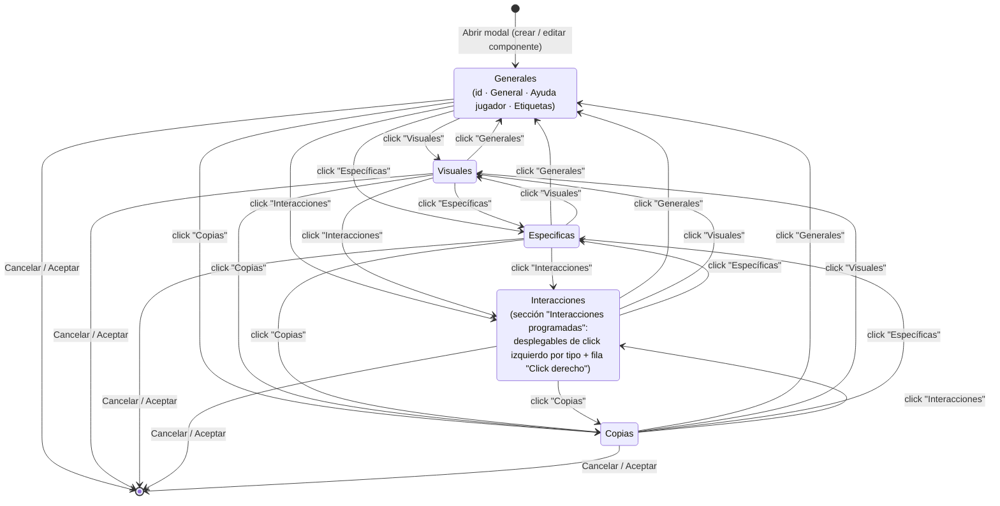

# Navegación — pestañas de la modal de configuración de componente

**Caso de uso:** cómo el usuario cambia entre las pestañas de la modal de configuración de un componente tras este cambio, y en qué pestaña queda la sección "Interacciones programadas".

Al abrir la modal (crear o editar un componente en Modo Edición) se muestra siempre la pestaña **Generales**. El conmutador pasa a tener **5 pestañas** en este orden: Generales · Visuales · Específicas · **Interacciones** (nueva) · Copias. Cualquier pestaña es accesible desde cualquier otra con un solo click en su título; cerrar la modal (Cancelar / Aceptar) es posible desde cualquier pestaña.

La sección **"Interacciones programadas"** deja de estar en **Generales** (donde estaba tras "Etiquetas") y pasa a ser el contenido de la pestaña **Interacciones**.

**Notas:**

- La pestaña **Interacciones** se muestra siempre, para los 8 tipos de componente: aunque un tipo no tenga interacciones de click izquierdo programadas (cuadro de texto, tablero simple, visor de documentos), la fila fija "Click derecho" hace que la sección nunca quede vacía.
- El resto de pestañas (Visuales, Específicas, Copias) no cambian su contenido con este cambio.
