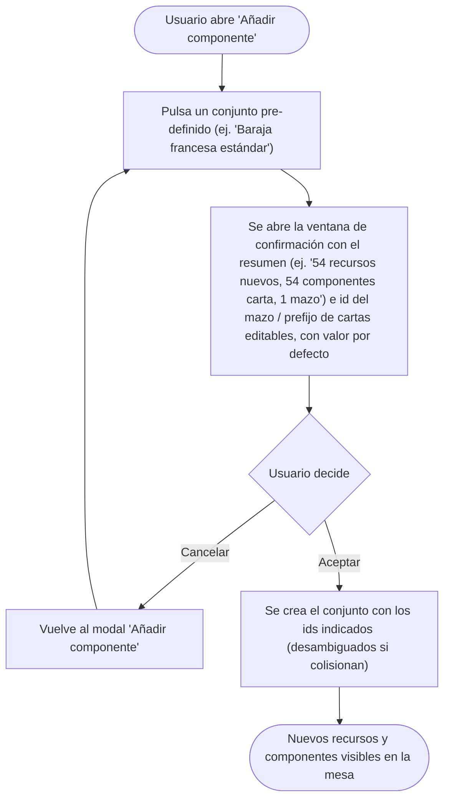

- **Name**: Confirmación antes de crear un conjunto pre-definido de componentes
- **Code**: 00275
- **Type**: change
- **Creation date**: 2026-09-15

## Full description

Al seleccionar, desde el modal "Añadir componente", un conjunto de componentes pre-definido (hoy solo "Baraja francesa estándar (54 cartas)"), en vez de crearse directamente en la mesa debe aparecer una ventana de confirmación con dos botones, "Cancelar" y "Aceptar".

La ventana de confirmación informa al usuario de cuántos elementos se van a crear y de qué tipo. Para la "Baraja francesa estándar" el resumen mostrado es: 54 componentes carta (52 cartas + 2 comodines), 54 recursos nuevos (1 reverso de carta compartido por todas + 53 caras únicas, ya que los dos comodines comparten la misma cara) y 1 componente mazo.

Además, la ventana permite al usuario escribir dos identificadores antes de confirmar, ambos ya rellenos con un valor por defecto:

- El identificador del componente mazo que se va a crear.
- El prefijo de identificador de las cartas (sustituye el prefijo por defecto que llevarían las cartas generadas, manteniendo el resto del patrón de nombrado).

Comportamiento según la decisión del usuario:

- **Cancelar**: se cierra solo la ventana de confirmación. El modal "Añadir componente" (con la lista de tipos y conjuntos pre-definidos) sigue visible, sin haberse creado ningún elemento ni modificado la mesa.
- **Aceptar**: se cierran la ventana de confirmación y el modal "Añadir componente", y se procede a crear realmente el conjunto de componentes con los identificadores indicados por el usuario. Si el identificador del mazo o el de alguna carta resultante coincide con uno ya existente en la partida, se renombra automáticamente añadiendo un sufijo numérico entre paréntesis (mismo comportamiento ya existente al generar la baraja francesa más de una vez), sin bloquear la confirmación ni mostrar un error. Durante la creación se sigue mostrando el indicador de progreso que ya existía para esta operación.

Este mecanismo de confirmación es genérico: aplica a cualquier conjunto pre-definido que exista o se añada en el futuro, no solo a la baraja francesa. El contenido concreto del resumen (qué tipos y cuántos elementos de cada uno) depende de cada conjunto.

### Puntos de análisis resueltos con el usuario

- La confirmación sustituye el comportamiento actual de creación inmediata al pulsar el conjunto pre-definido, en vez de aparecer después de cerrar el modal de selección de tipo.
- Cancelar no cierra el modal de selección de tipo, para poder elegir otra opción sin reabrir el flujo desde cero.
- No se valida en vivo si los identificadores escritos colisionan con otros existentes: la resolución de colisiones ocurre de forma automática al aceptar, igual que ya ocurre hoy.
- No es una operación destructiva ni irreversible (el usuario puede deshacerla borrando lo creado), por lo que la ventana usa el estilo informativo estándar, sin icono de advertencia.

## Diagrama funcional

## Technical notes

- Único conjunto pre-definido existente hoy: `frenchDeck54`. `ui/componentTypeModal.js` renderiza el item del preset y, al pulsarlo, hoy llama a `onPresetSelected('frenchDeck54')` y cierra el overlay directamente. `modes/edit/editMode.js#openAddModal` recibe ese callback y ejecuta `createFrenchDeckPreset()` (`core/presets/frenchDeck.js`) dentro de `runWithProgressModal`.
- El id del componente mazo hoy se autogenera vía `createDefaultComponent('mazo')` (no configurable). Los ids de carta siguen el patrón fijo `cardId()` de `data/cardTemplates.js` (`card-<palo>-<valor>` / `card-joker`). Ambos deben pasar a ser configurables por el usuario desde la nueva ventana de confirmación, con el valor actual como valor por defecto del campo.
- La desambiguación de ids colisionados ya existe (mismo mecanismo que `nextCloneId` de `core/component.js`, sufijo `(n)` con el siguiente entero libre) — `core/presets/frenchDeck.js` ya la ejercita al generarse dos veces la baraja en la misma partida (ver `src/test/functional/french-deck-preset.test.js`, FT-002-21). La nueva ventana debe poder partir de un id/prefijo elegido por el usuario en vez del fijo, reutilizando ese mismo mecanismo de desambiguación al aplicar los ids resultantes.
- El resumen de conteos (recursos/cartas/mazos) para la baraja francesa se puede derivar de `data/cardTemplates.js#buildFrenchDeckCatalog()` (54 entradas: 52 cartas normales + 2 jokers) sin necesidad de generar los SVG reales ni tocar el estado — se propone una función de resumen ligera por preset, en vez de valores fijos hardcodeados, para no desincronizarse si el preset cambia.
- Patrón visual/estructural de referencia para el nuevo modal de confirmación: `ui/bulkDeleteConfirmModal.js` (`.modal-overlay`/`.modal`, header, `.modal__content`, footer `.btn-cancel`/`.btn-accept`), documentado en `previo-sdd/design/docs/style/003-modales-menus.md`. A diferencia de ese modal (que lista elementos individuales), este muestra conteos agregados por tipo, más dos campos de texto editables.
- El item de conjunto pre-definido en el modal de tipo ya está documentado en `previo-sdd/design/docs/style/003-modales-menus.md`, sección "Pre-defined set item (immediate action in a selection list)" — esa sección describe el comportamiento actual (acción inmediata que cierra el modal al pulsar), que este cambio sustituye por la apertura de la ventana de confirmación.
