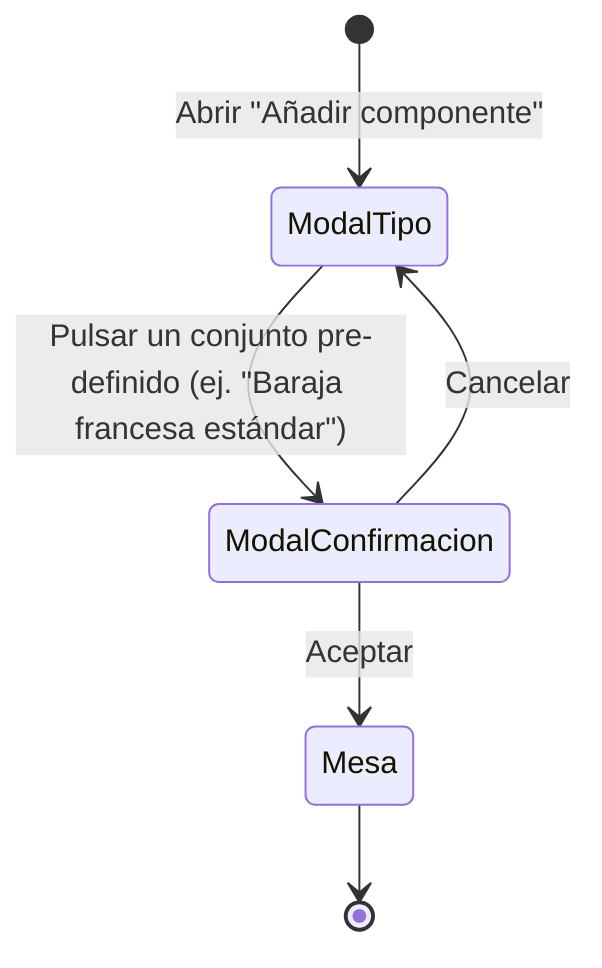

# Navegación — Confirmación al añadir un conjunto pre-definido

- **ModalTipo**: modal "Añadir componente" existente (`ui/componentTypeModal.js`), con la lista de tipos y, al final, el/los conjuntos pre-definidos.
- **ModalConfirmacion**: nueva ventana de confirmación (`design_confirmacion-conjunto-predefinido.html`), con el resumen de conteos y los campos de id del mazo / prefijo de cartas.
- **Cancelar**: cierra únicamente la ventana de confirmación; el modal "Añadir componente" vuelve a quedar como estado activo, sin cambios en la mesa.
- **Aceptar**: cierra la ventana de confirmación y el modal "Añadir componente" a la vez, y pasa al estado "Mesa" — el conjunto se crea (con el indicador de progreso ya existente) y los nuevos elementos quedan visibles.
